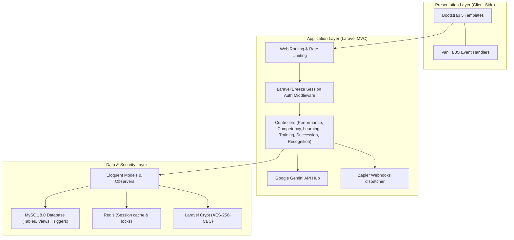

# HIMS Performance & Development Module
## Technical Reference: Architecture, Database Design & Security Specifications

This document outlines the systems architecture, MySQL database design list, and security configurations for the Performance & Development (P&D) module of the Hospital Information Management System (HIMS).

---

## 1. Systems Architecture

The module is structured as a MVC web application built on **PHP Laravel**, utilising a **MySQL 8.0+** relational database and rendering server-side views styled with **Bootstrap 5**.



### Stack Components

| Layer | Component | Technical Role |
|---|---|---|
| **Frontend** | HTML5 / Bootstrap 5 / JS | Renders responsive grid layouts, tables, forms, validation cues, and alerts. |
| **Backend** | PHP 8.2+ / Laravel | Controls data flow, business logic routines, controllers, routing, and notifications. |
| **Database** | MySQL 8.0+ | Stores records with UUID keys, manages gaps via trigger routines, and runs relational checks. |
| **Authentication** | Laravel Breeze | Manages cookie-based sessions, rate limiting, and password hashing. |
| **Caching** | Redis | Caches session details, notification queues, and leaderboard stats. |
| **AI Engine** | Google Gemini API | Conducts supervisor reviews audits, quiz creation, and Taglish command processing. |
| **Integration** | Zapier Webhooks | Broadcasts recognition milestones and certification completions to external tools. |
| **Local Staging** | Laragon | Standardised local server setup (Apache/Nginx + PHP + MySQL). |

---

## 2. Database Design (MySQL 8.0+)

The relational model consists of **42 tables and views** grouped into 8 operational schemas. All record identifiers (`PRIMARY KEY` & `FOREIGN KEY`) use standard `CHAR(36)` UUID formatting.

### 2.1 Core / Shared Subsystem
1.  **`departments`**: Hospital divisions (clinical and non-clinical).
    *   *Columns*: `department_id` (PK), `name` (unique), `department_code` (unique), `head_employee_id` (FK to employees), `parent_dept_id` (FK to departments), `is_clinical` (bool), `created_at`.
2.  **`roles`**: Employee roles within departments.
    *   *Columns*: `role_id` (PK), `role_name` (unique), `role_slug` (unique), `department_id` (FK), `is_clinical` (bool), `created_at`.
3.  **`employees`**: Central register of all hospital personnel.
    *   *Columns*: `employee_id` (PK), `employee_code` (unique), `first_name`, `last_name`, `email` (unique), `phone` (encrypted), `department_id` (FK), `role_id` (FK), `position_title`, `hire_date`, `employment_status`, `supervisor_id` (FK to self), `profile_image_url`, `created_at`, `updated_at`.
4.  **`system_users`**: Portal accounts linked to employee records.
    *   *Columns*: `user_id` (PK), `employee_id` (FK unique), `username` (unique), `password_hash` (Breeze defaults), `access_role` (enum check), `mfa_enabled`, `mfa_secret` (encrypted), `last_login`, `failed_login_count`, `account_locked`, `locked_until`, `password_changed_at`, `must_change_password`, `is_active`, `created_at`, `updated_at`.
5.  **`notifications`**: Global system notification queue.
    *   *Columns*: `notification_id` (PK), `recipient_id` (FK), `notification_type`, `title`, `message`, `reference_type` (polymorphic), `reference_id` (polymorphic), `is_read`, `read_at`, `created_at`.

### 2.2 Performance Management Subsystem
6.  **`review_cycles`**: Evaluation timelines (e.g., quarterly, monthly, annual).
    *   *Columns*: `cycle_id` (PK), `cycle_name`, `cycle_type` (enum check), `start_date`, `end_date`, `status` (enum check), `created_by` (FK), `created_at`, `updated_at`.
7.  **`kpi_library`**: KPI templates by role type.
    *   *Columns*: `kpi_id` (PK), `kpi_name`, `kpi_category` (enum check), `description`, `target_value` (decimal), `unit`, `applicable_roles` (JSON array of role slugs), `weight`, `is_active` (bool), `created_at`.
8.  **`performance_reviews`**: Periodic appraisal dossiers.
    *   *Columns*: `review_id` (PK), `employee_id` (FK), `cycle_id` (FK), `reviewer_id` (FK), `review_type` (enum check), `status` (enum check), `self_rating`, `supervisor_rating`, `peer_rating`, `overall_score`, `strengths_text`, `improvements_text`, `ai_bias_flags` (JSON), `ai_summary` (text), `digital_signature` (hash), `signed_at`, `created_at`, `updated_at`.
9.  **`review_kpi_scores`**: Raw ratings per KPI.
    *   *Columns*: `score_id` (PK), `review_id` (FK), `kpi_id` (FK), `self_score`, `supervisor_score`, `peer_score`, `weighted_score`, `comments` (text).
    *   *Constraint*: Unique combination of `(review_id, kpi_id)`.
10. **`peer_reviews`**: Evaluations submitted by designated peers.
    *   *Columns*: `peer_review_id` (PK), `review_id` (FK), `peer_employee_id` (FK), `rating` (CHECK 1.0 to 5.0), `comments`, `is_anonymous` (bool), `submitted_at`.
11. **`performance_improvement_plans`**: Corrective pathways for review scores below `2.5 / 5.0`.
    *   *Columns*: `pip_id` (PK), `employee_id` (FK), `triggered_by_review` (FK), `status` (enum check), `action_steps` (JSON tasks checklist), `start_date`, `target_end_date`, `actual_end_date`, `supervisor_id` (FK), `notes`, `created_at`, `updated_at`.
12. **`review_goals`**: SMART goals associated with a performance dossier.
    *   *Columns*: `goal_id` (PK), `review_id` (FK), `employee_id` (FK), `goal_title`, `goal_description`, `target_date`, `progress_pct` (CHECK 0 to 100), `status` (enum check), `created_at`.

### 2.3 Competency Management Subsystem
13. **`competency_domains`**: Domains such as Clinical, Technical, or Administrative.
    *   *Columns*: `domain_id` (PK), `domain_name` (unique), `description`, `created_at`.
14. **`competency_categories`**: Skill groups mapped to JCI Standards (e.g., JCI.SQE.3).
    *   *Columns*: `category_id` (PK), `domain_id` (FK), `category_name`, `jci_standard_code`, `created_at`.
15. **`competencies`**: Individual skill templates.
    *   *Columns*: `competency_id` (PK), `category_id` (FK), `competency_name`, `competency_code` (unique), `description`, `required_proficiency` (CHECK 1 to 5), `is_mandatory` (bool), `created_at`.
16. **`role_competency_requirements`**: Target minimum proficiencies by role.
    *   *Columns*: `id` (PK), `role_id` (FK), `competency_id` (FK), `minimum_proficiency` (CHECK 1 to 5), `is_critical` (bool).
    *   *Constraint*: Unique combination of `(role_id, competency_id)`.
17. **`competency_assessments`**: Audit logs of employee evaluations.
    *   *Columns*: `assessment_id` (PK), `employee_id` (FK), `competency_id` (FK), `assessed_by` (FK), `assessment_method` (enum check), `current_proficiency` (CHECK 1 to 5), `gap` (computed delta), `evidence_url`, `notes`, `assessed_date`, `next_assessment_due`, `created_at`.
18. **`employee_credentials`**: Official clinical credentials (PRC license, Board certifications).
    *   *Columns*: `credential_id` (PK), `employee_id` (FK), `credential_type`, `credential_number` (encrypted), `issuing_body`, `issue_date`, `expiry_date`, `status` (stored generated column), `document_url`, `verified_by` (FK), `verified_at`, `created_at`, `updated_at`.
    *   *Generated Status Logic*:
        ```sql
        status VARCHAR(20) GENERATED ALWAYS AS (
            CASE
                WHEN expiry_date IS NULL THEN 'no_expiry'
                WHEN expiry_date < CURRENT_DATE() THEN 'expired'
                WHEN expiry_date < CURRENT_DATE() + INTERVAL 30 DAY THEN 'expiring_soon'
                ELSE 'active'
            END
        ) STORED
        ```
19. **`credential_alert_log`**: Log of warnings dispatched when licenses expire.
    *   *Columns*: `alert_id` (PK), `credential_id` (FK), `employee_id` (FK), `alert_type`, `sent_to` (JSON list of user IDs), `sent_at`, `acknowledged_at`.

### 2.4 Learning Management Subsystem
20. **`learning_pathways`**: Program curricula (e.g., "Critical Care Nurse Pathway").
    *   *Columns*: `pathway_id` (PK), `pathway_name`, `description`, `target_roles` (JSON list of role slugs), `total_cpd_hours` (decimal), `is_mandatory` (bool), `created_by` (FK), `created_at`.
21. **`courses`**: Catalog course entries.
    *   *Columns*: `course_id` (PK), `course_code` (unique), `title`, `description`, `category`, `cpd_hours` (decimal), `difficulty_level` (enum check), `estimated_duration` (int representing minutes), `passing_score` (decimal), `max_retakes`, `is_mandatory` (bool), `is_active` (bool), `created_by` (FK), `created_at`, `updated_at`.
22. **`pathway_courses`**: Junction table mapping courses to pathways.
    *   *Columns*: `id` (PK), `pathway_id` (FK), `course_id` (FK), `sequence_order` (int), `is_prerequisite` (bool).
    *   *Constraint*: Unique combination of `(pathway_id, course_id)`.
23. **`course_modules`**: Structured modules (videos, documents, quizzes) inside a course.
    *   *Columns*: `module_id` (PK), `course_id` (FK), `module_title`, `module_type` (enum check), `content_url`, `content_body` (text), `sequence_order`, `estimated_minutes`, `created_at`.
24. **`course_enrollments`**: Course progress tracking records.
    *   *Columns*: `enrollment_id` (PK), `employee_id` (FK), `course_id` (FK), `enrolled_by` (FK), `enrollment_date`, `due_date`, `status` (enum check), `progress_pct` (CHECK 0 to 100), `completed_at`, `cpd_hours_earned` (decimal), `certificate_id` (FK).
    *   *Constraint*: Unique combination of `(employee_id, course_id)`.
25. **`quiz_questions`**: Quiz items inside course quiz modules.
    *   *Columns*: `question_id` (PK), `module_id` (FK), `question_text`, `question_type` (enum check), `options` (JSON config), `correct_answer`, `explanation`, `points`, `ai_generated` (bool), `created_at`.
26. **`quiz_attempts`**: Attempts submitted by users.
    *   *Columns*: `attempt_id` (PK), `employee_id` (FK), `module_id` (FK), `attempt_number`, `answers` (JSON details), `score_pct` (decimal), `passed` (bool), `started_at`, `completed_at`, `time_spent_seconds` (int).
27. **`cpd_records`**: Consolidated CPD points ledger.
    *   *Columns*: `cpd_id` (PK), `employee_id` (FK), `source_type` (enum check), `source_id` (FK reference), `activity_name`, `cpd_hours`, `date_earned`, `renewal_period`, `verified` (bool), `verified_by` (FK), `created_at`.
28. **`certificates`**: Digital credentials issued to users upon completion of compliance courses.
    *   *Columns*: `certificate_id` (PK), `employee_id` (FK), `course_id` (FK), `certificate_code` (unique), `issued_date`, `expiry_date`, `pdf_url`, `qr_verification_url`, `created_at`.

### 2.5 Training Management Subsystem
29. **`training_venues`**: Physical venues (e.g., Main Auditorium).
    *   *Columns*: `venue_id` (PK), `venue_name`, `building`, `floor`, `capacity`, `equipment` (JSON), `is_active` (bool), `created_at`.
30. **`training_sessions`**: Live scheduled training workshops.
    *   *Columns*: `session_id` (PK), `session_code` (unique), `title`, `description`, `category`, `instructor_id` (FK), `venue_id` (FK), `session_date`, `start_time`, `end_time`, `capacity`, `registration_deadline`, `status` (enum check), `linked_course_id` (FK), `linked_competencies` (JSON), `cpd_hours`, `has_pre_test` (bool), `has_post_test` (bool), `created_by` (FK), `created_at`, `updated_at`.
    *   *Venue Conflict Check*: Unique key index `idx_venue_schedule` on `(venue_id, session_date, start_time)`.
31. **`training_registrations`**: Registration and attendance state records.
    *   *Columns*: `registration_id` (PK), `session_id` (FK), `employee_id` (FK), `registered_by` (FK), `registration_date`, `status` (enum check), `check_in_time`, `check_in_method`, `UNIQUE (session_id, employee_id)`.
32. **`training_tests`**: Pre-tests or post-tests linked to training sessions.
    *   *Columns*: `test_id` (PK), `session_id` (FK), `test_type` (enum check), `questions` (JSON), `passing_score` (decimal), `created_at`.
33. **`training_test_results`**: Test scores per attendee.
    *   *Columns*: `result_id` (PK), `test_id` (FK), `employee_id` (FK), `score_pct` (decimal), `answers` (JSON), `completed_at`, `UNIQUE (test_id, employee_id)`.
34. **`training_feedback`**: Surveys compiled after completion.
    *   *Columns*: `feedback_id` (PK), `session_id` (FK), `employee_id` (FK), `overall_rating` (CHECK 1 to 5), `content_rating`, `instructor_rating`, `venue_rating`, `comments`, `ai_sentiment_score` (decimal), `ai_sentiment_label`, `submitted_at`, `UNIQUE (session_id, employee_id)`.

### 2.6 Succession Planning Subsystem
35. **`critical_positions`**: Target critical hospital roles.
    *   *Columns*: `position_id` (PK), `position_title`, `department_id` (FK), `current_holder_id` (FK), `is_critical` (bool), `vacancy_risk` (enum check), `risk_factors` (JSON), `impact_description`, `created_at`, `updated_at`.
36. **`succession_candidates`**: Target successor backup plans.
    *   *Columns*: `candidate_id` (PK), `position_id` (FK), `employee_id` (FK), `performance_score` (CHECK 1 to 3), `potential_score` (CHECK 1 to 3), `nine_box_label` (stored generated column), `readiness_level` (enum check), `development_plan` (JSON), `mentor_id` (FK), `status` (enum check), `nominated_by` (FK), `nominated_at`, `reviewed_at`, `approved_at`.
    *   *Generated 9-Box Label Logic*:
        ```sql
        nine_box_label VARCHAR(30) GENERATED ALWAYS AS (
            CASE
                WHEN performance_score = 3 AND potential_score = 3 THEN 'star_talent'
                WHEN performance_score = 3 AND potential_score = 2 THEN 'high_performer'
                WHEN performance_score = 3 AND potential_score = 1 THEN 'solid_performer'
                WHEN performance_score = 2 AND potential_score = 3 THEN 'high_potential'
                WHEN performance_score = 2 AND potential_score = 2 THEN 'core_contributor'
                WHEN performance_score = 2 AND potential_score = 1 THEN 'average_performer'
                WHEN performance_score = 1 AND potential_score = 3 THEN 'rough_diamond'
                WHEN performance_score = 1 AND potential_score = 2 THEN 'inconsistent'
                ELSE 'underperformer'
            END
        ) STORED
        ```
    *   *Constraint*: Unique combination of `(position_id, employee_id)`.
37. **`succession_reviews`**: Audits of succession plans.
    *   *Columns*: `review_id` (PK), `position_id` (FK), `review_period`, `reviewed_by` (FK), `review_notes`, `risk_assessment`, `action_items` (JSON), `created_at`.
38. **`leadership_development_paths`**: Milestones tracking successor development.
    *   *Columns*: `path_id` (PK), `candidate_id` (FK), `milestone_title`, `milestone_type`, `description`, `target_date`, `completed_date`, `status` (enum check), `linked_course_id` (FK), `linked_competency` (FK), `created_at`.

### 2.7 Social Recognition Subsystem
39. **`recognition_badges`**: Badges mapped to core hospital values.
    *   *Columns*: `badge_id` (PK), `badge_name` (unique), `badge_icon` (class), `badge_color`, `hospital_value`, `description`, `points_value` (int), `is_active` (bool), `created_at`.
40. **`recognition_posts`**: Wall posts created by peers/managers.
    *   *Columns*: `post_id` (PK), `author_id` (FK), `recipient_id` (FK), `badge_id` (FK), `post_type` (enum check), `message` (text), `is_public` (bool), `is_featured` (bool), `moderation_status` (enum check), `moderated_by` (FK), `moderation_note`, `link_to_review_id` (FK), `created_at`, `updated_at`.
    *   *Constraint*: Author cannot self-recognize (`CHECK (author_id != recipient_id)`).
41. **`recognition_reactions`**: Reactions (e.g. like, clap, support).
    *   *Columns*: `reaction_id` (PK), `post_id` (FK), `employee_id` (FK), `reaction_type` (enum check), `created_at`, `UNIQUE (post_id, employee_id)`.
42. **`recognition_comments`**: Post comments.
    *   *Columns*: `comment_id` (PK), `post_id` (FK), `author_id` (FK), `comment_text`, `moderation_status`, `created_at`.

### 2.8 Database Views
*   **`v_recognition_leaderboard`**: Renders monthly scoring profiles.
    ```sql
    CREATE VIEW v_recognition_leaderboard AS
    SELECT
        rp.recipient_id                         AS employee_id,
        CONCAT(e.first_name, ' ', e.last_name)  AS employee_name,
        e.department_id,
        d.name                                  AS department_name,
        COUNT(rp.post_id)                       AS total_recognitions,
        SUM(COALESCE(rb.points_value, 1))       AS total_points,
        DATE_FORMAT(rp.created_at, '%Y-%m-01')  AS month
    FROM recognition_posts rp
    JOIN employees e ON rp.recipient_id = e.employee_id
    JOIN departments d ON e.department_id = d.department_id
    LEFT JOIN recognition_badges rb ON rp.badge_id = rb.badge_id
    WHERE rp.moderation_status = 'approved'
    GROUP BY rp.recipient_id, e.first_name, e.last_name, e.department_id, d.name, DATE_FORMAT(rp.created_at, '%Y-%m-01');
    ```

### 2.9 Subsystem MySQL Triggers
```sql
DELIMITER $$
-- Calculates proficiency gap on assessment insert
CREATE TRIGGER trg_compute_gap_insert
BEFORE INSERT ON competency_assessments
FOR EACH ROW
BEGIN
    DECLARE req_prof INT;
    SELECT required_proficiency INTO req_prof FROM competencies WHERE competency_id = NEW.competency_id;
    SET NEW.gap = NEW.current_proficiency - req_prof;
END$$

-- Calculates proficiency gap on assessment update
CREATE TRIGGER trg_compute_gap_update
BEFORE UPDATE ON competency_assessments
FOR EACH ROW
BEGIN
    DECLARE req_prof INT;
    SELECT required_proficiency INTO req_prof FROM competencies WHERE competency_id = NEW.competency_id;
    SET NEW.gap = NEW.current_proficiency - req_prof;
END$$
DELIMITER ;
```

---

## 3. Security Design

Security is configured at multiple levels to ensure HIPAA and Philippine Data Privacy Act (RA 10173) compliance.

### 3.1 Portal Authentication (Laravel Breeze)
*   **Session-based Authentication**: Handled via Laravel's built-in session handlers. Session cookie is secure, HttpOnly, and uses `SameSite=Lax` or `SameSite=Strict`.
*   **Brute Force Protection**: Standard Login throttling locks user accounts for 15 minutes after 5 failed authentication attempts.
*   **TOTP MFA**: Session-challenged multi-factor verification required for `hospital_admin` and `hr_admin` roles.
*   **CSRF Protection**: Standard `VerifyCsrfToken` middleware verifies token presence on state-changing requests.

### 3.2 Granular Access Control (RBAC)
Authorisation logic is managed via Laravel **Policies** and **Gates** mapping the core roles to database resources.

```sql
CREATE TABLE permissions (
    permission_id       CHAR(36) PRIMARY KEY,
    resource            VARCHAR(50) NOT NULL,             -- e.g., 'performance_reviews'
    action              VARCHAR(20) NOT NULL,             -- 'create','read','update','delete','approve'
    scope               VARCHAR(20) DEFAULT 'own' CHECK (scope IN ('own','department','all')),
    description         TEXT,
    UNIQUE KEY (resource, action, scope)
);

CREATE TABLE role_permissions (
    id                  CHAR(36) PRIMARY KEY,
    access_role         VARCHAR(30) NOT NULL,             -- 'employee','supervisor',...
    permission_id       CHAR(36) NOT NULL REFERENCES permissions(permission_id),
    UNIQUE KEY (access_role, permission_id)
);
```

### 3.3 Data Encryption (At-Rest & In-Transit)
*   **In-Transit Routing**: Enforced via TLS 1.3 only, using HSTS configurations.
*   **Database Encryption**: Sensitive fields (`employees.phone`, `employee_credentials.credential_number`, `system_users.mfa_secret`) are encrypted using Laravel's Crypt facade utilizing `AES-256-CBC` with HMAC verification.

### 3.4 Tamper-Proof Audit Trail (Observers)
Instead of custom database schemas, Laravel model Observers monitor write events across Eloquent entities (`PerformanceReview`, `Credential`, `Employee`) and log transactions to `audit_trails`.

```sql
CREATE TABLE audit_trails (
    audit_id            CHAR(36) PRIMARY KEY,
    timestamp           TIMESTAMP DEFAULT CURRENT_TIMESTAMP,
    user_id             CHAR(36) NOT NULL REFERENCES system_users(user_id),
    employee_id         CHAR(36) REFERENCES employees(employee_id),
    action              VARCHAR(30) NOT NULL,             -- 'CREATE','READ','UPDATE','DELETE'
    resource_type       VARCHAR(50) NOT NULL,
    resource_id         CHAR(36),
    ip_address          VARCHAR(45) NOT NULL,
    user_agent          TEXT,
    request_method      VARCHAR(10),
    request_path        TEXT,
    before_state        JSON,                             -- DB state before execution
    after_state         JSON,                             -- DB state after execution
    before_state_hash   VARCHAR(64),                      -- SHA-256 hash
    after_state_hash    VARCHAR(64),                      -- SHA-256 hash
    chain_hash          VARCHAR(64),                      -- SHA-256 linking to the previous log row
    metadata            JSON,
    created_at          TIMESTAMP DEFAULT CURRENT_TIMESTAMP
);
```
*   **Immutability**: Write permissions on the audit trails are locked at the database configuration layer (`REVOKE UPDATE, DELETE ON audit_trails FROM 'app_user'@'localhost'`).
*   **Row Chain-Hashing**: Each audit log record contains a `chain_hash` computed as:
    $$\text{chain\_hash} = \text{SHA256}(\text{current\_record\_contents} + \text{previous\_record\_chain\_hash})$$
    This allows instant tamper detection if any past log record is modified.
