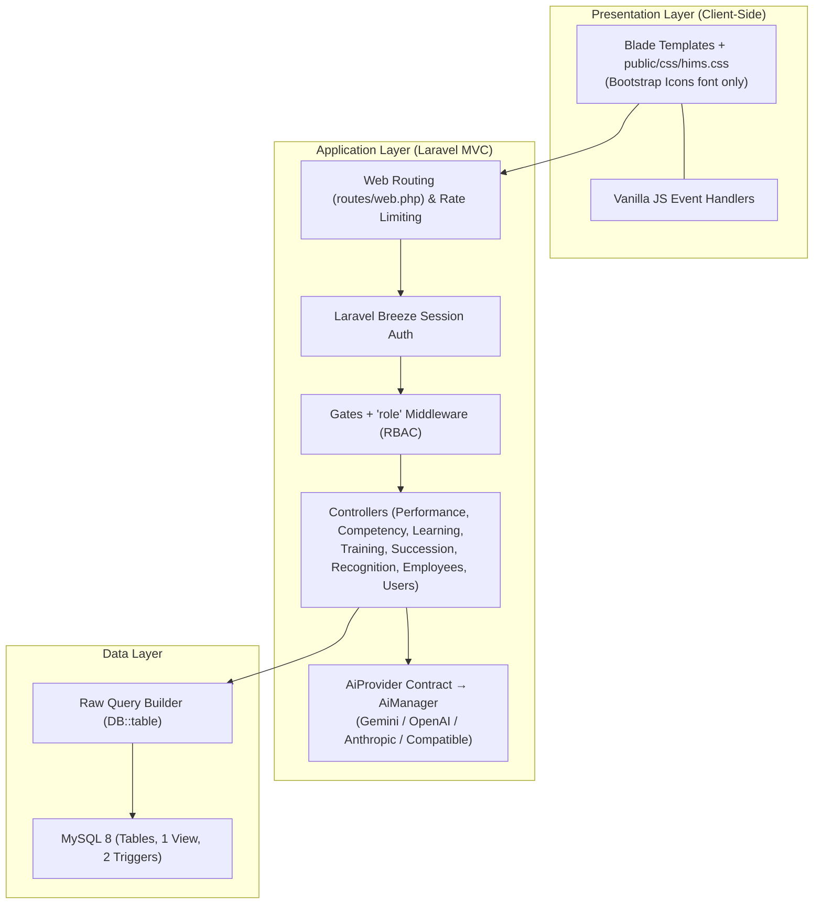
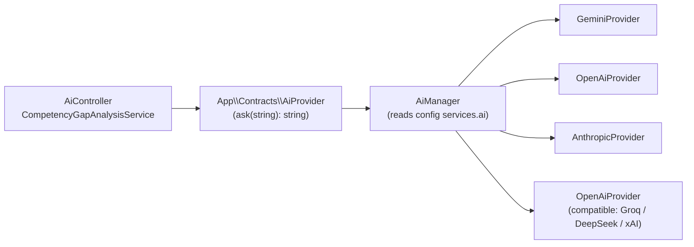

# HIMS Performance & Development Module
## Technical Reference: Architecture, Database Design & Security Specifications

This document outlines the systems architecture, MySQL database design list, and security configurations for the Performance & Development (P&D) module of the Hospital Information Management System (HIMS).

> **Status of this document — AS-BUILT.**
> Revised to describe what is actually implemented in `hims-app/`, verified against source. Items that remain
> designed-but-not-implemented are listed explicitly in [§4 Roadmap](#4-not-yet-implemented-roadmap) rather than
> being described as if they exist. Where the code deliberately diverges from the original specification, the
> divergence is stated inline.

---

## 1. Systems Architecture

The module is an **MVC, server-rendered web application** built on **Laravel 13 / PHP 8.3**, backed by a
**MySQL 8** relational database. Views are Blade templates styled by a single hand-authored stylesheet
(`public/css/hims.css`, 742 lines) served directly via `asset()` — **not** Bootstrap and **not** through the
Vite/Tailwind pipeline. Data access is **raw Query Builder** (`DB::table(...)`), not Eloquent ORM.



### Stack Components (as-built)

| Layer | Specified | Actually Implemented | Status |
|---|---|---|---|
| **Frontend** | HTML5 / Bootstrap 5 / JS | HTML5 + hand-authored `public/css/hims.css` (742 lines) + vanilla JS. **Bootstrap Icons** (font glyphs) via CDN only — the Bootstrap CSS *framework* is not used. Tailwind/Vite are installed but the domain UI bypasses the build (`resources/css/app.css` is 3 lines). 46 views extend `layouts/hims`; only `profile/edit` uses Breeze's `x-app-layout`. | ⚠️ Diverges |
| **Backend** | PHP 8.2+ / Laravel | **PHP ^8.3**, **Laravel 13.22**. Controllers + routing as specified. Notifications are *not* implemented. | ✅ Yes |
| **Database** | MySQL 8.0+ | MySQL 8 (`DB_CONNECTION=mysql`). `CHAR(36)` UUID PKs generated in PHP via `Str::uuid()`; MySQL triggers auto-compute competency gap; `GENERATED ALWAYS AS` stored columns; 1 view. | ✅ Yes |
| **Authentication** | Laravel Breeze | Breeze v2.4 session auth on the `users` table. Login throttling = 5 attempts (`LoginRequest`), `throttle:6,1` on verification/password routes. Public self-registration is disabled — admins provision accounts via `UserController`. | ✅ Yes |
| **Caching** | Redis | **Not used.** `CACHE_STORE=database`, `SESSION_DRIVER=file`, `QUEUE_CONNECTION=database`. Redis config exists only as framework scaffolding; no `predis`, no `Redis::` or `Cache::` calls in `app/`. | ❌ No |
| **AI Engine** | Google Gemini API | **Superseded — now provider-agnostic.** Consumers depend on `App\Contracts\AiProvider`; `AiManager` resolves the driver from `AI_PROVIDER` (`gemini`\|`openai`\|`anthropic`\|`compatible`). Gemini remains the default. See [§5](#5-ai-provider-layer). | ✅ Exceeds |
| **Integration** | Zapier Webhooks | `ZapierService` is fully written with 5 event helpers but is **never instantiated or called** anywhere, and all 5 webhook URLs are blank in `.env` — doubly inert. | ⚠️ Dormant |
| **Local Staging** | Laragon | Laragon (Apache/Nginx + PHP + MySQL) on Windows. | ✅ Yes |
| **Data Access** | Eloquent Models & Observers | **Not used.** `App\Models\User` is the only model; all 40+ domain tables use raw `DB::table()` Query Builder in controllers. No models, policies, observers, or repositories. | ❌ No |

---

## 2. Database Design (MySQL 8.0+)

The relational model consists of **54 tables and 1 view** created across 15 migrations (this includes Laravel's
own `users`, `sessions`, `cache`, `jobs`, `failed_jobs`, `job_batches`, `password_reset_tokens`, `cache_locks`
infrastructure tables plus `ai_chat_messages`). All domain record identifiers (`PRIMARY KEY` & `FOREIGN KEY`) use
standard `CHAR(36)` UUID formatting, **generated in PHP via `Str::uuid()` at insert time** — nothing is
auto-generated by MySQL, so an insert that omits the PK will fail. `created_at`/`updated_at` must likewise be set
manually, since Query Builder has no timestamp magic.

> **⚠️ Schema-only (dead) tables.** The following tables are created by migrations but are **never referenced by
> any code** in `app/`, `routes/`, `resources/`, or seeders. They represent designed-but-unbuilt features. Verified
> by grep: zero references outside their creating migration.
>
> `permissions` · `role_permissions` · `audit_trails` · `system_users` · `notifications` ·
> `course_modules` · `quiz_questions` · `quiz_attempts` · `training_tests` · `training_test_results` ·
> `succession_reviews` · `credential_alert_log` · `pathway_courses`
>
> Consequences: the LMS quiz engine, training pre/post-tests, credential-expiry alert logging, succession
> periodic reviews, in-app notifications, and the entire RBAC-permissions + audit-trail subsystem are **schema
> without behaviour**. `system_users` is dead schema duplicating Laravel's `users` table — real authentication
> runs off `users` (extended with `role` and a nullable `employee_id` FK by migration `..._000095`).

### 2.1 Core / Shared Subsystem
1.  **`departments`**: Hospital divisions (clinical and non-clinical).
    *   *Columns*: `department_id` (PK), `name` (unique), `department_code` (unique), `head_employee_id` (FK to employees), `parent_dept_id` (FK to departments), `is_clinical` (bool), `created_at`.
2.  **`roles`**: Employee roles within departments.
    *   *Columns*: `role_id` (PK), `role_name` (unique), `role_slug` (unique), `department_id` (FK), `is_clinical` (bool), `created_at`.
3.  **`employees`**: Central register of all hospital personnel.
    *   *Columns*: `employee_id` (PK), `employee_code` (unique), `first_name`, `last_name`, `email` (unique), `phone` (encrypted), `department_id` (FK), `role_id` (FK), `position_title`, `hire_date`, `employment_status`, `supervisor_id` (FK to self), `profile_image_url`, `created_at`, `updated_at`.
4.  **`system_users`**: Portal accounts linked to employee records.
    *   *Columns*: `user_id` (PK), `employee_id` (FK unique), `username` (unique), `password_hash` (Breeze defaults), `access_role` (enum check), `mfa_enabled`, `mfa_secret` (encrypted), `last_login`, `failed_login_count`, `account_locked`, `locked_until`, `password_changed_at`, `must_change_password`, `is_active`, `created_at`, `updated_at`.
5.  **`notifications`**: Global system notification queue.
    *   *Columns*: `notification_id` (PK), `recipient_id` (FK), `notification_type`, `title`, `message`, `reference_type` (polymorphic), `reference_id` (polymorphic), `is_read`, `read_at`, `created_at`.

### 2.2 Performance Management Subsystem
6.  **`review_cycles`**: Evaluation timelines (e.g., quarterly, monthly, annual).
    *   *Columns*: `cycle_id` (PK), `cycle_name`, `cycle_type` (enum check), `start_date`, `end_date`, `status` (enum check), `created_by` (FK), `created_at`, `updated_at`.
7.  **`kpi_library`**: KPI templates by role type.
    *   *Columns*: `kpi_id` (PK), `kpi_name`, `kpi_category` (enum check), `description`, `target_value` (decimal), `unit`, `applicable_roles` (JSON array of role slugs), `weight`, `is_active` (bool), `created_at`.
8.  **`performance_reviews`**: Periodic appraisal dossiers.
    *   *Columns*: `review_id` (PK), `employee_id` (FK), `cycle_id` (FK), `reviewer_id` (FK), `review_type` (enum check), `status` (enum check), `self_rating`, `supervisor_rating`, `peer_rating`, `overall_score`, `strengths_text`, `improvements_text`, `ai_bias_flags` (JSON), `ai_summary` (text), `digital_signature` (hash), `signed_at`, `created_at`, `updated_at`.
9.  **`review_kpi_scores`**: Raw ratings per KPI.
    *   *Columns*: `score_id` (PK), `review_id` (FK), `kpi_id` (FK), `self_score`, `supervisor_score`, `peer_score`, `weighted_score`, `comments` (text).
    *   *Constraint*: Unique combination of `(review_id, kpi_id)`.
10. **`peer_reviews`**: Evaluations submitted by designated peers.
    *   *Columns*: `peer_review_id` (PK), `review_id` (FK), `peer_employee_id` (FK), `rating` (CHECK 1.0 to 5.0), `comments`, `is_anonymous` (bool), `submitted_at`.
11. **`performance_improvement_plans`**: Corrective pathways for review scores below `2.5 / 5.0`.
    *   *Columns*: `pip_id` (PK), `employee_id` (FK), `triggered_by_review` (FK), `status` (enum check), `action_steps` (JSON tasks checklist), `start_date`, `target_end_date`, `actual_end_date`, `supervisor_id` (FK), `notes`, `created_at`, `updated_at`.
12. **`review_goals`**: SMART goals associated with a performance dossier.
    *   *Columns*: `goal_id` (PK), `review_id` (FK), `employee_id` (FK), `goal_title`, `goal_description`, `target_date`, `progress_pct` (CHECK 0 to 100), `status` (enum check), `created_at`.

### 2.3 Competency Management Subsystem
13. **`competency_domains`**: Domains such as Clinical, Technical, or Administrative.
    *   *Columns*: `domain_id` (PK), `domain_name` (unique), `description`, `created_at`.
14. **`competency_categories`**: Skill groups mapped to JCI Standards (e.g., JCI.SQE.3).
    *   *Columns*: `category_id` (PK), `domain_id` (FK), `category_name`, `jci_standard_code`, `created_at`.
15. **`competencies`**: Individual skill templates.
    *   *Columns*: `competency_id` (PK), `category_id` (FK), `competency_name`, `competency_code` (unique), `description`, `required_proficiency` (CHECK 1 to 5), `is_mandatory` (bool), `created_at`.
16. **`role_competency_requirements`**: Target minimum proficiencies by role.
    *   *Columns*: `id` (PK), `role_id` (FK), `competency_id` (FK), `minimum_proficiency` (CHECK 1 to 5), `is_critical` (bool).
    *   *Constraint*: Unique combination of `(role_id, competency_id)`.
17. **`competency_assessments`**: Audit logs of employee evaluations.
    *   *Columns*: `assessment_id` (PK), `employee_id` (FK), `competency_id` (FK), `assessed_by` (FK), `assessment_method` (enum check), `current_proficiency` (CHECK 1 to 5), `gap` (computed delta), `evidence_url`, `notes`, `assessed_date`, `next_assessment_due`, `created_at`.
18. **`employee_credentials`**: Official clinical credentials (PRC license, Board certifications).
    *   *Columns*: `credential_id` (PK), `employee_id` (FK), `credential_type`, `credential_number` (encrypted), `issuing_body`, `issue_date`, `expiry_date`, `status` (stored generated column), `document_url`, `verified_by` (FK), `verified_at`, `created_at`, `updated_at`.
    *   *Generated Status Logic*:
        ```sql
        status VARCHAR(20) GENERATED ALWAYS AS (
            CASE
                WHEN expiry_date IS NULL THEN 'no_expiry'
                WHEN expiry_date < CURRENT_DATE() THEN 'expired'
                WHEN expiry_date < CURRENT_DATE() + INTERVAL 30 DAY THEN 'expiring_soon'
                ELSE 'active'
            END
        ) STORED
        ```
19. **`credential_alert_log`**: Log of warnings dispatched when licenses expire.
    *   *Columns*: `alert_id` (PK), `credential_id` (FK), `employee_id` (FK), `alert_type`, `sent_to` (JSON list of user IDs), `sent_at`, `acknowledged_at`.

### 2.4 Learning Management Subsystem
20. **`learning_pathways`**: Program curricula (e.g., "Critical Care Nurse Pathway").
    *   *Columns*: `pathway_id` (PK), `pathway_name`, `description`, `target_roles` (JSON list of role slugs), `total_cpd_hours` (decimal), `is_mandatory` (bool), `created_by` (FK), `created_at`.
21. **`courses`**: Catalog course entries.
    *   *Columns*: `course_id` (PK), `course_code` (unique), `title`, `description`, `category`, `cpd_hours` (decimal), `difficulty_level` (enum check), `estimated_duration` (int representing minutes), `passing_score` (decimal), `max_retakes`, `is_mandatory` (bool), `is_active` (bool), `created_by` (FK), `created_at`, `updated_at`.
22. **`pathway_courses`**: Junction table mapping courses to pathways.
    *   *Columns*: `id` (PK), `pathway_id` (FK), `course_id` (FK), `sequence_order` (int), `is_prerequisite` (bool).
    *   *Constraint*: Unique combination of `(pathway_id, course_id)`.
23. **`course_modules`**: Structured modules (videos, documents, quizzes) inside a course.
    *   *Columns*: `module_id` (PK), `course_id` (FK), `module_title`, `module_type` (enum check), `content_url`, `content_body` (text), `sequence_order`, `estimated_minutes`, `created_at`.
24. **`course_enrollments`**: Course progress tracking records.
    *   *Columns*: `enrollment_id` (PK), `employee_id` (FK), `course_id` (FK), `enrolled_by` (FK), `enrollment_date`, `due_date`, `status` (enum check), `progress_pct` (CHECK 0 to 100), `completed_at`, `cpd_hours_earned` (decimal), `certificate_id` (FK).
    *   *Constraint*: Unique combination of `(employee_id, course_id)`.
25. **`quiz_questions`**: Quiz items inside course quiz modules.
    *   *Columns*: `question_id` (PK), `module_id` (FK), `question_text`, `question_type` (enum check), `options` (JSON config), `correct_answer`, `explanation`, `points`, `ai_generated` (bool), `created_at`.
26. **`quiz_attempts`**: Attempts submitted by users.
    *   *Columns*: `attempt_id` (PK), `employee_id` (FK), `module_id` (FK), `attempt_number`, `answers` (JSON details), `score_pct` (decimal), `passed` (bool), `started_at`, `completed_at`, `time_spent_seconds` (int).
27. **`cpd_records`**: Consolidated CPD points ledger.
    *   *Columns*: `cpd_id` (PK), `employee_id` (FK), `source_type` (enum check), `source_id` (FK reference), `activity_name`, `cpd_hours`, `date_earned`, `renewal_period`, `verified` (bool), `verified_by` (FK), `created_at`.
28. **`certificates`**: Digital credentials issued to users upon completion of compliance courses.
    *   *Columns*: `certificate_id` (PK), `employee_id` (FK), `course_id` (FK), `certificate_code` (unique), `issued_date`, `expiry_date`, `pdf_url`, `qr_verification_url`, `created_at`.

### 2.5 Training Management Subsystem
29. **`training_venues`**: Physical venues (e.g., Main Auditorium).
    *   *Columns*: `venue_id` (PK), `venue_name`, `building`, `floor`, `capacity`, `equipment` (JSON), `is_active` (bool), `created_at`.
30. **`training_sessions`**: Live scheduled training workshops.
    *   *Columns*: `session_id` (PK), `session_code` (unique), `title`, `description`, `category`, `instructor_id` (FK), `venue_id` (FK), `session_date`, `start_time`, `end_time`, `capacity`, `registration_deadline`, `status` (enum check), `linked_course_id` (FK), `linked_competencies` (JSON), `cpd_hours`, `has_pre_test` (bool), `has_post_test` (bool), `created_by` (FK), `created_at`, `updated_at`.
    *   *Venue Conflict Check*: Unique key index `idx_venue_schedule` on `(venue_id, session_date, start_time)`.
31. **`training_registrations`**: Registration and attendance state records.
    *   *Columns*: `registration_id` (PK), `session_id` (FK), `employee_id` (FK), `registered_by` (FK), `registration_date`, `status` (enum check), `check_in_time`, `check_in_method`, `UNIQUE (session_id, employee_id)`.
32. **`training_tests`**: Pre-tests or post-tests linked to training sessions.
    *   *Columns*: `test_id` (PK), `session_id` (FK), `test_type` (enum check), `questions` (JSON), `passing_score` (decimal), `created_at`.
33. **`training_test_results`**: Test scores per attendee.
    *   *Columns*: `result_id` (PK), `test_id` (FK), `employee_id` (FK), `score_pct` (decimal), `answers` (JSON), `completed_at`, `UNIQUE (test_id, employee_id)`.
34. **`training_feedback`**: Surveys compiled after completion.
    *   *Columns*: `feedback_id` (PK), `session_id` (FK), `employee_id` (FK), `overall_rating` (CHECK 1 to 5), `content_rating`, `instructor_rating`, `venue_rating`, `comments`, `ai_sentiment_score` (decimal), `ai_sentiment_label`, `submitted_at`, `UNIQUE (session_id, employee_id)`.

### 2.6 Succession Planning Subsystem
35. **`critical_positions`**: Target critical hospital roles.
    *   *Columns*: `position_id` (PK), `position_title`, `department_id` (FK), `current_holder_id` (FK), `is_critical` (bool), `vacancy_risk` (enum check), `risk_factors` (JSON), `impact_description`, `created_at`, `updated_at`.
36. **`succession_candidates`**: Target successor backup plans.
    *   *Columns*: `candidate_id` (PK), `position_id` (FK), `employee_id` (FK), `performance_score` (**int, 1–5**), `potential_score` (**int, 1–5**), `nine_box_label` (**plain `VARCHAR(30)` — see below**), `readiness_level`, `development_plan` (JSON, unused), `mentor_id` (FK), `status`, `nominated_by` (FK), `nominated_at` (DEFAULT CURRENT_TIMESTAMP), `reviewed_at`, `approved_at`.
    *   **⚠️ As-built vs. specified.** Two divergences here, both verified against the live schema:
        1.  Scores are **1–5**, not the 1–3 originally specified. There is no `CHECK` constraint in the
            migration; the range is enforced by `$request->validate(['performance_score' => 'integer|min:1|max:5'])`
            and by `min`/`max` on the form inputs.
        2.  `nine_box_label` is **not** a `GENERATED` column — `SHOW COLUMNS` reports
            `varchar(30)` with an empty `Extra`. The DDL below was never applied.
    *   *Actual 9-Box logic* — computed in PHP by `SuccessionController::nineBoxLabel()`, which runs on **every**
        insert and update and ignores any submitted `nine_box_label`. Each 1–5 axis collapses to three bands
        (low = 1–2, med = 3, high = 4–5), giving the standard nine cells:

        | | pot 1–2 (low) | pot 3 (med) | pot 4–5 (high) |
        |---|---|---|---|
        | **perf 4–5 (high)** | `solid` | `high` | `star` |
        | **perf 3 (med)** | `avg` | `core` | `potential` |
        | **perf 1–2 (low)** | `under` | `inconsist` | `diamond` |

        Because the value is derived server-side and never accepted from input, the badge cannot contradict the
        scores displayed beside it — the same guarantee a generated column would give, enforced one layer up.
    *   *Original (never applied) DDL*, retained for reference should the constraint ever move into MySQL:
        ```sql
        -- NOT IN THE DATABASE. Superseded by SuccessionController::nineBoxLabel().
        -- Note it also assumes the 1-3 score range, not the 1-5 range in use.
        nine_box_label VARCHAR(30) GENERATED ALWAYS AS (
            CASE
                WHEN performance_score = 3 AND potential_score = 3 THEN 'star_talent'
                WHEN performance_score = 3 AND potential_score = 2 THEN 'high_performer'
                WHEN performance_score = 3 AND potential_score = 1 THEN 'solid_performer'
                WHEN performance_score = 2 AND potential_score = 3 THEN 'high_potential'
                WHEN performance_score = 2 AND potential_score = 2 THEN 'core_contributor'
                WHEN performance_score = 2 AND potential_score = 1 THEN 'average_performer'
                WHEN performance_score = 1 AND potential_score = 3 THEN 'rough_diamond'
                WHEN performance_score = 1 AND potential_score = 2 THEN 'inconsistent'
                ELSE 'underperformer'
            END
        ) STORED
        ```
    *   *Constraint*: Unique combination of `(position_id, employee_id)` — enforced, and pre-checked in
        `storeCandidate()` so a duplicate nomination reports a message instead of a 500.
    *   *Note*: this table has **no** `created_at`/`updated_at`; it tracks lifecycle via
        `nominated_at` / `reviewed_at` / `approved_at`.
37. **`succession_reviews`**: Audits of succession plans. 💀 **Schema-only — no code reads or writes it.**
    *   *Columns*: `review_id` (PK), `position_id` (FK), `review_period`, `reviewed_by` (FK), `review_notes`, `risk_assessment`, `action_items` (JSON), `created_at`.
38. **`leadership_development_paths`**: Milestones tracking successor development. **Live** — full CRUD via
    `SuccessionController::storeMilestone()` / `updateMilestone()` / `destroyMilestone()`.
    *   *Columns*: `path_id` (PK), `candidate_id` (FK), `milestone_title`, `milestone_type`, `description`, `target_date`, `completed_date`, `status`, `linked_course_id` (FK), `linked_competency` (FK), `created_at`, `updated_at`.
    *   `status` moves `not_started` → `in_progress` → `completed`. `completed_date` is stamped on completion and
        **cleared** if the status moves back, so the Dev Progress percentage only ever counts genuinely finished work.
    *   Rows are deleted with their parent candidate (`withdrawCandidate()` wraps both deletes in a transaction),
        since the FK would otherwise block the parent delete and an orphaned milestone belongs to nobody.

### 2.7 Social Recognition Subsystem
39. **`recognition_badges`**: Badges mapped to core hospital values.
    *   *Columns*: `badge_id` (PK), `badge_name` (unique), `badge_icon` (class), `badge_color`, `hospital_value`, `description`, `points_value` (int), `is_active` (bool), `created_at`.
40. **`recognition_posts`**: Wall posts created by peers/managers.
    *   *Columns*: `post_id` (PK), `author_id` (FK), `recipient_id` (FK), `badge_id` (FK), `post_type` (enum check), `message` (text), `is_public` (bool), `is_featured` (bool), `moderation_status` (enum check), `moderated_by` (FK), `moderation_note`, `link_to_review_id` (FK), `created_at`, `updated_at`.
    *   *Constraint*: Author cannot self-recognize (`CHECK (author_id != recipient_id)`).
41. **`recognition_reactions`**: Reactions (e.g. like, clap, support).
    *   *Columns*: `reaction_id` (PK), `post_id` (FK), `employee_id` (FK), `reaction_type` (enum check), `created_at`, `UNIQUE (post_id, employee_id)`.
42. **`recognition_comments`**: Post comments.
    *   *Columns*: `comment_id` (PK), `post_id` (FK), `author_id` (FK), `comment_text`, `moderation_status`, `created_at`.

### 2.8 Database Views
*   **`v_recognition_leaderboard`**: Renders monthly scoring profiles.
    ```sql
    CREATE VIEW v_recognition_leaderboard AS
    SELECT
        rp.recipient_id                         AS employee_id,
        CONCAT(e.first_name, ' ', e.last_name)  AS employee_name,
        e.department_id,
        d.name                                  AS department_name,
        COUNT(rp.post_id)                       AS total_recognitions,
        SUM(COALESCE(rb.points_value, 1))       AS total_points,
        DATE_FORMAT(rp.created_at, '%Y-%m-01')  AS month
    FROM recognition_posts rp
    JOIN employees e ON rp.recipient_id = e.employee_id
    JOIN departments d ON e.department_id = d.department_id
    LEFT JOIN recognition_badges rb ON rp.badge_id = rb.badge_id
    WHERE rp.moderation_status = 'approved'
    GROUP BY rp.recipient_id, e.first_name, e.last_name, e.department_id, d.name, DATE_FORMAT(rp.created_at, '%Y-%m-01');
    ```

### 2.9 Subsystem MySQL Triggers
```sql
DELIMITER $$
-- Calculates proficiency gap on assessment insert
CREATE TRIGGER trg_compute_gap_insert
BEFORE INSERT ON competency_assessments
FOR EACH ROW
BEGIN
    DECLARE req_prof INT;
    SELECT required_proficiency INTO req_prof FROM competencies WHERE competency_id = NEW.competency_id;
    SET NEW.gap = NEW.current_proficiency - req_prof;
END$$

-- Calculates proficiency gap on assessment update
CREATE TRIGGER trg_compute_gap_update
BEFORE UPDATE ON competency_assessments
FOR EACH ROW
BEGIN
    DECLARE req_prof INT;
    SELECT required_proficiency INTO req_prof FROM competencies WHERE competency_id = NEW.competency_id;
    SET NEW.gap = NEW.current_proficiency - req_prof;
END$$
DELIMITER ;
```

---

## 3. Security Design

Security controls that are **actually implemented**. The compliance posture targeted by the original design
(HIPAA / Philippine Data Privacy Act RA 10173) is **not yet met** — the encryption, MFA, and audit-trail controls
required for it are listed in [§4](#4-not-yet-implemented-roadmap).

### 3.1 Portal Authentication (Laravel Breeze) — implemented

*   **Session-based Authentication**: Laravel Breeze v2.4 on the `users` table via the `web` guard
    (`Auth::attempt`). Passwords are bcrypt-hashed (`BCRYPT_ROUNDS=12`).
*   **No public registration**: self-service signup is deliberately disabled. Accounts are provisioned by an
    admin through `UserController` (`role:admin`-gated `users` resource routes).
*   **Brute Force Protection**: `App\Http\Requests\Auth\LoginRequest` rate-limits on an email+IP throttle key —
    **5 failed attempts, then a 60-second lockout** (Laravel's default decay), cleared on success. Password-reset
    and email-verification routes carry `throttle:6,1`.
    *Note:* this is request rate-limiting, **not** account locking. The `account_locked` / `failed_login_count`
    columns in the spec live on the dead `system_users` table and are never written.
*   **CSRF Protection**: Laravel's `VerifyCsrfToken` runs in the default `web` middleware group; all
    state-changing Blade forms emit `@csrf`.
*   **Session cookie**: `HttpOnly` and `SameSite=Lax` by framework default. `SESSION_ENCRYPT=false` and
    `SESSION_DRIVER=file` in the current environment. The `Secure` flag only applies over HTTPS — the local
    environment runs `APP_ENV=local` / `APP_URL=http://localhost:8000`, so it is **not** set locally.
    `bootstrap/app.php` calls `trustProxies(at: '*')` so deployment behind a TLS-terminating proxy
    (Railway) yields correct HTTPS scheme and asset URLs.
*   **TOTP MFA**: ❌ **not implemented** — see [§4](#4-not-yet-implemented-roadmap).

#### Password reset by email — implemented

The standard Breeze broker flow over `password_reset_tokens`: `/forgot-password` accepts an address,
`Password::sendResetLink()` mails a signed link to **that** address if it belongs to a `users` row, and
`/reset-password/{token}` sets the new hash. Tokens are **single-use** — consumed on success, and a replayed
link is rejected. Both routes carry `throttle:6,1`.

Security properties worth noting:

*   **No account enumeration beyond Laravel's default.** An unregistered address returns the framework's
    "We can't find a user with that email address" — this is Breeze's stock behaviour, retained as-is. If
    enumeration resistance is required, switch to a generic confirmation for every submission.
*   **Transport failures do not leak configuration.** `PasswordResetLinkController::store()` wraps
    `sendResetLink()` because `PasswordBroker` calls `sendPasswordResetNotification()` unguarded — an
    unreachable SMTP host would otherwise surface as a **500 on an unauthenticated page**. The visitor gets a
    generic message; the mailer name, host, and exception go to `Log::error` for an operator. A separate
    `Log::warning` fires when `MAIL_MAILER` is `log`/`array`, so a deployment that silently swallows reset
    mail is visible in the log rather than to the user.
*   **Deployment dependency**: the emailed link is built from `APP_URL`. A wrong `APP_URL` yields a link that
    resolves nowhere for the recipient — the reset itself works, the URL does not. See §4.8.

### 3.2 Granular Access Control (RBAC) — implemented, by a different mechanism

Authorisation **is enforced**, but via **Gates + route middleware** rather than the Policies-and-permissions-tables
design originally specified. There are no Policy classes, and the `permissions` / `role_permissions` tables are
dead schema.

*   **Role source of truth**: `users.role`, one of **`admin` | `hr_manager` | `supervisor` | `staff`**
    (four roles — not the six roles named in `HIMS_SYSTEM_DOCUMENTATION.md` §3).
    `App\Models\User` exposes `hasRole(...$roles)`, `isAdmin()`, `isHrManager()`, `isSupervisor()`, `isStaff()`.
*   **13 Gates** are defined in `AppServiceProvider::registerGates()`: `manage-users`, `manage-departments`,
    `manage-employees`, `view-employees`, `manage-performance`, `manage-review-cycles`, `manage-competency`,
    `manage-learning`, `manage-training`, `manage-succession`, `view-succession`, `view-org-analytics`,
    `run-gap-analysis`.
*   **Route enforcement**: `App\Http\Middleware\EnsureUserHasRole`, aliased `role` in `bootstrap/app.php`, applied
    as `role:admin,hr_manager,...` across `routes/web.php`.
*   **Single definition, two consumers**: the same Gates back both the `@can` checks that show/hide sidebar
    navigation and the middleware that enforces access, so the menu and the guard cannot drift apart.

The intended (unbuilt) table-driven permission model is retained for reference in
[§4.1](#41-table-driven-rbac-permissions--role_permissions).

### 3.3 Data Protection — current state

*   **In-Transit**: TLS is terminated by the hosting proxy in deployment; `trustProxies(at: '*')` in
    `bootstrap/app.php` ensures Laravel generates `https://` URLs behind it. **TLS 1.3-only enforcement and HSTS
    headers are not configured in the application.** Local development runs plain HTTP.
*   **At-Rest field encryption**: ❌ **not implemented.** No `Crypt::`, `encryptString`, or `decryptString` calls
    exist anywhere in `app/`. `employees.phone` and `employee_credentials.credential_number` are stored as
    **plaintext**. This is the most significant gap against the RA 10173 / HIPAA posture the design targets.
*   **Input validation**: every write path validates via `$request->validate([...])`; all queries go through
    Query Builder parameter binding, so SQL injection is mitigated even though raw `DB::table()` is used.
    Where raw SQL fragments are needed (`DB::raw` for `CONCAT`, `DATE_FORMAT`, `FIELD`), they contain no
    user-supplied interpolation.
*   **SQL-layer safety**: MySQL `BEFORE INSERT`/`BEFORE UPDATE` triggers compute `competency_assessments.gap`,
    and a `GENERATED ALWAYS AS ... STORED` column derives `employee_credentials.status` — these values cannot be
    falsified from application code.
    **Correction:** `succession_candidates.nine_box_label` is **not** a generated column, despite §2.6 below
    describing it as one. It is a plain `VARCHAR(30)`. The integrity guarantee is enforced in PHP instead —
    `SuccessionController::nineBoxLabel()` recomputes it on every insert and update and never reads the
    submitted value, so the label cannot contradict the scores. Verified by posting
    `nine_box_label=star` alongside scores of 1/1: the stored label was `under`.

### 3.4 Audit Logging — not implemented

There is **no audit logging**. `audit_trails` is dead schema (see [§4.3](#43-tamper-proof-audit-trail)); there are
no Observers, and no `::observe()` registrations anywhere in the app. The only write-tracking that exists is
Laravel's own `created_at`/`updated_at` columns, set manually at each insert.

---

## 4. Not Yet Implemented (Roadmap)

Everything below is **specified and, in most cases, already has its database schema migrated — but has zero
implementing code.** Retained as the design of record for future work. Verified absent by source grep.

### 4.1 Table-driven RBAC (`permissions` / `role_permissions`)

Both tables exist in migration `..._000080_create_security_tables.php` and are **never read**. Live authorisation
uses Gates + the `role` middleware instead ([§3.2](#32-granular-access-control-rbac--implemented-by-a-different-mechanism)).
Adopting this model would add per-resource/action/scope grants (`own` / `department` / `all`), which Gates
currently approximate with coarser role checks.

```sql
CREATE TABLE permissions (
    permission_id       CHAR(36) PRIMARY KEY,
    resource            VARCHAR(50) NOT NULL,             -- e.g., 'performance_reviews'
    action              VARCHAR(20) NOT NULL,             -- 'create','read','update','delete','approve'
    scope               VARCHAR(20) DEFAULT 'own' CHECK (scope IN ('own','department','all')),
    description         TEXT,
    UNIQUE KEY (resource, action, scope)
);

CREATE TABLE role_permissions (
    id                  CHAR(36) PRIMARY KEY,
    access_role         VARCHAR(30) NOT NULL,             -- 'employee','supervisor',...
    permission_id       CHAR(36) NOT NULL REFERENCES permissions(permission_id),
    UNIQUE KEY (access_role, permission_id)
);
```

### 4.2 Field-Level Encryption (AES-256-CBC)

**Target**: encrypt `employees.phone`, `employee_credentials.credential_number`, and (if MFA ships)
`system_users.mfa_secret` using Laravel's `Crypt` facade (`AES-256-CBC` with HMAC).
**Current**: plaintext. No `Crypt` usage exists. Note that encrypting a column removes the ability to
`WHERE`/`LIKE` on it, which affects the employee search in `EmployeeController`.

### 4.3 Tamper-Proof Audit Trail

**Target**: Observers on write events logging to `audit_trails`, with SHA-256 `before_state_hash` /
`after_state_hash` and a `chain_hash` linking each row to its predecessor.
**Current**: the table below is migrated — including the three hash columns — but nothing inserts, reads, or
hashes into it. There are no Observers. Because the app uses raw Query Builder and not Eloquent, an
Observer-based approach is **not viable as designed**; audit capture would need explicit writes at each mutation
site, a service wrapper around them, or DB-level triggers.

```sql
CREATE TABLE audit_trails (
    audit_id            CHAR(36) PRIMARY KEY,
    timestamp           TIMESTAMP DEFAULT CURRENT_TIMESTAMP,
    user_id             CHAR(36) NOT NULL REFERENCES system_users(user_id),
    employee_id         CHAR(36) REFERENCES employees(employee_id),
    action              VARCHAR(30) NOT NULL,             -- 'CREATE','READ','UPDATE','DELETE'
    resource_type       VARCHAR(50) NOT NULL,
    resource_id         CHAR(36),
    ip_address          VARCHAR(45) NOT NULL,
    user_agent          TEXT,
    request_method      VARCHAR(10),
    request_path        TEXT,
    before_state        JSON,                             -- DB state before execution
    after_state         JSON,                             -- DB state after execution
    before_state_hash   VARCHAR(64),                      -- SHA-256 hash
    after_state_hash    VARCHAR(64),                      -- SHA-256 hash
    chain_hash          VARCHAR(64),                      -- SHA-256 linking to the previous log row
    metadata            JSON,
    created_at          TIMESTAMP DEFAULT CURRENT_TIMESTAMP
);
```
*   **Immutability (planned)**: revoke write access at the DB layer — `REVOKE UPDATE, DELETE ON audit_trails FROM 'app_user'@'localhost'`.
*   **Row Chain-Hashing (planned)**: each record's `chain_hash` computed as
    $$\text{chain\_hash} = \text{SHA256}(\text{current\_record\_contents} + \text{previous\_record\_chain\_hash})$$
    allowing instant tamper detection if any past log row is modified.

### 4.4 TOTP Multi-Factor Authentication

**Target**: session-challenged TOTP for privileged roles.
**Current**: ❌ absent. No 2FA package is installed (no `pragmarx/google2fa`, no `laravel/fortify`), and no
`totp` / `two_factor` code exists. The `mfa_enabled` / `mfa_secret` columns live on the dead `system_users`
table; implementing MFA against the live `users` table would require new columns there.

### 4.5 Redis Caching & Queued Notifications

**Target**: Redis for session cache, notification queues, and leaderboard stats.
**Current**: `CACHE_STORE=database`, `SESSION_DRIVER=file`, `QUEUE_CONNECTION=database`. No `predis` package;
no `Cache::` or `Redis::` calls in `app/` — the application performs **no caching at all**. The
`v_recognition_leaderboard` view is queried live on each request. The `notifications` table is dead schema and
no notification is ever dispatched — the topbar bell added in v2.5.0-beta.1 renders a dropdown but has no data
source behind it, so it permanently reports "You're all caught up."

### 4.6 Zapier Webhook Dispatch

`App\Services\ZapierService` is fully written — a generic `dispatch()` plus five helpers (`onReviewApproved`,
`onCredentialExpired`, `onPipInitiated`, `onTrainingRegistration`, `onCertificateIssued`) — but **no controller,
event, listener, or job ever calls it**, and all five `ZAPIER_WEBHOOK_*` URLs are empty in `.env`. Even if
invoked, `dispatch()` would short-circuit on its `empty($webhookUrl)` guard and return `false`. Activating it
requires both wiring call sites into the relevant controllers and populating the webhook URLs.

### 4.7 Unbuilt Feature Schema

Migrated but unused, blocking the features they were designed for:
`course_modules`, `quiz_questions`, `quiz_attempts` (LMS quiz engine) ·
`training_tests`, `training_test_results` (pre/post-test analytics) ·
`credential_alert_log` (expiry alert audit) · `succession_reviews` (periodic plan review) ·
`pathway_courses` (pathway→course sequencing) · `notifications` (in-app inbox).

`leadership_development_paths` was never on this list — it was already read for display — but it is now
**fully writable** too (add / advance / remove milestones), so the Dev Progress percentage reflects real data
instead of always reading 0. Still absent: the succession **candidate approval workflow** — `status`,
`reviewed_at`, and `approved_at` exist and `reviewed_at` is stamped on edit, but no UI transitions a candidate
from `proposed` to `approved`.

### 4.8 Outbound Mail — implemented, credential-dependent

Password reset is the only feature that sends mail, and it is entirely dependent on the transport being real.
The failure mode is silent by design in Laravel: `MAIL_MAILER=log` accepts every message, writes it to
`storage/logs/laravel.log`, and reports success — so the app tells the user "We have emailed your password
reset link" while nothing is delivered.

**Provider presets.** `config/mail.php` defines `gmail`, `outlook`, and `yahoo` alongside the stock `smtp`
mailer, each with host, port (587) and scheme baked in, so `MAIL_MAILER` alone selects the provider and only
`MAIL_USERNAME` / `MAIL_PASSWORD` differ. Work/school Outlook tenants override the host via
`MAIL_OUTLOOK_HOST=smtp.office365.com`.

**Two constraints all three consumer providers impose:**

1.  A normal account password is rejected over SMTP — an **app-specific password** is required
    (Gmail additionally requires 2-Step Verification to be enabled first).
2.  `MAIL_FROM_ADDRESS` must be the **same mailbox** as `MAIL_USERNAME`; they refuse to send as an address
    the session did not authenticate as, or file the result as spam.

**Two configuration traps documented here because both produce misleading errors:**

*   **`env()` returns `''`, not the default, for a key that is present but blank.** `MAIL_FROM_ADDRESS=` with
    no value meant `env('MAIL_FROM_ADDRESS', 'hello@example.com')` evaluated to an empty string, and every
    send failed with *"An email must have a From or Sender header"* — an error that points nowhere near the
    cause. The config now reads
    `env('MAIL_FROM_ADDRESS') ?: (env('MAIL_USERNAME') ?: 'no-reply@hospital.ph')`. **Any future config value
    that must survive a blank env key needs `?:`, not a second `env()` argument.**
*   **An unquoted value containing whitespace breaks the entire dotenv parse.** Google presents app passwords
    in groups of four; pasted verbatim, dotenv fails with *"The environment file is invalid!"* and **every**
    artisan command dies, not just mail. Paste as 16 unbroken characters.

**Diagnostics.** `php artisan hims:mail-test {email}` prints the resolved mailer, host, port, username,
password-set state and From address, warns on a `MAIL_FROM_ADDRESS` / `MAIL_USERNAME` mismatch, fails with an
explicit missing-key list before attempting a send, and on failure prints the provider-specific app-password
URLs. It reads the **active** mailer's config rather than a hardcoded `smtp` block, so the presets report
their real host. Run `php artisan config:clear` after every `.env` change, and restart `php artisan serve` —
a running server holds the old config.

**A third trap — `'timeout' => null` turns a hung connection into a fatal error.** `MailManager` forwards this
value to the socket only `if (isset($config['timeout']))`, and `isset(null)` is **false**, so a null timeout is
silently dropped and the connection inherits PHP's `default_socket_timeout` (60s). Where that exceeds
`max_execution_time`, PHP hits its own limit while still blocked inside
`SocketStream::initialize()` → `stream_socket_client()` and dies with a **`FatalError`** — *before* Symfony's
`set_error_handler()` on the surrounding lines can convert it into a `TransportException`. The result is that
`PasswordResetLinkController`'s try/catch, which exists precisely to prevent a crash page here, never runs.

All four mailers therefore set `'timeout' => (int) (env('MAIL_TIMEOUT') ?: 15)` — short enough to abort inside
the framework, long enough for a real SMTP handshake, and overridable per environment. Verified by pointing the
`gmail` preset at `203.0.113.1` (RFC 5737 blackhole, so the connect hangs exactly as a firewalled port does):
the send now aborts at the configured timeout as a caught `TransportException` instead of a fatal.
**Do not restore `null` here.** Note the `?:` — the same blank-env-key rule as `MAIL_FROM_ADDRESS` applies.

**Production caveats.** `APP_URL` is baked into the emailed reset link, so a wrong value produces a link that
resolves nowhere for the recipient. Railway does **not** read `.env` — `MAIL_MAILER`, `MAIL_USERNAME`,
`MAIL_PASSWORD`, `MAIL_FROM_ADDRESS` and `APP_URL` must be set in its dashboard. Consumer Gmail is not a
production transport (~500 sends/day, and reset mail from a personal address is frequently spam-filed); a
transactional provider on the hospital domain — Brevo, SendGrid, or Resend — is the correct choice, and
`.env.example` documents the SMTP details for each.

#### ⚠️ SMTP does not work on Railway below the Pro plan

**No environment variable can fix this.** [Railway blocks outbound SMTP on Free, Trial, and Hobby
plans](https://docs.railway.com/networking/outbound-networking) to prevent spam and protect its IP reputation.
Ports 25, 465, 587 and 2525 are all affected, so every preset in this file — all of which are port 587 — fails
identically: the connection to `smtp.gmail.com` hangs until it times out, because the platform drops it before
the provider is ever reached. Credentials, `MAIL_FROM_ADDRESS`, and the reset flow itself are irrelevant to this
failure; the same configuration that works locally cannot work there.

Two paths resolve it:

1.  **Upgrade to Railway Pro, then redeploy the service.** The redeploy is required — new egress rules do not
    apply to a running deployment. Gmail/Outlook/Yahoo presets then work unchanged.
2.  **Switch to an HTTPS API transport**, which is not SMTP and is therefore unaffected on every plan. Railway
    recommends Resend; SendGrid, Mailgun, Postmark and Brevo are equivalent in kind. This needs a Composer
    bridge package (e.g. `resend/resend-laravel`) and `MAIL_MAILER=resend` — **not currently installed**, so it
    is a code change, not a configuration change.

For option 2, note a sandbox restriction that catches people out: until a sending **domain** is DNS-verified,
Resend only delivers to the address the account was registered with. A password-reset flow must mail arbitrary
registered users, so domain verification (or a provider whose free tier verifies a single sender address
instead) is a prerequisite, not an optimisation.

---

## 5. AI Provider Layer

**Supersedes the original "Google Gemini API" single-vendor design.** Consumers depend on an interface, not a
vendor, so the provider can be swapped by changing one env var.



| Aspect | Detail |
|---|---|
| **Contract** | `App\Contracts\AiProvider` — a single method, `ask(string $prompt): string`. |
| **Resolution** | `AiManager` reads `config('services.ai')`; `AppServiceProvider::register()` binds `AiProvider` to the default driver. |
| **Selection** | `AI_PROVIDER` = `gemini` \| `openai` \| `anthropic` \| `compatible`. **Default: `gemini`**, so an existing `GEMINI_API_KEY` keeps working unchanged. |
| **Drivers** | `GeminiProvider`, `OpenAiProvider`, `AnthropicProvider` — all raw HTTP over `Http::`, all extending `AbstractAiProvider`. The `compatible` slot reuses `OpenAiProvider` with a custom label and `base_url` for OpenAI-compatible hosts. |
| **Model config** | Per-provider `*_MODEL` plus a `fallback_models` list; a 404/model-error response advances to the next candidate automatically. |
| **Failure contract** | `ask()` **never throws** for an API or config problem — it returns a `⚠️`-prefixed string. `CompetencyGapAnalysisService::parseAiJson()` detects that prefix and degrades gracefully to "AI unavailable". Callers must not assume the return value is model output. |
| **System prompt** | `AbstractAiProvider::systemContext()` — shared by all four drivers, so a change there applies everywhere. It sets the HIMS/hospital-HR domain framing and, since v2.5.0-beta.1, an explicit **English-by-default** instruction: switch to Tagalog or Taglish only when the user clearly writes in it, then match their language. The previous wording only stated that the assistant *understood* both languages, which — combined with Tagalog cues in the widget UI — produced Tagalog replies to English questions. Bilingual capability is unchanged. |
| **Consumers** | `AiController` (`POST /ai/query`, `GET`/`DELETE /ai/history`, persisted to `ai_chat_messages`) and `CompetencyGapAnalysisService` (gap-analysis narratives). |

---

## 6. Routing & Module Map (as-built)

All application routes live in **`routes/web.php`** (plus `auth.php`, `console.php`). There is **no `api.php`
and no `/api/v1` REST layer** — `bootstrap/app.php` registers only `web` and `commands` routing. Every domain
route sits behind `['auth', 'verified']`, with per-route `role:` gating.

| Module | Handler | Views | Access |
|---|---|---|---|
| Dashboard | `DashboardController` | `dashboard.blade.php` + `dashboard/partials/` | all authenticated |
| Performance | `PerformanceController` | `performance/` (+ `cycles/`, `reviews/`) | read: all · write: `admin,hr_manager,supervisor` · cycles: `admin,hr_manager` |
| Competency | `CompetencyController` | `competency/` (+ `assessments/`, `credentials/`, `domains/`) | read: all · assess: `admin,hr_manager,supervisor` · domains: `admin,hr_manager` |
| Gap Analysis | `GapAnalysisController` (`competency.gap.*`) | `competency/gap-analysis/` | `admin,hr_manager,supervisor` |
| Learning | `LearningController` | `learning/` (+ `courses/`, `cpd/`, `pathways/`) | read/enroll: all · authoring: `admin,hr_manager` |
| Training | `TrainingController` | `training/` (+ `sessions/`, `venues/`) | read/register: all · sessions: `+supervisor` · venues: `admin,hr_manager` |
| Succession | `SuccessionController` | `succession/` (+ `candidates/`, `positions/`) | whole group `admin,hr_manager,supervisor` (staff: no access) · create/edit/withdraw: `admin,hr_manager` · milestones: whole group |
| Recognition | `RecognitionController` | `recognition/` (+ `badges/`, `posts/`) | open to all roles · badges: `admin,hr_manager` |
| Employees | `EmployeeController` | `employees/` | group `admin,hr_manager,supervisor` · CRUD: `admin,hr_manager` |
| Departments | **inline closures in `routes/web.php`** (no controller) | `departments/index.blade.php` | `admin,hr_manager` |
| Users | `UserController` (resource, no `show`) | `users/` | `admin` only |
| AI | `AiController` | rendered inside the app shell | all authenticated |

> `routes/web.php` imports `App\Http\Controllers\DepartmentController`, **a class that does not exist**. The
> import is harmless (unused imports are never autoloaded) but misleading — departments are handled by two
> inline closures.
