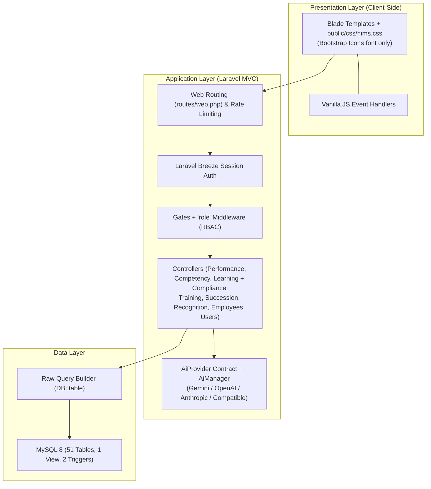
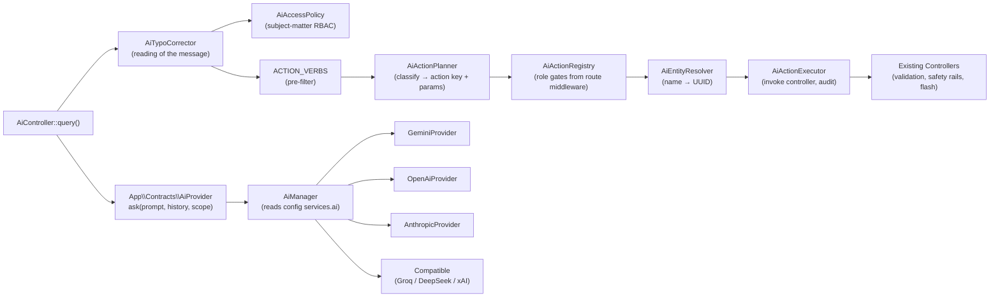

# HIMS Performance & Development Module
## Technical Reference: Architecture, Database Design & Security Specifications

This document outlines the systems architecture, MySQL database design list, and security configurations for the Performance & Development (P&D) module of the Hospital Information Management System (HIMS).

> **Status of this document — AS-BUILT.**
> Describes only what is actually implemented in `hims-app/`, verified against source. Designed-but-unbuilt
> features have been removed rather than described; if a control or capability is not documented here, it does
> not exist in the system.

---

## 1. Systems Architecture

The module is an **MVC, server-rendered web application** built on **Laravel 13 / PHP 8.3**, backed by a
**MySQL 8** relational database. Views are Blade templates styled by a single hand-authored stylesheet
(`public/css/hims.css`, 1808 lines) served directly via `asset()` — **not** Bootstrap and **not** through the
Vite/Tailwind pipeline. Data access is **raw Query Builder** (`DB::table(...)`), not Eloquent ORM.

> **One consequence of loading no Bootstrap CSS is worth recording, because it caused a defect across the whole
> UI.** Only the Bootstrap *Icons* font is loaded; Bootstrap's **reboot** is not. The reboot is what normally
> supplies `th { text-align: inherit }`, without which browsers apply their own defaults — `center` for `th`,
> `left` for `td`. `.hims-table th` never declared an alignment, so every table header in the app sat centred
> above left-aligned data. `hims.css` now declares `text-align: left` on `.hims-table th` explicitly, and
> `Unit\TableAlignmentContractTest` asserts it. **Nothing in this stylesheet may rely on a normalise/reboot
> layer being present.**



### Stack Components (as-built)

| Layer | Implementation |
|---|---|
| **Frontend** | HTML5 + hand-authored `public/css/hims.css` (1808 lines) + vanilla JS. **Bootstrap Icons** (font glyphs) via CDN only — the Bootstrap CSS *framework* is not used, so no reboot/normalise layer exists and the stylesheet must declare its own element defaults (see the `.hims-table th` note in §1). Tailwind/Vite are installed but the domain UI bypasses the build (`resources/css/app.css` is 3 lines). Most domain views extend `layouts/hims`; only `profile/edit` uses Breeze's `x-app-layout`. Record creation happens in **modals** (`.hims-modal-backdrop` / `.hims-modal`, z-index 1200, transparent backdrop acting purely as a dismissal hit area) driven by one shared controller, `partials/modal-js.blade.php`, and rendered through a `@stack('modals')` outside `<main>` so their `position: fixed` resolves against the viewport rather than the animated (transformed) content wrapper; multi-select uses **checkbox lists** (`.hims-checklist`), not `<select multiple>`. Tabular data uses one `.hims-table` style, with regression tests enforcing header/data alignment on the desktop grid and, below 768px, the restacking of every table into labelled record cards — `thead` hidden, each row a bordered card, each cell printing its own heading from `data-label` — so that no screen asks for a horizontal swipe. The same rule shapes the rest of the mobile block: flex rows of buttons wrap by name (`justify-content-between`, `.hims-card .card-header`, and the `.gap-1`…`.gap-4` utilities, since a *nested* action group left unwrapped puts a primary button past the right edge), and `display: contents` on `.topbar-left` promotes the page title out of its own box onto a full-width bar row beside a widened `--hims-topbar-h`, because clamping it inside the desktop 64px bar truncated every title longer than about 22 characters at 320px. Because the stylesheet and favicon are served outside the build, their URLs carry the file's own content hash (`substr(md5_file($path), 0, 8)`) from `partials/app-css.blade.php` and `partials/favicon.blade.php` — a constant URL behind `Cache-Control: max-age=14400` and Cloudflare would otherwise serve a release's new markup to clients still holding the previous CSS. |
| **Backend** | **PHP ^8.3**, **Laravel 13.22**. Controllers + `routes/web.php` routing. |
| **Database** | MySQL 8 (`DB_CONNECTION=mysql`). `CHAR(36)` UUID PKs generated in PHP via `Str::uuid()`; MySQL triggers auto-compute competency gap; **three statuses are derived rather than stored** — `App\Support\CredentialStatus` (credential expiry), `CycleStatus` (review cycle closed) and `ReviewStatus` (review frozen) all compute from a date on every read, in PHP and as bound SQL; 1 view. |
| **Authentication** | Breeze v2.4 session auth on the `users` table. Login throttling = 5 attempts (`LoginRequest`), `throttle:6,1` on verification/password routes. Public self-registration is disabled — admins provision accounts via `UserController`. |
| **Authorisation** | Gates defined in `AppServiceProvider::registerGates()` + the `role` route middleware, both keyed on `users.role`. See [§3.2](#32-granular-access-control-rbac). The AI assistant adds a third form — subject-matter RBAC applied in the controller rather than by middleware, see [§3.2.1](#321-subject-matter-rbac-for-the-ai-assistant). |
| **Cache / session / queue** | `CACHE_STORE=database`, `SESSION_DRIVER=file`, `QUEUE_CONNECTION=database`. The application makes no `Cache::` calls of its own and dispatches no queued jobs. |
| **Timezone** | `APP_TIMEZONE=Asia/Manila` (`config/app.php`). **An authorization setting, not a display one** — the three derived statuses above all ask "has this date passed?" against `now()->toDateString()`, so under Laravel's stock UTC default a Philippine cycle stayed editable until 8am the day after it ended. See [§2.2.1](#221-review-and-cycle-status-are-derived-from-the-cycles-end-date). |
| **AI Engine** | Provider-agnostic. Consumers depend on `App\Contracts\AiProvider`; `AiManager` resolves the driver from `AI_PROVIDER` (`gemini`\|`openai`\|`anthropic`\|`compatible`). Gemini is the default. See [§5](#5-ai-provider-layer). |
| **Mail** | SMTP presets (`gmail`, `outlook`, `yahoo`) plus a Brevo HTTPS API transport. Used by password reset only. See [§4](#4-outbound-mail). |
| **Local Staging** | Laragon (Apache/Nginx + PHP + MySQL) on Windows. |
| **Data Access** | Raw `DB::table()` Query Builder in controllers. `App\Models\User` is the only Eloquent model; there are no policies, observers, or repositories for the domain tables. |

---

## 2. Database Design (MySQL 8.0+)

The current MySQL database contains **51 tables and 1 view**, with **31 applied migration rows**. This includes
Laravel's own `users`, `sessions`, `cache`, `jobs`, `failed_jobs`, `job_batches`, `password_reset_tokens`, and
`cache_locks` infrastructure tables plus the HIMS domain tables. All
domain record identifiers (`PRIMARY KEY` & `FOREIGN KEY`) use standard `CHAR(36)` UUID formatting, **generated in
PHP via `Str::uuid()` at insert time** — nothing is auto-generated by MySQL, so an insert that omits the PK will
fail. `created_at`/`updated_at` must likewise be set manually, since Query Builder has no timestamp magic.

> **Removed legacy schema.** Later migrations dropped `peer_reviews` and the unused placeholder tables
> `permissions`, `role_permissions`, `system_users`, `course_modules`, `quiz_questions`, `quiz_attempts`,
> `training_tests`, `training_test_results`, `succession_reviews`, and `credential_types`. They are not part of
> the 51-table live baseline. Real authentication runs off Laravel's `users`, extended with `role`, a nullable
> `employee_id`, failed-attempt, and lockout columns.
>
> Renewal rules intentionally match the live free-text `employee_credentials.credential_type` values instead
> of depending on the removed placeholder `credential_types` table. See
> [§2.10](#210-compliance--oversight-subsystem).
>
> `notifications`, `credential_alert_log`, and `audit_trails` are live. `AuditTrail::record()` is used by the
> review lifecycle, succession, recognition, employee/user/competency administration,
> AI actions, training assignment, compliance, and completion paths; see [§3.4](#34-write-tracking).

### 2.1 Core / Shared Subsystem
1.  **`departments`**: Hospital divisions (clinical and non-clinical).
    *   *Columns*: `department_id` (PK), `name` (unique), `department_code` (unique), `head_employee_id` (FK to employees), `parent_dept_id` (FK to departments), `is_clinical` (bool), `created_at`.
2.  **`roles`**: Employee roles within departments.
    *   *Columns*: `role_id` (PK), `role_name` (unique), `role_slug` (unique), `department_id` (FK), `is_clinical` (bool), `created_at`.
3.  **`employees`**: Central register of all hospital personnel.
    *   *Columns*: `employee_id` (PK), `employee_code` (unique), `first_name`, `last_name`, `email` (unique), `phone`, `department_id` (FK), `role_id` (FK), `position_title`, `hire_date`, `employment_status`, `is_people_manager` (bool), `supervisor_id` (FK to self), `profile_image_url`, `created_at`, `updated_at`.

### 2.2 Performance Management Subsystem
4.  **`review_cycles`**: Evaluation timelines (annual, semi-annual, quarterly, probationary).
    *   *Columns*: `cycle_id` (PK), `cycle_name`, `cycle_type` (varchar, app-validated), `start_date`, `end_date`, `status` (varchar, app-validated), `created_by` (FK), `created_at`, `updated_at`.
    *   *`cycle_type`*: one of `annual`, `semi_annual`, `quarterly`, `probationary`. There is no `monthly`.
    *   *`status`*: one of `planned`, `active`, `closed`, `archived`, and it is **advisory rather than authoritative** — a cycle whose `end_date` has passed reads as closed however the column is set, and only `archived` outranks the date. Creation always stamps `planned`; nothing auto-writes the column afterwards. See §2.2.1.
5.  **`kpi_library`**: KPI templates by role type.
    *   *Columns*: `kpi_id` (PK), `kpi_name`, `kpi_category` (varchar, app-validated), `description`, `target_value` (decimal), `unit`, `applicable_roles` (JSON array of role slugs), `weight`, `is_active` (bool), `created_at`.
6.  **`performance_reviews`**: Periodic appraisal dossiers.
    *   *Columns*: `review_id` (PK), `employee_id` (FK), `cycle_id` (FK), `reviewer_id` (FK, nullable, `nullOnDelete`), `review_type` (varchar, app-validated), `status` (varchar, app-validated), `supervisor_rating`, `overall_score`, `strengths_text`, `improvements_text`, `employee_response`, `employee_response_submitted_at`, `employee_acknowledged_at`, `ai_bias_flags` (JSON), `ai_summary` (text), `digital_signature` (hash), `signed_at`, `is_exception_review` (bool, default false), `exception_basis` (varchar 30, nullable), `exception_reason` (text, nullable), `created_at`, `updated_at`.
    *   *Status*: holds **only `draft` or `finished`**. The third state, `completed`, is derived from the cycle's `end_date` and never written — see §2.2.1.
    *   *`review_type`*: one of `standard`, `probationary`, `promotion`. It is a **label on the review, not a workflow stage** — there is no `self`, no `peer` and no `360`. It carries no authorization meaning and is excluded from the unique key below.
    *   *Constraint*: Unique combination of `(employee_id, cycle_id, reviewer_id)`, named `pr_employee_cycle_reviewer_unique` because the generated name overruns MySQL's 64-character limit. One reviewer opens **one review per employee per cycle**, whatever it is labelled — `review_type` was deliberately removed from the key by migration `..._000170`, so a reviewer cannot open a second review on the same person by relabelling it from `standard` to `promotion`. A repeat create is routed to the existing record rather than inserted. The index is a **backstop, not the rule** — `reviewer_id` is nullable and MySQL treats NULLs as distinct, so two reviewer-less rows would both pass it; the PHP pre-check in `PerformanceController::storeReview()` is what actually deduplicates.
    *   *Exception columns*: populated only when admin or HR opens a review outside the reporting line. `exception_basis` is one of `no_supervisor`, `supervisor_unavailable`, `supervisor_is_subject`, `supervisor_account_unavailable`; `exception_reason` is operator-typed and mandatory on that path. See §3.2.2.
    *   *Employee response*: the subject may save a response after the review is no longer Draft. Acknowledgement
        is permitted only when the cycle has ended; it stamps `employee_acknowledged_at` and locks the response.
        This route cannot alter scores or reviewer comments and both operations are audited.
7.  **`review_kpi_scores`**: Raw ratings per KPI.
    *   *Columns*: `score_id` (PK), `review_id` (FK), `kpi_id` (FK), `supervisor_score`, `weighted_score`, `comments` (text).
    *   *Constraint*: Unique combination of `(review_id, kpi_id)`.
    *   `weighted_score` carries the reviewer's own number for that KPI straight through — there is no longer a blend to compute. The per-KPI weighting lives in `overall_score`, which weighs each KPI by `kpi_library.weight`. **The review screens no longer display this column**; because it equals `supervisor_score` on every row, printing it under a "Weighted" heading showed the same figure twice and mislabelled one of them. It is still written by `saveScores()` and still read by `CompetencyGapAnalysisService` and the gap-analysis employee view, so the column stays. What the screens print in its place is each KPI's *share* of the final score — see §2.2.2.
8. **`performance_improvement_plans`**: Corrective pathways for review scores below `2.5 / 5.0`.
    *   *Columns*: `pip_id` (PK), `employee_id` (FK), `triggered_by_review` (FK), `status` (varchar, app-validated), `action_steps` (JSON tasks checklist), `start_date`, `target_end_date`, `actual_end_date`, `supervisor_id` (FK), `notes`, `created_at`, `updated_at`.
    *   `triggered_by_review` is `NOT NULL` with a plain foreign key — **no cascade, no null-on-delete** — so a PIP pins its review in place. Migration `..._000170` had to delete every PIP before it could purge the reviews; that data loss is recorded in the patch notes.
9. **`review_goals`**: SMART goals associated with a performance dossier.
    *   *Columns*: `goal_id` (PK), `review_id` (FK), `employee_id` (FK), `goal_title`, `goal_description`, `target_date`, `progress_pct` (int, app-validated 0–100), `status` (varchar, app-validated), `created_at`.

#### 2.2.1 Review and cycle status are derived from the cycle's end date

Neither a review's frozen state nor a cycle's closed state is stored. Both are computed on every read
from `review_cycles.end_date`, by two small classes in `App\Support`:

| Class | Question it answers | States |
|---|---|---|
| `CycleStatus` | Has this review cycle ended? | `planned`, `active`, `closed`, `archived` |
| `ReviewStatus` | May this review still be edited? | `draft`, `finished`, `completed` |

`CycleStatus::of($stored, $endDate)` returns `archived` when the column says so, otherwise `closed`
when the end date has passed, otherwise the stored value — **archived outranks the date; the date
outranks the stored column otherwise**. `ReviewStatus::of()` returns `completed` on the same
condition, and delegates the date test to `CycleStatus::hasEnded()` so the cycle badge and the review
lock cannot drift apart. Only `draft` and `finished` are settable by a person; both remain editable.
`completed` is nobody's to set and is refused by validation.

Three properties are load-bearing:

*   **The comparison is a strict `<` on `Y-m-d` strings**, so a cycle ending *today* is open for the
    whole of that day and freezes the following morning.
*   **Dates are bound as query parameters, not baked in as `CURDATE()`**, which keeps
    `ReviewStatus::caseSql()` and `CycleStatus::whereNotEnded()` running on the sqlite connection
    `phpunit.xml` uses.
*   **There is no scheduled job.** The freeze is an authorization rule, and a rule that depends on
    `schedule:run` being wired is one that fails open on any box where it is not. The cost is that a
    raw query reading `performance_reviews.status` alone cannot see that a review is completed — it
    must join `review_cycles` and go through `of()`, `caseSql()` or `CycleStatus::whereNotEnded()`.

That cost has already been paid once. The dashboard's **Pending Reviews** tile filtered
`whereNotIn('status', ['completed'])` — a predicate that was correct while something wrote that value
and silently became a no-op when nothing did. It excluded no rows, so every frozen review in every
ended cycle stayed counted as outstanding work while the review screen showed it Completed and
refused edits. Both the organisation-wide and supervisor tiles now join `review_cycles`
([DashboardController.php:116](hims-app/app/Http/Controllers/DashboardController.php#L116),
[:209](hims-app/app/Http/Controllers/DashboardController.php#L209)). **Any new read that means
"reviews still open" has to join the cycle**; the status column cannot answer the question, and the
default sqlite test run cannot catch the mistake, because the admin dashboard is one of the
`CONCAT()`-carrying screens that skips off MySQL.

#### 2.2.2 A KPI's weight is displayed as its share of the score, not as the raw number

`kpi_library.weight` is a `decimal(3,2)` — the seeded values run 1.00, 0.90, 0.80, 0.70, 0.60. Printed
raw on a review screen, "weight 0.60" tells a supervisor nothing: it is not a multiplier they can apply
to their rating and it is not a percentage. It acquires meaning only next to the weights of the other
KPIs on the same review, because `overall_score` is a weighted mean and every weight there is divided
by the total.

**`App\Support\KpiWeighting`** ([KpiWeighting.php](hims-app/app/Support/KpiWeighting.php)) is the one
definition of that arithmetic, in the same shape as the status classes above — `final class`, static
methods, no database access and no Carbon, so `Unit\KpiWeightingTest` runs off the DB entirely.

| Method | Answers |
|---|---|
| `effectiveWeight($w)` | The coefficient actually used. A missing, null or zero weight counts as **1.00**, not as removal from the score: a KPI attached to a review is something the reviewer was asked to judge, and a blank library column is an unset field, not an instruction to ignore their answer. |
| `isRated($row)` | Has the reviewer put a rating on this row? Reads `supervisor_score`, the one field the form writes; empty string counts as unrated. |
| `shares($rows)` | Each rated row's exact share of the final score, as a float percentage keyed by `score_id`. |
| `displayShares($rows)` | The same shares as whole percentages that total exactly 100. |
| `ratedCount($rows)` | How many attached KPIs carry a rating. |

Three properties are load-bearing:

*   **The denominator is the rated rows, not the attached ones.** An unrated KPI is absent from the
    roll-up, not a zero — `cleanScore()` nulls an empty box, so its weight leaves the denominator too
    and the remaining KPIs' shares grow to fill the gap. A share computed over *attached* rows would
    disagree with the score on display the moment one box was left blank. Unrated rows are therefore
    **absent from the returned array** rather than present with a 0, because a 0% would read as
    "counted, and worthless".
*   **One implementation serves both the screen and the write.**
    `PerformanceController::recalculateReviewTotals()` gets its `weight ?: 1` rule from
    `effectiveWeight()`, and the review screens render through `displayShares()`. A KPI cannot be shown
    as deciding 13% of a score that was calculated as though it decided something else.
*   **A screen must call `displayShares()`, never `shares()`.** A column of percentages is read down
    and added up, so rounding each share independently is wrong in a way the reader can see: seven KPIs
    of similar weight round to 16/14/16/13/13/16/14, which totals **102%**. Both seeded reviews hit
    this. The integers are apportioned by largest remainder instead — floor everything, then hand the
    leftover points to the largest fractional parts, with ties breaking on the order the screen lists
    the rows so the same review always shows the same figures.

The two roll-ups are also now labelled by what each averages. `supervisor_rating` renders as **"Average
of KPI ratings"** and `overall_score` as **"Final Score / weighted by KPI importance"**, with a sentence
on the page saying why they differ and that the Final Score is the figure the rest of HIMS quotes. They
previously read "Supervisor Rating" and "Final Score" — two names for what looked like one thing.

Because the whole mechanism turns on "has this date passed?", **`config('app.timezone')` is
`Asia/Manila` and that is an authorization setting, not a display one** (`APP_TIMEZONE` in `.env`).
Under Laravel's stock UTC default, `now()->toDateString()` was still yesterday for the first eight
hours of every Philippine day, so a cycle that ended the night before stayed scoreable until 8am.
`Unit\CycleStatusTest::test_the_app_clock_is_the_hospital_clock` pins the value, and `phpunit.xml`
deliberately does not override the timezone so the assertion stays live.

#### 2.2.3 The written half of a review is the half that states a cause

A performance review stores three kinds of free text: `performance_reviews.strengths_text`,
`performance_reviews.improvements_text`, and one `review_kpi_scores.comments` note per KPI (a `TEXT`
column, validated at 1000 characters). A score says *that* something is wrong; only the sentence beside
it says *why*, which is what decides whether the answer is training, equipment familiarisation or
reassessment.

**`App\Support\ReviewFeedback`** ([ReviewFeedback.php](hims-app/app/Support/ReviewFeedback.php)) is the
one definition of that set, in the same shape as the status classes and `KpiWeighting` above — `final
class`, static methods, no Carbon — with **one deliberate exception: `promptLines()` reads the two
`system_settings` privacy switches** (§2.11), because a prompt-builder that ignored them would be the
leak. Every other method is pure, and that one read is wrapped in a `try`/`catch` that falls back to
redacting, which is why `Unit\ReviewFeedbackTest` (14 tests) still runs with no schema behind it.

| Method | Answers |
|---|---|
| `group($reviews, $comments)` | Folds review rows and their per-KPI comment rows into one entry per review, preserving the caller's order (the service selects newest cycle first). Blank and whitespace-only text is dropped; a review with nothing written on it is **kept**, because a cycle that passed without a single comment is itself a finding. |
| `count($grouped)` | How many individual pieces of written feedback exist — strengths, improvements and each KPI note count one apiece, because each is one thing somebody sat down and typed. |
| `promptLines($grouped)` | The same set as prompt text. Truncates each comment to `MAX_COMMENT_CHARS` (300) and collapses newlines, since a dozen KPIs × 1000 characters × three cycles would be a five-figure paste. |
| `formatScore(?float)` | A score as both the prompt and the page spell it — `3.40/5`, or `not scored` for null. Public for the same reason `KpiWeighting::displayShares()` is: the view renders the numbers this class puts in the prompt, and four inline copies of `number_format($x, 2).'/5'` had already diverged on the null case. |

Two properties are load-bearing:

*   **One shape, two consumers.** `competency/gap-analysis/employee.blade.php` iterates the array that
    `promptLines()` renders, so a comment cannot reach the page without reaching the prompt, or vice
    versa. That drift is exactly what produced the original defect: all three fields were being
    *selected* by `CompetencyGapAnalysisService::performanceSignal()` and then dropped before the
    heredoc, so the model was asked for `evidence`, `root_causes` and `strengths_to_leverage` while
    holding three numbers and a cycle name. Only the prompt is truncated — the screen has room and the
    reader is entitled to the whole sentence.
*   **A stated absence, never an empty section.** With no reviews, or reviews carrying no comment,
    `promptLines()` returns an explicit sentence saying so. An empty block in a prompt reads as an
    omission the model may fill in; a stated absence does not. The page says the same thing in the same
    two cases, and the AI is instructed to return `null` for `feedback_summary` rather than restate a
    rating as though somebody had written it.

**Privacy consequence, stated plainly:** supervisors' verbatim written comments about a named employee
are sent to the configured third-party AI provider on every employee gap-analysis page load unless an
administrator has turned that off. That was already true of the scores; it is a materially different
disclosure for free text, which can name patients, incidents or colleagues. It is bounded by the
`admin,hr_manager,supervisor` gate on `competency.gap.*` and by
`Controller::authorizeEmployeeAccess()`, and by the three-cycle limit and the 300-character-per-comment
cap.

**Two administrator controls do exist, and they fail safe.** They live in the `system_settings`
key/value table, are written by `UserController::updateAiSettings()` from the user-administration
screen, and are read by `ReviewFeedback::promptLines()`:

*   **`ai_include_comments`** — set to `'0'`, no written comment leaves the hospital at all.
    `promptLines()` substitutes one sentence stating that comments are excluded per hospital privacy
    settings, so the model is told the text was *withheld* rather than left to infer none was written.
    Scores, cycle names and the deterministic analysis are unaffected.
*   **`ai_redact_names`** — on unless explicitly `'0'`. `ReviewFeedback::redactPii()` replaces every
    part of the subject's own name longer than two characters with `[REDACTED]`, and any
    `Patient` / `Pt.` / `Patient #`-prefixed identifier with `[REDACTED_PATIENT]`, across strengths,
    improvements and every KPI note.

The settings read is wrapped in `try`/`catch` whose handler sets redaction **on**, so a missing table or
a failed query redacts rather than discloses. What still does not exist is a *consent* step: the
employee is not asked, and redaction is name-and-patient-pattern based rather than a guarantee — a
comment naming a colleague or an incident is still forwarded. Hospitals running this with a provider
outside their data-processing agreements should clear `ai_include_comments`, and can additionally set
`AI_PROVIDER` to a driver with no key configured, which degrades the narrative to the `⚠️` path and
leaves the deterministic analysis and the on-page feedback list fully intact.

### 2.3 Competency Management Subsystem
10. **`competency_domains`**: Domains such as Clinical, Technical, or Administrative.
    *   *Columns*: `domain_id` (PK), `domain_name` (unique), `description`, `created_at`.
11. **`competency_categories`**: Skill groups mapped to JCI Standards (e.g., JCI.SQE.3).
    *   *Columns*: `category_id` (PK), `domain_id` (FK), `category_name`, `jci_standard_code`, `created_at`.
12. **`competencies`**: Individual skill templates.
    *   *Columns*: `competency_id` (PK), `category_id` (FK), `competency_name`, `competency_code` (unique), `description`, `required_proficiency` (int, app-validated 1–5), `is_mandatory` (bool), `reassessment_months` (nullable int — the type-level default cadence, added by migration `..._000130`), `created_at`.
13. **`role_competency_requirements`**: Target minimum proficiencies by role.
    *   *Columns*: `id` (PK), `role_id` (FK), `competency_id` (FK), `minimum_proficiency` (int, app-validated 1–5), `is_critical` (bool).
    *   *Constraint*: Unique combination of `(role_id, competency_id)`.
14. **`competency_assessments`**: Audit logs of employee evaluations.
    *   *Columns*: `assessment_id` (PK), `employee_id` (FK), `competency_id` (FK), `assessed_by` (FK), `assessment_method` (varchar, app-validated), `current_proficiency` (int, app-validated 1–5), `gap` (computed delta), `evidence_url`, `notes`, `assessed_date`, `next_assessment_due` (per-assessment override; falls back to `competencies.reassessment_months` when null), `created_at`, `updated_at`.
15. **`employee_credentials`**: Official clinical credentials (PRC license, Board certifications).
    *   *Columns*: `credential_id` (PK), `employee_id` (FK), `credential_type`, `credential_number`, `issuing_body`, `issue_date`, `expiry_date`, `document_url`, `verified_by` (FK), `verified_at`, `created_at`, `updated_at`. **There is no `status` column** — status is derived at read time from `expiry_date`.
    *   *Status derivation*: `App\Support\CredentialStatus` is the single definition. `of(?string $expiryDate)` decides in PHP; `caseSql($column)` emits the same decision as SQL, parameterised with the two bindings from `caseBindings()` (today, and the window end 30 days out) so it runs on sqlite as well as MySQL. The four states are mutually exclusive, so a set of counts over them sums to the row total:
        ```php
        // App\Support\CredentialStatus — abbreviated
        expiry_date IS NULL                   => 'no_expiry'
        expiry_date <  today                  => 'expired'
        expiry_date <= today + 30 days        => 'expiring_soon'
        otherwise                             => 'active'
        ```
    *   *Why it matters*: every screen and every scan that reports credential state calls this class, so the dashboard tile, the Competency alerts panel, the progression page and the daily sweep cannot disagree about whether one credential is expiring. `CredentialStatusTest` asserts the PHP and SQL paths agree on each boundary date. The guarantee is application-level, not database-enforced — a query that hand-rolled its own date comparison would escape it.

### 2.4 Learning Management Subsystem
16. **`learning_pathways`**: Program curricula (e.g., "Critical Care Nurse Pathway").
    *   *Columns*: `pathway_id` (PK), `pathway_name`, `description`, `target_roles` (JSON list of role slugs), `total_cpd_hours` (decimal), `is_mandatory` (bool), `created_by` (FK), `created_at`.
17. **`courses`**: Catalog course entries.
    *   *Columns*: `course_id` (PK), `course_code` (unique), `title`, `description`, `category`, `cpd_hours` (decimal), `difficulty_level` (varchar, app-validated), `estimated_duration` (int representing minutes), `passing_score` (decimal), `max_retakes`, `is_mandatory` (bool), `is_active` (bool), `created_by` (FK), `created_at`, `updated_at`.
18. **`pathway_courses`**: Junction table mapping courses to pathways.
    *   *Columns*: `id` (PK), `pathway_id` (FK), `course_id` (FK), `sequence_order` (int), `is_prerequisite` (bool).
    *   *Constraint*: Unique combination of `(pathway_id, course_id)`.
19. **`course_enrollments`**: Course requirement/progress records. New rows are created by Required Training rather than self-service.
    *   *Columns*: `enrollment_id` (PK), `employee_id` (FK), `course_id` (FK), `enrolled_by` (FK), `assignment_id` (nullable `CHAR(36)`, **no FK** — the link to `training_assignments` is application-enforced; non-null on current writes), `enrollment_date`, `due_date`, `status` (varchar, app-validated), `progress_pct` (int, app-validated 0–100), `completed_at`, `cpd_hours_earned` (decimal), `certificate_id` (FK).
    *   *Constraint*: Unique combination of `(employee_id, course_id)`.
20. **`cpd_records`**: Consolidated CPD points ledger.
    *   *Columns*: `cpd_id` (PK), `employee_id` (FK), `source_type` (varchar, app-validated), `source_id` (FK reference), `activity_name`, `cpd_hours`, `date_earned`, `renewal_period`, `verified` (bool), `verified_by` (FK), `created_at`.
21. **`certificates`**: Certificate metadata schema. The application currently reads the count but issues no certificate and writes no row.
    *   *Columns*: `certificate_id` (PK), `employee_id` (FK), `course_id` (FK), `certificate_code` (unique), `issued_date`, `expiry_date`, `pdf_url`, `qr_verification_url`, `created_at`.

### 2.5 Training Management Subsystem
22. **`training_venues`**: Physical venues (e.g., Main Auditorium).
    *   *Columns*: `venue_id` (PK), `venue_name`, `building`, `floor`, `capacity`, `equipment` (JSON), `is_active` (bool), `created_at`.
23. **`training_sessions`**: Live scheduled training workshops.
    *   *Columns*: `session_id` (PK), `session_code` (unique), `title`, `description`, `category`, `instructor_id` (FK), `venue_id` (FK), `session_date`, `start_time`, `end_time`, `capacity`, `registration_deadline`, `status` (varchar, app-validated), `linked_course_id` (FK), `linked_competencies` (JSON), `cpd_hours`, `has_pre_test` (bool), `has_post_test` (bool), `created_by` (FK), `created_at`, `updated_at`.
    *   *Venue Conflict Check*: Unique key index `idx_venue_schedule` on `(venue_id, session_date, start_time)`.
24. **`training_registrations`**: Registration and attendance state records.
    *   *Columns*: `registration_id` (PK), `session_id` (FK), `employee_id` (FK), `registered_by` (FK), `registration_date`, `status` (varchar, app-validated), `check_in_time`, `check_in_method`, `UNIQUE (session_id, employee_id)`.
25. **`training_feedback`**: Surveys compiled after completion.
    *   *Columns*: `feedback_id` (PK), `session_id` (FK), `employee_id` (FK), `overall_rating` (int, app-validated 1–5), `content_rating`, `instructor_rating`, `venue_rating`, `comments`, `ai_sentiment_score` (decimal), `ai_sentiment_label`, `submitted_at`, `UNIQUE (session_id, employee_id)`.

### 2.6 Succession Planning Subsystem
26. **`critical_positions`**: Target critical hospital roles.
    *   *Columns*: `position_id` (PK), `position_title`, `department_id` (FK), `current_holder_id` (FK), `is_critical` (bool), `vacancy_risk` (varchar, app-validated), `risk_factors` (JSON), `impact_description`, `estimated_vacancy_date`, `last_reviewed_at`, `last_reviewed_by` (FK), `quarterly_review_notes`, `created_at`, `updated_at`.
    *   HR/Admin can record a quarterly review; the timestamp, linked reviewer and notes are audited. The
        organisation dashboard flags high/critical-risk positions with no `ready_now` candidate.
27. **`succession_candidates`**: Target successor backup plans.
    *   *Columns*: `candidate_id` (PK), `position_id` (FK), `employee_id` (FK), `performance_score` (**int, 1–5**), `potential_score` (**int, 1–5**), `nine_box_label` (`VARCHAR(30)`, written by the application), `readiness_level`, `development_plan` (JSON, unused), `mentor_id` (FK), `status`, `nomination_notes` (`TEXT`, nullable), `nominated_by` (FK), `nominated_at` (DEFAULT CURRENT_TIMESTAMP), `reviewed_at`, `approved_at`.
    *   `nomination_notes` holds the rationale typed into the nominate modal. It is **write-once**: only
        `storeCandidate()` writes it, `updateCandidate()` does not read or clear it, and the edit form has no
        field for it — so revising a candidate's ratings cannot wipe the reasoning behind the nomination. It is
        confidential and sits in `redactConfidentialCandidate()`'s field list with the ratings; the audit row
        records `nomination_notes_length` rather than the prose, so `audit_trails` does not become a second,
        unredacted copy of HR's judgement about a named employee. Added by
        `2026_08_16_000001_add_nomination_notes_to_succession_candidates`; the field had existed in the modal
        since the module shipped but posted to no column, so every rationale was silently discarded behind a
        success message.
    *   Scores are **1–5**. There is no `CHECK` constraint in the migration; the range is enforced by
        `$request->validate(['performance_score' => 'integer|min:1|max:5'])` and by `min`/`max` on the form inputs.
    *   *9-Box logic* — computed in PHP by `SuccessionController::nineBoxLabel()`, which runs on **every**
        insert and update and ignores any submitted `nine_box_label`. Each 1–5 axis collapses to three bands
        (low = 1–2, med = 3, high = 4–5), giving the standard nine cells:

        | | pot 1–2 (low) | pot 3 (med) | pot 4–5 (high) |
        |---|---|---|---|
        | **perf 4–5 (high)** | `solid` | `high` | `star` |
        | **perf 3 (med)** | `avg` | `core` | `potential` |
        | **perf 1–2 (low)** | `under` | `inconsist` | `diamond` |

        Because the value is derived server-side and never accepted from input, the badge cannot contradict the
        scores displayed beside it.
    *   *Constraint*: Unique combination of `(position_id, employee_id)` — enforced, and pre-checked in
        `storeCandidate()` so a duplicate nomination reports a message instead of a 500.
    *   *Note*: this table has **no** `created_at`/`updated_at`; it tracks lifecycle via
        `nominated_at` / `reviewed_at` / `approved_at`. `status`, `reviewed_at` and `approved_at` exist as
        columns and `reviewed_at` is stamped on edit, but no screen transitions a candidate between statuses.
28. **`leadership_development_paths`**: Milestones tracking successor development. Full CRUD via
    `SuccessionController::storeMilestone()` / `updateMilestone()` / `destroyMilestone()`.
    *   *Columns*: `path_id` (PK), `candidate_id` (FK), `milestone_title`, `milestone_type`, `description`, `target_date`, `completed_date`, `status`, `linked_course_id` (FK), `linked_competency` (FK), `created_at`, `updated_at`.
    *   `status` moves `not_started` → `in_progress` → `completed`. `completed_date` is stamped on completion and
        **cleared** if the status moves back, so the Dev Progress percentage only ever counts genuinely finished work.
    *   Rows are deleted with their parent candidate (`withdrawCandidate()` wraps both deletes in a transaction),
        since the FK would otherwise block the parent delete and an orphaned milestone belongs to nobody.
    *   *Confidential scope*: staff cannot enter the module. Admin/HR see all data. Supervisors see only
        candidates who report directly to them and positions containing those candidates; performance/potential,
        9-box, readiness, mentor, candidate status and vacancy-risk fields are redacted. They can manage
        milestones only for those direct-report candidates.

### 2.7 Social Recognition Subsystem
29. **`recognition_badges`**: Badges mapped to core hospital values.
    *   *Columns*: `badge_id` (PK), `badge_name` (unique), `badge_icon` (class), `badge_color`, `hospital_value`, `description`, `points_value` (int), `is_active` (bool), `created_at`.
30. **`recognition_posts`**: Wall posts created by peers/managers.
    *   *Columns*: `post_id` (PK), `author_id` (FK), `recipient_id` (FK), `badge_id` (FK), `post_type` (varchar, app-validated), `message` (text), `is_public` (bool), `is_featured` (bool), `moderation_status` (varchar, app-validated), `moderated_by` (FK), `moderation_note`, `link_to_review_id` (FK), `created_at`, `updated_at`.
    *   *Self-recognition is blocked in two places.* The modal excludes the current employee, and
        `RecognitionController::storePost()` rejects `author_id === recipient_id` so a crafted request cannot
        bypass the picker. The schema has no CHECK constraint for this rule.
    *   `post_type` is derived, not selected by the author: it is `supervisor` only when the recipient's
        `employees.supervisor_id` equals the author, otherwise `peer`. `link_to_review_id` remains null on every
        production write; recognition does not contribute to formal review scoring.
    *   HR/Admin moderation updates `moderation_status`, `moderated_by`, and `moderation_note`, writes an
        `audit_trails` row, and notifies the author. Posts are always named. The public feed reads
        approved/public rows only; Sent and Received include private posts involving the current employee, and
        HR/Admin receive a Private moderation view of all private posts.
31. **`recognition_reactions`**: Reactions (e.g. like, clap, support).
    *   *Columns*: `reaction_id` (PK), `post_id` (FK), `employee_id` (FK), `reaction_type` (varchar, app-validated), `created_at`, `UNIQUE (post_id, employee_id)`.
32. **`recognition_comments`**: Post comments.
    *   *Columns*: `comment_id` (PK), `post_id` (FK), `author_id` (FK), `comment_text`, `moderation_status`, `created_at`.
    *   Both reactions and comments resolve the parent through `visiblePost()`, so private-post interaction is
        restricted to sender, recipient, and HR/Admin moderators. Private posts are excluded from public
        statistics and `v_recognition_leaderboard`.

### 2.8 AI Assistant Subsystem
33. **`ai_chat_sessions`**: One row per conversation in the assistant sidebar.
    *   *Columns*: `id` (PK, UUID), `user_id` (FK → `users`, `ON DELETE CASCADE`), `title` (nullable, 120 — derived from the first question, so an abandoned chat never gets a misleading name), `pending_action` (text, nullable — holds a JSON payload, but declared `TEXT`, not a MySQL `JSON` column), `pending_action_at` (timestamp, nullable), `created_at`, `updated_at`.
    *   *Index*: `(user_id, updated_at)` — the sidebar list, most recent first.
    *   *`pending_action` holds a destructive action awaiting confirmation* — added by migration `..._000140`. A delete is never executed on the turn that requests it: the plan is resolved, parked here, and fired only if the **next** message in that session confirms it. `pending_action_at` bounds that window to five minutes (`AiController::CONFIRM_TTL_MINUTES`), so a "yes" answering some later question cannot detonate a stale offer. Both columns are cleared the moment the pending action is read, whether it is confirmed or cancelled. Scoped per session, so a confirmation in one conversation cannot fire an action parked in another.
34. **`ai_chat_messages`**: The turns of a conversation.
    *   *Columns*: `id` (PK, UUID), `user_id` (FK → `users`, `ON DELETE CASCADE`), `session_id` (`CHAR(36)`, nullable, **no FK — see below**), `role` (`ENUM('user','ai')`), `message` (text), `seq` (unsigned int, nullable), `created_at`, `updated_at`.
    *   *Index*: `(session_id, seq)` — ordered replay of one conversation.

> **`session_id` deliberately carries no foreign key.** Adding one through `Schema::table()` makes Laravel's
> SQLite grammar rebuild the whole table, and that rebuild reconstructs columns from `BlueprintState`, which does
> not capture CHECK constraints — so `role`'s `ENUM('user','ai')`, which SQLite implements as
> `varchar check (role in (...))`, would be silently downgraded to a plain varchar in the test database while
> MySQL kept a real `ENUM`. The same rebuild copies rows with `pragma foreign_keys` off, so an FK that MySQL
> would reject against existing history would still pass green in CI. Ownership is enforced in `AiController`
> instead — see [§3.2.1](#321-subject-matter-rbac-for-the-ai-assistant).
>
> **`seq` exists because `created_at` cannot order a conversation.** `AiController` writes one `now()` value to
> both the question and the answer row, and the column has whole-second precision, so the two halves of a turn
> tie. That was invisible while history was only ever displayed, but the turn list replayed to the model must be
> in true order. Messages adopted from the pre-session flat log keep a null `seq`; the reader falls back to
> `created_at` for them.

The right-hand assistant rail exposes that persisted session model directly. Conversation history is visible by
default, loads when the rail opens, and can be collapsed with the clock button without deleting anything. A
browser-local preference remembers the collapsed state. A Global Search result can open a saved conversation by
adding `?ai_session=<uuid>` to the dashboard URL; the layout moves that id into the same owner-scoped session state,
opens the rail, loads the transcript, and removes the query parameter from the visible URL. Failed history loads
remain retryable rather than permanently marking the session list as loaded.

### 2.9 Notification Subsystem

Added by the development rework. Two tables, both live. Compliance reminders originate from a scheduled sweep;
recognition activity, course completion, CPD verification, and moderation outcomes originate from their owning
interactive workflows.

35. **`notifications`**: In-app alerts, rendered by the topbar bell. Created by migration `..._000010` but dead schema until the rework.
    *   *Columns*: `notification_id` (PK), `recipient_id` (FK → `employees.employee_id`), `notification_type` (50), `title` (300), `message` (text, nullable), `reference_type` (50, nullable), `reference_id` (nullable), `is_read` (bool, default false), `read_at`, `created_at`, `updated_at`.
    *   *Index*: `(recipient_id, is_read, created_at)` — exactly the shape the bell query uses.
    *   *Recipients are employees, not users.* `recipient_id` carries a foreign key to `employees`, so an account with no linked employee profile receives nothing and its bell is permanently empty. An employee with no login still accrues rows, harmlessly.
    *   *Types in use*: `credential_expiring_soon`, `credential_expired`, `competency_reassessment_due`,
        `cycle_at_risk`, `cycle_shortfall`, `course_completed`, `cpd_verified`, `recognition_received`,
        `recognition_reaction`, `recognition_comment`, and `recognition_moderated`. Credential types are built as
        `'credential_'.$status`, so they follow `CredentialStatus`' vocabulary rather than a second list that
        could drift from it.
    *   `reference_type` / `reference_id` point back at the row that caused the alert (`recognition_post`,
        `employee_credentials`, `competency_assessments`, `employee_renewal_cycles`, `course_enrollments`, or
        `cpd_records`) and deliberately carry **no** foreign key, so deleting the subject leaves the alert history intact.
36. **`credential_alert_log`**: Dedupe ledger for the daily sweep.
    *   *Columns*: `alert_id` (PK), `subject_type` (30, nullable), `subject_id` (36, nullable), `credential_id` (FK, **nullable**), `employee_id` (FK), `alert_type` (30 — the `CredentialStatus` value, `expired` or `expiring_soon`, or `cycle_shortfall`), `sent_to` (JSON list of recipient employee ids), `sent_at` (defaults to insert time), `acknowledged_at` (nullable, never written).
    *   The sweep keys on `(credential_id, alert_type)` and skips anything already present, so a credential sitting inside the 30-day window for a month raises one alert rather than thirty — and still raises a second, distinct one when it crosses into `expired`.
    *   *Widened by the compliance layer.* `credential_id` was `NOT NULL` with an FK, which a renewal-cycle shortfall alert cannot satisfy — it has no credential to point at. The column became nullable and `subject_type` / `subject_id` were added as a discriminator (`credential` + `credential_id`, or `renewal_cycle` + `cycle_id`). **One ledger, one dedupe path**: a second table would have needed its own skip logic, and two copies of that logic drift.
37. **`audit_trails`**: Selective attributable write-action ledger.
    *   *Columns*: `audit_id` (PK), `user_id` (`CHAR(36)`, nullable — the stringified `users.id`, **no FK**), `employee_id` (`CHAR(36)`, nullable, **no FK**), `action` (30 — `ai_create`, `ai_update`, `ai_delete`), `resource_type` (50 — the registry's `table` value), `resource_id` (36 UUID, nullable — best effort, see below), `ip_address` (45, NOT NULL), `user_agent` (text, nullable), `request_method` (10), `request_path` (text), `before_state` (JSON, nullable), `after_state` (JSON, nullable), `before_state_hash` / `after_state_hash` / `chain_hash` (64 char, all nullable, never written — hash chaining is documented as not implemented), `metadata` (JSON, nullable — carries `action_key`, `prompt`, `session_id`, `provider`), `timestamp` (defaults to insert time). The table has **no foreign keys at all** and exactly two indexes: `(user_id, timestamp)` and `(resource_type, resource_id, timestamp)`.
    *   *Scope*: AI writes; training assignment; compliance rule/cycle administration; course completion/reopen;
        employee/user creation and update; competency assessment/credential creation; recognition creation,
        badge creation and moderation; review cycle/review creation,
        exception use, score/comment/status updates, employee response/acknowledgement; and every succession
        position/candidate/milestone mutation. Reads and every other UI edit are not comprehensively logged.
    *   *`resource_id` best effort*: UUIDs are generated in PHP, not by MySQL, so a create's row `INSERT` carries no `LAST_INSERT_ID()`. The executor reads back the newest row since a pre-call timestamp, which is correct for a quiet system and a plausible guess under load. Concurrency could pick a different row; the audit row is still correct about who did what, and `resource_id` is nullable for exactly this reason.
    *   *Hash chaining* is documented in the migration but unimplemented in `App\Support\AuditTrail`. Those three hash columns stay NULL.

**Alerts escalate; they are not private.** `NotificationService::escalationChain($employeeId)` resolves each
credential or reassessment alert to up to three recipients — the employee, their `supervisor_id`, and the head of
their department (`departments.head_employee_id`) — deduplicated, with missing links dropped. So a lapsing licence
is visible to the people responsible for clinical assignment, not only to its holder. `cpd_verified` is the
exception: it goes to the owning employee alone, since nobody else needs to know a claim cleared approval.

**How rows get written.** `App\Console\Commands\ScanCredentialExpiry` (`hims:scan-credential-expiry`) is
registered on the scheduler to run daily. It sweeps credentials entering the 30-day window, credentials that
have lapsed, and competency reassessments falling due, then writes through `App\Services\NotificationService`.
Expiry state comes from `App\Support\CredentialStatus`, the same definition every screen uses, so an alert
cannot contradict the page the recipient opens after reading it. Email is attempted only where configured and a
failure is swallowed — a dead SMTP host must not cost the in-app notification. Interactive writers include
`RecognitionController` (received/reaction/comment/moderation), `LearningController::completeEnrollment()`
(course completion), and `LearningController::verifyCpd()` (external CPD approval).

**How rows get read.** `AppServiceProvider::composeNotifications()` attaches a view composer to the shell
layout, so the bell is populated on every page without each controller knowing about it. `feedFor()` returns the
latest twelve rows for the caller, including already-read items, and adds the circular icon/tone plus a
server-resolved destination. `unreadCount()`, `markRead()`, and `markAllRead()` all filter on the caller's own
`employee_id`, so neither `POST /notifications/{notification}/read` nor `POST /notifications/read-all` can change
another employee's alerts. Reading changes emphasis and counters; it does not delete the recent feed row.

Destination resolution is access-aware. Recognition, credential, CPD, course-completion, renewal, and
competency notifications point at their owning module. A credential result receives a focused row link only when
the recipient is the subject, the subject's recorded supervisor, or HR/Admin. Department heads can receive an
escalation alert without being the recorded supervisor; in that case the destination falls back to the credentials
module rather than producing a focus filter for a row the module will not return.

### 2.9.1 Permission-Aware Global Search

`GET /search?q=...` is handled by `GlobalSearchController` for every authenticated role. The controller uses an
explicit allow-list of sources rather than discovering tables or columns dynamically. A query must contain at
least two characters, each **database-backed** source contributes at most six matches (the navigation list is a
fixed, role-filtered set and is not capped), and the combined response is capped at fifty
results. The shell debounces requests, groups the JSON response, supports arrow-key selection, and follows the
returned real route when the user chooses a result.

The allow-list covers navigation pages, employees, review cycles/reviews/goals, competency domains and records,
credentials, courses, pathways, CPD and renewal cycles, required-training assignments, training sessions and
venues, recognition, succession positions/candidates, departments, user accounts, and AI sessions. Every source
applies its owning visibility rule before matching searchable columns. In particular: staff are held to their own
employee records; supervisors are held to themselves and direct reports; private recognition is limited to
participants and HR/Admin moderators; supervisor succession search excludes ratings, readiness, status, mentor,
9-box, and vacancy-risk terms; accounts are Admin-only; and AI titles/messages are owner-only. Search returns
destinations, not authorization grants, so the destination controller remains the final enforcement point.

### 2.10 Compliance & Oversight Subsystem

Three tables and three widened ones, added by migration `..._000150`. Where Learning answers *"what has this
employee done"*, this subsystem answers the hospital's questions: what is **required**, who is **short of it**,
and what an accreditation survey needs to see.

**Nothing here requires a `users` row.** Every table keys on `employee_id`; every query in
`ComplianceController` and both compliance services does the same. An employee tracked by proxy — no login, no
password, possibly no email — is fully governed by mandatory training and renewal cycles. This is a hard
constraint, not an accident of implementation: the hospital's compliance position cannot depend on who has
gotten around to onboarding an account.

38. **`renewal_rules`**: What a renewal cycle requires.
    *   *Columns*: `rule_id` (PK), `subject_type` (20 — `credential` | `cpd`), `subject_key` (100), `label` (150), `required_hours` (decimal 5,1), `cycle_months` (int), `grace_days` (int, default 0), `is_active` (bool, default true), `created_by` (FK → employees, nullOnDelete), `created_at`, `updated_at`.
    *   *Constraint*: unique `(subject_type, subject_key)` — pre-checked in `storeRule()` so a duplicate reports a message rather than a 500.
    *   `subject_key` is **free text on purpose**: for a `credential` rule it must match `employee_credentials.credential_type`, which is itself free text with no FK to `credential_types`. Matching the column it has to join against beats introducing a mismatch.
    *   `grace_days` is recorded and displayed ("+30 grace") but does **not** extend the window used for the hours calculation — it is advisory information for the person chasing the renewal.
39. **`employee_renewal_cycles`**: One employee's window against one rule.
    *   *Columns*: `cycle_id` (PK), `employee_id` (FK, cascade), `rule_id` (FK, cascade), `cycle_start` (date), `cycle_end` (date), `hours_required_snapshot` (decimal 5,1), `credential_id` (FK → employee_credentials, nullOnDelete), `status` (20 — `open` | `met` | `shortfall` | `closed`), `created_at`, `updated_at`.
    *   *Constraint*: unique `(employee_id, rule_id, cycle_start)`; index on `(employee_id, status)`.
    *   **`hours_required_snapshot` freezes the requirement when the cycle opens.** Raising a rule from 45 hours to 60 applies to the *next* cycle; it cannot retroactively fail everyone who already met the old bar. This is the whole reason rules and cycles are two tables rather than one.
    *   **Hours *attained* are deliberately not stored.** `RenewalCycleService::attainedHours()` sums `cpd_records` at read time — `date_earned` inside the window, `verified = 1`. CPD is verified days or weeks after it is logged, so a stored total is stale the moment a verification lands, and a recount job is one more thing to run and get wrong. **Unverified hours never count**: an employee cannot clear a compliance requirement by typing a number into a form.
    *   *Window anchoring*: a `credential` rule ends when the licence does (`employee_credentials.expiry_date`), so the cycle and the credential expire together. A `cpd` rule with no credential rolls forward from `hire_date` in `cycle_months` steps until the window covers today — a five-year employee on a 36-month cycle lands in their second window, not one that closed two years ago.
40. **`training_assignments`**: The assignment *intent*.
    *   *Columns*: `assignment_id` (PK), `subject_type` (20 — `course` | `session`), `subject_id` (36), `target_type` (20 — `employee` | `department` | `role` | `all`), `target_id` (36, nullable — null when `target_type = all`), `required_by` (date, nullable), `reason` (text, nullable), `assigned_by` (FK → employees, nullOnDelete), `expanded_count` (int, default 0), `created_at`, `updated_at`.
    *   *Index*: `(subject_type, subject_id)`.
    *   **Intent is stored separately from the enrollments it produced.** A department-wide assignment is one row here plus N `course_enrollments` rows. Keeping the intent means "who required this, of whom, and why" survives people joining or leaving the department afterwards — a roster recomputed from current membership would quietly rewrite history.
    *   `expanded_count` records how many employees the target resolved to at assignment time. The live compliance denominator comes from the enrolment/registration rows attached to this assignment, so people skipped as already enrolled or beyond session capacity are not falsely counted as unfinished.
    *   **One submission can select many subjects.** The modal posts `subjects[]` values prefixed as `course:<uuid>` or `session:<uuid>`; `TrainingAssignmentService::assignMany()` wraps the batch in one transaction and calls `assign()` once per subject. Each subject remains a separate assignment because it needs its own roster and completion rate.

**Widened by this subsystem:** `course_enrollments.assignment_id` and
`training_registrations.assignment_id` / `.required_by` (both nullable), plus the
`credential_alert_log` changes in §2.9. **Course self-enrolment has been removed**, so every new
`course_enrollments` row is created by Required Training and carries an `assignment_id`; null means a legacy
pre-removal row. Training sessions still allow self-registration, so a null
`training_registrations.assignment_id` continues to mean self-registered.

**Cycle settlement.** `RenewalCycleService::settleExpiredCycles()` closes out windows whose `cycle_end` has
passed, stamping `met` or `shortfall` so the history records the outcome rather than leaving every old cycle
`open`. It runs from the same nightly `hims:scan-credential-expiry` command as the credential sweep.

### 2.11 Settings

*   **`system_settings`**: A key/value table created by migration `..._000005`, `key` as the primary key
    (`string`) and a nullable `text` `value`, with timestamps. It currently holds exactly two rows, both
    governing what employee free text may be sent to the AI provider:
    `ai_include_comments` and `ai_redact_names`. Written by `UserController::updateAiSettings()`, read by
    `App\Support\ReviewFeedback::promptLines()`. See the administrator controls in
    [§2.2.3](#223-the-written-half-of-a-review-is-the-half-that-states-a-cause) for the semantics and the
    fail-safe default. Values are stored as the strings `'1'` / `'0'`, and `ai_redact_names` treats
    anything other than `'0'` as on — so an absent row redacts.

### 2.12 Database Views
*   **`v_recognition_leaderboard`**: Renders monthly scoring profiles.
    ```sql
    CREATE VIEW v_recognition_leaderboard AS
    SELECT
        rp.recipient_id                         AS employee_id,
        CONCAT(e.first_name, ' ', e.last_name)  AS employee_name,
        e.department_id,
        d.name                                  AS department_name,
        COUNT(rp.post_id)                       AS total_recognitions,
        SUM(COALESCE(rb.points_value, 1))       AS total_points,
        DATE_FORMAT(rp.created_at, '%Y-%m-01')  AS month
    FROM recognition_posts rp
    JOIN employees e ON rp.recipient_id = e.employee_id
    JOIN departments d ON e.department_id = d.department_id
    LEFT JOIN recognition_badges rb ON rp.badge_id = rb.badge_id
    WHERE rp.moderation_status = 'approved' AND rp.is_public = 1
    GROUP BY rp.recipient_id, e.first_name, e.last_name, e.department_id, d.name, DATE_FORMAT(rp.created_at, '%Y-%m-01');
    ```

### 2.13 Subsystem MySQL Triggers
```sql
DELIMITER $$
-- Calculates proficiency gap on assessment insert
CREATE TRIGGER trg_compute_gap_insert
BEFORE INSERT ON competency_assessments
FOR EACH ROW
BEGIN
    DECLARE req_prof INT;
    SELECT required_proficiency INTO req_prof FROM competencies WHERE competency_id = NEW.competency_id;
    SET NEW.gap = NEW.current_proficiency - req_prof;
END$$

-- Calculates proficiency gap on assessment update
CREATE TRIGGER trg_compute_gap_update
BEFORE UPDATE ON competency_assessments
FOR EACH ROW
BEGIN
    DECLARE req_prof INT;
    SELECT required_proficiency INTO req_prof FROM competencies WHERE competency_id = NEW.competency_id;
    SET NEW.gap = NEW.current_proficiency - req_prof;
END$$
DELIMITER ;
```

---

## 3. Security Design

The controls below are the ones the application actually enforces.

> **Controls and limitations.** Field-level encryption exists for employee phone and credential number only.
> There is **no multi-factor authentication**, **no table-driven permission model**, no comprehensive read/access
> log, and no tamper-evident hash chain. Audit coverage is selective rather than universal; see
> [§3.4](#34-write-tracking). The compliance posture of HIPAA / Philippine Data Privacy Act RA 10173 is **not met**.

### 3.1 Portal Authentication (Laravel Breeze)

*   **Session-based Authentication**: Laravel Breeze v2.4 on the `users` table via the `web` guard
    (`Auth::attempt`). Passwords are bcrypt-hashed (`BCRYPT_ROUNDS=12`).
*   **No public registration**: self-service signup is deliberately disabled. Accounts are provisioned by an
    admin through `UserController` (`role:admin`-gated `users` resource routes).
*   **Brute Force Protection**: `App\Http\Requests\Auth\LoginRequest` rate-limits on an email+IP throttle key
    and tracks failures on `users`. The fifth failed attempt sets `locked_until` for **15 minutes**. Success
    clears the counter/lock, and an Admin can unlock early through `UserController::unlockAccount()`.
    Password-reset and email-verification routes carry `throttle:6,1`.
*   **CSRF Protection**: Laravel's `VerifyCsrfToken` runs in the default `web` middleware group; all
    state-changing Blade forms emit `@csrf`.
*   **Session cookie**: `HttpOnly` and `SameSite=Lax` by framework default. `SESSION_ENCRYPT=false` and
    `SESSION_DRIVER=file` in the current environment. The `Secure` flag only applies over HTTPS — the local
    environment runs `APP_ENV=local` / `APP_URL=http://localhost:8000`, so it is **not** set locally.
    `bootstrap/app.php` calls `trustProxies(at: '*')` so deployment behind a TLS-terminating proxy
    (Railway) yields correct HTTPS scheme and asset URLs.

#### Password reset by email

The standard Breeze broker flow over `password_reset_tokens`: `/forgot-password` accepts an address,
`Password::sendResetLink()` mails a signed link to **that** address if it belongs to a `users` row, and
`/reset-password/{token}` sets the new hash. Tokens are **single-use** — consumed on success, and a replayed
link is rejected. Both routes carry `throttle:6,1`.

Security properties worth noting:

*   **No account enumeration beyond Laravel's default.** An unregistered address returns the framework's
    "We can't find a user with that email address" — this is Breeze's stock behaviour, retained as-is. If
    enumeration resistance is required, switch to a generic confirmation for every submission.
*   **Transport failures do not leak configuration.** `PasswordResetLinkController::store()` wraps
    `sendResetLink()` because `PasswordBroker` calls `sendPasswordResetNotification()` unguarded — an
    unreachable SMTP host would otherwise surface as a **500 on an unauthenticated page**. The visitor gets a
    generic message; the mailer name, host, and exception go to `Log::error` for an operator. A separate
    `Log::warning` fires when `MAIL_MAILER` is `log`/`array`, so a deployment that silently swallows reset
    mail is visible in the log rather than to the user.
*   **Deployment dependency**: the emailed link is built from `APP_URL`. A wrong `APP_URL` yields a link that
    resolves nowhere for the recipient — the reset itself works, the URL does not. See [§4](#4-outbound-mail).

### 3.2 Granular Access Control (RBAC)

Authorisation is enforced by **Gates + route middleware**, both keyed on a single role column. There are no
Policy classes.

*   **Role source of truth**: `users.role`, one of **`admin` | `hr_manager` | `supervisor` | `staff`**.
    `App\Models\User` exposes `hasRole(...$roles)`, `isAdmin()`, `isHrManager()`, `isSupervisor()`, `isStaff()`.
*   **20 Gates** are defined in `AppServiceProvider::registerGates()`: `manage-users`, `manage-departments`,
    `manage-employees`, `view-employees`, `manage-performance`, `manage-review-cycles`, `manage-competency`,
    `manage-competency-framework`, `manage-learning`, `manage-training`, `manage-venues`, `record-completion`,
    `view-compliance`, `manage-compliance`, `manage-succession`, `view-succession`, `manage-recognition`,
    `view-audit-history`, `view-org-analytics`, `run-gap-analysis`.
    *   **No Gate covers review authority at all.** Every rule there needs the review row — who its subject is,
        who its reviewer is, which cycle it belongs to and whether that cycle has ended — and a Gate closure
        receives only `$user`. They are private controller methods instead
        ([§3.2.2](#322-performance-review-authority)). Read the small number of Gates here as a statement about
        Gate ergonomics, not about how much of the rule is enforced.
    *   `record-completion` (admin, hr_manager, supervisor) governs marking a course enrolment complete. It is
        deliberately **wider than `manage-learning`** — a ward supervisor knows who has done the fire drill even
        though they cannot author the course — and deliberately **excludes staff**, because a completion is an
        assertion about a person and nobody self-certifies. This mirrors the existing rule for session
        check-in. The inverse operation, reopening a completion, is held to `manage-learning` (admin/HR) instead:
        it withdraws evidence and deletes the CPD credit that was granted with it.
    *   `view-compliance` (admin, hr_manager, supervisor) opens the Learning oversight tabs — Required Training,
        Renewals and Reports — scoped to the supervisor's direct reports by the record-level layer below. The
        current Required Training POST route uses this same role band, so supervisors may create assignments.
        A single-employee target is access-checked; department/role/all targets expand across the selected active
        population and are broader than the supervisor's visible roster. `manage-compliance` (admin, hr_manager) is required to define a renewal rule, run a
        cycle sync, and view account coverage.
    *   The one compliance route with **no** Gate is `learning.cycles.mine`: an employee's own renewal standing
        is open to every role. Hiding it from staff would mean the only people who can see a deficit are the ones
        who cannot personally fix it.
*   **Route enforcement**: `App\Http\Middleware\EnsureUserHasRole`, aliased `role` in `bootstrap/app.php`, applied
    as `role:admin,hr_manager,...` across `routes/web.php`.
*   **Single definition, two consumers**: the same Gates back both the `@can` checks that show/hide sidebar
    navigation and the middleware that enforces access, so the menu and the guard cannot drift apart.

Route middleware answers "may this role reach this route". Record-level scoping is a second, separate layer,
provided by two helpers on the base `App\Http\Controllers\Controller` — `scopeToVisibleEmployees($query)` for
list queries and `authorizeEmployeeAccess($employeeId)` for single-record pages. Both apply the same rule:
admin/HR unrestricted, **supervisor limited to the employees who actually report to them**, everyone else
limited to their own row.

**The supervisor half of that rule is the reporting line, not the department.** A supervisor reaches the rows
where `employees.supervisor_id` equals their own linked `employee_id`, plus their own record. It was a
`department_id` match until the review-authority rework; because both helpers are shared, that rewrite narrowed
every module that calls them, not just performance. Two consequences are worth stating plainly:

*   **Co-membership of a department now grants nothing.** A ward supervisor and a nurse in the same ward are
    unrelated to this layer unless the reporting line says otherwise. The compliance at-risk list and
    course-completion authority narrowed with it.
*   **An employee with no `supervisor_id` is visible to nobody but admin/HR.** The seeder therefore ships a
    complete reporting line (`DatabaseSeeder` §4b), and `employees/create` and `employees/edit` expose a
    **Reports To** field with the consequence spelled out under it. A hospital that imports staff without
    populating that column will find supervisors seeing empty lists — which is the rule working, not a bug.

**People Manager controls who may appear in Reports To. Account role controls what they may do inside HIMS.**
Migration `2026_08_15_000030_add_people_manager_to_employees.php` adds `employees.is_people_manager` and
backfills every employee already named by a `supervisor_id`, preserving the existing chart without changing
`users.role`. `ReportingLineService` is the single policy point for dropdown eligibility, account-state labels,
atomic graph reads, loop detection, direct-report protection, and the HR Manager Setup report. An unchanged
legacy assignment may remain even when inactive or missing access; only new or changed assignments must pass
the full active + People Manager + review-capable-account rule.

`$employeeColumn` defaults to `e.employee_id` and the supervisor column is derived from it by string
substitution, so a caller aliasing the employees table to something other than `e` must pass the column
explicitly. The `$departmentColumn` parameter is retained for call-site compatibility and is no longer read.

The shared layer is used by `EmployeeController`, `PerformanceController`, `GapAnalysisController`,
`LearningController`, `ComplianceController`, `CompetencyController`, `DashboardController`, and parts of
`SuccessionController`. Learning scopes CPD, course enrolment and progression reads; competency scopes
assessment/credential lists and writes; dashboard core supervisor figures are direct-report scoped.

Compliance uses both helpers throughout, which is what makes the oversight pages safe to open to supervisors:
the at-risk list and the accreditation roster are built through `scopeToVisibleEmployees()`, the assignment
drill-down filters its roster with `canAccessEmployee()`, `storeAssignment()` rejects an employee target the
caller cannot reach, and `myCycles()` calls `authorizeEmployeeAccess()` whenever the requested employee is not
the caller. `RenewalCycleService::atRisk()` takes the scope as a `?callable` precisely so the service does not
need to know the rule — the controller hands in the same helper the rest of the app uses.

Succession adds a stricter purpose-built layer: staff are route-blocked; a Supervisor sees only candidates who
report directly to them and positions containing those candidates, with candidate ratings/readiness/mentor/status
and position vacancy-risk fields redacted. Recognition uses a separate audience rule: public approved posts are
global, while private posts and their reactions/comments are limited to sender, recipient, and HR/Admin.
Training does not use the shared helpers for attendance, yet is not unrestricted: `TrainingController::checkIn()` narrows by hand
to the session's own instructor or admin/HR, and a supervisor who is not running the session may only mark
attendance for staff in their own department. `storeFeedback()` is bound to the caller's own attendance row.

**Two different supervisor rules therefore coexist in the codebase**, and the difference is deliberate rather
than an oversight left to tidy up. `TrainingController::checkIn()` compares `employees.department_id` directly
(`TrainingController.php:226`) and was **not** migrated to the reporting line, because marking a room full of
attendees present is a logistical act about who was in the room — a ward supervisor running the fire drill
should not have to be the line manager of everyone who attended. The shared helpers govern statements *about a
person* (their review, their completion record, their renewal standing), which is where the chain of command is
the right test. `AiEntityResolver::scopeEmployees()` likewise keeps its own department match; it resolves names
for the assistant and grants nothing, since `AiActionExecutor` invokes the real controller and the real check
still runs.

#### 3.2.1 Subject-Matter RBAC for the AI Assistant

The AI routes are the one place where role enforcement is **not** done by middleware. They carry no `role:`
guard at all — the assistant is deliberately available to every signed-in user — so the boundary is applied
inside `AiController::query()` by `App\Services\Ai\AiAccessPolicy`.

**What this controls, and what it does not.** The assistant has no database access: `query()` forwards the
question and the conversation to the provider and nothing else. This policy is therefore not preventing record
leakage — there are no records in the request. What it governs is the **subject matter** a role may raise, so a
staff nurse cannot use the chat as a side door to succession-planning guidance, account administration, or
org-wide analytics that the routes and Gates deny them everywhere else.

Two layers, deliberately:

1.  **Hard block** — `deniedTopic()` classifies the question against a keyword table and, if the asker's role
    does not hold the topic, `refusal()` is returned *instead of* calling the provider. Deterministic, runs
    before any network call, costs no tokens, and cannot be talked around by the prompt. **This is the actual
    control.**
2.  **Advisory scope** — `scopeFor()` builds a per-request fragment naming the caller's role and their
    restrictions, appended to the system prompt by `AbstractAiProvider::systemContext()`. It shapes answers to
    the mixed or borderline questions the classifier lets through. Prompt instructions are advisory and are
    never the only barrier.

**Since v2.22.0 the hard block is tested twice.** `TOPICS` is a list of mostly multi-word phrases, so a single
wrong letter defeated it outright — *"tell me about the succesion plan"* was not a succession question as far as
the gate was concerned, and a staff nurse got an answer. `query()` now runs `deniedTopic()` on the raw message
exactly as before, and then again on `AiTypoCorrector`'s reading **only when the two differ**. That ordering is
the safety property, not an optimisation: the second pass can only ever turn a null into a refusal, never the
reverse, so correcting spelling cannot open a topic — it can only close one that a misspelling had propped open.
When the re-check is what produced the refusal, the reply says how the message was read, so the person is not
left thinking the same question worked a moment ago.

The topic → role map mirrors the route middleware, so the chat cannot be more permissive than the rest of the
app:

| Topic | Roles permitted | Mirrors |
|---|---|---|
| `users` — user accounts, passwords, system roles | `admin` | `users.*` (`role:admin`) |
| `succession` — succession planning, talent pipeline, readiness | `admin`, `hr_manager`, `supervisor` | succession group |
| `employees` — other employees' records, salary, disciplinary history | `admin`, `hr_manager`, `supervisor` | employees group |
| `departments` — department administration | `admin`, `hr_manager` | `departments.*` |
| `org_analytics` — hospital-wide figures, attrition/turnover, cross-department comparison | `admin`, `hr_manager` | `view-org-analytics` Gate |

Performance, competency, learning, training and recognition are **absent from the table by design** — they are
open to every authenticated role at the route level, so they are never blocked here. Topics are tested in
declaration order, most sensitive first, so a question touching both accounts and training is judged on
accounts.

Refusal handling:

*   The refusal string is prefixed **`🔒`** (`AiAccessPolicy::REFUSAL_PREFIX`), deliberately **not** `⚠️` —
    that prefix means "the provider failed" throughout this stack (see the failure contract in [§5](#5-ai-provider-layer)),
    whereas a refusal is a successful, intended outcome.
*   It is persisted as a normal `role='ai'` message so the transcript stays an honest record and a page reload
    does not make the question look unanswered.
*   It is **excluded from replayed history**: `AbstractAiProvider::sanitiseHistory()` drops any reply HIMS wrote
    itself — both `⚠️` failures and `🔒` refusals — together with the question it stood in for. Without this the
    model would read its own voice saying "I can't help with that" and imitate it for the rest of the
    conversation.

Per-user isolation is separate and unchanged: `ai_chat_messages.session_id` carries no foreign key (see
[§2.8](#28-ai-assistant-subsystem)), so `AiController::ownedSession()` scopes every session read and write by
`auth()->id()` and returns 404 — not 403 — so the response does not confirm that an id exists.

Covered by `tests/Feature/AiChatSessionTest.php` (35 tests): cross-user session access, memory replay,
refusal persistence and sanitisation, and two `#[DataProvider]` tables asserting ten blocked and ten permitted
role/question pairs, plus that an admin is never blocked and that the scope is rebuilt per request rather than
cached on the shared driver singleton.

#### 3.2.2 Performance Review Authority

A performance review makes a claim about a named person, so the right to write one is treated as a property of
**identity** rather than of role. Three rules follow, and none of them has a role exemption.

**1. Reviewer legitimacy is the reporting line plus usable account access.** An account may open or score a review only where the subject's
`employees.supervisor_id` equals the acting account's linked `employee_id` and that account is `supervisor`, `hr_manager`, or `admin`. `admin` and `hr_manager` hold **no
blanket review access** — organisation-wide reach elsewhere in HIMS does not carry into this module.
`Controller::isLegitimateReviewerFor($employeeId)` is the single decision point.

**2. No self-review, ever.** `reviewer_id` may never equal `employee_id`. Checked before anything else at create,
and again at score time — a review that somehow points at itself grants its holder no supervisor column.

**3. The exception path is narrow, reasoned and logged.** `Controller::reviewExceptionBasis()` admits admin/HR
outside the chain on exactly four bases, tested in order:

| `exception_basis` | Condition |
|---|---|
| `no_supervisor` | The employee has no `supervisor_id`. |
| `supervisor_unavailable` | The assigned supervisor's `employment_status` is `on_leave`, `suspended` or `resigned`. |
| `supervisor_is_subject` | The assigned supervisor is themselves the subject of a review in that same cycle. |
| `supervisor_account_unavailable` | The assigned supervisor has no linked Supervisor, HR Manager, or Admin account. |

Anything else is refused outright. A qualifying create additionally requires a typed `exception_reason`; a blank
or whitespace-only reason is rejected. The review is then stamped `is_exception_review = true` with its basis and
reason, **badged in the UI** on both the review and score screens, and written to `audit_trails` as a
`review_exception` row through the existing `App\Support\AuditTrail::record()` — not a second logging system.

Note the practical reach of `supervisor_is_subject`: once a department head has a review of their own in a cycle,
every one of their subordinates becomes exception-eligible for HR in that cycle. This is intended — it is the
conflict-of-interest case the rule exists for — but it means the exception path is not rare in a fully-reviewed
cycle, which is precisely why each use carries a reason and an audit row.

**One review, one voice.** A review used to gather three — the subject's `self_score`, an invited peer's
`peer_score` and the reviewer's `supervisor_score`, blended 50/30/20 — and each column was owned by a
different identity. Migration `..._000170` removed all of that: `self_score`/`peer_score`,
`self_rating`/`peer_rating`, the `peer_reviews` table, the `performance.reviews.contribute` route and the
`self-assess-review` Gate are all gone. **The only score column is `supervisor_score`, and only the account
named in `reviewer_id` may write it.** `review_kpi_scores.weighted_score` now carries that number straight
through; `performance_reviews.overall_score` is the mean of those weighted by each KPI's
`kpi_library.weight`, and `supervisor_rating` is their plain unweighted average. The screens label those
two by what each averages and print each KPI's weight as its share of the score rather than raw — see
[§2.2.2](#222-a-kpis-weight-is-displayed-as-its-share-of-the-score-not-as-the-raw-number).

**One write route.** `performance.reviews.score.save` (PUT) carries the score column, the narrative fields and
the status, and it sits inside `role:admin,hr_manager,supervisor`. That role list is load-bearing beyond
performance: `AiActionRegistry` derives each AI action's permitted roles from route middleware, so widening it
would silently grant every signed-in account the `performance.review.status` assistant action. **The role is the
door, not the decision** — `PerformanceController::canScoreReview()` then requires the acting account to *be*
`reviewer_id` and not the subject, so holding the role opens nothing on its own.

**The freeze is checked twice, independently.** `scoreReview()` refuses the GET screen and `saveScores()`
refuses the write, both via `reviewIsFrozen()` → `ReviewStatus::cycleHasEnded()`. Hiding the button is not the
control: a replayed PUT carrying a valid CSRF token is refused by the save-side check with the stored scores
unchanged. `storeReview()` applies the same rule at the other end, refusing to open a review in a cycle that has
already ended — otherwise the system would create a review born frozen, editable by nobody. See
[§2.2.1](#221-review-and-cycle-status-are-derived-from-the-cycles-end-date).

**An account with no linked employee record cannot author a review at all** — `storeReview()` refuses it before
any authority question is asked, and `scopeToVisibleReviews()` returns an empty list for it. Reviewer identity
is an `employee_id`, so an account without one has no identity to assert.

**Read scoping.** `performance.show` and the review listing remain reachable by any authenticated account, but
return only reviews the account is part of: their own, ones they authored, or their direct reports'. This is
`PerformanceController::scopeToVisibleReviews()` / `canViewReview()`, and it applies to admin and HR too — a
review is visible because of a relationship to it, not because of a job title.

Covered by `tests/Feature/ReviewAuthorityTest.php` (36 tests): chain-of-command creates and refusals, three of
the four exception bases with their flag/reason/audit stamping (the fourth,
`supervisor_account_unavailable`, is covered by `tests/Feature/PeopleManagerTest.php`), the no-self-review rule at both create and score,
dedupe-to-edit, scoring restricted to the named reviewer, the end-date freeze at both the GET screen and the
write, refusing a create into an ended cycle, and the `performance.show` scoping. The seven tests that drive a
read screen are MySQL-gated — the listings select `CONCAT()`, which sqlite does not provide.

### 3.3 Data Protection

*   **In-Transit**: TLS is terminated by the hosting proxy in deployment; `trustProxies(at: '*')` in
    `bootstrap/app.php` ensures Laravel generates `https://` URLs behind it. **TLS 1.3-only enforcement and HSTS
    headers are not configured in the application.** Local development runs plain HTTP.
*   **At-Rest**: `employees.phone` and `employee_credentials.credential_number` are encrypted with Laravel
    `Crypt::encryptString()` on write and decrypted in their authorized controllers. Migration
    `2026_08_14_000004_encrypt_existing_phone_and_credential_numbers.php` encrypts existing rows. This is not
    comprehensive: most performance, competency, and succession fields remain
    database plaintext.
*   **Input validation**: every write path validates via `$request->validate([...])`; all queries go through
    Query Builder parameter binding, so SQL injection is mitigated even though raw `DB::table()` is used.
    Where raw SQL fragments are needed (`DB::raw` for `CONCAT`, `DATE_FORMAT`, `FIELD`), they contain no
    user-supplied interpolation.
*   **SQL-layer safety**: MySQL `BEFORE INSERT`/`BEFORE UPDATE` triggers compute `competency_assessments.gap`,
    so that value cannot be falsified from application code. It is the **only** such guarantee in the schema —
    there are no generated columns and no `CHECK` constraints anywhere in the migrations. In particular
    `employee_credentials` has no `status` column at all: expiry state is derived in PHP by
    `App\Support\CredentialStatus` on every read (see [§2.3](#23-competency-subsystem)), which makes it an
    application-level guarantee that a hand-rolled date comparison could escape.
    `succession_candidates.nine_box_label` is likewise enforced one layer up, not by the database:
    `SuccessionController::nineBoxLabel()` recomputes it on every insert and update and never reads the
    submitted value. Verified by posting `nine_box_label=star` alongside scores of 1/1 — the stored label was
    `under`.

### 3.4 Write Tracking

Per-record timestamps exist widely, but there are no Observers and no `::observe()` registrations. Instead,
selected sensitive and administrative paths call `AuditTrail::record()` explicitly. Reads and any write path
without an explicit call are not attributable beyond the row's timestamps.

Two tables retain alert history beyond that, both written by the notification subsystem rather than by user
action:

*   **`credential_alert_log`** — one row per subject per alert run, holding `alert_type`, the `sent_to`
    recipients as JSON, and `sent_at`. Its purpose is deduplication (so the daily sweep does not re-warn about
    the same credential on consecutive nights), but the side effect is a durable ledger of every expiry warning
    the system has issued. Since the compliance layer it also carries `cycle_shortfall` rows for renewal cycles
    heading for a miss, discriminated by `subject_type` / `subject_id`.
*   **`notifications`** — retains the alert itself with `created_at` and `read_at`, so it is possible to
    establish that an employee was told about a lapsing licence and whether they had opened the bell since.

Neither covers edits made by people: they record alerts raised by a scheduled job.

#### Explicit audit writers

`App\Support\AuditTrail::record()` is the single writer of `audit_trails`. Current caller groups include:

*   **`AiActionExecutor::execute()`** — one row per write the assistant performs, after the controller returns
    and only on success. A rejected or failed action writes nothing, so the table holds attempts that changed
    something rather than every attempt.
*   **`TrainingAssignmentService::assign()`** — one `assign_training` row per selected course or session. A
    multi-subject form therefore produces several audit rows inside the same transaction, each naming its own
    assignment intent, target and expansion count.
*   **`ComplianceController`** — `storeRule()` records `create_renewal_rule`, and `syncCycles()` records
    `sync_renewal_cycles`. These are logged because a renewal rule silently changes what every affected
    employee owes, and a cycle sync writes across the whole active roster in one click; neither is
    reconstructable afterwards by looking at any single record.
*   **`LearningController`** — `completeEnrollment()` records `complete_enrollment` and `reopenEnrollment()`
    records `reopen_enrollment`. A completion is the compliance evidence itself: it is asserted by one person
    about another, it moves an assignment's compliance rate, and it mints verified CPD hours that count toward
    a renewal cycle. There is no `completed_by` column on `course_enrollments` — **the audit row is the record
    of who certified it**, which is also why a reopen is logged with the prior state in `before_state`.
*   **`PerformanceController`** — cycle creation/update, review creation, exception use, coherent score/comment/
    status updates, employee response, and acknowledgement.
*   **`SuccessionController`** — every position review/create, candidate add/update/withdraw, and milestone
    create/update/remove.
*   **`RecognitionController`**, **`EmployeeController`**, **`UserController`**, and
    **`CompetencyController`** — recognition creation/moderation, employee/user create/update, and assessment/
    credential creation.

Each row carries `action` (`ai_create` \| `ai_update` \| `ai_delete` for assistant writes, or the compliance,
completion or review-exception action name), the target table as `resource_type`, `user_id` + `employee_id` for
the actor, `ip_address` / `user_agent` / `request_method` / `request_path` from the originating request,
`before_state` (the row as it stood, null on create), `after_state` (the resolved parameters), and — for
assistant writes — a
`metadata` blob holding the action key, the **verbatim prompt**, the chat session id, and the active AI
provider. The prompt matters: it is the only record of what the person actually asked, as distinct from what
the planner decided they meant.

Three deliberate gaps:

*   **`before_state_hash`, `after_state_hash`, `chain_hash` stay NULL.** The migration defines them for a
    tamper-evident chain that is not implemented. Half-building it — writing hashes nothing verifies — would
    imply a guarantee the system cannot make, so they are left empty rather than populated.
*   **`resource_id` is best effort on create, and null for a bulk write.** UUIDs are generated in PHP, so there
    is no `LAST_INSERT_ID()` to read back; the executor takes the newest row in the target table since a
    pre-call timestamp. Under concurrency that can name the wrong row. `sync_renewal_cycles` leaves it null
    outright — the write spans many rows, so no single id identifies it, and the counts go in `after_state`
    instead. The actor, action, and payload are still correct in every case.
*   **Coverage is selective, not a system-wide access log.** The implemented workflows above are attributable,
    but reads are not logged and any write path without an explicit `AuditTrail::record()` call leaves only its
    ordinary timestamps. An empty audit search therefore does not prove a record was untouched.

---

## 4. Outbound Mail

Password reset is the only feature that sends mail *by default*. The credential-expiry sweep also sends mail, but
only where `CREDENTIAL_ALERT_EMAIL` has been switched on (`config/hims.php:19`, default `false`) — see
`ScanCredentialExpiry::emailIfEnabled()`, which posts `Mail::raw()` to the subject employee and to any escalation
recipient with no `users` row. Both paths are entirely dependent on the transport being real.
The failure mode is silent by design in Laravel: `MAIL_MAILER=log` accepts every message, writes it to
`storage/logs/laravel.log`, and reports success — so the app tells the user "We have emailed your password
reset link" while nothing is delivered.

**Provider presets.** `config/mail.php` defines `gmail`, `outlook`, and `yahoo` alongside the stock `smtp`
mailer, each with host, port (587) and scheme baked in, so `MAIL_MAILER` alone selects the provider and only
`MAIL_USERNAME` / `MAIL_PASSWORD` differ. Work/school Outlook tenants override the host via
`MAIL_OUTLOOK_HOST=smtp.office365.com`.

**Two constraints all three consumer providers impose:**

1.  A normal account password is rejected over SMTP — an **app-specific password** is required
    (Gmail additionally requires 2-Step Verification to be enabled first).
2.  `MAIL_FROM_ADDRESS` must be the **same mailbox** as `MAIL_USERNAME`; they refuse to send as an address
    the session did not authenticate as, or file the result as spam.

**Two configuration traps documented here because both produce misleading errors:**

*   **`env()` returns `''`, not the default, for a key that is present but blank.** `MAIL_FROM_ADDRESS=` with
    no value meant `env('MAIL_FROM_ADDRESS', 'hello@example.com')` evaluated to an empty string, and every
    send failed with *"An email must have a From or Sender header"* — an error that points nowhere near the
    cause. The config now reads
    `env('MAIL_FROM_ADDRESS') ?: (env('MAIL_USERNAME') ?: 'no-reply@hospital.ph')`. **Any future config value
    that must survive a blank env key needs `?:`, not a second `env()` argument.**
*   **An unquoted value containing whitespace breaks the entire dotenv parse.** Google presents app passwords
    in groups of four; pasted verbatim, dotenv fails with *"The environment file is invalid!"* and **every**
    artisan command dies, not just mail. Paste as 16 unbroken characters.

**Diagnostics.** `php artisan hims:mail-test {email}` prints the resolved mailer, host, port, username,
password-set state and From address, warns on a `MAIL_FROM_ADDRESS` / `MAIL_USERNAME` mismatch, fails with an
explicit missing-key list before attempting a send, and on failure prints the provider-specific app-password
URLs. It reads the **active** mailer's config rather than a hardcoded `smtp` block, so the presets report
their real host. Run `php artisan config:clear` after every `.env` change, and restart `php artisan serve` —
a running server holds the old config.

**A third trap — `'timeout' => null` turns a hung connection into a fatal error.** `MailManager` forwards this
value to the socket only `if (isset($config['timeout']))`, and `isset(null)` is **false**, so a null timeout is
silently dropped and the connection inherits PHP's `default_socket_timeout` (60s). Where that exceeds
`max_execution_time`, PHP hits its own limit while still blocked inside
`SocketStream::initialize()` → `stream_socket_client()` and dies with a **`FatalError`** — *before* Symfony's
`set_error_handler()` on the surrounding lines can convert it into a `TransportException`. The result is that
`PasswordResetLinkController`'s try/catch, which exists precisely to prevent a crash page here, never runs.

All four mailers therefore set `'timeout' => (int) (env('MAIL_TIMEOUT') ?: 15)` — short enough to abort inside
the framework, long enough for a real SMTP handshake, and overridable per environment. Verified by pointing the
`gmail` preset at `203.0.113.1` (RFC 5737 blackhole, so the connect hangs exactly as a firewalled port does):
the send now aborts at the configured timeout as a caught `TransportException` instead of a fatal.
**Do not restore `null` here.** Note the `?:` — the same blank-env-key rule as `MAIL_FROM_ADDRESS` applies.

**Production caveats.** `APP_URL` is baked into the emailed reset link, so a wrong value produces a link that
resolves nowhere for the recipient. Railway does **not** read `.env` — `MAIL_MAILER`, `MAIL_USERNAME`,
`MAIL_PASSWORD`, `MAIL_FROM_ADDRESS` and `APP_URL` must be set in its dashboard. Consumer Gmail is not a
production transport (~500 sends/day, and reset mail from a personal address is frequently spam-filed); a
transactional provider on the hospital domain — Brevo, SendGrid, or Resend — is the correct choice, and
`.env.example` documents the SMTP details for each.

#### ⚠️ SMTP does not work on Railway below the Pro plan

**No environment variable can fix this.** [Railway blocks outbound SMTP on Free, Trial, and Hobby
plans](https://docs.railway.com/networking/outbound-networking) to prevent spam and protect its IP reputation.
Ports 25, 465, 587 and 2525 are all affected, so every preset in this file — all of which are port 587 — fails
identically: the connection to `smtp.gmail.com` hangs until it times out, because the platform drops it before
the provider is ever reached. Credentials, `MAIL_FROM_ADDRESS`, and the reset flow itself are irrelevant to this
failure; the same configuration that works locally cannot work there.

Two paths resolve it:

1.  **Upgrade to Railway Pro, then redeploy the service.** The redeploy is required — new egress rules do not
    apply to a running deployment. Gmail/Outlook/Yahoo presets then work unchanged.
2.  **Switch to Brevo (HTTPS API transport).** `symfony/brevo-mailer` is installed and the `brevo` mailer is
    configured in `config/mail.php`. Set `MAIL_MAILER=brevo`, `BREVO_API_KEY=xkeysib-…`, and `MAIL_FROM_ADDRESS` in
    the Railway dashboard (or `.env` locally), then run `php artisan config:clear`. No code change required.

Single Sender advantage: Brevo allows verifying a single personal or work email address in their dashboard
(without needing DNS domain records), making it easy to test and use custom sender addresses.

---

## 5. AI Provider Layer

**Supersedes the original "Google Gemini API" single-vendor design.** Consumers depend on an interface, not a
vendor, so the provider can be swapped by changing one env var.



Note which arrow the corrector is *not* on: `ask()` receives the raw message. The
corrected reading exists for the string gates, which cannot read around a typo; a
model can. The `AiAccessPolicy` arrow is drawn once but is walked twice — the raw
message first, then the corrected reading only when the two differ, so the second
pass can add a refusal and never remove one ([§3.2.1](#321-subject-matter-rbac-for-the-ai-assistant)).

| Aspect | Detail |
|---|---|
| **Contract** | `App\Contracts\AiProvider` — a single method, `ask(string $prompt, array $history = [], ?string $scope = null): string`. |
| **Resolution** | `AiManager` reads `config('services.ai')`; `AppServiceProvider::register()` binds `AiProvider` to the default driver. |
| **Selection** | `AI_PROVIDER` = `gemini` \| `openai` \| `anthropic` \| `compatible`. **Default: `gemini`**, so an existing `GEMINI_API_KEY` keeps working unchanged. |
| **Drivers** | `GeminiProvider`, `OpenAiProvider`, `AnthropicProvider` — all raw HTTP over `Http::`, all extending `AbstractAiProvider`. The `compatible` slot reuses `OpenAiProvider` with a custom label and `base_url` for OpenAI-compatible hosts. `NullAiProvider` is returned when `AI_PROVIDER` names an unknown driver, so a typo degrades the panel instead of 500-ing the page. |
| **Model config** | Per-provider `*_MODEL` env var. The fallback chains are mixed by design: `gemini` (`:70`) and `anthropic` (`:85`) carry hardcoded literal arrays in `config/services.php`, since their model names are knowable in advance; `compatible` reads a comma-separated **`AI_COMPATIBLE_FALLBACK_MODELS`**, because the host behind that slot is not known at config time and a literal list of Groq names would be nonsense pointed at DeepSeek or a local Ollama. `openai` still defines no chain, so a bad `OPENAI_MODEL` yields a single candidate from `AbstractAiProvider::models()` and is a hard failure. Where a chain exists, a 404/model-error response advances to the next candidate automatically. **A chain is not cosmetic: hosts retire models under a running deployment** — Groq dropped `llama-3.3-70b-versatile` while it was configured, and with nothing to fall through to the assistant failed on every question at once. |
| **Failure contract** | `ask()` **never throws** for an API or config problem — it returns a `⚠️`-prefixed string. `CompetencyGapAnalysisService::parseAiJson()` detects that prefix and degrades gracefully to "AI unavailable". Callers must not assume the return value is model output. |
| **Exhausted-chain message** | `AbstractAiProvider::noUsableModel()`, shared by all three drivers. Each driver collects `model => reason` as it walks past a refusal, so the reply **names every refused model and quotes the host's own wording**, and states that the API key works — a refusal proves the key authenticated, since the host had to accept the request to know the model was wrong. Both properties are corrections: the message this replaced named the key as a suspect and identified no model, which sent readers to re-test the one component that was fine. An **empty** chain is a separate message (*"No model is configured … no request was sent"*) because no HTTP call is made at all. Each driver names only the env keys it reads via `modelEnvKeys()`; `OpenAiProvider` serves two slots, so `AiManager` passes its keys in rather than letting it infer them from its label. Pinned by `Unit\OpenAiProviderFailureTest` against `Http::fake`. |
| **Reply formatting** | `systemContext()` asks for plain prose and forbids markdown. This is a UI coupling: the rail renders replies with `div.textContent = text`, deliberately — model output is untrusted, and `innerHTML` would make it an injection surface — so asterisks and backticks display as themselves. Models vary widely in how much markdown they volunteer, so the same panel looked clean under one model and littered under the next; constraining the prompt is the only half of the fix that cannot open a hole. JSON consumers are unaffected: their prompts request JSON explicitly and `decodeJson()` strips ``` fences either way. |
| **Statelessness** | `AiManager` registers each driver as a **memoised singleton** shared by every consumer. A driver that held conversation state or the caller's role would leak one user's chat into the next request and into `CompetencyGapAnalysisService`, so both `$history` and `$scope` are passed per call and never stored on the driver. |
| **Conversation memory** | `$history` is the current session's earlier turns, oldest first, in storage shape (`['role' => 'user'\|'ai', 'message' => string]`). Each driver maps `ai` to its own wire role — `assistant` for OpenAI and Anthropic, `model` for Gemini. Drivers must not trust the list: `AbstractAiProvider::sanitiseHistory()` drops `⚠️`/`🔒` replies HIMS wrote itself along with the question each answered, forces strict `user`/`ai` alternation (Anthropic rejects consecutive same-role turns outright), removes a trailing unanswered question, and caps the result by turn count (`history_turns`, default 20) and total characters (`history_chars`, default 12000), oldest first. |
| **Access scope** | `$scope` is the role instruction from `AiAccessPolicy::scopeFor()`, appended to the system prompt. A **soft** control that shapes borderline answers; the hard block is in `AiController` — see [§3.2.1](#321-subject-matter-rbac-for-the-ai-assistant). |
| **System prompt** | `AbstractAiProvider::systemContext($scope)` — shared by all four drivers, so a change there applies everywhere. It sets the HIMS/hospital-HR domain framing and, since v2.5.0-beta.1, an explicit **English-by-default** instruction: switch to Tagalog or Taglish only when the user clearly writes in it, then match their language. The previous wording only stated that the assistant *understood* both languages, which — combined with Tagalog cues in the widget UI — produced Tagalog replies to English questions. Bilingual capability is unchanged. Anthropic receives it as a separate top-level `system` field rather than a message, which is why `AnthropicProvider::buildMessages()` takes no scope argument. |
| **Application grounding** | `HimsKnowledge::appGuide()` (~7.7 KB, carried on every request) maps the sidebar, each module's write permissions, the assignment-only course workflow, and the remaining self-service flows (session registration and CPD logging), then lists what HIMS **does not** have. Added in v2.6.1 after the assistant answered "how do I enrol an employee in a course?" with an employee picker, an enrolment-type dropdown and a date field — none of which exist. The assistant cannot see the database or the running UI, so absent grounding it answers "how do I…" from generic LMS conventions and states the result confidently. The negative list is the operative half: enumerating what exists does not stop invention, because the model fills whatever gap is left; contradicting the convention does. This is prompt text, so drift causes no failure — it silently resumes misleading users. Treat it like `AiAccessPolicy::TOPICS`: when a route, button or permission changes, change it here too. Guarded by `tests/Unit/HimsKnowledgeTest.php`. |
| **Consumers** | `AiController` — the sidebar: `POST /ai/query`, the `/ai/sessions*` group, `GET`/`DELETE /ai/history`, persisted to `ai_chat_sessions` + `ai_chat_messages`. It replays session history and enforces subject-matter RBAC before calling `ask()`. And `CompetencyGapAnalysisService` (gap-analysis narratives), which passes neither history nor scope — a one-shot question gated by its own route. Since v2.14.0 the employee prompt also carries the **verbatim written feedback** from the last three review cycles, assembled by `App\Support\ReviewFeedback` — see [§2.2.3](#223-the-written-half-of-a-review-is-the-half-that-states-a-cause) for the privacy consequence. |
| **Action pipeline** | **New in v2.7.** When a message matches an action verb, `AiController::resolveAction()` runs a four-stage pipeline *before* hitting the conversational path. (1) **Pre-filter** — `ACTION_VERBS` regex skips questions without a model call. (2) **Classify** — `AiActionPlanner` sends the full permitted catalogue (from `AiActionRegistry::catalogueFor()`) and returns `{"action":"<key>","params":{...},"missing":[...],"summary":"..."}`. If the model cannot map the instruction, or the key is outside `availableTo()`, the message falls through to normal conversation. (3) **Resolve** — `AiEntityResolver` converts names/codes/emails to UUIDs through its own department-level employee scope and other lookups; ambiguous or missing targets are reported back as a question. (4) **Execute** — `AiActionExecutor` builds a `Request`, pre-fills unspecified fields from the current row (so "set status to X" does not blank name/email/department), calls the *real controller method*, catches `ValidationException`, and writes an `audit_trails` row. Destructive actions stop short of step 4: the target is resolved, named back, and stored in `pending_action` until the next message confirms. Two role layers must both pass — `AiAccessPolicy::deniedTopic()` for the subject and `AiActionRegistry::get()` for the specific route. The planner costs one extra AI call per command; the conversational path remains at one. Stages 1 and 2 read `AiTypoCorrector`'s corrected text, not the raw message — see the next row. |
| **Spelling tolerance** | **New in v2.22.0.** Every gate in front of the model is a literal string test — `ACTION_VERBS` is a word list, `AiAccessPolicy::TOPICS` is a pattern list, `AiEntityResolver` is a substring `LIKE` — so one mistyped letter made a message invisible to all three at once, and silently: *"crate a 2027 cycle"* was answered with advice about how one creates cycles, giving the asker every reason to believe the cycle existed. `AiTypoCorrector` now reads the message once at the top of `query()`, and which of the two readings each consumer sees is a deliberate split. **Corrected text:** the verb pre-filter, the planner, and a *second* pass of `deniedTopic()`. **Raw text:** `ask()`, the stored transcript, `deriveTitle()`, the `audit_trails` metadata, and the destructive confirmation keyword. Three properties make that safe. The topic gate runs on the raw text first and on the corrected text only when the reading differed, so the re-check can only ever **add** a refusal — which closes a real hole, because a misspelling walked straight past a list of mostly multi-word phrases. The confirmation keyword is matched against the raw message and is never fuzzy-matched, so a mistyped `confrim` cancels rather than firing a delete (the reply says so, via `FuzzyMatch` on the first word). And the reading is stated back to the person in the reply — *"Read “crate” as “create”."* — only when it changed the outcome, so a wrong guess is visible rather than mysterious. The audit keeps both: `metadata.prompt` is what was typed, `metadata.prompt_corrected` is present only when the two differed. No extra AI call — the whole pass is local string work. |

**Action services** (all under `app/Services/Ai/`):

| Service | Job |
|---|---|
| `AiActionRegistry` | Catalogue: action key → route name, param list, `destructive` flag, mirror spec. Derives required roles from `$route->gatherMiddleware()`. |
| `AiActionPlanner` | Builds the classifier prompt from `catalogueFor()`, calls `$ai->ask()`, decodes the JSON through the existing `AbstractAiProvider` decoder, re-checks the returned key against `availableTo()`. |
| `AiActionExecutor` | Synthesises the `Request`, resolves named params, pre-fills update fields from the current row, invokes the controller method by reflection, catches exceptions, calls `AuditTrail::record()`, reads the flash bag for the controller's own message. |
| `AiEntityResolver` | Name/code/email → UUID for employees, users, departments, cycles, courses, sessions, competencies, positions, badges, pathways, venues, posts. Employee lookups run through the class's **own** `scopeEmployees()` — admin/HR resolve everyone, a supervisor resolves their department, everyone else only themselves. That is deliberately *wider* than `Controller::scopeToVisibleEmployees()`, which now follows the reporting line ([§3.2.2](#322-performance-review-authority)); resolving a name grants nothing, because the controller the executor calls applies the real rule. >1 match returns a disambiguation error; 0 returns a not-found error, **since v2.22.0 carrying a `— did you mean "…"?` suffix** when one scoped record is close enough. Suggesting is not resolving: the fuzzy pass runs *only* after the real query returned nothing, so it cannot widen a successful match or change which row resolves — the action still stops. Its candidate pool is the already-scoped pool capped at `SUGGEST_POOL = 500`, so a suggestion can never name a record the caller could not have reached by spelling it correctly, which would leak a record's existence through a misspelling. |
| `AiTypoCorrector` | **New in v2.22.0.** The reading of a chat message: `correct()` returns `{text, changes}` and `note()` renders the changes as the sentence shown to the user. A token is a candidate only if it is ≥5 characters, unknown to the domain vocabulary, absent from the `NEVER_CORRECT` stop-list, not inside a quoted span, not an identifier (code/email/date/underscored column), and not capitalised mid-sentence — that last rule is what keeps surnames like *Reyes* and *Cruze* out of reach of *course*. At most `MAX_CORRECTIONS = 3` words are re-read per message: a message needing four was misunderstood, not mistyped. The per-token allowance is deliberately tighter than `FuzzyMatch::ceiling()` — **1 edit under 8 characters, 2 at 8 or more** — because this rewrites text rather than offering a suggestion. Case is restored from the original token, so `CRATE` → `CREATE`. |
| `App\Support\FuzzyMatch` | **New in v2.22.0.** The edit-distance primitive under both of the above, in the same shape as the other `App\Support` helpers (`final class`, static, no DB, no Carbon). Optimal String Alignment rather than PHP's `levenshtein()`, for two reasons: `levenshtein()` prices a transposition at 2 edits, which puts the commonest keyboard slip (`confrim`) as far away as an unrelated word, and it counts **bytes**, which would put every accented surname in this hospital out of reach. The DP therefore walks `mb_str_split()`. The allowance scales with term length (`ceiling()`: ≤3 → 0, ≤6 → 1, ≤10 → 2, else 3) — a three-character word gets none at all, because nearly every edit of one lands on another real word. Ambiguity is the caller's decision, which is why there are two entry points: `closest()`/`closestOf()` return **null** on a tie, and everything that resolves a record uses those; `preferred()` settles a tie by candidate order and only `AiTypoCorrector` uses it, because a guess that merely reshapes text is shown to the person and costs nothing if wrong. |
| `App\Support\AuditTrail` | Single `record()` helper inserting into `audit_trails`. Picks `action` from the spec (`ai_create`/`ai_update`/`ai_delete`) and always populates `ip_address` (NOT NULL). |

---

## 6. Routing & Module Map (as-built)

All application routes live in **`routes/web.php`** (plus `auth.php`, `console.php`). There is **no `api.php`
and no `/api/v1` REST layer** — `bootstrap/app.php` registers only `web` and `commands` routing. Every domain
route sits behind `['auth', 'verified']`, with per-route `role:` gating.

| Module | Handler | Views | Access |
|---|---|---|---|
| Dashboard | `DashboardController` | `dashboard.blade.php` + `dashboard/partials/` | all authenticated |
| Performance | `PerformanceController` | `performance/` (+ `cycles/`, `reviews/`) | read: all, **row-scoped to own / authored / direct reports** · review create: `admin,hr_manager,supervisor` **and** the chain-of-command check ([§3.2.2](#322-performance-review-authority)) · scoring: same role gate, then **the named `reviewer_id` only**, and refused once the cycle's end date has passed · cycles: `admin,hr_manager` |
| Competency | `CompetencyController` | `competency/` (+ `assessments/`, `credentials/`, `domains/`) | read: all · assess: `admin,hr_manager,supervisor` · domains: `admin,hr_manager` |
| Gap Analysis | `GapAnalysisController` (`competency.gap.*`) | `competency/gap-analysis/` | `admin,hr_manager,supervisor` |
| Learning | `LearningController` + `ComplianceController` | `learning/` (+ `courses/`, `cpd/`, `pathways/`, `assignments/`, `renewals/`) | one sidebar entry and canonical `learning.*` routes · catalogue/CPD/pathways: all authenticated · course/pathway authoring: `admin,hr_manager` · Required Training/Renewals/Reports: `admin,hr_manager,supervisor`, read lists row-scoped · assignment: same roles; a single-employee target is access-checked, while department/role/all expand the selected organisational target · rules/sync/accounts: `admin,hr_manager` · `learning.cycles.mine`: all roles |
| Training | `TrainingController` | `training/` (+ `sessions/`, `venues/`) | read/register: all · own feedback: all (needs attendance) · check-in: `admin,hr_manager,supervisor` — the session's instructor and any admin/HR mark anyone present, a supervisor who is not the instructor only registrants in their own department · sessions: `+supervisor` · venues: `admin,hr_manager` |
| Succession | `SuccessionController` | `succession/` (+ `candidates/`, `positions/`) | `admin,hr_manager,supervisor` (staff: no access) · admin/HR full confidential management · supervisors see redacted direct-report candidates/positions and manage those milestones only |
| Recognition | `RecognitionController` | `recognition/` (+ `badges/`, `posts/`, `comments/`) | public wall: all · private: sender/recipient/HR/Admin · writes require a linked employee · badges/moderation: `admin,hr_manager` |
| Employees | `EmployeeController` | `employees/` | group `admin,hr_manager,supervisor`; supervisor read is direct-report scoped · CRUD: `admin,hr_manager` |
| Departments | **inline closures in `routes/web.php`** (no controller) | `departments/index.blade.php` | `admin,hr_manager` |
| Users | `UserController` (resource, no `show`) | `users/` | `admin` only |
| AI | `AiController` | rendered inside the app shell (`partials/ai-rail`) | all authenticated — **no `role:` middleware by design**; the boundary is subject matter, applied in the controller ([§3.2.1](#321-subject-matter-rbac-for-the-ai-assistant)) |

> Departments have no controller — `routes/web.php` handles them with inline closures. The stale
> `App\Http\Controllers\DepartmentController` import that used to sit at the top of that file has since been
> removed, so the import block now lists only classes that exist.

> **One route crosses modules deliberately.** `learning.cycles.mine` (`GET /learning/my-cycles`) is declared in
> the Learning group but handled by `ComplianceController::myCycles()`. It reads the renewal machinery, so the
> code belongs with compliance; it answers "what do *I* owe", so the URL and the navigation belong with
> Learning. Splitting the difference by duplicating the query into `LearningController` would have created two
> definitions of an employee's standing that could disagree.

### 6.1 Compact forms have no GET route

Compact creation and edit flows use **modals** on their host pages: cycles, competency assessments,
credentials and domains, courses and pathways, CPD, required-training assignments, renewal rules, sessions and
venues, recognition posts and badges, plus training feedback and assignment-roster drill-downs. The former GET
form routes and Blade pages were removed where they existed; the route middleware on each POST/PUT remains the
enforcement point. Performance review creation is deliberately still a full page because its employee picker
and exception-reason flow are themselves an authorization decision.

Three consequences matter for security review:

1. **The `role:` middleware on the `store` route is still the enforcement point, and it is unchanged.** Removing
   the GET route removed a *second* place the same roles were listed, not a control. The modal markup is
   additionally wrapped in the matching `@can` Gate, so a staff user is never served the form — but that is
   presentation, and the POST is what is actually defended.
2. **Dropdown data moved into the index actions.** `CompetencyController::index()` now loads `$employees` and
   `$competencies`; `LearningController::index()` loads `$competencies` and `$roles`;
   `LearningController::pathwaysIndex()` loads `$roles`. These are reference lists, not employee records, and
   are not row-scoped — the same lists the deleted create pages loaded, moved one page earlier.
3. **`AiActionRegistry` is unaffected**, because its entries were always keyed on `.store` route names. The AI
   assistant's permitted-action set derives from route middleware, so it neither gained nor lost anything.

Presentation note, not a control: the modal markup is `@push`ed to a `@stack('modals')` rendered outside `<main>`.
The `@can` wrapper still decides whether the markup is emitted at all — the push only moves *where* it lands in
the document, so a staff user is served nothing either way.
