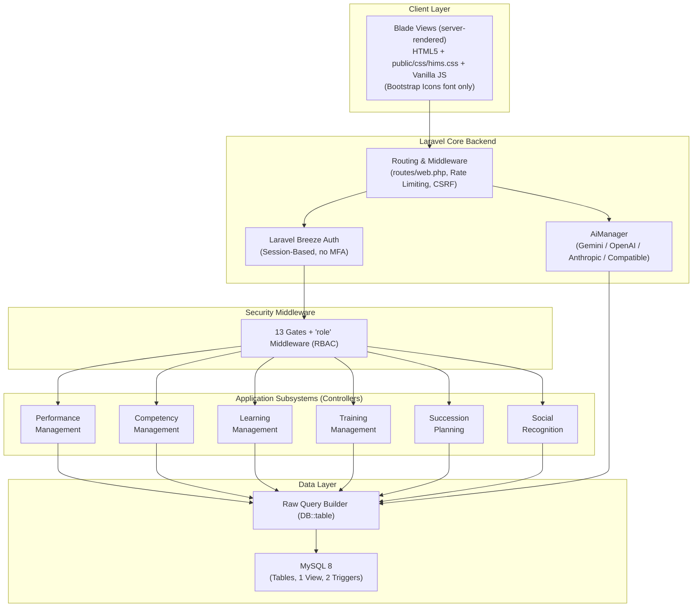
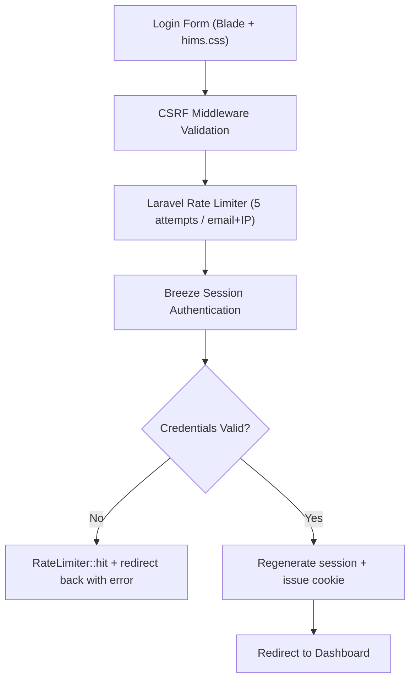

# Hospital Information Management System (HIMS)
## Performance & Development Module – Technical Specification & System Documentation

This document describes the architectural, functional, security, and data design of the **Performance & Development (P&D)** module for a modern Hospital Information Management System (HIMS). This module is tailored to meet the strict credentialing, continuing education, leadership succession, and quality-of-care demands of clinical and non-clinical staff.

---

## 1. System Overview

The **HIMS Performance & Development Module** is an enterprise-grade subsystem designed to manage, evaluate, and develop clinical (physicians, nurses, allied health professionals) and non-clinical (administrative, facilities, finance) hospital personnel. The primary objective is to align individual clinical competency with hospital quality standards, Joint Commission International (JCI) accreditation requirements, and employee development goals.

The system integrates six (6) distinct subsystems under a unified interface, controlled by Laravel session-based authentication (Laravel Breeze) and enhanced by the **HIMS Performance AI Assistant**, which runs on a **provider-agnostic AI layer** (Gemini by default; OpenAI, Anthropic, or any OpenAI-compatible host selectable via one env var).

> **Status of this document — AS-BUILT.**
> Describes only what is actually implemented in `hims-app/`, verified against source. Designed-but-unbuilt
> features have been removed rather than described; **if a capability is not documented here, it does not exist
> in the system.** For the stack and security breakdown see `HIMS_ARCHITECTURE_AND_SECURITY.md`.

### 1.1 High-Level Architecture (as-built)



**Implementation choices** (detail in `HIMS_ARCHITECTURE_AND_SECURITY.md`):

| Concern | Implementation |
|---|---|
| Styling | Hand-authored `public/css/hims.css` (742 lines); Bootstrap **Icons** font only — no Bootstrap CSS framework |
| Data access | Raw `DB::table()` Query Builder; `App\Models\User` is the only Eloquent model |
| Authorisation | 13 Gates + `EnsureUserHasRole` middleware over four roles: `admin` \| `hr_manager` \| `supervisor` \| `staff` |
| Cache / queue / session | `CACHE_STORE=database`, `SESSION_DRIVER=file`, `QUEUE_CONNECTION=database`; the app makes no cache calls |
| AI | Provider-agnostic `AiProvider` contract; four selectable providers |
| Interface | Server-rendered web routes only; there is no `api.php` and no REST API |

### 1.2 Subsystems Layout

```
+-------------------------------------------------------------------------------------------------+
|                                    HIMS Core Platform                                           |
+-------------------------------------------------------------------------------------------------+
                                                 |
                                                 v
+-------------------------------------------------------------------------------------------------+
|                                PERFORMANCE & DEVELOPMENT MODULE                                 |
+-------------------------------------------------------------------------------------------------+
|  +--------------------+  +--------------------+  +--------------------+  +--------------------+ |
|  |    Performance     |  |     Competency     |  |      Learning      |  |      Training      | |
|  |     Management     |  |     Management     |  |     Management     |  |     Management     | |
|  +--------------------+  +--------------------+  +--------------------+  +--------------------+ |
|  |     Succession     |  |       Social       |  |  Multi-Provider    |  |  Gates + role MW   | |
|  |      Planning      |  |    Recognition     |  |   AI Assistant     |  |     (Security)     | |
|  +--------------------+  +--------------------+  +--------------------+  +--------------------+ |
+-------------------------------------------------------------------------------------------------+
```

Seven live modules (the six above plus Employees/Departments/Users administration).

---

## 2. Functional Requirements

The system supports the following functional requirements:
- **Evaluations & Goals**: Review cycles (monthly, quarterly, semi-annual, annual), supervisor rating forms with per-KPI scores, and a goals/PIP data model surfaced on the review screens.
- **Competency & Credentialing**: Custom clinical/technical/administrative competency frameworks, competency assessments, gap analysis, skills matrices, and monitoring of clinical licences/certifications with computed expiry status.
- **Learning & Compliance**: Hospital course catalogue, e-learning enrolment, mandatory compliance tracking (e.g. Infection Control, Basic Life Support), CPD points ledger, and multi-course learning pathways.
- **Training Logistics**: Session scheduling with venue conflict prevention, registration, and trainee feedback capture.
- **Leadership Pipelines**: Succession mapping using a Performance–Potential 9-Box Grid, critical roles identification, vacancy-risk flagging, and leadership development milestones.
- **Social Recognition**: Public recognition wall, peer-to-peer appreciation badges (e.g. Compassion, Patient Care, Reliability), reactions, comments, and a monthly leaderboard.
- **AI Automation**: Provider-agnostic AI integration (Gemini default; OpenAI / Anthropic / OpenAI-compatible selectable) powering the in-app assistant and competency gap-analysis narratives.

---

## 3. User Roles and Permissions

Permissions are enforced via **13 Laravel Gates** (`AppServiceProvider::registerGates()`) plus the
`EnsureUserHasRole` middleware (aliased `role`) applied per-route in `routes/web.php`. There are no Policy
classes, and no table-driven permission model — a user's rights are derived entirely from the single
`users.role` column.

Route middleware answers "may this role reach this route". Row-level scoping (own / department / all) is layered
on top of it by two helpers on the base `App\Http\Controllers\Controller`:

*   `scopeToVisibleEmployees($query)` — constrains a list query. Admin and HR are unrestricted, a supervisor gets
    their own department, and everyone else (including any account with no linked employee profile) gets only
    their own row.
*   `authorizeEmployeeAccess($employeeId)` — `abort(403)` on a single-record page under the same rule.

**This scoping is applied in three controllers only**: `EmployeeController`, `PerformanceController`, and
`GapAnalysisController`. `CompetencyController`, `LearningController`, `TrainingController`,
`SuccessionController`, `RecognitionController`, and `DashboardController` do **not** call either helper — their
list pages return every row the query matches, to any role that can reach the route. (Succession is closed to
`staff` at the route level, and the dashboard branches on role by hand rather than through these helpers.)

### 3.1 Roles (`users.role`)

| Role | Maps to | Employees | Performance | Competency | Learning & Training | Succession | Recognition | Users/Depts |
| :--- | :--- | :--- | :--- | :--- | :--- | :--- | :--- | :--- |
| **`admin`** | Hospital Admin + system owner | Full CRUD | Full CRUD + cycles | Full + domains | Full authoring | Full | Post + badges | Full (users + depts) |
| **`hr_manager`** | HR Admin + Training Officer | Full CRUD | Full CRUD + cycles | Full + domains | Full authoring | Full | Post + badges | Departments only |
| **`supervisor`** | Dept Head + Supervisor | Read | Create/score reviews | Assess + credentials | Create sessions | Read + candidate scores | Post | — |
| **`staff`** | Employee | — | Read own | Read own | Enroll / register | **No access** | Post + react + comment | — |

**Gates defined:** `manage-users`, `manage-departments`, `manage-employees`, `view-employees`,
`manage-performance`, `manage-review-cycles`, `manage-competency`, `manage-learning`, `manage-training`,
`manage-succession`, `view-succession`, `view-org-analytics`, `run-gap-analysis`.

The same Gates drive both the `@can` checks that show/hide sidebar navigation and the route middleware that
enforces access, so the menu and the guard cannot drift apart.

---

## 4. Module-by-Module Features & Workflows

### A. Performance Management

*   **Role-Specific KPI Library**: Differentiates between Clinical KPIs (e.g., *Medication Error Rate*, *Patient Satisfaction Rating*, *Documentation Accuracy*) and Non-Clinical KPIs (e.g., *Billing Error Ratio*, *Facilities Ticket Response Time*), with each KPI carrying a target value, unit, weight, and applicable-role list.
*   **Review Cycles**: HR/admin opens a cycle (monthly, quarterly, semi-annual, annual) with a date range and status; reviews are created against a cycle.
*   **Structured Scoring**: Supervisors score a review against the KPI grid on 1–5 scales with per-KPI comments, plus free-text strengths and improvement notes. Self, peer, supervisor, and overall ratings are stored on the review.
*   **Goals & PIPs**: `review_goals` and `performance_improvement_plans` carry goal titles, progress percentages, and action steps, surfaced read-only on the review screens.

### B. Competency Management

*   **JCI Accreditation Mapping**: Maps compliance guidelines directly to required skills (SQE.3, SQE.4, SQE.5 standards) via the `jci_standard_code` on each competency category.
*   **Credential Monitoring**: Displays statuses for clinical licences (e.g. PRC licence, board certs, BLS, ACLS), derived by MySQL from the expiry date on every read:
    *   🟢 **Active** — valid and current
    *   🟡 **Expiring soon** — expiry within 30 days
    *   🔴 **Expired** — expiry date passed
    *   ⚪ **No expiry** — credential without an expiry date

    The status is a `GENERATED ALWAYS AS ... STORED` column, so it cannot fall out of step with the dates. It is a **display state only** — nothing sends a reminder or escalates.
*   **Department Skills Matrix**: Heatmaps showing competency coverage per ward, allowing managers to see if a ward lacks critical skills (e.g., ventilator operation).
*   **Gap Analysis Engine**: Computes `Gap = Current Proficiency − Required Proficiency` per employee per competency, via a MySQL `BEFORE INSERT`/`BEFORE UPDATE` trigger pair.

### C. Learning Management

*   **Hospital Course Catalog**: Course records categorised by compliance, clinical, and soft-skills, each with CPD hours, difficulty, duration, passing score, and retake limit.
*   **Enrolment**: Employees enrol themselves from a course page; progress percentage, status, and CPD hours earned are tracked per enrolment.
*   **CPD (Continuing Professional Development) Ledger**: A record of hours earned from courses, training, and external activities, listed per employee and totalled on the dashboard. The app **reads** `cpd_records` only — there is no screen for entering a CPD record, so rows must be loaded directly into the database.
*   **Learning Pathways**: Multi-course curriculums (e.g., "Critical Care Nurse Pathway") sequencing courses with prerequisite ordering.

### D. Training Management

*   **Session Scheduling**: Instructor-led workshops (e.g., Infection Control Seminar) with date, times, capacity, category, registration deadline, and optional linked course.
*   **Venue & Conflict Prevention**: Sessions are assigned to classrooms or simulator rooms; a unique index on `(venue_id, session_date, start_time)` prevents physical double-booking at the database level.
*   **Registration**: Employees register for a session, with a capacity check and a unique constraint preventing duplicate registration. Every registration is written with status `registered`; **nothing ever marks a registration as attended**, so the "Avg Attendance" figure on the training page is always 0%.
*   **Feedback Display**: `training_feedback` holds 1–5 ratings and free-text comments, and the training page shows the average and a recent-feedback list. The app **reads** this table only — there is no survey form, so rows must be loaded directly into the database.

### E. Succession Planning

*   **Critical Role Registry**: Flagging key medical positions (e.g., Chief of Surgery, ICU Head Nurse) that present high operational risk if vacant.
*   **9-Box Grid Placement**: Maps candidates on Performance vs. Potential. Scores are **1–5** on each axis (not 1–3), banded low (1–2) / med (3) / high (4–5) to give the nine cells:
    | | Low Potential (1–2) | Medium Potential (3) | High Potential (4–5) |
    |---|---|---|---|
    | **High Performance (4–5)** | Solid Performer | High Performer | ⭐ Star Talent |
    | **Medium Performance (3)** | Average Performer | Core Contributor | High Potential |
    | **Low Performance (1–2)** | Underperformer | Inconsistent | Rough Diamond |

    The label is **derived server-side on every write** and never accepted from the form, so it cannot contradict the scores. The nomination form shows a live preview of the resulting placement as scores are entered.
*   **Readiness Scale**: Categorises successors as "Ready Now," "Ready in 1–2 Years," "Ready in 2–5 Years," or "Long Term."
*   **Candidate Pipeline**: A single table of everyone nominated across all critical positions — candidate, target role, 9-box placement, readiness, development progress, and status. Filterable by position.
*   **Leadership Development Paths**: Per-candidate milestones (course, assignment, mentoring, rotation, certification, project) with target dates. Each advances `not started → in progress → completed`; the completion date is stamped automatically and cleared if the milestone moves back. Completion drives the pipeline's Dev Progress percentage.
*   **Nomination Management**: Scores, readiness, and mentor can be revised after nomination (stamping `reviewed_at`); a candidate can be withdrawn, which also removes their milestones.
*   **Vacancy Risk Flagging**: Each critical position carries a `low` / `medium` / `high` / `critical` risk level set when the position is created or edited, used to sort and highlight the positions list and the dashboard's at-risk panel.

### F. Social Recognition

*   **Activity Wall**: Social-media style board showcasing peer/manager appreciation posts with reactions and comments.
*   **Core Hospital Value Badges**:
    *   *Compassion (Kalinga)*: For exemplary patient bedside manner.
    *   *Teamwork (Bayanihan)*: For helping colleagues in understaffed shifts.
    *   *Innovation (Diskarte)*: For solving emergency bottlenecks.
    *   *Clinical Excellence*: For zero-error documentation or procedures.
*   **Leaderboard**: Highlights most recognized departments and staff monthly, read from the `v_recognition_leaderboard` MySQL view.

---

## 5. AI Provider Layer

The original Gemini-only design has been **replaced by a provider-agnostic layer**. Application code depends on
the `App\Contracts\AiProvider` interface (one method: `ask(string): string`); `AiManager` resolves the concrete
driver from `config('services.ai')` at runtime.
| Setting | Value |
|---|---|
| **Selector** | `AI_PROVIDER` = `gemini` \| `openai` \| `anthropic` \| `compatible` |
| **Default** | `gemini` — an existing `GEMINI_API_KEY` keeps working with no other change |
| **Drivers** | `GeminiProvider` · `OpenAiProvider` · `AnthropicProvider` · `compatible` (reuses `OpenAiProvider` with a custom label + `base_url` for Groq / DeepSeek / xAI / Mistral / Together / OpenRouter / Ollama) |
| **Transport** | Raw `Http::` calls — no vendor SDKs |
| **Model fallback** | Per-provider `*_MODEL` plus a `fallback_models` list; a 404/model error advances to the next candidate |
| **Failure contract** | `ask()` **never throws** on an API or config error — it returns a `⚠️`-prefixed string that callers detect and degrade on |

**Live AI features:**
*   **In-app assistant** (`AiController` → `POST /ai/query`): conversational queries in English/Tagalog/Taglish, with per-user history persisted to `ai_chat_messages` (`GET`/`DELETE /ai/history`).
*   **Competency gap-analysis narratives** (`CompetencyGapAnalysisService`): AI-generated summaries and development recommendations over assessment data, surfaced by `GapAnalysisController`.

These two are the only places the AI layer is called. The AI does not touch performance reviews, quizzes, or
training feedback.

---

## 6. Database Schema (MySQL 8.0+)

The relational schema is configured for **MySQL 8**. All domain primary and foreign keys use UUIDs represented as `CHAR(36)`. Arrays are represented as `JSON` columns.

> **Implementation notes.**
> *   UUIDs are generated **in PHP** via `Str::uuid()` at insert time — MySQL generates nothing. An insert that omits the PK will fail. `created_at` / `updated_at` must likewise be set explicitly, since raw Query Builder has no timestamp magic.
> *   **Access is via raw `DB::table()` Query Builder** throughout — there are no Eloquent models, relationships, or eager loading for these tables. Joins are written by hand in the controllers.

> **Note.** Twelve further tables are created by the migrations but are read and written by nothing —
> `audit_trails`, `permissions`, `role_permissions`, `system_users`, `notifications`, `course_modules`,
> `quiz_questions`, `quiz_attempts`, `training_tests`, `training_test_results`, `succession_reviews`,
> `credential_alert_log`. They are named here only so that a schema dump does not look like it contradicts this
> document; **they carry no behaviour and are not part of the system**, so their DDL is not reproduced below.
> `system_users` in particular is not the account table — real authentication runs off Laravel's `users`,
> extended with `role` and a nullable `employee_id` FK by migration `..._000095`.

### 6.1 Entity-Relationship Diagram

```mermaid
erDiagram
    DEPARTMENTS ||--o{ EMPLOYEES : employs
    DEPARTMENTS ||--o{ ROLES : defines
    DEPARTMENTS ||--o{ CRITICAL_POSITIONS : contains
    ROLES ||--o{ EMPLOYEES : assigns
    ROLES ||--o{ ROLE_COMPETENCY_REQUIREMENTS : requires

    EMPLOYEES ||--o{ PERFORMANCE_REVIEWS : undergoes
    EMPLOYEES ||--o{ PEER_REVIEWS : provides
    EMPLOYEES ||--o{ REVIEW_GOALS : tracks
    EMPLOYEES ||--o{ PERFORMANCE_IMPROVEMENT_PLANS : assigned

    EMPLOYEES ||--o{ COMPETENCY_ASSESSMENTS : evaluated_on
    EMPLOYEES ||--o{ EMPLOYEE_CREDENTIALS : holds

    EMPLOYEES ||--o{ COURSE_ENROLLMENTS : enrolls_in
    EMPLOYEES ||--o{ CPD_RECORDS : earns
    EMPLOYEES ||--o{ CERTIFICATES : receives

    EMPLOYEES ||--o{ TRAINING_REGISTRATIONS : registers_for
    EMPLOYEES ||--o{ TRAINING_FEEDBACK : submits

    EMPLOYEES ||--o{ SUCCESSION_CANDIDATES : nominated_as
    EMPLOYEES ||--o{ LEADERSHIP_DEVELOPMENT_PATHS : follows

    EMPLOYEES ||--o{ RECOGNITION_POSTS : gives_or_receives
    EMPLOYEES ||--o{ RECOGNITION_REACTIONS : reacts
    EMPLOYEES ||--o{ RECOGNITION_COMMENTS : comments

    REVIEW_CYCLES ||--o{ PERFORMANCE_REVIEWS : contains
    KPI_LIBRARY ||--o{ REVIEW_KPI_SCORES : measures
    PERFORMANCE_REVIEWS ||--o{ REVIEW_KPI_SCORES : includes
    PERFORMANCE_REVIEWS ||--o{ PEER_REVIEWS : collects
    PERFORMANCE_REVIEWS ||--o{ REVIEW_GOALS : sets

    COMPETENCY_DOMAINS ||--o{ COMPETENCY_CATEGORIES : groups
    COMPETENCY_CATEGORIES ||--o{ COMPETENCIES : contains
    COMPETENCIES ||--o{ COMPETENCY_ASSESSMENTS : assessed_via
    COMPETENCIES ||--o{ ROLE_COMPETENCY_REQUIREMENTS : required_by

    LEARNING_PATHWAYS ||--o{ PATHWAY_COURSES : sequences
    COURSES ||--o{ PATHWAY_COURSES : belongs_to
    COURSES ||--o{ COURSE_ENROLLMENTS : enrolled
    COURSES ||--o{ CERTIFICATES : certifies

    TRAINING_VENUES ||--o{ TRAINING_SESSIONS : hosts
    TRAINING_SESSIONS ||--o{ TRAINING_REGISTRATIONS : registers
    TRAINING_SESSIONS ||--o{ TRAINING_FEEDBACK : reviewed

    CRITICAL_POSITIONS ||--o{ SUCCESSION_CANDIDATES : candidates
    SUCCESSION_CANDIDATES ||--o{ LEADERSHIP_DEVELOPMENT_PATHS : develops

    RECOGNITION_BADGES ||--o{ RECOGNITION_POSTS : awarded_via
    RECOGNITION_POSTS ||--o{ RECOGNITION_REACTIONS : reacted_to
    RECOGNITION_POSTS ||--o{ RECOGNITION_COMMENTS : discussed
```



---

### 6.2 Core / Shared Tables

```sql
-- ═══════════════════════════════════════════════════════
-- CORE / SHARED TABLES
-- ═══════════════════════════════════════════════════════

CREATE TABLE departments (
    department_id       CHAR(36) PRIMARY KEY,
    name                VARCHAR(150) NOT NULL UNIQUE,     -- "Nursing", "Surgery", "Pediatrics"
    department_code     VARCHAR(20) UNIQUE,
    head_employee_id    CHAR(36),                         -- Resolved via FK later
    parent_dept_id      CHAR(36) REFERENCES departments(department_id),
    is_clinical         BOOLEAN DEFAULT TRUE,
    created_at          TIMESTAMP DEFAULT CURRENT_TIMESTAMP
);

CREATE TABLE roles (
    role_id             CHAR(36) PRIMARY KEY,
    role_name           VARCHAR(100) NOT NULL UNIQUE,     -- "Senior ICU Nurse"
    role_slug           VARCHAR(50) NOT NULL UNIQUE,      -- "senior_icu_nurse"
    department_id       CHAR(36) REFERENCES departments(department_id),
    is_clinical         BOOLEAN DEFAULT TRUE,
    created_at          TIMESTAMP DEFAULT CURRENT_TIMESTAMP
);

CREATE TABLE employees (
    employee_id         CHAR(36) PRIMARY KEY,
    employee_code       VARCHAR(30) UNIQUE NOT NULL,      -- "EMP-001"
    first_name          VARCHAR(100) NOT NULL,
    last_name           VARCHAR(100) NOT NULL,
    email               VARCHAR(255) UNIQUE NOT NULL,
    phone               VARCHAR(100),
    department_id       CHAR(36) NOT NULL REFERENCES departments(department_id),
    role_id             CHAR(36) NOT NULL REFERENCES roles(role_id),
    position_title      VARCHAR(200),
    hire_date           DATE NOT NULL,
    employment_status   VARCHAR(20) DEFAULT 'active'
        CHECK (employment_status IN ('active','on_leave','suspended','resigned','retired')),
    supervisor_id       CHAR(36) REFERENCES employees(employee_id),
    profile_image_url   TEXT,
    created_at          TIMESTAMP DEFAULT CURRENT_TIMESTAMP,
    updated_at          TIMESTAMP DEFAULT CURRENT_TIMESTAMP ON UPDATE CURRENT_TIMESTAMP
);

-- Complete circular dependency reference for Department Head
ALTER TABLE departments ADD CONSTRAINT fk_dept_head 
    FOREIGN KEY (head_employee_id) REFERENCES employees(employee_id);
```

---

### 6.3 Performance Management Tables

```sql
-- ═══════════════════════════════════════════════════════
-- PERFORMANCE MANAGEMENT TABLES
-- ═══════════════════════════════════════════════════════

CREATE TABLE review_cycles (
    cycle_id            CHAR(36) PRIMARY KEY,
    cycle_name          VARCHAR(100) NOT NULL,
    cycle_type          VARCHAR(20) NOT NULL
        CHECK (cycle_type IN ('monthly','quarterly','semi_annual','annual')),
    start_date          DATE NOT NULL,
    end_date            DATE NOT NULL,
    status              VARCHAR(20) DEFAULT 'planned'
        CHECK (status IN ('planned','active','closed')),
    created_by          CHAR(36) NOT NULL REFERENCES employees(employee_id),
    created_at          TIMESTAMP DEFAULT CURRENT_TIMESTAMP,
    updated_at          TIMESTAMP DEFAULT CURRENT_TIMESTAMP ON UPDATE CURRENT_TIMESTAMP
);

CREATE TABLE kpi_library (
    kpi_id              CHAR(36) PRIMARY KEY,
    kpi_name            VARCHAR(200) NOT NULL,
    kpi_category        VARCHAR(30) NOT NULL
        CHECK (kpi_category IN ('clinical','non_clinical','administrative')),
    description         TEXT,
    target_value        DECIMAL(5,2),
    unit                VARCHAR(30),
    applicable_roles    JSON,                             -- Array of role slugs e.g., ["icu_nurse"]
    weight              DECIMAL(3,2) DEFAULT 1.00,
    is_active           BOOLEAN DEFAULT TRUE,
    created_at          TIMESTAMP DEFAULT CURRENT_TIMESTAMP
);

CREATE TABLE performance_reviews (
    review_id           CHAR(36) PRIMARY KEY,
    employee_id         CHAR(36) NOT NULL REFERENCES employees(employee_id),
    cycle_id            CHAR(36) NOT NULL REFERENCES review_cycles(cycle_id),
    reviewer_id         CHAR(36) REFERENCES employees(employee_id),
    review_type         VARCHAR(20) DEFAULT 'standard'
        CHECK (review_type IN ('standard','probationary','pip_followup')),
    status              VARCHAR(30) DEFAULT 'draft'
        CHECK (status IN ('draft','self_assessment','peer_review','supervisor_review',
                          'ai_audit','pending_approval','approved','archived','returned')),
    self_rating         DECIMAL(3,2),
    supervisor_rating   DECIMAL(3,2),
    peer_rating         DECIMAL(3,2),
    overall_score       DECIMAL(3,2),
    strengths_text      TEXT,
    improvements_text   TEXT,
    ai_bias_flags       JSON,                             -- Google Gemini audit reports
    ai_summary          TEXT,
    digital_signature   TEXT,
    signed_at           TIMESTAMP NULL DEFAULT NULL,
    created_at          TIMESTAMP DEFAULT CURRENT_TIMESTAMP,
    updated_at          TIMESTAMP DEFAULT CURRENT_TIMESTAMP ON UPDATE CURRENT_TIMESTAMP
);

CREATE TABLE review_kpi_scores (
    score_id            CHAR(36) PRIMARY KEY,
    review_id           CHAR(36) NOT NULL REFERENCES performance_reviews(review_id) ON DELETE CASCADE,
    kpi_id              CHAR(36) NOT NULL REFERENCES kpi_library(kpi_id),
    self_score          DECIMAL(3,2),
    supervisor_score    DECIMAL(3,2),
    peer_score          DECIMAL(3,2),
    weighted_score      DECIMAL(3,2),
    comments            TEXT,
    UNIQUE KEY (review_id, kpi_id)
);

CREATE TABLE peer_reviews (
    peer_review_id      CHAR(36) PRIMARY KEY,
    review_id           CHAR(36) NOT NULL REFERENCES performance_reviews(review_id) ON DELETE CASCADE,
    peer_employee_id    CHAR(36) NOT NULL REFERENCES employees(employee_id),
    rating              DECIMAL(3,2) NOT NULL CHECK (rating BETWEEN 1.0 AND 5.0),
    comments            TEXT,
    is_anonymous        BOOLEAN DEFAULT TRUE,
    submitted_at        TIMESTAMP DEFAULT CURRENT_TIMESTAMP
);

CREATE TABLE performance_improvement_plans (
    pip_id              CHAR(36) PRIMARY KEY,
    employee_id         CHAR(36) NOT NULL REFERENCES employees(employee_id),
    triggered_by_review CHAR(36) NOT NULL REFERENCES performance_reviews(review_id),
    status              VARCHAR(20) DEFAULT 'initiated'
        CHECK (status IN ('initiated','in_progress','resolved','escalated')),
    action_steps        JSON NOT NULL,                    -- Task step definitions
    start_date          DATE NOT NULL,
    target_end_date     DATE NOT NULL,
    actual_end_date     DATE,
    supervisor_id       CHAR(36) REFERENCES employees(employee_id),
    notes               TEXT,
    created_at          TIMESTAMP DEFAULT CURRENT_TIMESTAMP,
    updated_at          TIMESTAMP DEFAULT CURRENT_TIMESTAMP ON UPDATE CURRENT_TIMESTAMP
);

CREATE TABLE review_goals (
    goal_id             CHAR(36) PRIMARY KEY,
    review_id           CHAR(36) NOT NULL REFERENCES performance_reviews(review_id) ON DELETE CASCADE,
    employee_id         CHAR(36) NOT NULL REFERENCES employees(employee_id),
    goal_title          VARCHAR(300) NOT NULL,
    goal_description    TEXT,
    target_date         DATE,
    progress_pct        INT DEFAULT 0 CHECK (progress_pct BETWEEN 0 AND 100),
    status              VARCHAR(20) DEFAULT 'not_started'
        CHECK (status IN ('not_started','in_progress','completed','deferred')),
    created_at          TIMESTAMP DEFAULT CURRENT_TIMESTAMP
);
```

---

### 6.4 Competency Management Tables

```sql
-- ═══════════════════════════════════════════════════════
-- COMPETENCY MANAGEMENT TABLES
-- ═══════════════════════════════════════════════════════

CREATE TABLE competency_domains (
    domain_id           CHAR(36) PRIMARY KEY,
    domain_name         VARCHAR(100) NOT NULL UNIQUE,     -- "Clinical", "Administrative"
    description         TEXT,
    created_at          TIMESTAMP DEFAULT CURRENT_TIMESTAMP
);

CREATE TABLE competency_categories (
    category_id         CHAR(36) PRIMARY KEY,
    domain_id           CHAR(36) NOT NULL REFERENCES competency_domains(domain_id),
    category_name       VARCHAR(150) NOT NULL,           -- "Emergency Response", "Infection Control"
    jci_standard_code   VARCHAR(30),                     -- "SQE.3", "PCI.5"
    created_at          TIMESTAMP DEFAULT CURRENT_TIMESTAMP
);

CREATE TABLE competencies (
    competency_id       CHAR(36) PRIMARY KEY,
    category_id         CHAR(36) NOT NULL REFERENCES competency_categories(category_id),
    competency_name     VARCHAR(200) NOT NULL,           -- "Advanced Ventilator Support"
    competency_code     VARCHAR(30) UNIQUE,              -- "COMP-ICU-009"
    description         TEXT,
    required_proficiency INT NOT NULL CHECK (required_proficiency BETWEEN 1 AND 5),
    is_mandatory        BOOLEAN DEFAULT FALSE,
    created_at          TIMESTAMP DEFAULT CURRENT_TIMESTAMP
);

CREATE TABLE role_competency_requirements (
    id                  CHAR(36) PRIMARY KEY,
    role_id             CHAR(36) NOT NULL REFERENCES roles(role_id),
    competency_id       CHAR(36) NOT NULL REFERENCES competencies(competency_id),
    minimum_proficiency INT NOT NULL CHECK (minimum_proficiency BETWEEN 1 AND 5),
    is_critical         BOOLEAN DEFAULT FALSE,
    UNIQUE KEY (role_id, competency_id)
);

CREATE TABLE competency_assessments (
    assessment_id       CHAR(36) PRIMARY KEY,
    employee_id         CHAR(36) NOT NULL REFERENCES employees(employee_id),
    competency_id       CHAR(36) NOT NULL REFERENCES competencies(competency_id),
    assessed_by         CHAR(36) NOT NULL REFERENCES employees(employee_id),
    assessment_method   VARCHAR(30) DEFAULT 'observation'
        CHECK (assessment_method IN ('observation','exam','simulation','self_report')),
    current_proficiency INT NOT NULL CHECK (current_proficiency BETWEEN 1 AND 5),
    gap                 INT,                              -- Computed via trigger
    evidence_url        TEXT,
    notes               TEXT,
    assessed_date       DATE NOT NULL,
    next_assessment_due DATE,
    created_at          TIMESTAMP DEFAULT CURRENT_TIMESTAMP
);

-- MySQL trigger definition to auto-calculate performance gaps
DELIMITER $$
CREATE TRIGGER trg_compute_gap_insert
BEFORE INSERT ON competency_assessments
FOR EACH ROW
BEGIN
    DECLARE req_prof INT;
    SELECT required_proficiency INTO req_prof FROM competencies WHERE competency_id = NEW.competency_id;
    SET NEW.gap = NEW.current_proficiency - req_prof;
END$$

CREATE TRIGGER trg_compute_gap_update
BEFORE UPDATE ON competency_assessments
FOR EACH ROW
BEGIN
    DECLARE req_prof INT;
    SELECT required_proficiency INTO req_prof FROM competencies WHERE competency_id = NEW.competency_id;
    SET NEW.gap = NEW.current_proficiency - req_prof;
END$$
DELIMITER ;

CREATE TABLE employee_credentials (
    credential_id       CHAR(36) PRIMARY KEY,
    employee_id         CHAR(36) NOT NULL REFERENCES employees(employee_id),
    credential_type     VARCHAR(50) NOT NULL,             -- 'PRC_License','Board_Cert','BLS'
    credential_number   VARCHAR(100),
    issuing_body        VARCHAR(150),
    issue_date          DATE,
    expiry_date         DATE,
    status              VARCHAR(20) GENERATED ALWAYS AS (
                            CASE
                                WHEN expiry_date IS NULL THEN 'no_expiry'
                                WHEN expiry_date < CURRENT_DATE() THEN 'expired'
                                WHEN expiry_date < CURRENT_DATE() + INTERVAL 30 DAY THEN 'expiring_soon'
                                ELSE 'active'
                            END
                        ) STORED,
    document_url        TEXT,
    verified_by         CHAR(36) REFERENCES employees(employee_id),
    verified_at         TIMESTAMP NULL DEFAULT NULL,
    created_at          TIMESTAMP DEFAULT CURRENT_TIMESTAMP,
    updated_at          TIMESTAMP DEFAULT CURRENT_TIMESTAMP ON UPDATE CURRENT_TIMESTAMP
);
```

---

### 6.5 Learning Management Tables

```sql
-- ═══════════════════════════════════════════════════════
-- LEARNING MANAGEMENT TABLES
-- ═══════════════════════════════════════════════════════

CREATE TABLE learning_pathways (
    pathway_id          CHAR(36) PRIMARY KEY,
    pathway_name        VARCHAR(200) NOT NULL,
    description         TEXT,
    target_roles        JSON,                             -- Role slug mappings
    total_cpd_hours     DECIMAL(5,1),
    is_mandatory        BOOLEAN DEFAULT FALSE,
    created_by          CHAR(36) REFERENCES employees(employee_id),
    created_at          TIMESTAMP DEFAULT CURRENT_TIMESTAMP
);

CREATE TABLE courses (
    course_id           CHAR(36) PRIMARY KEY,
    course_code         VARCHAR(30) UNIQUE,
    title               VARCHAR(300) NOT NULL,
    description         TEXT,
    category            VARCHAR(50) NOT NULL,             -- 'compliance','clinical'
    cpd_hours           DECIMAL(4,1) NOT NULL DEFAULT 0,
    difficulty_level    VARCHAR(20) DEFAULT 'intermediate'
        CHECK (difficulty_level IN ('beginner','intermediate','advanced')),
    estimated_duration  INT,                              -- Duration in minutes
    passing_score       DECIMAL(5,2) DEFAULT 70.00,
    max_retakes         INT DEFAULT 3,
    is_mandatory        BOOLEAN DEFAULT FALSE,
    is_active           BOOLEAN DEFAULT TRUE,
    created_by          CHAR(36) REFERENCES employees(employee_id),
    created_at          TIMESTAMP DEFAULT CURRENT_TIMESTAMP,
    updated_at          TIMESTAMP DEFAULT CURRENT_TIMESTAMP ON UPDATE CURRENT_TIMESTAMP
);

CREATE TABLE pathway_courses (
    id                  CHAR(36) PRIMARY KEY,
    pathway_id          CHAR(36) NOT NULL REFERENCES learning_pathways(pathway_id) ON DELETE CASCADE,
    course_id           CHAR(36) NOT NULL REFERENCES courses(course_id),
    sequence_order      INT NOT NULL,
    is_prerequisite     BOOLEAN DEFAULT FALSE,
    UNIQUE KEY (pathway_id, course_id)
);

CREATE TABLE course_enrollments (
    enrollment_id       CHAR(36) PRIMARY KEY,
    employee_id         CHAR(36) NOT NULL REFERENCES employees(employee_id),
    course_id           CHAR(36) NOT NULL REFERENCES courses(course_id),
    enrolled_by         CHAR(36) REFERENCES employees(employee_id),
    enrollment_date     DATE,
    due_date            DATE,
    status              VARCHAR(20) DEFAULT 'enrolled'
        CHECK (status IN ('enrolled','in_progress','completed','failed','expired')),
    progress_pct        INT DEFAULT 0 CHECK (progress_pct BETWEEN 0 AND 100),
    completed_at        TIMESTAMP NULL DEFAULT NULL,
    cpd_hours_earned    DECIMAL(4,1) DEFAULT 0,
    certificate_id      CHAR(36),                         -- FK added post-creation
    UNIQUE KEY (employee_id, course_id)
);

CREATE TABLE cpd_records (
    cpd_id              CHAR(36) PRIMARY KEY,
    employee_id         CHAR(36) NOT NULL REFERENCES employees(employee_id),
    source_type         VARCHAR(30) NOT NULL,             -- 'course','training','external'
    source_id           CHAR(36),
    activity_name       VARCHAR(300) NOT NULL,
    cpd_hours           DECIMAL(4,1) NOT NULL,
    date_earned         DATE NOT NULL,
    renewal_period      VARCHAR(20),
    verified            BOOLEAN DEFAULT FALSE,
    verified_by         CHAR(36) REFERENCES employees(employee_id),
    created_at          TIMESTAMP DEFAULT CURRENT_TIMESTAMP
);

CREATE TABLE certificates (
    certificate_id      CHAR(36) PRIMARY KEY,
    employee_id         CHAR(36) NOT NULL REFERENCES employees(employee_id),
    course_id           CHAR(36) NOT NULL REFERENCES courses(course_id),
    certificate_code    VARCHAR(50) UNIQUE NOT NULL,      -- Verifiable serial
    issued_date         DATE NOT NULL,
    expiry_date         DATE,
    pdf_url             TEXT,
    qr_verification_url TEXT,
    created_at          TIMESTAMP DEFAULT CURRENT_TIMESTAMP
);

ALTER TABLE course_enrollments ADD CONSTRAINT fk_enrollment_cert 
    FOREIGN KEY (certificate_id) REFERENCES certificates(certificate_id);
```

---

### 6.6 Training Management Tables

```sql
-- ═══════════════════════════════════════════════════════
-- TRAINING MANAGEMENT TABLES
-- ═══════════════════════════════════════════════════════

CREATE TABLE training_venues (
    venue_id            CHAR(36) PRIMARY KEY,
    venue_name          VARCHAR(150) NOT NULL,
    building            VARCHAR(100),
    floor               VARCHAR(20),
    capacity            INT NOT NULL,
    equipment           JSON,                             -- Stored equipment array
    is_active           BOOLEAN DEFAULT TRUE,
    created_at          TIMESTAMP DEFAULT CURRENT_TIMESTAMP
);

CREATE TABLE training_sessions (
    session_id          CHAR(36) PRIMARY KEY,
    session_code        VARCHAR(30) UNIQUE,
    title               VARCHAR(300) NOT NULL,
    description         TEXT,
    category            VARCHAR(50) NOT NULL,
    instructor_id       CHAR(36) NOT NULL REFERENCES employees(employee_id),
    venue_id            CHAR(36) REFERENCES training_venues(venue_id),
    session_date        DATE NOT NULL,
    start_time          TIME NOT NULL,
    end_time            TIME NOT NULL,
    capacity            INT NOT NULL,
    registration_deadline DATE,
    status              VARCHAR(20) DEFAULT 'scheduled'
        CHECK (status IN ('scheduled','in_progress','completed','cancelled')),
    linked_course_id    CHAR(36) REFERENCES courses(course_id),
    linked_competencies JSON,                             -- Competency link array
    cpd_hours           DECIMAL(4,1) DEFAULT 0,
    has_pre_test        BOOLEAN DEFAULT FALSE,
    has_post_test       BOOLEAN DEFAULT FALSE,
    created_by          CHAR(36) REFERENCES employees(employee_id),
    created_at          TIMESTAMP DEFAULT CURRENT_TIMESTAMP,
    updated_at          TIMESTAMP DEFAULT CURRENT_TIMESTAMP ON UPDATE CURRENT_TIMESTAMP
);

-- Unique index to prevent physical venue double-booking in MySQL
CREATE UNIQUE INDEX idx_venue_schedule ON training_sessions (venue_id, session_date, start_time);

CREATE TABLE training_registrations (
    registration_id     CHAR(36) PRIMARY KEY,
    session_id          CHAR(36) NOT NULL REFERENCES training_sessions(session_id) ON DELETE CASCADE,
    employee_id         CHAR(36) NOT NULL REFERENCES employees(employee_id),
    registered_by       CHAR(36) REFERENCES employees(employee_id),
    registration_date   TIMESTAMP DEFAULT CURRENT_TIMESTAMP,
    status              VARCHAR(20) DEFAULT 'registered'
        CHECK (status IN ('registered','waitlisted','attended','no_show','cancelled')),
    check_in_time       TIMESTAMP NULL DEFAULT NULL,
    check_in_method     VARCHAR(20),                      -- 'qr_scan','manual'
    UNIQUE KEY (session_id, employee_id)
);

CREATE TABLE training_feedback (
    feedback_id         CHAR(36) PRIMARY KEY,
    session_id          CHAR(36) NOT NULL REFERENCES training_sessions(session_id) ON DELETE CASCADE,
    employee_id         CHAR(36) NOT NULL REFERENCES employees(employee_id),
    overall_rating      INT NOT NULL CHECK (overall_rating BETWEEN 1 AND 5),
    content_rating      INT CHECK (content_rating BETWEEN 1 AND 5),
    instructor_rating   INT CHECK (instructor_rating BETWEEN 1 AND 5),
    venue_rating        INT CHECK (venue_rating BETWEEN 1 AND 5),
    comments            TEXT,
    ai_sentiment_score  DECIMAL(3,2),                     -- rendered if present; nothing writes it
    ai_sentiment_label  VARCHAR(20),                      -- 'positive','neutral','negative'
    submitted_at        TIMESTAMP DEFAULT CURRENT_TIMESTAMP,
    UNIQUE KEY (session_id, employee_id)
);
```

---

### 6.7 Succession Planning Tables

```sql
-- ═══════════════════════════════════════════════════════
-- SUCCESSION PLANNING TABLES
-- ═══════════════════════════════════════════════════════

CREATE TABLE critical_positions (
    position_id         CHAR(36) PRIMARY KEY,
    position_title      VARCHAR(200) NOT NULL,
    department_id       CHAR(36) NOT NULL REFERENCES departments(department_id),
    current_holder_id   CHAR(36) REFERENCES employees(employee_id),
    is_critical         BOOLEAN DEFAULT TRUE,
    vacancy_risk        VARCHAR(10) DEFAULT 'medium'
        CHECK (vacancy_risk IN ('low','medium','high','critical')),
    risk_factors        JSON,                             -- Metadata about vacancies
    impact_description  TEXT,
    created_at          TIMESTAMP DEFAULT CURRENT_TIMESTAMP,
    updated_at          TIMESTAMP DEFAULT CURRENT_TIMESTAMP ON UPDATE CURRENT_TIMESTAMP
);

CREATE TABLE succession_candidates (
    candidate_id        CHAR(36) PRIMARY KEY,
    position_id         CHAR(36) NOT NULL REFERENCES critical_positions(position_id) ON DELETE CASCADE,
    employee_id         CHAR(36) NOT NULL REFERENCES employees(employee_id),
    -- Plain INT, range 1-5, no CHECK constraint. The range is enforced by
    -- request validation and the form inputs, not by MySQL.
    performance_score   INT NOT NULL,                     -- 1-5
    potential_score     INT NOT NULL,                     -- 1-5
    -- A plain VARCHAR, not a generated column. The value is computed in PHP by
    -- SuccessionController::nineBoxLabel() on every insert and update, and any
    -- submitted value is ignored, so it cannot contradict the scores.
    -- Labels in use: star | high | solid | potential | core | avg | diamond |
    --                inconsist | under   (bands: low 1-2, med 3, high 4-5)
    nine_box_label      VARCHAR(30),
    readiness_level     VARCHAR(20) NOT NULL,             -- ready_now | 1_2_years | 2_5_years | long_term
    development_plan    JSON,                             -- unused; milestones live in leadership_development_paths
    mentor_id           CHAR(36) REFERENCES employees(employee_id),
    status              VARCHAR(20) DEFAULT 'proposed'
        CHECK (status IN ('proposed','hr_reviewed','approved','withdrawn')),
    nominated_by        CHAR(36) REFERENCES employees(employee_id),
    nominated_at        TIMESTAMP DEFAULT CURRENT_TIMESTAMP,
    reviewed_at         TIMESTAMP NULL DEFAULT NULL,
    approved_at         TIMESTAMP NULL DEFAULT NULL,
    UNIQUE KEY (position_id, employee_id)
);

CREATE TABLE leadership_development_paths (
    path_id             CHAR(36) PRIMARY KEY,
    candidate_id        CHAR(36) NOT NULL REFERENCES succession_candidates(candidate_id),
    milestone_title     VARCHAR(200) NOT NULL,
    milestone_type      VARCHAR(30),                      -- 'training','mentorship','rotation'
    description         TEXT,
    target_date         DATE,
    completed_date      DATE,
    status              VARCHAR(20) DEFAULT 'pending'
        CHECK (status IN ('pending','in_progress','completed','deferred')),
    linked_course_id    CHAR(36) REFERENCES courses(course_id),
    linked_competency   CHAR(36) REFERENCES competencies(competency_id),
    created_at          TIMESTAMP DEFAULT CURRENT_TIMESTAMP
);
```

---

### 6.8 Social Recognition Tables

```sql
-- ═══════════════════════════════════════════════════════
-- SOCIAL RECOGNITION TABLES
-- ═══════════════════════════════════════════════════════

CREATE TABLE recognition_badges (
    badge_id            CHAR(36) PRIMARY KEY,
    badge_name          VARCHAR(100) NOT NULL UNIQUE,     -- "Compassion (Kalinga)"
    badge_icon          VARCHAR(50),                      -- Bootstrap icon class e.g., "bi-heart-fill"
    badge_color         VARCHAR(7),                       -- Hex code
    hospital_value      VARCHAR(100),
    description         TEXT,
    points_value        INT DEFAULT 1,
    is_active           BOOLEAN DEFAULT TRUE,
    created_at          TIMESTAMP DEFAULT CURRENT_TIMESTAMP
);

CREATE TABLE recognition_posts (
    post_id             CHAR(36) PRIMARY KEY,
    author_id           CHAR(36) NOT NULL REFERENCES employees(employee_id),
    recipient_id        CHAR(36) NOT NULL REFERENCES employees(employee_id),
    badge_id            CHAR(36) REFERENCES recognition_badges(badge_id),
    post_type           VARCHAR(20) DEFAULT 'peer'
        CHECK (post_type IN ('peer','manager','hr_award','department')),
    message             TEXT NOT NULL,
    is_public           BOOLEAN DEFAULT TRUE,
    is_featured         BOOLEAN DEFAULT FALSE,
    moderation_status   VARCHAR(20) DEFAULT 'approved'
        CHECK (moderation_status IN ('pending','approved','flagged','removed')),
    moderated_by        CHAR(36) REFERENCES employees(employee_id),
    moderation_note     TEXT,
    link_to_review_id   CHAR(36) REFERENCES performance_reviews(review_id),
    created_at          TIMESTAMP DEFAULT CURRENT_TIMESTAMP,
    updated_at          TIMESTAMP DEFAULT CURRENT_TIMESTAMP ON UPDATE CURRENT_TIMESTAMP,
    CONSTRAINT chk_no_self_recognition CHECK (author_id != recipient_id)
);

CREATE TABLE recognition_reactions (
    reaction_id         CHAR(36) PRIMARY KEY,
    post_id             CHAR(36) NOT NULL REFERENCES recognition_posts(post_id) ON DELETE CASCADE,
    employee_id         CHAR(36) NOT NULL REFERENCES employees(employee_id),
    reaction_type       VARCHAR(20) DEFAULT 'like'
        CHECK (reaction_type IN ('like','clap','heart','celebrate','support')),
    created_at          TIMESTAMP DEFAULT CURRENT_TIMESTAMP,
    UNIQUE KEY (post_id, employee_id)
);

CREATE TABLE recognition_comments (
    comment_id          CHAR(36) PRIMARY KEY,
    post_id             CHAR(36) NOT NULL REFERENCES recognition_posts(post_id) ON DELETE CASCADE,
    author_id           CHAR(36) NOT NULL REFERENCES employees(employee_id),
    comment_text        TEXT NOT NULL,
    moderation_status   VARCHAR(20) DEFAULT 'approved',
    created_at          TIMESTAMP DEFAULT CURRENT_TIMESTAMP
);

-- Standard SQL View for leaderboard computations
CREATE VIEW v_recognition_leaderboard AS
SELECT
    rp.recipient_id                         AS employee_id,
    CONCAT(e.first_name, ' ', e.last_name)  AS employee_name,
    e.department_id,
    d.name                                  AS department_name,
    COUNT(rp.post_id)                       AS total_recognitions,
    SUM(COALESCE(rb.points_value, 1))       AS total_points,
    DATE_FORMAT(rp.created_at, '%Y-%m-01')  AS month
FROM recognition_posts rp
JOIN employees e ON rp.recipient_id = e.employee_id
JOIN departments d ON e.department_id = d.department_id
LEFT JOIN recognition_badges rb ON rp.badge_id = rb.badge_id
WHERE rp.moderation_status = 'approved'
GROUP BY rp.recipient_id, e.first_name, e.last_name, e.department_id, d.name, DATE_FORMAT(rp.created_at, '%Y-%m-01');
```

---

## 7. Security and Compliance Architecture

> **Controls that do not exist.** Stated here so nobody assumes otherwise from a schema dump or a marketing
> claim: there is **no field-level encryption**, **no multi-factor authentication**, **no audit logging**, and
> **no table-driven permission model**. The compliance posture of HIPAA / Philippine Data Privacy Act RA 10173
> is **not met**. Authoritative detail lives in `HIMS_ARCHITECTURE_AND_SECURITY.md` §3.

### 7.1 Authentication & Sessions



Public self-registration is **disabled**; accounts are provisioned by an admin through `UserController`.

### 7.2 Security Settings

*   **Laravel Breeze & Sessions** ✅ — session cookies are `HttpOnly` with `SameSite=Lax` by framework default. `SESSION_DRIVER=file`, `SESSION_ENCRYPT=false`. The `Secure` flag applies only over HTTPS; local dev runs plain HTTP on `http://localhost:8000`. `bootstrap/app.php` sets `trustProxies(at: '*')` for correct scheme detection behind a TLS-terminating proxy.
*   **CSRF Protection** ✅ — `VerifyCsrfToken` in the default `web` group; all state-changing forms emit `@csrf`.
*   **Brute-force throttling** ✅ — `LoginRequest` throttles on an email+IP key at **5 failed attempts** with Laravel's standard decay, cleared on success. `throttle:6,1` guards password-reset and verification routes. *This is request rate-limiting, not account locking* — there is no account-lockout policy.
*   **Role-Based Access Control (RBAC)** ✅ — 13 **Gates** + the `EnsureUserHasRole` middleware, keyed on `users.role`. See §3.1.
*   **Input validation & SQL safety** ✅ — every write path calls `$request->validate([...])`; all queries use Query Builder parameter binding. `DB::raw` fragments (`CONCAT`, `DATE_FORMAT`, `FIELD`) contain no user-supplied interpolation.
*   **Encryption at rest** ❌ — no `Crypt::` / `encryptString` usage anywhere. `employees.phone` and `employee_credentials.credential_number` are stored **plaintext**.
*   **TOTP MFA** ❌ — no 2FA package installed, no `totp` / `two_factor` code.
*   **Audit trail** ❌ — no Observers and no logging of reads or writes. The only write tracking is the `created_at` / `updated_at` and `*_by` columns individual tables carry.

### 7.3 Compliance Control Summary

| Control | Required for | Status |
|---|---|---|
| Session auth, CSRF, password hashing | Baseline | ✅ Implemented |
| Login rate-limiting | Baseline | ✅ Implemented (5 attempts, email+IP) |
| Role-based access enforcement | Baseline | ✅ Implemented (13 Gates + `role` middleware) |
| Input validation / SQL-injection defence | Baseline | ✅ Implemented (validation + bound params) |
| HTTPS in deployment | HIPAA · RA 10173 | ⚠️ Proxy-terminated; no app-level HSTS or TLS-1.3-only enforcement |
| Field-level encryption at rest | HIPAA · RA 10173 | ❌ Not implemented — PII stored plaintext |
| Multi-factor authentication | HIPAA | ❌ Not implemented |
| Audit trail of PHI access/modification | HIPAA · RA 10173 | ❌ Not implemented — no logging of any kind |
| Account lockout policy | Hospital policy | ❌ Not implemented (throttling ≠ lockout) |

**Net position:** the application is soundly built against everyday web risks (CSRF, injection, unauthorised
navigation), but the three controls that regulated health data specifically requires — encryption at rest, MFA,
and audit logging — are absent. It should be treated as **pre-compliance**.

---

## 8. Sample Workflow

### Performance Review
1.  **Cycle setup**: an admin or HR manager creates the review cycle (name, type, date range) from `/performance/cycles/create`.
2.  **Review creation**: a supervisor, HR manager, or admin creates a review for an employee against that cycle from `/performance/reviews/create`.
3.  **Scoring**: the reviewer opens `/performance/reviews/{id}/score` and enters a score and comment for each KPI in the employee's role library, plus overall strengths and improvement notes.
4.  **Save**: scores are written to `review_kpi_scores`, the aggregate rating is stored on the review, and the reviewer is returned to the review list.
5.  **Reading**: the review remains visible on the employee's record and in the reviews list.

```
[Cycle created by HR] --> [Review created for employee] --> [Supervisor scores KPI grid] --> [Saved to employee record]
```

---

## 9. Dashboard Layout

The dashboard renders one of four partials depending on the signed-in user's role
(`dashboard/partials/organisation`, `supervisor`, `staff`). The organisation view — shown to `admin` and
`hr_manager` — is laid out as follows.

```
+------------------------------------------------------------------------------------------------------+
|  HIMS Performance & Development                                    [ Notifications ] [ Help ] [ User ] |
+------------------------------------------------------------------------------------------------------+
|  [Dashboard] [Performance] [Competency] [Learning] [Training] [Succession] [Recognition] [Admin]      |
+------------------------------------------------------------------------------------------------------+
|  STAT CARDS:                                                                                         |
|  [ Active Employees ] [ Reviews In Progress ] [ Expiring Licenses ] [ Critical Skill Gaps ]          |
|  [ Active Enrollments ] [ Upcoming Sessions ] [ Recognitions This Month ] [ Login Accounts ]         |
|  [ Never Assessed ]                                                                                  |
|                                                                                                      |
|  +--------------------------------------------------+  +-------------------------------------------+ |
|  |  Workforce by Department                          |  | 🚀 Quick Actions                          | |
|  |  Largest Skill Gaps                               |  | ⚠️  Succession Risk                        | |
|  |  Recent Performance Reviews                       |  | 🪪 Credential Alerts                      | |
|  |                                                   |  | ❤️  Latest Recognition                     | |
|  +--------------------------------------------------+  +-------------------------------------------+ |
+------------------------------------------------------------------------------------------------------+
```

Every figure on this screen is a live aggregate query in `DashboardController` — none of the panels are
placeholders.

---

## 10. Sample Form

### Competency Assessment (`/competency/assessments/create`)
*   **Employee**: Maria Santos, RN
*   **Competency**: Advanced Ventilator Support (COMP-ICU-009)
*   **Assessment method**: observation | exam | simulation | self-report
*   **Current proficiency (1–5)**: [3]
*   **Assessed date** / **Next assessment due**
*   **Evidence URL**, **Notes**

On save the MySQL trigger subtracts the competency's `required_proficiency` from the submitted
`current_proficiency` and stores the result in `gap` — the reviewer never types the gap, and it cannot be
inconsistent with the two proficiency figures.

---

## 11. Sample Report

### Clinical Skills Gap Analysis Report (`/competency/gap-analysis/department`)
*   **Department**: Critical Care Unit (ICU)
*   **Generated**: 2026-07-06

| Competency Name | Code | Target Score | Current Avg | Gap |
| :--- | :--- | :---: | :---: | :---: |
| **Advanced Vent Support** | COMP-ICU-009 | 5 | 3.4 | **-1.6** |
| **ACLS Certification** | COMP-GEN-002 | 5 | 4.8 | -0.2 |
| **JCI Sterile Techniques** | COMP-INF-001 | 4 | 3.9 | -0.1 |

`CompetencyGapAnalysisService` sends the aggregated figures to the configured AI provider for a narrative
summary and development recommendations, which are rendered alongside the table. If the provider is unavailable
the service detects the `⚠️` marker and the report renders with the numbers only.

---

## 12. Routes & Endpoints

> **There is no REST API.** `hims-app/routes/` contains only `web.php`, `auth.php`, and `console.php`;
> `bootstrap/app.php` registers **`web` and `commands` routing only** (no `api:` key), so a `routes/api.php`
> would not even be loaded if it existed. Laravel Sanctum and Passport are both absent from `composer.json`.
>
> The application is **entirely server-rendered**: routes return Blade views, forms POST with `@csrf`, and
> redirects carry flash messages. The four exceptions that return JSON are noted below.

All domain routes sit behind `['auth', 'verified']` and are gated per-route by the `role` middleware.
Roles: `admin` | `hr_manager` | `supervisor` | `staff`.

### 12.1 Performance Management

| Method | Route | Name | Access |
|---|---|---|---|
| GET | `/performance` | `performance.index` | all authenticated |
| GET | `/performance/reviews` | `performance.reviews.index` | all authenticated |
| GET | `/performance/reviews/create` | `performance.reviews.create` | `admin,hr_manager,supervisor` |
| POST | `/performance/reviews` | `performance.reviews.store` | `admin,hr_manager,supervisor` |
| GET | `/performance/reviews/{id}` | `performance.show` | all authenticated |
| GET | `/performance/reviews/{id}/score` | `performance.reviews.score` | `admin,hr_manager,supervisor` |
| PUT | `/performance/reviews/{id}/score` | `performance.reviews.score.save` | `admin,hr_manager,supervisor` |
| GET | `/performance/cycles/create` | `performance.cycles.create` | `admin,hr_manager` |
| POST | `/performance/cycles` | `performance.cycles.store` | `admin,hr_manager` |
| GET | `/performance/cycles/{id}` | `performance.cycles.show` | `admin,hr_manager` |
| GET | `/performance/cycles/{id}/edit` | `performance.cycles.edit` | `admin,hr_manager` |
| PUT | `/performance/cycles/{id}` | `performance.cycles.update` | `admin,hr_manager` |

Reviews are created and scored through these routes. There are no submit / approve / return state transitions
and no digital signing; `performance_improvement_plans` and `review_goals` are read for display and have no
management screens.

### 12.2 Competency Management

| Method | Route | Name | Access |
|---|---|---|---|
| GET | `/competency` | `competency.index` | all authenticated |
| GET | `/competency/assessments/create` | `competency.assessments.create` | `admin,hr_manager,supervisor` |
| POST | `/competency/assessments` | `competency.assessments.store` | `admin,hr_manager,supervisor` |
| GET | `/competency/credentials` | `competency.credentials.index` | `admin,hr_manager,supervisor` |
| GET | `/competency/credentials/create` | `competency.credentials.create` | `admin,hr_manager,supervisor` |
| POST | `/competency/credentials` | `competency.credentials.store` | `admin,hr_manager,supervisor` |
| GET | `/competency/domains/create` | `competency.domains.create` | `admin,hr_manager` |
| POST | `/competency/domains` | `competency.domains.store` | `admin,hr_manager` |
| GET | `/competency/domains/{id}` | `competency.domains.show` | `admin,hr_manager` |

> Route order matters: the `domains/{id}` wildcard is registered **last** so it cannot swallow `domains/create`.

### 12.3 Competency Gap Analysis

Nested under the competency prefix, named `competency.gap.*`. Whole group requires `admin,hr_manager,supervisor`.

| Method | Route | Name | Notes |
|---|---|---|---|
| GET | `/competency/gap-analysis` | `competency.gap.index` | organisation-wide overview |
| GET | `/competency/gap-analysis/department` | `competency.gap.department` | per-department heatmap |
| GET | `/competency/gap-analysis/employee/{employeeId}` | `competency.gap.employee` | individual profile |
| GET | `/competency/gap-analysis/employee/{employeeId}/json` | `competency.gap.employee.json` | **returns JSON** |

Backed by `CompetencyGapAnalysisService`, which calls the configured AI provider for narrative summaries and
degrades gracefully when the provider returns its `⚠️` unavailable marker.

### 12.4 Learning Management

| Method | Route | Name | Access |
|---|---|---|---|
| GET | `/learning` | `learning.index` | all authenticated |
| GET | `/learning/courses/{id}` | `learning.courses.show` | all authenticated |
| POST | `/learning/courses/{id}/enroll` | `learning.enroll` | all authenticated |
| GET | `/learning/courses/create` | `learning.courses.create` | `admin,hr_manager` |
| POST | `/learning/courses` | `learning.courses.store` | `admin,hr_manager` |
| GET | `/learning/pathways` | `learning.pathways.index` | all authenticated |
| GET | `/learning/pathways/create` | `learning.pathways.create` | `admin,hr_manager` |
| POST | `/learning/pathways` | `learning.pathways.store` | `admin,hr_manager` |
| GET | `/learning/cpd` | `learning.cpd.index` | all authenticated |

Courses are catalogued, browsed, and enrolled in; pathways sequence them. Course content itself is not delivered
in-app — there is no module player, no quiz engine, and no certificate issuance or QR verification. The CPD page
and the `certificates` count on the learning dashboard are read-only views: no route writes `cpd_records` or
`certificates`, and enrolling in a course does not create either.

### 12.5 Training Management

| Method | Route | Name | Access |
|---|---|---|---|
| GET | `/training` | `training.index` | all authenticated |
| GET | `/training/sessions/{id}` | `training.sessions.show` | all authenticated |
| POST | `/training/sessions/{id}/register` | `training.register` | all authenticated |
| GET | `/training/sessions/create` | `training.sessions.create` | `admin,hr_manager,supervisor` |
| POST | `/training/sessions` | `training.sessions.store` | `admin,hr_manager,supervisor` |
| GET | `/training/venues` | `training.venues.index` | all authenticated |
| GET | `/training/venues/create` | `training.venues.create` | `admin,hr_manager` |
| POST | `/training/venues` | `training.venues.store` | `admin,hr_manager` |

Sessions are scheduled, venues managed, and employees register themselves. Attendance is not captured — there
is no QR check-in and no no-show tracking — there are no pre/post-tests or delta analytics, and a registration
cannot be cancelled. There is also no route for submitting training feedback; `training_feedback` is displayed
but never written by the app.

### 12.6 Succession Planning

Whole group requires `admin,hr_manager,supervisor` — **`staff` have no access to this module at all.**

| Method | Route | Name | Access |
|---|---|---|---|
| GET | `/succession` | `succession.index` | group |
| GET | `/succession/positions` | `succession.positions.index` | group |
| GET | `/succession/positions/{id}` | `succession.positions.show` | group |
| GET | `/succession/positions/create` | `succession.positions.create` | `admin,hr_manager` |
| POST | `/succession/positions` | `succession.positions.store` | `admin,hr_manager` |
| GET | `/succession/candidates/{id}` | `succession.candidates.show` | group |
| GET | `/succession/candidates/create` | `succession.candidates.create` | `admin,hr_manager` |
| POST | `/succession/candidates` | `succession.candidates.store` | `admin,hr_manager` |
| GET | `/succession/candidates/{id}/edit` | `succession.candidates.edit` | `admin,hr_manager` |
| PUT | `/succession/candidates/{id}` | `succession.candidates.update` | `admin,hr_manager` |
| DELETE | `/succession/candidates/{id}` | `succession.candidates.withdraw` | `admin,hr_manager` |
| POST | `/succession/candidates/{id}/milestones` | `succession.milestones.store` | group |
| PUT | `/succession/candidates/{id}/milestones/{pathId}` | `succession.milestones.update` | group |
| DELETE | `/succession/candidates/{id}/milestones/{pathId}` | `succession.milestones.destroy` | group |

**Pipeline filter.** `/succession?position_id={uuid}` narrows the candidate table to one position. The value is
validated against the loaded position list, so an unrecognised id is discarded rather than reaching the query.

**9-Box integrity.** `nine_box_label` is computed by `SuccessionController::nineBoxLabel()` on every insert and
update, and any submitted value is ignored — the badge cannot contradict the scores shown next to it. Scores are
1–5, each axis banding to low (1–2) / med (3) / high (4–5). This is a **PHP-enforced** guarantee: the column is a
plain `VARCHAR(30)`, not a `GENERATED` column.

**Dev Progress.** The percentage on the pipeline is
`completed milestones / total milestones` per candidate, with `NULLIF(COUNT(...), 0)` guarding the
zero-milestone case. (The earlier `AVG(CASE WHEN ... THEN 100 ELSE 0 END)` formula was replaced — it produced
misleading figures once a candidate had a mix of statuses.)

**Withdraw** deletes the nomination and its milestones inside a transaction. It is a hard delete: the table has
no soft-delete column, and the `(position_id, employee_id)` unique key would otherwise block re-nominating the
same person later.

There is no approval workflow. `status`, `reviewed_at`, and `approved_at` exist on the table — and `reviewed_at`
is stamped when a nomination is edited — but nothing moves a candidate from `proposed` to `approved`.

### 12.7 Social Recognition

Deliberately open to **every** role — recognition is peer-to-peer.

| Method | Route | Name | Access |
|---|---|---|---|
| GET | `/recognition` | `recognition.index` | all authenticated |
| GET | `/recognition/posts/create` | `recognition.posts.create` | all authenticated |
| POST | `/recognition/posts` | `recognition.posts.store` | all authenticated |
| POST | `/recognition/posts/{id}/react` | `recognition.react` | all authenticated |
| POST | `/recognition/posts/{id}/comments` | `recognition.comments.store` | all authenticated |
| GET | `/recognition/badges/create` | `recognition.badges.create` | `admin,hr_manager` |
| POST | `/recognition/badges` | `recognition.badges.store` | `admin,hr_manager` |

The leaderboard is read from the `v_recognition_leaderboard` MySQL view. A `CHECK` constraint prevents
self-recognition at the database level. Posts carry a `moderation_status` column but there is no UI to change it,
and a reaction cannot be removed once given.

### 12.8 Employees, Departments, Users & AI

| Method | Route | Name | Access |
|---|---|---|---|
| GET | `/dashboard` | `dashboard` | all authenticated |
| GET | `/employees` | `employees.index` | `admin,hr_manager,supervisor` |
| GET | `/employees/{id}` | `employees.show` | `admin,hr_manager,supervisor` |
| GET | `/employees/create` · POST `/employees` | `employees.create` · `.store` | `admin,hr_manager` |
| GET | `/employees/{id}/edit` · PUT `/employees/{id}` | `employees.edit` · `.update` | `admin,hr_manager` |
| DELETE | `/employees/{id}` | `employees.destroy` | `admin,hr_manager` |
| GET | `/departments` · POST `/departments` | `departments.index` · `.store` | `admin,hr_manager` |
| — | `/users` resource (no `show`) | `users.*` | `admin` only |
| POST | `/ai/query` | `ai.query` | all authenticated — **returns JSON** |
| GET | `/ai/history` | `ai.history` | all authenticated — **returns JSON** |
| DELETE | `/ai/history` | `ai.history.clear` | all authenticated — **returns JSON** |
| POST | `/log-error` | `log-error` | inline closure; receives client-side JS errors |

Notes:
*   `employees.show` constrains `{id}` to a UUID pattern (`[0-9a-fA-F-]{36}`) so it cannot capture `/employees/create`.
*   **Departments have no controller** — `departments.index` and `.store` are inline closures in `routes/web.php`. `web.php` imports a `DepartmentController` class that does not exist; the unused import is harmless but misleading.
*   `AiController` persists both sides of each exchange to `ai_chat_messages`, scoped per user. The stored history is only replayed to the browser by `GET /ai/history` — it is never sent back to the provider, so each turn is stateless. `query()` forwards the raw user string; the only framing is `AbstractAiProvider::systemContext()`, which is static domain text and carries no employee data.
*   There is no `routes/api.php` and no token-based API. Every route in this section is a session-authenticated web route; the four JSON responders above are reached from the app's own pages.

---

## 13. Implementation Status

| Area | Status |
|---|---|
| MySQL schema & migrations (54 tables, 1 view, 2 triggers, generated columns) | ✅ Complete |
| Laravel Breeze session auth; admin-provisioned accounts, registration disabled | ✅ Complete |
| RBAC — 13 Gates + `EnsureUserHasRole` middleware over 4 roles | ✅ Complete *(Gates, not Policies)* |
| Performance module — cycles, reviews, KPI scoring | ✅ Core paths |
| Competency module — domains, assessments (trigger-computed gap), credentials | ✅ Core paths |
| Competency Gap Analysis (Objective 6) — org / department / employee views + JSON | ✅ Complete |
| Learning module — courses, pathways, enrolment, CPD ledger | ✅ Core paths |
| Training module — sessions, venues, registration, feedback | ✅ Core paths |
| Succession module — critical positions, candidates, 9-box, development milestones | ✅ Complete except approval workflow |
| Recognition module — posts, reactions, comments, badges, leaderboard view | ✅ Complete |
| Employees / Departments / Users administration | ✅ Complete |
| AI assistant + provider-agnostic AI layer (4 providers, fallback models) | ✅ Complete |
| UI shell, design system, full mobile-responsive support | ✅ Complete |
| Password reset by email — request, delivery, tokenised reset, single-use enforcement | ✅ Complete *(needs mail credentials + a correct `APP_URL`; see "Outbound Mail" in `HIMS_ARCHITECTURE_AND_SECURITY.md`)* |
| Topbar Notifications and Help/FAQ dropdowns | ✅ UI complete *(the bell is presentation only — nothing reads or writes the `notifications` table, so it permanently reads "You're all caught up.")* |

---

## 14. Technology Stack & Dev Environment

*   **Frontend**: HTML5, CSS3, vanilla JavaScript. Styling is a **single hand-authored stylesheet**, `public/css/hims.css` (742 lines), loaded via `asset()` — including a hand-rolled 12-column `.row`/`.col-*` grid and 7 media queries for mobile. **Bootstrap Icons 1.11.3** (font glyphs, CDN) is the only Bootstrap artefact; the Bootstrap **CSS framework is not used**. 46 views extend `layouts/hims`; Alpine.js + Tailwind reach only `profile/edit` via Breeze's `x-app-layout`.
*   **Backend Framework**: **PHP ^8.3**, **Laravel 13.22**. Data access is **raw Query Builder** (`DB::table()`) — not Eloquent; `App\Models\User` is the only model.
*   **Database**: MySQL 8 — `CHAR(36)` UUID PKs generated in PHP via `Str::uuid()`, two `BEFORE INSERT`/`BEFORE UPDATE` triggers for competency gap, a `GENERATED ALWAYS AS ... STORED` column for credential status, and one view (`v_recognition_leaderboard`). The 9-box label is computed in PHP, not by the database.
*   **Caching / Queue / Session**: `CACHE_STORE=database`, `QUEUE_CONNECTION=database`, `SESSION_DRIVER=file`. **Redis is not used** — its config is framework scaffolding only, no `predis` package, and the app makes no `Cache::` calls at all.
*   **Authentication**: Laravel Breeze v2.4, session-based, bcrypt (12 rounds). Public registration disabled; admin-provisioned accounts.
*   **Authorisation**: 13 Laravel Gates + `EnsureUserHasRole` middleware over `users.role` (`admin`/`hr_manager`/`supervisor`/`staff`). No Policies.
*   **AI Integration**: provider-agnostic `App\Contracts\AiProvider` resolved by `AiManager` — Gemini (default), OpenAI, Anthropic, or any OpenAI-compatible host, selected by `AI_PROVIDER`. Raw `Http::` calls via Guzzle; no vendor SDKs.
*   **Build tooling**: Vite 8 + `laravel-vite-plugin` 3.1, Tailwind (v3 core + v4 Vite plugin), Alpine.js 3 — present but largely bypassed by the domain UI. Pint for formatting, PHPUnit 12 for tests, Pail for log tailing.
*   **Local Setup & DevOps**: Laragon (Apache/Nginx + PHP + MySQL) on Windows, Git & GitHub. Deployed behind a **Railway** TLS-terminating proxy — `bootstrap/app.php` calls `trustProxies(at: '*')` so HTTPS asset URLs resolve correctly.
*   **Not present**: Redis, TOTP MFA, field-level encryption, audit logging, and any REST API (no Sanctum/Passport). `App\Services\ZapierService` exists in the codebase but is never called and its webhook URLs are blank.

---

## 15. Database Schema Summary

| Subsystem | Tables / Views | Key MySQL Features Used |
|---|---|---|
| **Core / Shared** | `departments`, `roles`, `employees` | UUID formatting represented as `CHAR(36)`, indexing on login credentials, self-referential parent department mapping |
| **Performance** | `review_cycles`, `kpi_library`, `performance_reviews`, `review_kpi_scores`, `peer_reviews`, `performance_improvement_plans`, `review_goals` | JSON column stores for PIP steps, composite unique key indexes |
| **Competency** | `competency_domains`, `competency_categories`, `competencies`, `role_competency_requirements`, `competency_assessments`, `employee_credentials` | MySQL `BEFORE INSERT` and `BEFORE UPDATE` trigger routines to auto-populate numerical gaps, `GENERATED ALWAYS AS ... STORED` column for credential status |
| **Learning** | `learning_pathways`, `courses`, `pathway_courses`, `course_enrollments`, `cpd_records`, `certificates` | Enrollment metadata indexes, certificate verification hash uniqueness |
| **Training** | `training_venues`, `training_sessions`, `training_registrations`, `training_feedback` | Unique indexes mapping venue dates and times to prevent overlaps |
| **Succession** | `critical_positions`, `succession_candidates`, `leadership_development_paths` | 9-Box placement derived in PHP (`SuccessionController::nineBoxLabel()`) on every write — **not** a `GENERATED` column. Milestone completion drives the pipeline's Dev Progress percentage. |
| **Recognition** | `recognition_badges`, `recognition_posts`, `recognition_reactions`, `recognition_comments`, `v_recognition_leaderboard` | View mapping monthly score leaderboards, self-recognition `CHECK` constraint |
| **AI** | `ai_chat_messages` | Per-user assistant history (`AiController`) |
| **Laravel infrastructure** | `users`, `sessions`, `cache`, `cache_locks`, `jobs`, `job_batches`, `failed_jobs`, `password_reset_tokens` | Framework tables. `users` is the real auth table, extended with `role` + nullable `employee_id` FK. |

**Total: 54 tables + 1 view** created across 15 migrations, configured for MySQL 8. Twelve of those tables
(`audit_trails`, `permissions`, `role_permissions`, `system_users`, `notifications`, `course_modules`,
`quiz_questions`, `quiz_attempts`, `training_tests`, `training_test_results`, `succession_reviews`,
`credential_alert_log`) exist in the schema but are referenced by **zero** code in `app/`, `routes/`,
`resources/`, or seeders — they are listed here only so a schema dump does not appear to contradict this
document. The live surface is **42 tables + 1 view**: 34 domain tables plus the 8 framework tables above.
