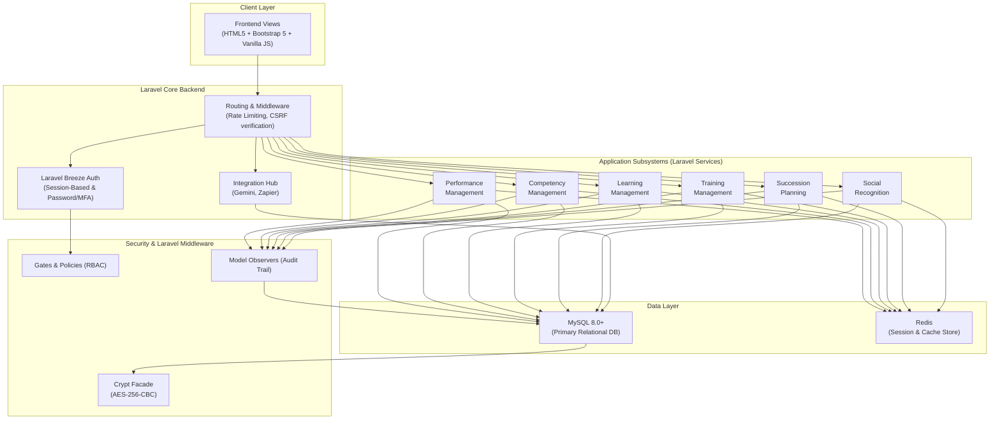
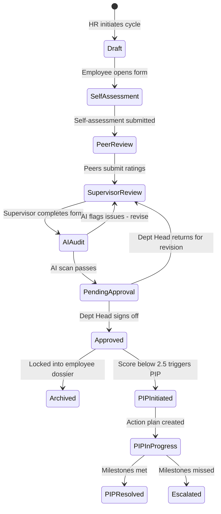
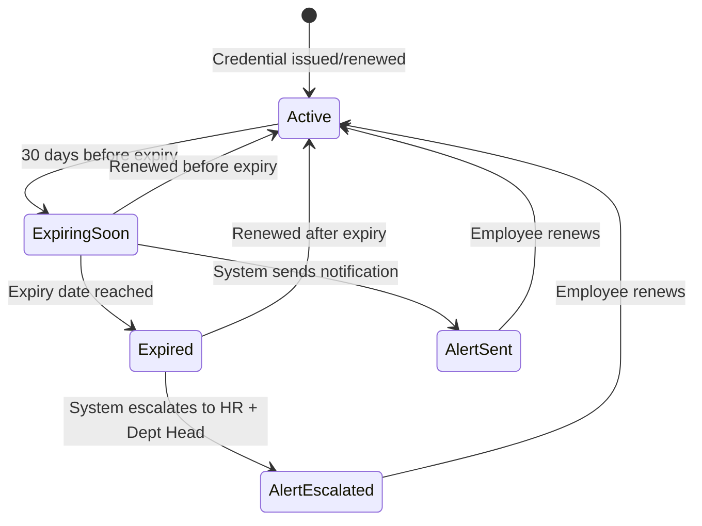
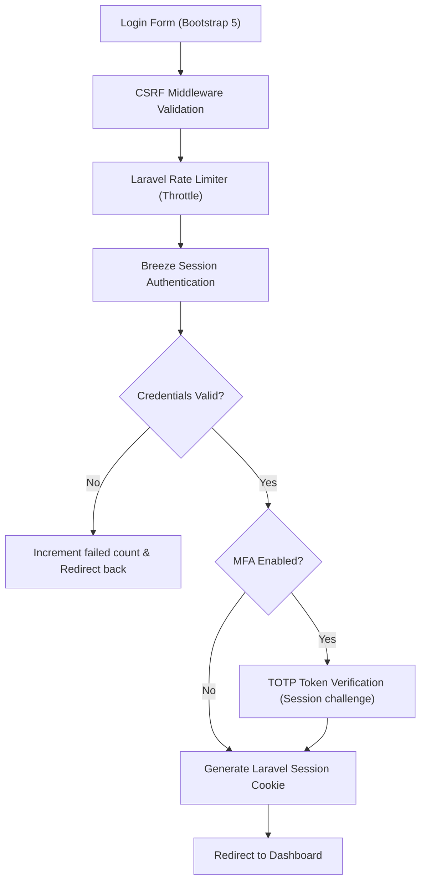
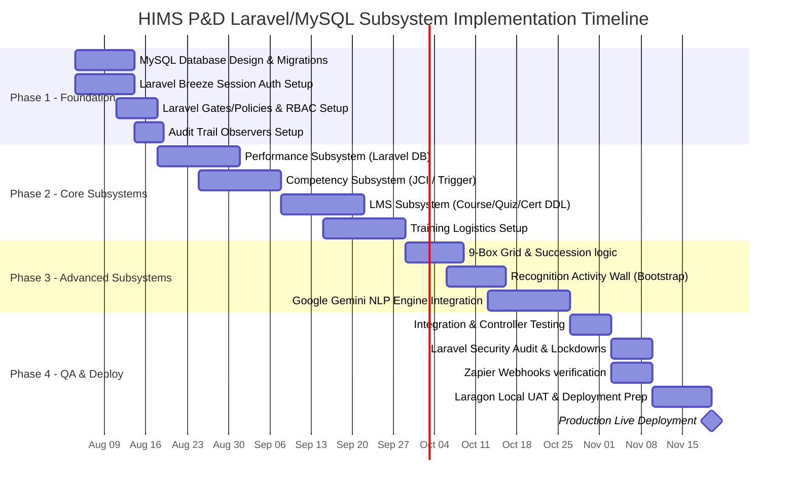

# Hospital Information Management System (HIMS)
## Performance & Development Module – Technical Specification & System Documentation

This document describes the architectural, functional, security, and data design of the **Performance & Development (P&D)** module for a modern Hospital Information Management System (HIMS). This module is tailored to meet the strict credentialing, continuing education, leadership succession, and quality-of-care demands of clinical and non-clinical staff.

---

## 1. System Overview

The **HIMS Performance & Development Module** is an enterprise-grade subsystem designed to manage, evaluate, and develop clinical (physicians, nurses, allied health professionals) and non-clinical (administrative, facilities, finance) hospital personnel. The primary objective is to align individual clinical competency with hospital quality standards, Joint Commission International (JCI) accreditation requirements, and employee development goals.

The system integrates six (6) distinct subsystems under a unified interface, controlled by Laravel session-based authentication (Laravel Breeze) and enhanced by the **HIMS Performance AI Assistant**, powered by the **Google Gemini API**.

### 1.1 High-Level Architecture



### 1.2 Subsystems Layout

```
+-------------------------------------------------------------------------------------------------+
|                                    HIMS Core Platform                                           |
+-------------------------------------------------------------------------------------------------+
                                                 |
                                                 v
+-------------------------------------------------------------------------------------------------+
|                                PERFORMANCE & DEVELOPMENT MODULE                                 |
+-------------------------------------------------------------------------------------------------+
|  +--------------------+  +--------------------+  +--------------------+  +--------------------+ |
|  |    Performance     |  |     Competency     |  |      Learning      |  |      Training      | |
|  |     Management     |  |     Management     |  |     Management     |  |     Management     | |
|  +--------------------+  +--------------------+  +--------------------+  +--------------------+ |
|  |     Succession     |  |       Social       |  |   Google Gemini    |  |  Session Audit logs| |
|  |      Planning      |  |    Recognition     |  |    AI Assistant    |  |     & Security     | |
|  +--------------------+  +--------------------+  +--------------------+  +--------------------+ |
+-------------------------------------------------------------------------------------------------+
```

---

## 2. Functional Requirements

The system supports the following functional requirements:
- **Evaluations & Goals**: Periodic reviews (monthly, quarterly, annual), supervisor forms, self-assessments, peer reviews, Goal Tracking, and Performance Improvement Plans (PIPs).
- **Competency & Credentialing**: Custom clinical/technical/administrative competency frameworks, competency assessments, gap analysis, skills matrices, and active monitoring of clinical licenses/certifications with automated alerts.
- **Learning & Compliance**: Custom hospital courses, e-learning enrollment, mandatory compliance tracking (e.g., Infection Control, Basic Life Support), CPD points calculation, and automatically generated quizzes.
- **Training Logistics**: Attendance tracking, calendar visualization, resources mapping, and trainee feedback analysis.
- **Leadership Pipelines**: Succession mapping using a Performance-Potential 9-Box Grid, critical roles identification, risk tracking (e.g., loss of key specialists), and leadership development pathways.
- **Social Recognition**: Public recognition wall, peer-to-peer appreciation badges (e.g., Compassion, Patient Care, Reliability), and recognition highlights.
- **AI Automation**: Google Gemini integration for evaluations auditing, Taglish translation/query support, competency extraction, and automatic quiz generation.
- **Integrations**: Zapier webhooks to sync recognition events or external HR actions.

---

## 3. User Roles and Permissions

To ensure compliance with data privacy regulations (e.g., HIPAA, Philippine Data Privacy Act of 2012), permissions are enforced via Laravel Gates and Policies mapping the following roles:

| Role | Description | Performance Access | Competency Access | Learning & Training | Succession Access | Social Recognition |
| :--- | :--- | :--- | :--- | :--- | :--- | :--- |
| **Hospital Admin** | Senior leadership / Executive Director | Read-only aggregate dashboard, reports. | Read-only aggregate charts. | View status. | Full read. Review approvals. | Read feed, give awards. |
| **HR Admin** | Full access to employee records | Full CRUD (All reviews, PIPs, setups). | Manage framework, audits. | Course builder, reports. | Full succession setup, pools. | Moderate recognition, post. |
| **Dept Head** | Clinical/non-clinical department chiefs | Read/Write dept staff, approve reviews. | View skills matrix, identify gaps. | Recommend courses, track. | Identify successors, risk review. | Write recognition, view. |
| **Supervisor** | Ward Head Nurses, Unit Supervisors | Write direct reports evaluations, goals. | Conduct competency audits. | Assign/approve registrations. | Input readiness scores. | Write recognition, view. |
| **Training Officer** | Education & training department staff | Read performance aggregated scores. | Add competencies, view skills. | Complete CRUD for courses/calendar. | View leadership development. | Read, write. |
| **Employee** | Nurses, Doctors, Staff | Self-assessment, view own goals/history. | View own competencies & gaps. | Enroll, take quizzes, CPD track. | View own career path / goals. | Write recognition, view feed. |

---

## 4. Module-by-Module Features & Workflows

### A. Performance Management

*   **Role-Specific KPI Library**: Differentiates between Clinical KPIs (e.g., *Medication Error Rate*, *Patient Satisfaction Rating*, *Documentation Accuracy*) and Non-Clinical KPIs (e.g., *Billing Error Ratio*, *Facilities Ticket Response Time*).
*   **Structured Reviews**: Self-evaluations, supervisor rating grids, and peer reviews using 1–5 scales and text justifications.
*   **Reminders**: Cron-triggered Laravel notifications alerting employees of upcoming reviews and warning managers of overdue appraisals.
*   **Performance Improvement Plans (PIPs)**: Automated generation of corrective action steps for employees scoring under `2.5 / 5.0` over consecutive review periods.

#### Performance Review Workflow State Machine



### B. Competency Management

*   **JCI Accreditation Mapping**: Maps compliance guidelines directly to required skills (SQE.3, SQE.4, SQE.5 standards).
*   **Credential Monitoring**: Displays real-time statuses for clinical licenses (e.g., PRC license, board certs, BLS, ACLS) with traffic-light warning states:
    *   🟢 **Active** — Valid and current
    *   🟡 **Expiring in 30 Days** — Renewal reminder triggered
    *   🔴 **Expired** — Escalation alert to HR and department head
*   **Department Skills Matrix**: Heatmaps showing competency coverage per ward, allowing managers to see if a ward lacks critical skills (e.g., ventilators operations).
*   **Gap Analysis Engine**: Computes `Gap = Current Proficiency − Required Proficiency` per employee per competency.

#### Credential Monitoring Workflow



### C. Learning Management

*   **Hospital Course Catalog**: Self-paced e-learning modules built using Bootstrap layout grids, categorized by compliance, clinical, and soft-skills.
*   **CPD (Continuing Professional Development) Tracker**: Accumulates hours required for professional license renewals.
*   **Interactive Assessments**: Quizzes built into modules with pass thresholds and retake limits.
*   **Learning Pathways**: Multi-course curriculums (e.g., "Critical Care Nurse Pathway") with prerequisite chains.
*   **Certificates**: Auto-generated completion certificates with QR verification codes.

### D. Training Management

*   **Visual Calendar**: Interactive calendar tracking active and upcoming instructor-led workshops (e.g., Infection Control Seminar).
*   **Logistics & Resource Allocation**: Assigns classrooms or simulator rooms while checking for schedule conflicts.
*   **Attendance Tracking**: QR code check-in with manual override; tracks no-shows and late arrivals.
*   **Evaluation Forms**: Post-training feedback surveys analyzed via Google Gemini for sentiment score and common recommendations.
*   **Pre-test/Post-test Analytics**: Automatically measures knowledge gains: `Δ Knowledge = Post-test Score − Pre-test Score`.

### E. Succession Planning

*   **Critical Role Registry**: Flagging key medical positions (e.g., Chief of Surgery, ICU Head Nurse) that present high operational risk if vacant.
*   **9-Box Grid Placement**: Maps candidates to a grid of "Performance (X-axis)" vs. "Potential (Y-axis)" (calculated via employee scores):
    | | Low Potential (1) | Medium Potential (2) | High Potential (3) |
    |---|---|---|---|
    | **High Performance (3)** | Solid Performer | High Performer | ⭐ Star Talent |
    | **Medium Performance (2)** | Average Performer | Core Contributor | High Potential |
    | **Low Performance (1)** | Underperformer | Inconsistent | Rough Diamond |
*   **Readiness Scale**: Categorizes successors as "Ready Now," "Ready in 1-2 Years," or "Ready in 3+ Years."
*   **Replacement Charts**: Visual organizational backups representing immediate backups for crucial clinical functions.
*   **Risk Dashboard**: Vacancy risk scoring based on holder's age, tenure, market scarcity, and successor readiness.

### F. Social Recognition

*   **Activity Wall**: Social-media style board showcasing peer/manager appreciation posts with reactions and comments.
*   **Core Hospital Value Badges**:
    *   *Compassion (Kalinga)*: For exemplary patient bedside manner.
    *   *Teamwork (Bayanihan)*: For helping colleagues in understaffed shifts.
    *   *Innovation (Diskarte)*: For solving emergency bottlenecks.
    *   *Clinical Excellence*: For zero-error documentation or procedures.
*   **Leaderboard**: Highlights most recognized departments and staff monthly.
*   **Integration**: Zapier webhooks trigger when a user receives a new badge, pushing messages to Slack or external dashboards.

---

## 5. Third-Party API Integrations

The P&D module leverages core APIs to extend functionality:

1.  **Google Gemini API**:
    *   **Evaluations Bias Audit**: Analyzes supervisor evaluations for subjective comments (e.g., Taglish review notes) and suggests descriptive, JCI-compliant phrasing.
    *   **Auto Quiz Generation**: Processes uploaded learning PDFs/documents and produces JSON-formatted multiple-choice questions for LMS assessments.
    *   **Natural Language Queries**: Translates Taglish or casual inputs into SQL query inputs for HR reports (e.g., "Sino ang successor para sa ICU Head Nurse?").
2.  **Zapier**:
    *   **HR Synchronization**: Triggers Zapier hooks when recognition posts are created or certificates are issued, allowing seamless connection with external corporate systems (e.g., Google Sheets, Slack, HR payroll dashboards).

---

## 6. Database Schema (MySQL 8.0+)

The relational schema is configured for **MySQL 8.0+**. All primary and foreign keys use UUIDs represented as `CHAR(36)`. Arrays are represented as `JSON` columns.

### 6.1 Entity-Relationship Diagram

```mermaid
erDiagram
    DEPARTMENTS ||--o{ EMPLOYEES : employs
    DEPARTMENTS ||--o{ ROLES : defines
    DEPARTMENTS ||--o{ CRITICAL_POSITIONS : contains
    ROLES ||--o{ EMPLOYEES : assigns
    ROLES ||--o{ ROLE_COMPETENCY_REQUIREMENTS : requires

    EMPLOYEES ||--o{ SYSTEM_USERS : authenticates_as
    EMPLOYEES ||--o{ PERFORMANCE_REVIEWS : undergoes
    EMPLOYEES ||--o{ PEER_REVIEWS : provides
    EMPLOYEES ||--o{ REVIEW_GOALS : tracks
    EMPLOYEES ||--o{ PERFORMANCE_IMPROVEMENT_PLANS : assigned

    EMPLOYEES ||--o{ COMPETENCY_ASSESSMENTS : evaluated_on
    EMPLOYEES ||--o{ EMPLOYEE_CREDENTIALS : holds

    EMPLOYEES ||--o{ COURSE_ENROLLMENTS : enrolls_in
    EMPLOYEES ||--o{ QUIZ_ATTEMPTS : takes
    EMPLOYEES ||--o{ CPD_RECORDS : earns
    EMPLOYEES ||--o{ CERTIFICATES : receives

    EMPLOYEES ||--o{ TRAINING_REGISTRATIONS : registers_for
    EMPLOYEES ||--o{ TRAINING_FEEDBACK : submits

    EMPLOYEES ||--o{ SUCCESSION_CANDIDATES : nominated_as
    EMPLOYEES ||--o{ LEADERSHIP_DEVELOPMENT_PATHS : follows

    EMPLOYEES ||--o{ RECOGNITION_POSTS : gives_or_receives
    EMPLOYEES ||--o{ RECOGNITION_REACTIONS : reacts
    EMPLOYEES ||--o{ RECOGNITION_COMMENTS : comments

    EMPLOYEES ||--o{ NOTIFICATIONS : receives
    EMPLOYEES ||--o{ AUDIT_TRAILS : generates

    REVIEW_CYCLES ||--o{ PERFORMANCE_REVIEWS : contains
    KPI_LIBRARY ||--o{ REVIEW_KPI_SCORES : measures
    PERFORMANCE_REVIEWS ||--o{ REVIEW_KPI_SCORES : includes
    PERFORMANCE_REVIEWS ||--o{ PEER_REVIEWS : collects
    PERFORMANCE_REVIEWS ||--o{ REVIEW_GOALS : sets

    COMPETENCY_DOMAINS ||--o{ COMPETENCY_CATEGORIES : groups
    COMPETENCY_CATEGORIES ||--o{ COMPETENCIES : contains
    COMPETENCIES ||--o{ COMPETENCY_ASSESSMENTS : assessed_via
    COMPETENCIES ||--o{ ROLE_COMPETENCY_REQUIREMENTS : required_by

    LEARNING_PATHWAYS ||--o{ PATHWAY_COURSES : sequences
    COURSES ||--o{ PATHWAY_COURSES : belongs_to
    COURSES ||--o{ COURSE_MODULES : contains
    COURSES ||--o{ COURSE_ENROLLMENTS : enrolled
    COURSES ||--o{ CERTIFICATES : certifies
    COURSE_MODULES ||--o{ QUIZ_QUESTIONS : tests
    COURSE_MODULES ||--o{ QUIZ_ATTEMPTS : attempted

    TRAINING_VENUES ||--o{ TRAINING_SESSIONS : hosts
    TRAINING_SESSIONS ||--o{ TRAINING_REGISTRATIONS : registers
    TRAINING_SESSIONS ||--o{ TRAINING_TESTS : evaluates
    TRAINING_SESSIONS ||--o{ TRAINING_FEEDBACK : reviewed
    TRAINING_TESTS ||--o{ TRAINING_TEST_RESULTS : scored

    CRITICAL_POSITIONS ||--o{ SUCCESSION_CANDIDATES : candidates
    CRITICAL_POSITIONS ||--o{ SUCCESSION_REVIEWS : reviewed
    SUCCESSION_CANDIDATES ||--o{ LEADERSHIP_DEVELOPMENT_PATHS : develops

    RECOGNITION_BADGES ||--o{ RECOGNITION_POSTS : awarded_via
    RECOGNITION_POSTS ||--o{ RECOGNITION_REACTIONS : reacted_to
    RECOGNITION_POSTS ||--o{ RECOGNITION_COMMENTS : discussed

    SYSTEM_USERS ||--o{ ROLE_PERMISSIONS : granted
    PERMISSIONS ||--o{ ROLE_PERMISSIONS : defines
```



---

### 6.2 Core / Shared Tables

```sql
-- ═══════════════════════════════════════════════════════
-- CORE / SHARED TABLES
-- ═══════════════════════════════════════════════════════

CREATE TABLE departments (
    department_id       CHAR(36) PRIMARY KEY,
    name                VARCHAR(150) NOT NULL UNIQUE,     -- "Nursing", "Surgery", "Pediatrics"
    department_code     VARCHAR(20) UNIQUE,
    head_employee_id    CHAR(36),                         -- Resolved via FK later
    parent_dept_id      CHAR(36) REFERENCES departments(department_id),
    is_clinical         BOOLEAN DEFAULT TRUE,
    created_at          TIMESTAMP DEFAULT CURRENT_TIMESTAMP
);

CREATE TABLE roles (
    role_id             CHAR(36) PRIMARY KEY,
    role_name           VARCHAR(100) NOT NULL UNIQUE,     -- "Senior ICU Nurse"
    role_slug           VARCHAR(50) NOT NULL UNIQUE,      -- "senior_icu_nurse"
    department_id       CHAR(36) REFERENCES departments(department_id),
    is_clinical         BOOLEAN DEFAULT TRUE,
    created_at          TIMESTAMP DEFAULT CURRENT_TIMESTAMP
);

CREATE TABLE employees (
    employee_id         CHAR(36) PRIMARY KEY,
    employee_code       VARCHAR(30) UNIQUE NOT NULL,      -- "EMP-001"
    first_name          VARCHAR(100) NOT NULL,
    last_name           VARCHAR(100) NOT NULL,
    email               VARCHAR(255) UNIQUE NOT NULL,
    phone               VARCHAR(100),                     -- ENCRYPTED
    department_id       CHAR(36) NOT NULL REFERENCES departments(department_id),
    role_id             CHAR(36) NOT NULL REFERENCES roles(role_id),
    position_title      VARCHAR(200),
    hire_date           DATE NOT NULL,
    employment_status   VARCHAR(20) DEFAULT 'active'
        CHECK (employment_status IN ('active','on_leave','suspended','resigned','retired')),
    supervisor_id       CHAR(36) REFERENCES employees(employee_id),
    profile_image_url   TEXT,
    created_at          TIMESTAMP DEFAULT CURRENT_TIMESTAMP,
    updated_at          TIMESTAMP DEFAULT CURRENT_TIMESTAMP ON UPDATE CURRENT_TIMESTAMP
);

-- Complete circular dependency reference for Department Head
ALTER TABLE departments ADD CONSTRAINT fk_dept_head 
    FOREIGN KEY (head_employee_id) REFERENCES employees(employee_id);

CREATE TABLE system_users (
    user_id             CHAR(36) PRIMARY KEY,
    employee_id         CHAR(36) NOT NULL UNIQUE REFERENCES employees(employee_id),
    username            VARCHAR(50) UNIQUE NOT NULL,
    password_hash       VARCHAR(255) NOT NULL,            -- Laravel Breeze default bcrypt/argon2
    access_role         VARCHAR(30) NOT NULL
        CHECK (access_role IN ('hospital_admin','hr_admin','dept_head',
                               'supervisor','training_officer','employee')),
    mfa_enabled         BOOLEAN DEFAULT FALSE,
    mfa_secret          TEXT,                             -- ENCRYPTED
    last_login          TIMESTAMP NULL DEFAULT NULL,
    failed_login_count  INT DEFAULT 0,
    account_locked      BOOLEAN DEFAULT FALSE,
    locked_until        TIMESTAMP NULL DEFAULT NULL,
    password_changed_at TIMESTAMP DEFAULT CURRENT_TIMESTAMP,
    must_change_password BOOLEAN DEFAULT FALSE,
    is_active           BOOLEAN DEFAULT TRUE,
    created_at          TIMESTAMP DEFAULT CURRENT_TIMESTAMP,
    updated_at          TIMESTAMP DEFAULT CURRENT_TIMESTAMP ON UPDATE CURRENT_TIMESTAMP
);

CREATE TABLE notifications (
    notification_id     CHAR(36) PRIMARY KEY,
    recipient_id        CHAR(36) NOT NULL REFERENCES employees(employee_id),
    notification_type   VARCHAR(50) NOT NULL,             -- 'review_due','license_expiring',...
    title               VARCHAR(300) NOT NULL,
    message             TEXT,
    reference_type      VARCHAR(50),                      -- Polymorphic reference
    reference_id        CHAR(36),
    is_read             BOOLEAN DEFAULT FALSE,
    read_at             TIMESTAMP NULL DEFAULT NULL,
    created_at          TIMESTAMP DEFAULT CURRENT_TIMESTAMP
);

CREATE INDEX idx_notifications_recipient ON notifications(recipient_id, is_read, created_at DESC);
```

---

### 6.3 Performance Management Tables

```sql
-- ═══════════════════════════════════════════════════════
-- PERFORMANCE MANAGEMENT TABLES
-- ═══════════════════════════════════════════════════════

CREATE TABLE review_cycles (
    cycle_id            CHAR(36) PRIMARY KEY,
    cycle_name          VARCHAR(100) NOT NULL,
    cycle_type          VARCHAR(20) NOT NULL
        CHECK (cycle_type IN ('monthly','quarterly','semi_annual','annual')),
    start_date          DATE NOT NULL,
    end_date            DATE NOT NULL,
    status              VARCHAR(20) DEFAULT 'planned'
        CHECK (status IN ('planned','active','closed')),
    created_by          CHAR(36) NOT NULL REFERENCES employees(employee_id),
    created_at          TIMESTAMP DEFAULT CURRENT_TIMESTAMP,
    updated_at          TIMESTAMP DEFAULT CURRENT_TIMESTAMP ON UPDATE CURRENT_TIMESTAMP
);

CREATE TABLE kpi_library (
    kpi_id              CHAR(36) PRIMARY KEY,
    kpi_name            VARCHAR(200) NOT NULL,
    kpi_category        VARCHAR(30) NOT NULL
        CHECK (kpi_category IN ('clinical','non_clinical','administrative')),
    description         TEXT,
    target_value        DECIMAL(5,2),
    unit                VARCHAR(30),
    applicable_roles    JSON,                             -- Array of role slugs e.g., ["icu_nurse"]
    weight              DECIMAL(3,2) DEFAULT 1.00,
    is_active           BOOLEAN DEFAULT TRUE,
    created_at          TIMESTAMP DEFAULT CURRENT_TIMESTAMP
);

CREATE TABLE performance_reviews (
    review_id           CHAR(36) PRIMARY KEY,
    employee_id         CHAR(36) NOT NULL REFERENCES employees(employee_id),
    cycle_id            CHAR(36) NOT NULL REFERENCES review_cycles(cycle_id),
    reviewer_id         CHAR(36) REFERENCES employees(employee_id),
    review_type         VARCHAR(20) DEFAULT 'standard'
        CHECK (review_type IN ('standard','probationary','pip_followup')),
    status              VARCHAR(30) DEFAULT 'draft'
        CHECK (status IN ('draft','self_assessment','peer_review','supervisor_review',
                          'ai_audit','pending_approval','approved','archived','returned')),
    self_rating         DECIMAL(3,2),
    supervisor_rating   DECIMAL(3,2),
    peer_rating         DECIMAL(3,2),
    overall_score       DECIMAL(3,2),
    strengths_text      TEXT,
    improvements_text   TEXT,
    ai_bias_flags       JSON,                             -- Google Gemini audit reports
    ai_summary          TEXT,
    digital_signature   TEXT,
    signed_at           TIMESTAMP NULL DEFAULT NULL,
    created_at          TIMESTAMP DEFAULT CURRENT_TIMESTAMP,
    updated_at          TIMESTAMP DEFAULT CURRENT_TIMESTAMP ON UPDATE CURRENT_TIMESTAMP
);

CREATE TABLE review_kpi_scores (
    score_id            CHAR(36) PRIMARY KEY,
    review_id           CHAR(36) NOT NULL REFERENCES performance_reviews(review_id) ON DELETE CASCADE,
    kpi_id              CHAR(36) NOT NULL REFERENCES kpi_library(kpi_id),
    self_score          DECIMAL(3,2),
    supervisor_score    DECIMAL(3,2),
    peer_score          DECIMAL(3,2),
    weighted_score      DECIMAL(3,2),
    comments            TEXT,
    UNIQUE KEY (review_id, kpi_id)
);

CREATE TABLE peer_reviews (
    peer_review_id      CHAR(36) PRIMARY KEY,
    review_id           CHAR(36) NOT NULL REFERENCES performance_reviews(review_id) ON DELETE CASCADE,
    peer_employee_id    CHAR(36) NOT NULL REFERENCES employees(employee_id),
    rating              DECIMAL(3,2) NOT NULL CHECK (rating BETWEEN 1.0 AND 5.0),
    comments            TEXT,
    is_anonymous        BOOLEAN DEFAULT TRUE,
    submitted_at        TIMESTAMP DEFAULT CURRENT_TIMESTAMP
);

CREATE TABLE performance_improvement_plans (
    pip_id              CHAR(36) PRIMARY KEY,
    employee_id         CHAR(36) NOT NULL REFERENCES employees(employee_id),
    triggered_by_review CHAR(36) NOT NULL REFERENCES performance_reviews(review_id),
    status              VARCHAR(20) DEFAULT 'initiated'
        CHECK (status IN ('initiated','in_progress','resolved','escalated')),
    action_steps        JSON NOT NULL,                    -- Task step definitions
    start_date          DATE NOT NULL,
    target_end_date     DATE NOT NULL,
    actual_end_date     DATE,
    supervisor_id       CHAR(36) REFERENCES employees(employee_id),
    notes               TEXT,
    created_at          TIMESTAMP DEFAULT CURRENT_TIMESTAMP,
    updated_at          TIMESTAMP DEFAULT CURRENT_TIMESTAMP ON UPDATE CURRENT_TIMESTAMP
);

CREATE TABLE review_goals (
    goal_id             CHAR(36) PRIMARY KEY,
    review_id           CHAR(36) NOT NULL REFERENCES performance_reviews(review_id) ON DELETE CASCADE,
    employee_id         CHAR(36) NOT NULL REFERENCES employees(employee_id),
    goal_title          VARCHAR(300) NOT NULL,
    goal_description    TEXT,
    target_date         DATE,
    progress_pct        INT DEFAULT 0 CHECK (progress_pct BETWEEN 0 AND 100),
    status              VARCHAR(20) DEFAULT 'not_started'
        CHECK (status IN ('not_started','in_progress','completed','deferred')),
    created_at          TIMESTAMP DEFAULT CURRENT_TIMESTAMP
);
```

---

### 6.4 Competency Management Tables

```sql
-- ═══════════════════════════════════════════════════════
-- COMPETENCY MANAGEMENT TABLES
-- ═══════════════════════════════════════════════════════

CREATE TABLE competency_domains (
    domain_id           CHAR(36) PRIMARY KEY,
    domain_name         VARCHAR(100) NOT NULL UNIQUE,     -- "Clinical", "Administrative"
    description         TEXT,
    created_at          TIMESTAMP DEFAULT CURRENT_TIMESTAMP
);

CREATE TABLE competency_categories (
    category_id         CHAR(36) PRIMARY KEY,
    domain_id           CHAR(36) NOT NULL REFERENCES competency_domains(domain_id),
    category_name       VARCHAR(150) NOT NULL,           -- "Emergency Response", "Infection Control"
    jci_standard_code   VARCHAR(30),                     -- "SQE.3", "PCI.5"
    created_at          TIMESTAMP DEFAULT CURRENT_TIMESTAMP
);

CREATE TABLE competencies (
    competency_id       CHAR(36) PRIMARY KEY,
    category_id         CHAR(36) NOT NULL REFERENCES competency_categories(category_id),
    competency_name     VARCHAR(200) NOT NULL,           -- "Advanced Ventilator Support"
    competency_code     VARCHAR(30) UNIQUE,              -- "COMP-ICU-009"
    description         TEXT,
    required_proficiency INT NOT NULL CHECK (required_proficiency BETWEEN 1 AND 5),
    is_mandatory        BOOLEAN DEFAULT FALSE,
    created_at          TIMESTAMP DEFAULT CURRENT_TIMESTAMP
);

CREATE TABLE role_competency_requirements (
    id                  CHAR(36) PRIMARY KEY,
    role_id             CHAR(36) NOT NULL REFERENCES roles(role_id),
    competency_id       CHAR(36) NOT NULL REFERENCES competencies(competency_id),
    minimum_proficiency INT NOT NULL CHECK (minimum_proficiency BETWEEN 1 AND 5),
    is_critical         BOOLEAN DEFAULT FALSE,
    UNIQUE KEY (role_id, competency_id)
);

CREATE TABLE competency_assessments (
    assessment_id       CHAR(36) PRIMARY KEY,
    employee_id         CHAR(36) NOT NULL REFERENCES employees(employee_id),
    competency_id       CHAR(36) NOT NULL REFERENCES competencies(competency_id),
    assessed_by         CHAR(36) NOT NULL REFERENCES employees(employee_id),
    assessment_method   VARCHAR(30) DEFAULT 'observation'
        CHECK (assessment_method IN ('observation','exam','simulation','self_report')),
    current_proficiency INT NOT NULL CHECK (current_proficiency BETWEEN 1 AND 5),
    gap                 INT,                              -- Computed via trigger
    evidence_url        TEXT,
    notes               TEXT,
    assessed_date       DATE NOT NULL,
    next_assessment_due DATE,
    created_at          TIMESTAMP DEFAULT CURRENT_TIMESTAMP
);

-- MySQL trigger definition to auto-calculate performance gaps
DELIMITER $$
CREATE TRIGGER trg_compute_gap_insert
BEFORE INSERT ON competency_assessments
FOR EACH ROW
BEGIN
    DECLARE req_prof INT;
    SELECT required_proficiency INTO req_prof FROM competencies WHERE competency_id = NEW.competency_id;
    SET NEW.gap = NEW.current_proficiency - req_prof;
END$$

CREATE TRIGGER trg_compute_gap_update
BEFORE UPDATE ON competency_assessments
FOR EACH ROW
BEGIN
    DECLARE req_prof INT;
    SELECT required_proficiency INTO req_prof FROM competencies WHERE competency_id = NEW.competency_id;
    SET NEW.gap = NEW.current_proficiency - req_prof;
END$$
DELIMITER ;

CREATE TABLE employee_credentials (
    credential_id       CHAR(36) PRIMARY KEY,
    employee_id         CHAR(36) NOT NULL REFERENCES employees(employee_id),
    credential_type     VARCHAR(50) NOT NULL,             -- 'PRC_License','Board_Cert','BLS'
    credential_number   VARCHAR(100),                     -- ENCRYPTED
    issuing_body        VARCHAR(150),
    issue_date          DATE,
    expiry_date         DATE,
    status              VARCHAR(20) GENERATED ALWAYS AS (
                            CASE
                                WHEN expiry_date IS NULL THEN 'no_expiry'
                                WHEN expiry_date < CURRENT_DATE() THEN 'expired'
                                WHEN expiry_date < CURRENT_DATE() + INTERVAL 30 DAY THEN 'expiring_soon'
                                ELSE 'active'
                            END
                        ) STORED,
    document_url        TEXT,
    verified_by         CHAR(36) REFERENCES employees(employee_id),
    verified_at         TIMESTAMP NULL DEFAULT NULL,
    created_at          TIMESTAMP DEFAULT CURRENT_TIMESTAMP,
    updated_at          TIMESTAMP DEFAULT CURRENT_TIMESTAMP ON UPDATE CURRENT_TIMESTAMP
);

CREATE TABLE credential_alert_log (
    alert_id            CHAR(36) PRIMARY KEY,
    credential_id       CHAR(36) NOT NULL REFERENCES employee_credentials(credential_id),
    employee_id         CHAR(36) NOT NULL REFERENCES employees(employee_id),
    alert_type          VARCHAR(30) NOT NULL,             -- 'expiring_30d','expired'
    sent_to             JSON NOT NULL,                    -- Array of user IDs notified
    sent_at             TIMESTAMP DEFAULT CURRENT_TIMESTAMP,
    acknowledged_at     TIMESTAMP NULL DEFAULT NULL
);
```

---

### 6.5 Learning Management Tables

```sql
-- ═══════════════════════════════════════════════════════
-- LEARNING MANAGEMENT TABLES
-- ═══════════════════════════════════════════════════════

CREATE TABLE learning_pathways (
    pathway_id          CHAR(36) PRIMARY KEY,
    pathway_name        VARCHAR(200) NOT NULL,
    description         TEXT,
    target_roles        JSON,                             -- Role slug mappings
    total_cpd_hours     DECIMAL(5,1),
    is_mandatory        BOOLEAN DEFAULT FALSE,
    created_by          CHAR(36) REFERENCES employees(employee_id),
    created_at          TIMESTAMP DEFAULT CURRENT_TIMESTAMP
);

CREATE TABLE courses (
    course_id           CHAR(36) PRIMARY KEY,
    course_code         VARCHAR(30) UNIQUE,
    title               VARCHAR(300) NOT NULL,
    description         TEXT,
    category            VARCHAR(50) NOT NULL,             -- 'compliance','clinical'
    cpd_hours           DECIMAL(4,1) NOT NULL DEFAULT 0,
    difficulty_level    VARCHAR(20) DEFAULT 'intermediate'
        CHECK (difficulty_level IN ('beginner','intermediate','advanced')),
    estimated_duration  INT,                              -- Duration in minutes
    passing_score       DECIMAL(5,2) DEFAULT 70.00,
    max_retakes         INT DEFAULT 3,
    is_mandatory        BOOLEAN DEFAULT FALSE,
    is_active           BOOLEAN DEFAULT TRUE,
    created_by          CHAR(36) REFERENCES employees(employee_id),
    created_at          TIMESTAMP DEFAULT CURRENT_TIMESTAMP,
    updated_at          TIMESTAMP DEFAULT CURRENT_TIMESTAMP ON UPDATE CURRENT_TIMESTAMP
);

CREATE TABLE pathway_courses (
    id                  CHAR(36) PRIMARY KEY,
    pathway_id          CHAR(36) NOT NULL REFERENCES learning_pathways(pathway_id) ON DELETE CASCADE,
    course_id           CHAR(36) NOT NULL REFERENCES courses(course_id),
    sequence_order      INT NOT NULL,
    is_prerequisite     BOOLEAN DEFAULT FALSE,
    UNIQUE KEY (pathway_id, course_id)
);

CREATE TABLE course_modules (
    module_id           CHAR(36) PRIMARY KEY,
    course_id           CHAR(36) NOT NULL REFERENCES courses(course_id) ON DELETE CASCADE,
    module_title        VARCHAR(200) NOT NULL,
    module_type         VARCHAR(30) NOT NULL
        CHECK (module_type IN ('video','document','interactive','quiz')),
    content_url         TEXT,
    content_body        TEXT,
    sequence_order      INT NOT NULL,
    estimated_minutes   INT,
    created_at          TIMESTAMP DEFAULT CURRENT_TIMESTAMP
);

CREATE TABLE course_enrollments (
    enrollment_id       CHAR(36) PRIMARY KEY,
    employee_id         CHAR(36) NOT NULL REFERENCES employees(employee_id),
    course_id           CHAR(36) NOT NULL REFERENCES courses(course_id),
    enrolled_by         CHAR(36) REFERENCES employees(employee_id),
    enrollment_date     DATE,
    due_date            DATE,
    status              VARCHAR(20) DEFAULT 'enrolled'
        CHECK (status IN ('enrolled','in_progress','completed','failed','expired')),
    progress_pct        INT DEFAULT 0 CHECK (progress_pct BETWEEN 0 AND 100),
    completed_at        TIMESTAMP NULL DEFAULT NULL,
    cpd_hours_earned    DECIMAL(4,1) DEFAULT 0,
    certificate_id      CHAR(36),                         -- FK added post-creation
    UNIQUE KEY (employee_id, course_id)
);

CREATE TABLE quiz_questions (
    question_id         CHAR(36) PRIMARY KEY,
    module_id           CHAR(36) NOT NULL REFERENCES course_modules(module_id) ON DELETE CASCADE,
    question_text       TEXT NOT NULL,
    question_type       VARCHAR(20) DEFAULT 'multiple_choice'
        CHECK (question_type IN ('multiple_choice','true_false','fill_blank')),
    options             JSON NOT NULL,                    -- Answer choices schema
    correct_answer      TEXT NOT NULL,
    explanation         TEXT,
    points              INT DEFAULT 1,
    ai_generated        BOOLEAN DEFAULT FALSE,            -- Populated by Google Gemini API
    created_at          TIMESTAMP DEFAULT CURRENT_TIMESTAMP
);

CREATE TABLE quiz_attempts (
    attempt_id          CHAR(36) PRIMARY KEY,
    employee_id         CHAR(36) NOT NULL REFERENCES employees(employee_id),
    module_id           CHAR(36) NOT NULL REFERENCES course_modules(module_id),
    attempt_number      INT NOT NULL DEFAULT 1,
    answers             JSON NOT NULL,
    score_pct           DECIMAL(5,2) NOT NULL,
    passed              BOOLEAN NOT NULL,
    started_at          TIMESTAMP NOT NULL,
    completed_at        TIMESTAMP NOT NULL,
    time_spent_seconds  INT
);

CREATE TABLE cpd_records (
    cpd_id              CHAR(36) PRIMARY KEY,
    employee_id         CHAR(36) NOT NULL REFERENCES employees(employee_id),
    source_type         VARCHAR(30) NOT NULL,             -- 'course','training','external'
    source_id           CHAR(36),
    activity_name       VARCHAR(300) NOT NULL,
    cpd_hours           DECIMAL(4,1) NOT NULL,
    date_earned         DATE NOT NULL,
    renewal_period      VARCHAR(20),
    verified            BOOLEAN DEFAULT FALSE,
    verified_by         CHAR(36) REFERENCES employees(employee_id),
    created_at          TIMESTAMP DEFAULT CURRENT_TIMESTAMP
);

CREATE TABLE certificates (
    certificate_id      CHAR(36) PRIMARY KEY,
    employee_id         CHAR(36) NOT NULL REFERENCES employees(employee_id),
    course_id           CHAR(36) NOT NULL REFERENCES courses(course_id),
    certificate_code    VARCHAR(50) UNIQUE NOT NULL,      -- Verifiable serial
    issued_date         DATE NOT NULL,
    expiry_date         DATE,
    pdf_url             TEXT,
    qr_verification_url TEXT,
    created_at          TIMESTAMP DEFAULT CURRENT_TIMESTAMP
);

ALTER TABLE course_enrollments ADD CONSTRAINT fk_enrollment_cert 
    FOREIGN KEY (certificate_id) REFERENCES certificates(certificate_id);
```

---

### 6.6 Training Management Tables

```sql
-- ═══════════════════════════════════════════════════════
-- TRAINING MANAGEMENT TABLES
-- ═══════════════════════════════════════════════════════

CREATE TABLE training_venues (
    venue_id            CHAR(36) PRIMARY KEY,
    venue_name          VARCHAR(150) NOT NULL,
    building            VARCHAR(100),
    floor               VARCHAR(20),
    capacity            INT NOT NULL,
    equipment           JSON,                             -- Stored equipment array
    is_active           BOOLEAN DEFAULT TRUE,
    created_at          TIMESTAMP DEFAULT CURRENT_TIMESTAMP
);

CREATE TABLE training_sessions (
    session_id          CHAR(36) PRIMARY KEY,
    session_code        VARCHAR(30) UNIQUE,
    title               VARCHAR(300) NOT NULL,
    description         TEXT,
    category            VARCHAR(50) NOT NULL,
    instructor_id       CHAR(36) NOT NULL REFERENCES employees(employee_id),
    venue_id            CHAR(36) REFERENCES training_venues(venue_id),
    session_date        DATE NOT NULL,
    start_time          TIME NOT NULL,
    end_time            TIME NOT NULL,
    capacity            INT NOT NULL,
    registration_deadline DATE,
    status              VARCHAR(20) DEFAULT 'scheduled'
        CHECK (status IN ('scheduled','in_progress','completed','cancelled')),
    linked_course_id    CHAR(36) REFERENCES courses(course_id),
    linked_competencies JSON,                             -- Competency link array
    cpd_hours           DECIMAL(4,1) DEFAULT 0,
    has_pre_test        BOOLEAN DEFAULT FALSE,
    has_post_test       BOOLEAN DEFAULT FALSE,
    created_by          CHAR(36) REFERENCES employees(employee_id),
    created_at          TIMESTAMP DEFAULT CURRENT_TIMESTAMP,
    updated_at          TIMESTAMP DEFAULT CURRENT_TIMESTAMP ON UPDATE CURRENT_TIMESTAMP
);

-- Unique index to prevent physical venue double-booking in MySQL
CREATE UNIQUE INDEX idx_venue_schedule ON training_sessions (venue_id, session_date, start_time);

CREATE TABLE training_registrations (
    registration_id     CHAR(36) PRIMARY KEY,
    session_id          CHAR(36) NOT NULL REFERENCES training_sessions(session_id) ON DELETE CASCADE,
    employee_id         CHAR(36) NOT NULL REFERENCES employees(employee_id),
    registered_by       CHAR(36) REFERENCES employees(employee_id),
    registration_date   TIMESTAMP DEFAULT CURRENT_TIMESTAMP,
    status              VARCHAR(20) DEFAULT 'registered'
        CHECK (status IN ('registered','waitlisted','attended','no_show','cancelled')),
    check_in_time       TIMESTAMP NULL DEFAULT NULL,
    check_in_method     VARCHAR(20),                      -- 'qr_scan','manual'
    UNIQUE KEY (session_id, employee_id)
);

CREATE TABLE training_tests (
    test_id             CHAR(36) PRIMARY KEY,
    session_id          CHAR(36) NOT NULL REFERENCES training_sessions(session_id) ON DELETE CASCADE,
    test_type           VARCHAR(10) NOT NULL
        CHECK (test_type IN ('pre_test','post_test')),
    questions           JSON NOT NULL,
    passing_score       DECIMAL(5,2) DEFAULT 70.00,
    created_at          TIMESTAMP DEFAULT CURRENT_TIMESTAMP
);

CREATE TABLE training_test_results (
    result_id           CHAR(36) PRIMARY KEY,
    test_id             CHAR(36) NOT NULL REFERENCES training_tests(test_id) ON DELETE CASCADE,
    employee_id         CHAR(36) NOT NULL REFERENCES employees(employee_id),
    score_pct           DECIMAL(5,2) NOT NULL,
    answers             JSON,
    completed_at        TIMESTAMP DEFAULT CURRENT_TIMESTAMP,
    UNIQUE KEY (test_id, employee_id)
);

CREATE TABLE training_feedback (
    feedback_id         CHAR(36) PRIMARY KEY,
    session_id          CHAR(36) NOT NULL REFERENCES training_sessions(session_id) ON DELETE CASCADE,
    employee_id         CHAR(36) NOT NULL REFERENCES employees(employee_id),
    overall_rating      INT NOT NULL CHECK (overall_rating BETWEEN 1 AND 5),
    content_rating      INT CHECK (content_rating BETWEEN 1 AND 5),
    instructor_rating   INT CHECK (instructor_rating BETWEEN 1 AND 5),
    venue_rating        INT CHECK (venue_rating BETWEEN 1 AND 5),
    comments            TEXT,
    ai_sentiment_score  DECIMAL(3,2),                     -- Populated by Google Gemini API
    ai_sentiment_label  VARCHAR(20),                      -- 'positive','neutral','negative'
    submitted_at        TIMESTAMP DEFAULT CURRENT_TIMESTAMP,
    UNIQUE KEY (session_id, employee_id)
);
```

---

### 6.7 Succession Planning Tables

```sql
-- ═══════════════════════════════════════════════════════
-- SUCCESSION PLANNING TABLES
-- ═══════════════════════════════════════════════════════

CREATE TABLE critical_positions (
    position_id         CHAR(36) PRIMARY KEY,
    position_title      VARCHAR(200) NOT NULL,
    department_id       CHAR(36) NOT NULL REFERENCES departments(department_id),
    current_holder_id   CHAR(36) REFERENCES employees(employee_id),
    is_critical         BOOLEAN DEFAULT TRUE,
    vacancy_risk        VARCHAR(10) DEFAULT 'medium'
        CHECK (vacancy_risk IN ('low','medium','high','critical')),
    risk_factors        JSON,                             -- Metadata about vacancies
    impact_description  TEXT,
    created_at          TIMESTAMP DEFAULT CURRENT_TIMESTAMP,
    updated_at          TIMESTAMP DEFAULT CURRENT_TIMESTAMP ON UPDATE CURRENT_TIMESTAMP
);

CREATE TABLE succession_candidates (
    candidate_id        CHAR(36) PRIMARY KEY,
    position_id         CHAR(36) NOT NULL REFERENCES critical_positions(position_id) ON DELETE CASCADE,
    employee_id         CHAR(36) NOT NULL REFERENCES employees(employee_id),
    performance_score   INT NOT NULL CHECK (performance_score BETWEEN 1 AND 3),
    potential_score     INT NOT NULL CHECK (potential_score BETWEEN 1 AND 3),
    nine_box_label      VARCHAR(30) GENERATED ALWAYS AS (
                            CASE
                                WHEN performance_score = 3 AND potential_score = 3 THEN 'star_talent'
                                WHEN performance_score = 3 AND potential_score = 2 THEN 'high_performer'
                                WHEN performance_score = 3 AND potential_score = 1 THEN 'solid_performer'
                                WHEN performance_score = 2 AND potential_score = 3 THEN 'high_potential'
                                WHEN performance_score = 2 AND potential_score = 2 THEN 'core_contributor'
                                WHEN performance_score = 2 AND potential_score = 1 THEN 'average_performer'
                                WHEN performance_score = 1 AND potential_score = 3 THEN 'rough_diamond'
                                WHEN performance_score = 1 AND potential_score = 2 THEN 'inconsistent'
                                ELSE 'underperformer'
                            END
                        ) STORED,                         -- Managed automatically by MySQL
    readiness_level     VARCHAR(20) NOT NULL
        CHECK (readiness_level IN ('ready_now','1_2_years','3_plus_years')),
    development_plan    JSON,
    mentor_id           CHAR(36) REFERENCES employees(employee_id),
    status              VARCHAR(20) DEFAULT 'proposed'
        CHECK (status IN ('proposed','hr_reviewed','approved','withdrawn')),
    nominated_by        CHAR(36) REFERENCES employees(employee_id),
    nominated_at        TIMESTAMP DEFAULT CURRENT_TIMESTAMP,
    reviewed_at         TIMESTAMP NULL DEFAULT NULL,
    approved_at         TIMESTAMP NULL DEFAULT NULL,
    UNIQUE KEY (position_id, employee_id)
);

CREATE TABLE succession_reviews (
    review_id           CHAR(36) PRIMARY KEY,
    position_id         CHAR(36) NOT NULL REFERENCES critical_positions(position_id),
    review_period       VARCHAR(30) NOT NULL,
    reviewed_by         CHAR(36) NOT NULL REFERENCES employees(employee_id),
    review_notes        TEXT,
    risk_assessment     VARCHAR(10),
    action_items        JSON,
    created_at          TIMESTAMP DEFAULT CURRENT_TIMESTAMP
);

CREATE TABLE leadership_development_paths (
    path_id             CHAR(36) PRIMARY KEY,
    candidate_id        CHAR(36) NOT NULL REFERENCES succession_candidates(candidate_id),
    milestone_title     VARCHAR(200) NOT NULL,
    milestone_type      VARCHAR(30),                      -- 'training','mentorship','rotation'
    description         TEXT,
    target_date         DATE,
    completed_date      DATE,
    status              VARCHAR(20) DEFAULT 'pending'
        CHECK (status IN ('pending','in_progress','completed','deferred')),
    linked_course_id    CHAR(36) REFERENCES courses(course_id),
    linked_competency   CHAR(36) REFERENCES competencies(competency_id),
    created_at          TIMESTAMP DEFAULT CURRENT_TIMESTAMP
);
```

---

### 6.8 Social Recognition Tables

```sql
-- ═══════════════════════════════════════════════════════
-- SOCIAL RECOGNITION TABLES
-- ═══════════════════════════════════════════════════════

CREATE TABLE recognition_badges (
    badge_id            CHAR(36) PRIMARY KEY,
    badge_name          VARCHAR(100) NOT NULL UNIQUE,     -- "Compassion (Kalinga)"
    badge_icon          VARCHAR(50),                      -- Bootstrap icon class e.g., "bi-heart-fill"
    badge_color         VARCHAR(7),                       -- Hex code
    hospital_value      VARCHAR(100),
    description         TEXT,
    points_value        INT DEFAULT 1,
    is_active           BOOLEAN DEFAULT TRUE,
    created_at          TIMESTAMP DEFAULT CURRENT_TIMESTAMP
);

CREATE TABLE recognition_posts (
    post_id             CHAR(36) PRIMARY KEY,
    author_id           CHAR(36) NOT NULL REFERENCES employees(employee_id),
    recipient_id        CHAR(36) NOT NULL REFERENCES employees(employee_id),
    badge_id            CHAR(36) REFERENCES recognition_badges(badge_id),
    post_type           VARCHAR(20) DEFAULT 'peer'
        CHECK (post_type IN ('peer','manager','hr_award','department')),
    message             TEXT NOT NULL,
    is_public           BOOLEAN DEFAULT TRUE,
    is_featured         BOOLEAN DEFAULT FALSE,
    moderation_status   VARCHAR(20) DEFAULT 'approved'
        CHECK (moderation_status IN ('pending','approved','flagged','removed')),
    moderated_by        CHAR(36) REFERENCES employees(employee_id),
    moderation_note     TEXT,
    link_to_review_id   CHAR(36) REFERENCES performance_reviews(review_id),
    created_at          TIMESTAMP DEFAULT CURRENT_TIMESTAMP,
    updated_at          TIMESTAMP DEFAULT CURRENT_TIMESTAMP ON UPDATE CURRENT_TIMESTAMP,
    CONSTRAINT chk_no_self_recognition CHECK (author_id != recipient_id)
);

CREATE TABLE recognition_reactions (
    reaction_id         CHAR(36) PRIMARY KEY,
    post_id             CHAR(36) NOT NULL REFERENCES recognition_posts(post_id) ON DELETE CASCADE,
    employee_id         CHAR(36) NOT NULL REFERENCES employees(employee_id),
    reaction_type       VARCHAR(20) DEFAULT 'like'
        CHECK (reaction_type IN ('like','clap','heart','celebrate','support')),
    created_at          TIMESTAMP DEFAULT CURRENT_TIMESTAMP,
    UNIQUE KEY (post_id, employee_id)
);

CREATE TABLE recognition_comments (
    comment_id          CHAR(36) PRIMARY KEY,
    post_id             CHAR(36) NOT NULL REFERENCES recognition_posts(post_id) ON DELETE CASCADE,
    author_id           CHAR(36) NOT NULL REFERENCES employees(employee_id),
    comment_text        TEXT NOT NULL,
    moderation_status   VARCHAR(20) DEFAULT 'approved',
    created_at          TIMESTAMP DEFAULT CURRENT_TIMESTAMP
);

-- Standard SQL View for leaderboard computations
CREATE VIEW v_recognition_leaderboard AS
SELECT
    rp.recipient_id                         AS employee_id,
    CONCAT(e.first_name, ' ', e.last_name)  AS employee_name,
    e.department_id,
    d.name                                  AS department_name,
    COUNT(rp.post_id)                       AS total_recognitions,
    SUM(COALESCE(rb.points_value, 1))       AS total_points,
    DATE_FORMAT(rp.created_at, '%Y-%m-01')  AS month
FROM recognition_posts rp
JOIN employees e ON rp.recipient_id = e.employee_id
JOIN departments d ON e.department_id = d.department_id
LEFT JOIN recognition_badges rb ON rp.badge_id = rb.badge_id
WHERE rp.moderation_status = 'approved'
GROUP BY rp.recipient_id, e.first_name, e.last_name, e.department_id, d.name, DATE_FORMAT(rp.created_at, '%Y-%m-01');
```

---

## 7. Security and Compliance Architecture

### 7.1 Authentication & Sessions



### 7.2 Security Settings

*   **Laravel Breeze & Sessions**: Enforces standard session cookie policies. Cookies are flagged as `HttpOnly`, `Secure` (when running HTTPS), and set with `SameSite=Lax` or `SameSite=Strict`.
*   **CSRF Protection**: Verified automatically via Laravel's built-in `VerifyCsrfToken` middleware on all state-changing requests (POST, PUT, PATCH, DELETE).
*   **Role-Based Access Control (RBAC)**: Maps permissions using Laravel **Policies** (e.g., `ReviewPolicy`, `CredentialPolicy`) and **Gates**.
*   **Encryption**: Sensitive columns (like `employees.phone` and `employee_credentials.credential_number`) are encrypted using Laravel's Crypt system, utilizing `AES-256-CBC` under PHP OpenSSL.
*   **Tamper Protection**: Database configurations revoke raw modification access on log files. Laravel Observers compute record hashes before logging transactions to the audit trail.

### 7.3 Laravel Breeze RBAC Permission Table

```sql
-- ═══════════════════════════════════════════════════════
-- RBAC PERMISSION TABLES
-- ═══════════════════════════════════════════════════════

CREATE TABLE permissions (
    permission_id       CHAR(36) PRIMARY KEY,
    resource            VARCHAR(50) NOT NULL,             -- 'performance_reviews', 'competencies'
    action              VARCHAR(20) NOT NULL,             -- 'create','read','update','delete','approve'
    scope               VARCHAR(20) DEFAULT 'own'
        CHECK (scope IN ('own','department','all')),
    description         TEXT,
    UNIQUE KEY (resource, action, scope)
);

CREATE TABLE role_permissions (
    id                  CHAR(36) PRIMARY KEY,
    access_role         VARCHAR(30) NOT NULL,
    permission_id       CHAR(36) NOT NULL REFERENCES permissions(permission_id),
    UNIQUE KEY (access_role, permission_id)
);
```

---

### 7.4 Audit Trail Log (MySQL 8.0+)

```sql
-- ═══════════════════════════════════════════════════════
-- AUDIT TRAIL TABLE
-- ═══════════════════════════════════════════════════════

CREATE TABLE audit_trails (
    audit_id            CHAR(36) PRIMARY KEY,
    timestamp           TIMESTAMP DEFAULT CURRENT_TIMESTAMP,
    user_id             CHAR(36) NOT NULL REFERENCES system_users(user_id),
    employee_id         CHAR(36) REFERENCES employees(employee_id),
    action              VARCHAR(30) NOT NULL,             -- 'CREATE','READ','UPDATE','DELETE'
    resource_type       VARCHAR(50) NOT NULL,             -- 'performance_reviews'
    resource_id         CHAR(36),
    ip_address          VARCHAR(45) NOT NULL,             -- Supports IPv4 & IPv6
    user_agent          TEXT,
    request_method      VARCHAR(10),                      -- 'GET','POST','PUT'
    request_path        TEXT,
    before_state        JSON,                             -- Record snapshot before transaction
    after_state         JSON,                             -- Record snapshot after transaction
    before_state_hash   VARCHAR(64),
    after_state_hash    VARCHAR(64),
    chain_hash          VARCHAR(64),                      -- SHA-256 links records sequentially
    metadata            JSON,
    created_at          TIMESTAMP DEFAULT CURRENT_TIMESTAMP
);

-- Permissions Setup
-- REVOKE UPDATE, DELETE ON audit_trails FROM 'application_user'@'localhost';

CREATE INDEX idx_audit_user ON audit_trails(user_id, timestamp DESC);
CREATE INDEX idx_audit_resource ON audit_trails(resource_type, resource_id, timestamp DESC);
```

---

## 8. Sample Workflows

### Performance Review Approval Workflow
1.  **Initiation**: HR triggers the Q3 review cycle. The system auto-populates KPIs for the nurse's role.
2.  **Self & Peer Reviews**: The Nurse completes a Self-Assessment. Concurrently, selected peer nurses fill out Peer Forms.
3.  **Supervisor Appraisal**: The Nurse Ward Supervisor fills out the main assessment sheet.
4.  **AI Auditing & Insights**:
    *   The Supervisor hits "Check Review with AI".
    *   The system sends comments to the Google Gemini API to audit for subjective language and returns structural text enhancements.
5.  **Submission**: Supervisor submits the review. The workflow status updates to `Pending Dept Head Approval`.
6.  **Approval/Sign-off**: The Director of Nursing reviews, signs digitally, and releases it to the employee's dossier.

```
[Employee Self-Review] --+
                         v
[Supervisor Review] ---------> [Google Gemini Bias Scan] ---> [Submit Review] ---> [Dept Head Sign-off] ---> [Dossier Archive]
                         ^
[Peer-Evaluations] ------+
```

---

## 9. Sample Dashboard Layouts

### HR Admin Dashboard Layout (Bootstrap 5)
```
+------------------------------------------------------------------------------------------------------+
|  HIMS Performance & Development | HR View                                      [ Notifications ] [Role] |
+------------------------------------------------------------------------------------------------------+
|  [Dashboard] [Performance] [Competency] [Learning] [Training] [Succession] [Social]                  |
+------------------------------------------------------------------------------------------------------+
|  CORE STATS:                                                                                         |
|  +--------------------+  +--------------------+  +--------------------+  +--------------------+      |
|  | Pending Reviews    |  | Expiring Licenses  |  | Training Attendance|  | Succession Risks   |      |
|  | 24 Pending         |  | 12 Critical        |  | 92.4% Avg          |  | 3 Roles at Risk    |      |
|  +--------------------+  +--------------------+  +--------------------+  +--------------------+      |
|                                                                                                      |
|  MAIN INSIGHTS BOARD                                   AI GENERATED NOTIFICATIONS                    |
|  +--------------------------------------------------+  +-------------------------------------------+ |
|  |  Department Performance Distribution              |  | * ICU Nurse competency gaps detected.     | |
|  |  [Nursing: 4.2] [Emergency: 4.1] [Pediatrics: 3.8]|  | * 3 licenses expire within 30 days.       | |
|  |  [Admin: 3.9] [Radiology: 4.4]                    |  | * Recommended: Infection Control Part II  | |
|  +--------------------------------------------------+  +-------------------------------------------+ |
+------------------------------------------------------------------------------------------------------+
```

---

## 10. Sample Forms

### Performance Self-Assessment Form
*   **Employee**: Maria Santos, RN
*   **Cycle**: Annual Review 2026
*   **KPI Self-Ratings (1-5)**:
    *   Clinical Care Compliance: [4]
    *   Documentation Accuracy: [5]
    *   Patient Communication: [3]
*   **Open Comment (Bedside Care)**:
    *   *Input*: "Inaalagaan ko naman ang mga pasyente ko nang mabuti, minsan lang nagmamadali gawa ng understaffing sa ward."
    *   *AI Cleaned Comment Suggestion (via Gemini)*: "Consistently maintains high standards of nursing care and JCI documentation, though experiencing workload pressure due to high patient-to-staff ratios in the critical ward."

---

## 11. Sample Reports

### Clinical Skills Gap Analysis Report
*   **Department**: Critical Care Unit (ICU)
*   **Generated**: 2026-07-06

| Competency Name | Code | Target Score | Current Avg | Gap | Primary Actions Suggested by AI |
| :--- | :--- | :---: | :---: | :---: | :--- |
| **Advanced Vent Support** | COMP-ICU-009 | 5 | 3.4 | **-1.6** | Schedule Simulator Workshop with Dr. Lim |
| **ACLS Certification** | COMP-GEN-002 | 5 | 4.8 | -0.2 | Renew 2 pending certifications |
| **JCI Sterile Techniques** | COMP-INF-001 | 4 | 3.9 | -0.1 | Assign compliance module refresher |

---

## 12. API Endpoints

### 12.1 Performance Management APIs

| Method | Endpoint | Description | Authorized Roles |
|---|---|---|---|
| GET | `/api/v1/performance/cycles` | List all review cycles | All authenticated |
| POST | `/api/v1/performance/cycles` | Create new review cycle | HR Admin |
| GET | `/api/v1/performance/reviews` | Get reviews (filtered by employee_id, cycle_id, dept_id) | Role-scoped |
| POST | `/api/v1/performance/reviews` | Create review draft | HR Admin, Supervisor |
| PUT | `/api/v1/performance/reviews/:id` | Update review (ratings, comments) | Assigned Reviewer |
| POST | `/api/v1/performance/reviews/:id/submit` | Submit for Dept Head approval | Supervisor |
| POST | `/api/v1/performance/reviews/:id/approve` | Approve and digitally sign review | Dept Head |
| POST | `/api/v1/performance/reviews/:id/return` | Return review for revision | Dept Head |
| POST | `/api/v1/performance/reviews/:id/ai-audit` | Run Google Gemini bias check | Supervisor+ |
| GET | `/api/v1/performance/pips` | List PIPs (filtered by employee_id, status) | HR Admin, Supervisor |
| POST | `/api/v1/performance/pips` | Create Performance Improvement Plan | HR Admin |
| PUT | `/api/v1/performance/pips/:id` | Update PIP milestones/status | HR Admin, Supervisor |
| GET | `/api/v1/performance/goals/:employee_id` | Get employee goals | Role-scoped |
| POST | `/api/v1/performance/goals` | Create goal for employee | Employee, Supervisor |

### 12.2 Competency Management APIs

| Method | Endpoint | Description | Authorized Roles |
|---|---|---|---|
| GET | `/api/v1/competency/frameworks` | List domains, categories, competencies | All authenticated |
| POST | `/api/v1/competency/competencies` | Create new competency | HR Admin, Training Officer |
| GET | `/api/v1/competency/gap-matrix/:dept_id` | Department gap analysis heatmap data | HR Admin, Dept Head |
| GET | `/api/v1/competency/skills-matrix/:dept_id` | Department skills matrix | HR Admin, Dept Head, Supervisor |
| POST | `/api/v1/competency/assessments` | Record competency assessment | Supervisor+ |
| GET | `/api/v1/competency/assessments/:employee_id` | Get employee's competency profile | Role-scoped |
| GET | `/api/v1/competency/credentials/:employee_id` | Get employee's credentials | Role-scoped |
| POST | `/api/v1/competency/credentials` | Add/update credential | HR Admin |
| GET | `/api/v1/competency/credentials/expiring` | List all expiring/expired credentials | HR Admin, Hospital Admin |
| POST | `/api/v1/competency/credentials/:id/verify` | Verify credential authenticity | HR Admin |

### 12.3 Learning Management APIs

| Method | Endpoint | Description | Authorized Roles |
|---|---|---|---|
| GET | `/api/v1/learning/courses` | Browse course catalog | All authenticated |
| POST | `/api/v1/learning/courses` | Create new course | HR Admin, Training Officer |
| PUT | `/api/v1/learning/courses/:id` | Update course details | HR Admin, Training Officer |
| GET | `/api/v1/learning/pathways` | List learning pathways | All authenticated |
| POST | `/api/v1/learning/pathways` | Create learning pathway | HR Admin, Training Officer |
| POST | `/api/v1/learning/enroll` | Enroll in course | Employee+ |
| PUT | `/api/v1/learning/enrollments/:id/progress` | Update course progress | Employee (own) |
| POST | `/api/v1/learning/quiz/:module_id/submit` | Submit quiz answers | Employee |
| GET | `/api/v1/learning/cpd/:employee_id` | Get CPD summary and history | Role-scoped |
| GET | `/api/v1/learning/certificates/:employee_id` | List certificates earned | Role-scoped |
| GET | `/api/v1/learning/certificates/verify/:code` | Public QR certificate verification | Public (no auth) |

### 12.4 Training Management APIs

| Method | Endpoint | Description | Authorized Roles |
|---|---|---|---|
| GET | `/api/v1/training/sessions` | List training sessions (filterable) | All authenticated |
| POST | `/api/v1/training/sessions` | Create training session | Training Officer, HR Admin |
| PUT | `/api/v1/training/sessions/:id` | Update session details | Training Officer, HR Admin |
| DELETE | `/api/v1/training/sessions/:id` | Cancel training session | Training Officer, HR Admin |
| GET | `/api/v1/training/venues` | List available venues | Training Officer+ |
| POST | `/api/v1/training/sessions/:id/register` | Register for training | Employee+ |
| POST | `/api/v1/training/sessions/:id/checkin` | QR code check-in | Training Officer |
| POST | `/api/v1/training/sessions/:id/feedback` | Submit post-training feedback | Attendee |
| GET | `/api/v1/training/sessions/:id/analytics` | Pre/post-test delta analytics | Training Officer+ |
| GET | `/api/v1/training/sessions/:id/attendance` | Attendance report | Training Officer+ |
| GET | `/api/v1/training/calendar` | Calendar view data (date range) | All authenticated |

### 12.5 Succession Planning APIs

| Method | Endpoint | Description | Authorized Roles |
|---|---|---|---|
| GET | `/api/v1/succession/positions` | List critical positions | HR Admin, Hospital Admin |
| POST | `/api/v1/succession/positions` | Register critical position | HR Admin |
| PUT | `/api/v1/succession/positions/:id` | Update position risk/details | HR Admin |
| POST | `/api/v1/succession/candidates` | Nominate succession candidate | HR Admin, Dept Head |
| PUT | `/api/v1/succession/candidates/:id` | Update candidate scores/readiness | HR Admin, Supervisor |
| PUT | `/api/v1/succession/candidates/:id/approve` | Approve candidate nomination | HR Admin |
| GET | `/api/v1/succession/nine-box/:dept_id` | 9-Box grid data for department | HR Admin, Hospital Admin |
| GET | `/api/v1/succession/risk-dashboard` | Vacancy risk overview | HR Admin, Hospital Admin |
| GET | `/api/v1/succession/development/:candidate_id` | Leadership development milestones | Role-scoped |
| POST | `/api/v1/succession/development` | Add development milestone | HR Admin |

### 12.6 Social Recognition APIs

| Method | Endpoint | Description | Authorized Roles |
|---|---|---|---|
| GET | `/api/v1/recognition/feed` | Activity wall feed (paginated) | All authenticated |
| POST | `/api/v1/recognition/posts` | Create recognition post | All (cannot self-recognize) |
| GET | `/api/v1/recognition/posts/:id` | Get single recognition post | All authenticated |
| POST | `/api/v1/recognition/posts/:id/react` | Add reaction to post | All authenticated |
| DELETE | `/api/v1/recognition/posts/:id/react` | Remove reaction | Reactor (own) |
| POST | `/api/v1/recognition/posts/:id/comment` | Add comment to post | All authenticated |
| PUT | `/api/v1/recognition/posts/:id/moderate` | Moderate post (flag/remove) | HR Admin |
| GET | `/api/v1/recognition/leaderboard` | Monthly leaderboard rankings | All authenticated |
| GET | `/api/v1/recognition/badges` | List available badges | All authenticated |

### 12.7 AI Assistant Gateway

| Method | Endpoint | Description | Authorized Roles |
|---|---|---|---|
| POST | `/api/v1/ai/nlp-command` | Natural language query (English/Tagalog/Taglish) via Google Gemini | All authenticated |
| POST | `/api/v1/ai/bias-check` | Standalone text bias analysis (Gemini audit) | Supervisor+ |
| POST | `/api/v1/ai/generate-quiz` | Generate quiz from training text using Gemini | Training Officer, HR Admin |
| POST | `/api/v1/ai/extract-competencies` | Extract skills from resume/text via Gemini | HR Admin |
| POST | `/api/v1/ai/summarize` | Summarize review/feedback text using Gemini | Supervisor+ |

---

## 13. Implementation Roadmap



### Phase Summary

| Phase | Duration | Key Deliverables |
|---|---|---|
| **Phase 1: Foundation** | Weeks 1–3 | MySQL migrations deployment, Laravel Breeze setup, Policy security mappings, observer audit hooks |
| **Phase 2: Core Subsystems** | Weeks 3–8 | Performance evaluations controller, competency mappings + MySQL trigger, LMS pathways + Quiz models, training logistics |
| **Phase 3: Advanced Subsystems** | Weeks 9–12 | Succession 9-Box grid, Bootstrap-themed recognition feed, Google Gemini API wrappers |
| **Phase 4: Quality & Deployment**| Weeks 12–16 | PHPUnit execution, Zapier hooks test, Laragon local staging validation |

---

## 14. Technology Stack & Dev Environment

*   **Frontend**: HTML5, CSS3, Bootstrap 5 (Styling layout elements, form layouts, alerts), Vanilla JavaScript.
*   **Backend Framework**: PHP (PHP 8.2+), Laravel Framework.
*   **Database**: MySQL 8.0+ (relational engine, index limits, virtual stored columns, raw triggers), Redis (cache manager).
*   **Authentication**: Laravel Breeze, Session-Based Authentication.
*   **Integrations**: Google Gemini API (NLP tasks), Zapier Webhooks.
*   **Local Setup & DevOps**: Laragon development environment, Git & GitHub repository management, Vercel asset orchestration.

---

## 15. Database Schema Summary

| Subsystem | Tables / Views | Key MySQL Features Used |
|---|---|---|
| **Core / Shared** | `departments`, `roles`, `employees`, `system_users`, `notifications` | UUID formatting represented as `CHAR(36)`, indexing on login credentials, self-referential parent department mapping |
| **Performance** | `review_cycles`, `kpi_library`, `performance_reviews`, `review_kpi_scores`, `peer_reviews`, `performance_improvement_plans`, `review_goals` | JSON column stores for AI bias outputs and PIP steps, composite unique key indexes |
| **Competency** | `competency_domains`, `competency_categories`, `competencies`, `role_competency_requirements`, `competency_assessments`, `employee_credentials`, `credential_alert_log` | MySQL `BEFORE INSERT` and `BEFORE UPDATE` trigger routines to auto-populate numerical gaps, Virtual `GENERATED ALWAYS AS` columns for license active states |
| **Learning** | `learning_pathways`, `courses`, `pathway_courses`, `course_modules`, `course_enrollments`, `quiz_questions`, `quiz_attempts`, `cpd_records`, `certificates` | JSON schema for quiz questions, enrollment metadata indexes, certificate verifying hash uniqueness |
| **Training** | `training_venues`, `training_sessions`, `training_registrations`, `training_tests`, `training_test_results`, `training_feedback` | Unique indexes mapping venue dates and times to prevent overlaps |
| **Succession** | `critical_positions`, `succession_candidates`, `succession_reviews`, `leadership_development_paths` | Stored `GENERATED ALWAYS AS` column automatically evaluating candidate scores into 9-Box grid categories |
| **Recognition** | `recognition_badges`, `recognition_posts`, `recognition_reactions`, `recognition_comments`, `v_recognition_leaderboard` | View table mapping monthly score leaderboards, self-recognition constraint CHECK expressions |
| **Security / Audit** | `permissions`, `role_permissions`, `audit_trails` | Granular permission records, transaction state logs structured as JSON, row auditing linking hashes |

**Total: 42 tables/views** across 8 schema groups, fully configured for MySQL 8.0+.
