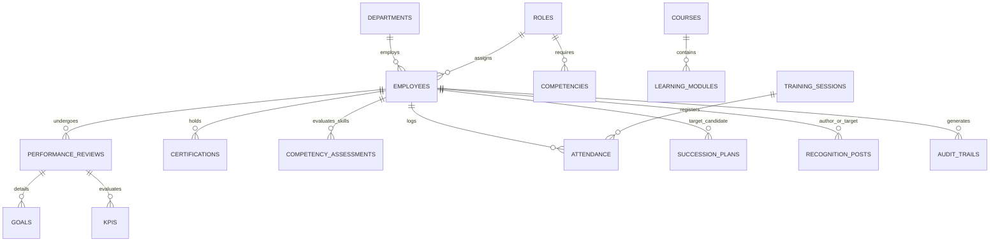

# Hospital Information Management System (HIMS)
## Performance & Development Module – Technical Specification & System Documentation

This document describes the architectural, functional, security, and data design of the **Performance & Development (P&D)** module for a modern Hospital Information Management System (HIMS). This module is tailored to meet the strict credentialing, continuing education, leadership succession, and quality-of-care demands of clinical and non-clinical staff.

---

## 1. System Overview
The **HIMS Performance & Development Module** is an enterprise-grade subsystem designed to manage, evaluate, and develop clinical (physicians, nurses, allied health professionals) and non-clinical (administrative, facilities, finance) hospital personnel. The primary objective is to align individual clinical competency with hospital quality standards, Joint Commission International (JCI) accreditation requirements, and employee development goals.

The system integrates six (6) distinct subsystems under a unified interface, controlled by robust Role-Based Access Control (RBAC) and enhanced by the **HIMS Performance AI Assistant**, a built-in Natural Language Processing (NLP) service.

```
+-------------------------------------------------------------------------------------------------+
|                                    HIMS Core Platform                                           |
+-------------------------------------------------------------------------------------------------+
                                                 |
                                                 v
+-------------------------------------------------------------------------------------------------+
|                                PERFORMANCE & DEVELOPMENT MODULE                                 |
+-------------------------------------------------------------------------------------------------+
|  +--------------------+  +--------------------+  +--------------------+  +--------------------+ |
|  |    Performance     |  |     Competency     |  |      Learning      |  |      Training      | |
|  |     Management     |  |     Management     |  |     Management     |  |     Management     | |
|  +--------------------+  +--------------------+  +--------------------+  +--------------------+ |
|  |     Succession     |  |       Social       |  |      HIMS NLP      |  |    Audit Trails    | |
|  |      Planning      |  |    Recognition     |  |    AI Assistant    |  |     & Security     | |
|  +--------------------+  +--------------------+  +--------------------+  +--------------------+ |
+-------------------------------------------------------------------------------------------------+
```

---

## 2. Functional Requirements
The system supports the following functional requirements:
- **Evaluations & Goals**: Periodic reviews (monthly, quarterly, annual), supervisor forms, self-assessments, peer reviews, Goal Tracking, and Performance Improvement Plans (PIPs).
- **Competency & Credentialing**: Custom clinical/technical/administrative competency frameworks, competency assessments, gap analysis, skills matrices, and active monitoring of clinical licenses/certifications with automated alerts.
- **Learning & Compliance**: Custom hospital courses, e-learning enrollment, mandatory compliance tracking (e.g., Infection Control, Basic Life Support), CPD points calculation, and automatically generated quizzes.
- **Training Logistics**: Attendance tracking, calendar visualization, venue/resource conflict checks, pre- and post-tests, and trainee feedback analysis.
- **Leadership Pipelines**: Succession mapping using a Performance-Potential 9-Box Grid, critical roles identification, risk tracking (e.g., loss of key specialists), and leadership development pathways.
- **Social Recognition**: Public recognition wall, peer-to-peer appreciation badges (e.g., Compassion, Patient Care, Reliability), and recognition highlights.
- **AI Automation**: Text summarization, sentiment analysis, clinical skill extraction, automatic quiz generation, and natural language query execution in English, Tagalog, and Taglish.

---

## 3. User Roles and Permissions
To ensure compliance with data privacy regulations (e.g., HIPAA, Philippine Data Privacy Act of 2012), permissions are enforced via Role-Based Access Control (RBAC):

| Role | Description | Performance Access | Competency Access | Learning & Training | Succession Access | Social Recognition |
| :--- | :--- | :--- | :--- | :--- | :--- | :--- |
| **Hospital Admin** | Senior leadership / Executive Director | Read-only aggregate dashboard, reports. | Read-only aggregate charts. | View status. | Full read. Review approvals. | Read feed, give awards. |
| **HR Admin** | Full access to employee records | Full CRUD (All reviews, PIPs, setups). | Manage framework, audits. | Course builder, reports. | Full succession setup, pools. | Moderate recognition, post. |
| **Dept Head** | Clinical/non-clinical department chiefs | Read/Write dept staff, approve reviews. | View skills matrix, identify gaps. | Recommend courses, track. | Identify successors, risk review. | Write recognition, view. |
| **Supervisor** | Ward Head Nurses, Unit Supervisors | Write direct reports evaluations, goals. | Conduct competency audits. | Assign/approve registrations. | Input readiness scores. | Write recognition, view. |
| **Training Officer** | Education & training department staff | Read performance aggregated scores. | Add competencies, view skills. | Complete CRUD for courses/calendar. | View leadership development. | Read, write. |
| **Employee** | Nurses, Doctors, Staff | Self-assessment, view own goals/history. | View own competencies & gaps. | Enroll, take quizzes, CPD track. | View own career path / goals. | Write recognition, view feed. |

---

## 4. Module-by-Module Features

### A. Performance Management
*   **Role-Specific KPI Library**: Differentiates between Clinical KPIs (e.g., *Medication Error Rate*, *Patient Satisfaction Rating*, *Documentation Accuracy*) and Non-Clinical KPIs (e.g., *Billing Error Ratio*, *Facilities Ticket Response Time*).
*   **Structured Reviews**: Self-evaluations, supervisor rating grids, and peer reviews using 1–5 scales and text justifications.
*   **Reminders**: Chron-triggered triggers notifying employees of upcoming reviews and warning managers of overdue appraisals.
*   **Performance Improvement Plans (PIPs)**: Automated generation of corrective action steps for employees scoring under `2.5 / 5.0` over consecutive review periods.

### B. Competency Management
*   **JCI Accreditation Mapping**: Maps compliance guidelines directly to required skills.
*   **Credential Monitoring**: Displays real-time statuses for clinical licenses (e.g., PRC license, board certs, BLS, ACLS) with warning states (Active, Expiring in 30 Days, Expired).
*   **Department Skills Matrix**: Heatmaps showing competency coverage per ward, allowing managers to see if a ward lacks critical skills (e.g., ventilators operations).
*   **Gap Analysis Engine**: Computes the difference between Role Required Proficiency and Staff Current Evaluated Proficiency.

### C. Learning Management
*   **Hospital Course Catalog**: Self-paced e-learning modules covering compliance, clinical workflows, and soft skills.
*   **CPD (Continuing Professional Development) Tracker**: Accumulates hours required for professional license renewals.
*   **Interactive Assessments**: Quizzes built into modules to verify comprehension before issuing certificates.
*   **Pathways**: Multi-course curriculums (e.g., "Critical Care Nurse Pathway" including Ventilator Care, Advanced Life Support, and ICU Infusion Protocols).

### D. Training Management
*   **Visual Calendar**: Interactive calendar tracking active and upcoming instructor-led workshops (e.g., Infection Control Seminar).
*   **Logistics & Resource Allocation**: Assigns classrooms, simulators, or meeting halls while checking for schedule conflicts.
*   **Evaluation Forms**: Post-training attendee feedback survey containing structured ratings and open comments.
*   **Pre-test/Post-test Analytics**: Automatically measures knowledge gains by calculating the delta between initial and final test scores.

### E. Succession Planning
*   **Critical Role Registry**: Flagging key medical positions (e.g., Chief of Surgery, ICU Head Nurse) that present high operational risk if vacant.
*   **9-Box Grid Placement**: Maps candidates to a grid of "Performance (X-axis)" vs. "Potential (Y-axis)" (e.g., Star Talent, Solid Performer, High Potential).
*   **Readiness Scale**: Categorizes successors as "Ready Immediately," "Ready in 1-2 Years," or "Ready in 3+ Years."
*   **Replacement Charts**: Visual organizational backups representing immediate backups for crucial clinical functions.

### F. Social Recognition
*   **Activity Wall**: Social-media style board showcasing peer/manager appreciation posts.
*   **Core Hospital Value Badges**:
    *   *Compassion (Kalinga)*: For exemplary patient bedside manner.
    *   *Teamwork (Bayanihan)*: For helping colleagues in understaffed shifts.
    *   *Innovation (Diskarte)*: For solving emergency bottlenecks.
    *   *Clinical Excellence*: For zero-error documentation or procedures.
*   **Leaderboard**: Highlights most recognized departments and staff monthly.

---

## 5. NLP AI Features (HIMS Performance AI)
The integrated AI assistant provides specialized natural language engines:

1.  **Sentiment and Biased Language Auditing**: Evaluates written supervisor assessments to flag subjective or non-professional language (e.g., "She is sometimes emotional" -> flagged as *Subjective/Biased Language*).
2.  **Competency Extraction**: Parses raw resume text, certifications, or performance feedback logs to isolate skill tags (e.g., "Managed 10 patient ventilators" -> Extracts: *Mechanical Ventilator Management*).
3.  **Automatic Quiz Generator**: Processes raw training text/handouts and creates multiple-choice question objects.
4.  **Taglish & Bilingual Support**: Interprets combined English and Tagalog expressions (e.g., "Patingin ng training feedback ng ICU nurses last week") and translates them into database query parameters.
5.  **Summarization & Action Engine**: Automatically compiles multi-month review files into bullet points detailing strengths, weaknesses, and direct action plans.

---

## 6. Database Schema
A normalized relational schema is utilized. Below are the key tables and data structures:



### Table Definitions

#### `EMPLOYEES`
Stores general hospital employee records.
*   `employee_id` (UUID, Primary Key)
*   `first_name` (VARCHAR)
*   `last_name` (VARCHAR)
*   `email` (VARCHAR, Unique)
*   `department_id` (UUID, Foreign Key)
*   `role_id` (UUID, Foreign Key)
*   `position_title` (VARCHAR) - e.g., "Senior ICU Nurse"
*   `status` (VARCHAR) - e.g., "Active", "On Leave"
*   `hire_date` (DATE)
*   `prc_license_number` (VARCHAR, Nullable)
*   `prc_license_expiry` (DATE, Nullable)

#### `DEPARTMENTS`
*   `department_id` (UUID, Primary Key)
*   `name` (VARCHAR) - e.g., "Pediatrics", "Internal Medicine", "Nursing"
*   `head_employee_id` (UUID, Foreign Key, Nullable)

#### `PERFORMANCE_REVIEWS`
*   `review_id` (UUID, Primary Key)
*   `employee_id` (UUID, Foreign Key)
*   `reviewer_id` (UUID, Foreign Key)
*   `review_cycle` (VARCHAR) - e.g., "Q1 2026", "Annual 2025"
*   `status` (VARCHAR) - e.g., "Draft", "Pending Approval", "Approved"
*   `self_rating` (NUMERIC)
*   `supervisor_rating` (NUMERIC)
*   `peer_rating` (NUMERIC)
*   `overall_score` (NUMERIC)
*   `strengths_text` (TEXT)
*   `improvements_text` (TEXT)
*   `ai_summarized_insights` (TEXT, Nullable)
*   `created_at` (TIMESTAMP)

#### `COMPETENCIES`
*   `competency_id` (UUID, Primary Key)
*   `name` (VARCHAR) - e.g., "Intravenous Therapy", "ACLS", "HIPAA Compliance"
*   `category` (VARCHAR) - e.g., "Clinical", "Administrative", "Technical"
*   `required_proficiency` (INTEGER) - Scale 1-5

#### `COMPETENCY_ASSESSMENTS`
*   `assessment_id` (UUID, Primary Key)
*   `employee_id` (UUID, Foreign Key)
*   `competency_id` (UUID, Foreign Key)
*   `assessed_by` (UUID, Foreign Key)
*   `current_proficiency` (INTEGER)
*   `gap` (INTEGER) - Calculated as `current_proficiency - required_proficiency`
*   `last_assessed_date` (DATE)

#### `SUCCESSION_PLANS`
*   `plan_id` (UUID, Primary Key)
*   `target_position` (VARCHAR)
*   `critical_role_flag` (BOOLEAN)
*   `current_holder_id` (UUID, Foreign Key)
*   `successor_id` (UUID, Foreign Key)
*   `readiness_level` (VARCHAR) - e.g., "Ready Now", "1-2 Years", "3+ Years"
*   `potential_score` (INTEGER) - 1-3 (Low, Med, High)
*   `performance_score` (INTEGER) - 1-3 (Low, Med, High)
*   `risk_of_vacancy` (VARCHAR) - e.g., "High", "Medium", "Low"
*   `status` (VARCHAR) - e.g., "Proposed", "HR Reviewed", "Approved"

---

## 7. Sample Workflows

### Performance Review Approval Workflow
1.  **Initiation**: HR triggers the Q3 review cycle. The system auto-populates KPIs for the nurse's role.
2.  **Self & Peer Reviews**: The Nurse completes a Self-Assessment. Concurrently, selected peer nurses fill out Peer Forms.
3.  **Supervisor Appraisal**: The Nurse Ward Supervisor fills out the main assessment sheet.
4.  **AI Auditing & Insights**:
    *   The Supervisor hits "Check Review with AI".
    *   The system scans comments, lists strengths/weaknesses, flags vague statements ("she is doing ok" -> suggested replacement: "demonstrates high drug dispensing accuracy"), and assigns a feedback sentiment index.
5.  **Submission**: Supervisor submits the review. The workflow status updates to `Pending Dept Head Approval`.
6.  **Approval/Sign-off**: The Director of Nursing reviews, signs digitally, and releases it to the employee's dossier.

```
[Employee Self-Review] --+
                         v
[Supervisor Review] ---------> [AI Language/Bias Scan] ---> [Submit Review] ---> [Dept Head Sign-off] ---> [Dossier Archive]
                         ^
[Peer-Evaluations] ------+
```

---

## 8. Sample Dashboard Layouts

### HR Admin Dashboard Layout
```
+------------------------------------------------------------------------------------------------------+
|  HIMS Performance & Development | HR View                                      [ Notifications ] [Role] |
+------------------------------------------------------------------------------------------------------+
|  [Dashboard] [Performance] [Competency] [Learning] [Training] [Succession] [Social]                  |
+------------------------------------------------------------------------------------------------------+
|  CORE STATS:                                                                                         |
|  +--------------------+  +--------------------+  +--------------------+  +--------------------+      |
|  | Pending Reviews    |  | Expiring Licenses  |  | Training Attendance|  | Succession Risks   |      |
|  | 24 Pending         |  | 12 Critical        |  | 92.4% Avg          |  | 3 Roles at Risk    |      |
|  +--------------------+  +--------------------+  +--------------------+  +--------------------+      |
|                                                                                                      |
|  MAIN INSIGHTS BOARD                                   AI GENERATED NOTIFICATIONS                    |
|  +--------------------------------------------------+  +-------------------------------------------+ |
|  |  Department Performance Distribution              |  | * ICU Nurse competency gaps detected.     | |
|  |  [Nursing: 4.2] [Emergency: 4.1] [Pediatrics: 3.8]|  | * 3 licenses expire within 30 days.       | |
|  |  [Admin: 3.9] [Radiology: 4.4]                    |  | * Recommended: Infection Control Part II  | |
|  +--------------------------------------------------+  +-------------------------------------------+ |
+------------------------------------------------------------------------------------------------------+
```

---

## 9. Sample Forms

### Performance Self-Assessment Form
*   **Employee**: Maria Santos, RN
*   **Cycle**: Annual Review 2026
*   **KPI Self-Ratings (1-5)**:
    *   Clinical Care Compliance: [4]
    *   Documentation Accuracy: [5]
    *   Patient Communication: [3]
*   **Open Comment (Bedside Care)**:
    *   *Input*: "Inaalagaan ko naman ang mga pasyente ko nang mabuti, minsan lang nagmamadali gawa ng understaffing sa ward."
    *   *AI Cleaned Comment Suggestion*: "Consistently maintains high standards of nursing care and JCI documentation, though experiencing workload pressure due to high patient-to-staff ratios in the critical ward."

---

## 10. Sample Reports

### Clinical Skills Gap Analysis Report
*   **Department**: Critical Care Unit (ICU)
*   **Generated**: 2026-07-06

| Competency Name | Code | Target Score | Current Avg | Gap | Primary Actions Suggested by AI |
| :--- | :--- | :---: | :---: | :---: | :--- |
| **Advanced Vent Support** | COMP-ICU-009 | 5 | 3.4 | **-1.6** | Schedule Simulator Workshop with Dr. Lim |
| **ACLS Certification** | COMP-GEN-002 | 5 | 4.8 | -0.2 | Renew 2 pending certifications |
| **JCI Sterile Techniques** | COMP-INF-001 | 4 | 3.9 | -0.1 | Assign compliance module refresher |

---

## 11. API Endpoints

### 1. Performance APIs
*   `GET /api/v1/performance/reviews?dept_id={id}`: Retrieves review summaries for a department.
*   `POST /api/v1/performance/reviews`: Creates a review draft.
*   `POST /api/v1/performance/reviews/{id}/ai-audit`: Scans text logs for bias and returns structural text enhancements.

### 2. Competency APIs
*   `GET /api/v1/competency/gap-matrix/{dept_id}`: Compiles JCI competency levels for department staff.
*   `POST /api/v1/competency/licenses/audit`: Audits professional regulatory license files.

### 3. AI Assistant Gateway
*   `POST /api/v1/ai/nlp-command`: Enters structured or bilingual commands.
    *   *Body*: `{ "role": "HR", "query": "Sino ang successor para sa Head Nurse?" }`
    *   *Response*: `{ "success": true, "matches": [...], "ai_summary": "Batay sa succession data, si Nurse Clara de Leon ang nangungunang successor..." }`

---

## 12. Security and Compliance Requirements
1.  **HIPAA & Privacy Isolation**: No patient-identifiable data (PHI) is ingested or mapped within the P&D module. All employee medical history is kept in separate secure records.
2.  **Role Separation**: Department heads cannot view salary-based succession ratings of other departments. Employees cannot view succession replacement planning or peer review notes before approval.
3.  **Encrypted Vaulting**: Personal identifiers, PRC license numbers, and performance ratings are encrypted at-rest using AES-256 and in-transit via TLS 1.3.
4.  **Audit Trail Enforcement**: Every transaction generates an immutable database entry:
    *   `audit_log_id` (UUID), `timestamp`, `user_id`, `action`, `resource_table`, `ip_address`, `before_state_hash`, `after_state_hash`.

---

## 13. Implementation Plan
```
Phase 1: Database Setup & Migration (Weeks 1-2)
  - Deploy PostgreSQL schema & initial role definitions.
  - Load employee directories and clinical competency lists.

Phase 2: Subsystem Development (Weeks 3-8)
  - Build Performance and Competency frameworks (Weeks 3-4)
  - Learning and Training calendars (Weeks 5-6)
  - Succession lists and Recognition wall (Weeks 7-8)

Phase 3: NLP AI Integration (Weeks 9-10)
  - Integrate AI engine, train classifiers for bias, load NLP vocabularies.

Phase 4: UAT & Compliance Review (Weeks 11-12)
  - Conduct JCI simulation audits, penetration tests, and deployment verification.
```

---

## 14. Suggested Technology Stack
*   **Frontend**: Single Page Application with React or Vue (or clean HTML5/Vanilla JS for high-speed local renderers), Tailwind CSS, Chart.js for data analytics.
*   **Backend**: Node.js (NestJS framework) or Python (FastAPI/Django) for robust API structuring.
*   **Database**: PostgreSQL (relational core) and Redis (caching dashboards and real-time alerts).
*   **AI/NLP Core**: Python-based Hugging Face Transformers, spaCy (for bilingual Tagalog/English parser), or OpenAI GPT-4 API endpoint integrated into a secure enterprise VPC.
