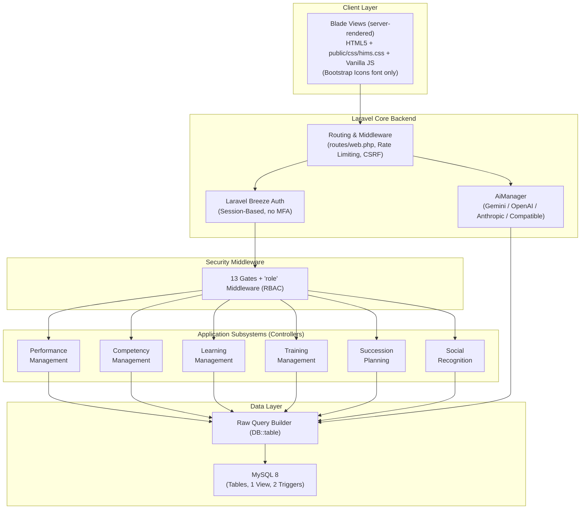
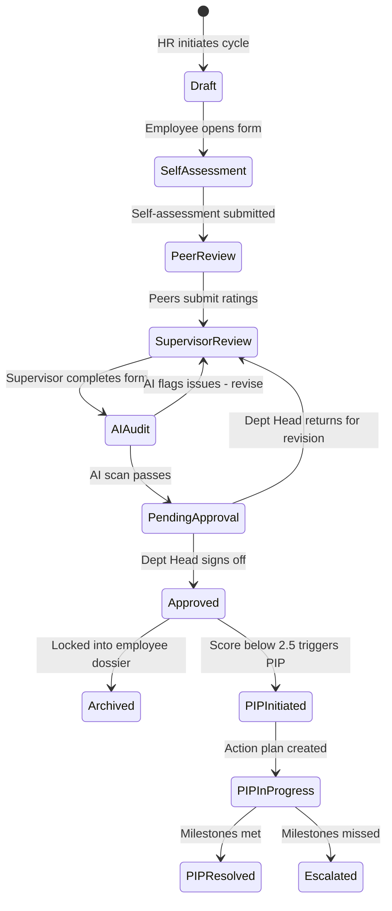
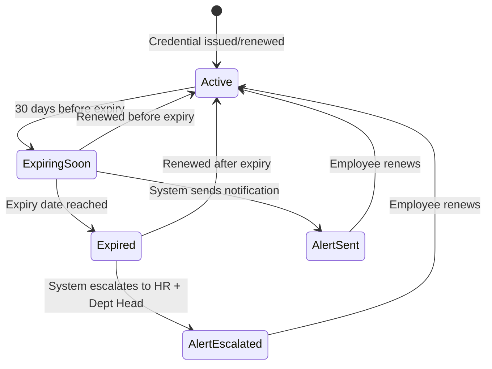
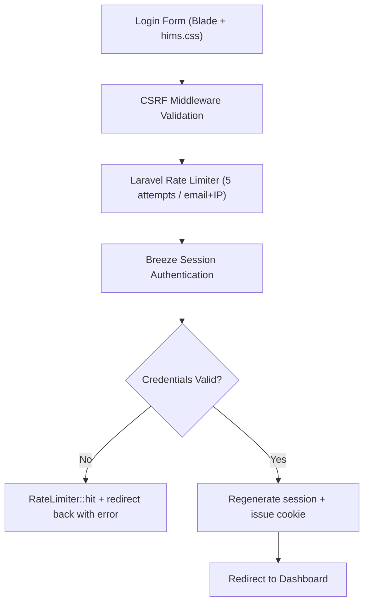

# Hospital Information Management System (HIMS)
## Performance & Development Module – Technical Specification & System Documentation

This document describes the architectural, functional, security, and data design of the **Performance & Development (P&D)** module for a modern Hospital Information Management System (HIMS). This module is tailored to meet the strict credentialing, continuing education, leadership succession, and quality-of-care demands of clinical and non-clinical staff.

---

## 1. System Overview

The **HIMS Performance & Development Module** is an enterprise-grade subsystem designed to manage, evaluate, and develop clinical (physicians, nurses, allied health professionals) and non-clinical (administrative, facilities, finance) hospital personnel. The primary objective is to align individual clinical competency with hospital quality standards, Joint Commission International (JCI) accreditation requirements, and employee development goals.

The system integrates six (6) distinct subsystems under a unified interface, controlled by Laravel session-based authentication (Laravel Breeze) and enhanced by the **HIMS Performance AI Assistant**, which runs on a **provider-agnostic AI layer** (Gemini by default; OpenAI, Anthropic, or any OpenAI-compatible host selectable via one env var).

> **Status of this document — AS-BUILT, with roadmap items flagged.**
> Revised against the source in `hims-app/`. Sections describing features that are **specified but not
> implemented** are marked **📋 Planned** and, where a database table exists with no code behind it, called out as
> *schema-only*. Everything not so marked has been verified present in code.
> For the authoritative stack/security breakdown see `HIMS_ARCHITECTURE_AND_SECURITY.md`.

### 1.1 High-Level Architecture (as-built)



**Deliberate divergences from the original design** (detail in `HIMS_ARCHITECTURE_AND_SECURITY.md`):

| Original design | As-built |
|---|---|
| Bootstrap 5 CSS framework | Hand-authored `public/css/hims.css` (742 lines); Bootstrap **Icons** font only |
| Eloquent Models & Observers | Raw `DB::table()` Query Builder; `App\Models\User` is the only model |
| Policies + `permissions` tables | 13 Gates + `EnsureUserHasRole` middleware; permission tables are schema-only |
| Redis cache / queue | `CACHE_STORE=database`, `SESSION_DRIVER=file`, `QUEUE_CONNECTION=database`; no caching at all |
| Google Gemini only | Provider-agnostic `AiProvider` contract; 4 selectable providers |
| `/api/v1/...` REST API | Server-rendered web routes only; no `api.php` |
| Six roles | Four roles: `admin` \| `hr_manager` \| `supervisor` \| `staff` |
| MFA · field encryption · audit trail | **📋 Planned** — not implemented |

### 1.2 Subsystems Layout

```
+-------------------------------------------------------------------------------------------------+
|                                    HIMS Core Platform                                           |
+-------------------------------------------------------------------------------------------------+
                                                 |
                                                 v
+-------------------------------------------------------------------------------------------------+
|                                PERFORMANCE & DEVELOPMENT MODULE                                 |
+-------------------------------------------------------------------------------------------------+
|  +--------------------+  +--------------------+  +--------------------+  +--------------------+ |
|  |    Performance     |  |     Competency     |  |      Learning      |  |      Training      | |
|  |     Management     |  |     Management     |  |     Management     |  |     Management     | |
|  +--------------------+  +--------------------+  +--------------------+  +--------------------+ |
|  |     Succession     |  |       Social       |  |  Multi-Provider    |  |  Gates + role MW   | |
|  |      Planning      |  |    Recognition     |  |   AI Assistant     |  |     (Security)     | |
|  +--------------------+  +--------------------+  +--------------------+  +--------------------+ |
+-------------------------------------------------------------------------------------------------+
```

Seven live modules (the six above plus Employees/Departments/Users administration). Audit logging is **📋 not
implemented** — see §7.4.

---

## 2. Functional Requirements

The system supports the following functional requirements:
- **Evaluations & Goals**: Periodic reviews (monthly, quarterly, annual), supervisor forms, self-assessments, peer reviews, Goal Tracking, and Performance Improvement Plans (PIPs).
- **Competency & Credentialing**: Custom clinical/technical/administrative competency frameworks, competency assessments, gap analysis, skills matrices, and active monitoring of clinical licenses/certifications with automated alerts.
- **Learning & Compliance**: Custom hospital courses, e-learning enrollment, mandatory compliance tracking (e.g., Infection Control, Basic Life Support), CPD points calculation, and automatically generated quizzes.
- **Training Logistics**: Attendance tracking, calendar visualization, resources mapping, and trainee feedback analysis.
- **Leadership Pipelines**: Succession mapping using a Performance-Potential 9-Box Grid, critical roles identification, risk tracking (e.g., loss of key specialists), and leadership development pathways.
- **Social Recognition**: Public recognition wall, peer-to-peer appreciation badges (e.g., Compassion, Patient Care, Reliability), and recognition highlights.
- **AI Automation**: Provider-agnostic AI integration (Gemini default; OpenAI / Anthropic / OpenAI-compatible selectable) for the in-app assistant and competency gap-analysis narratives. Bias auditing, quiz generation, and sentiment helpers exist in `AbstractAiProvider` but are **📋 not yet wired to UI actions**.
- **Integrations**: Zapier webhooks — **📋 Planned.** `ZapierService` is written with five event helpers but is never called, and all webhook URLs are blank.

---

## 3. User Roles and Permissions

Permissions are enforced via **13 Laravel Gates** (`AppServiceProvider::registerGates()`) plus the
`EnsureUserHasRole` middleware (aliased `role`) applied per-route in `routes/web.php`. There are **no Policy
classes**, and the `permissions` / `role_permissions` tables are schema-only.

The implementation uses **four** roles stored in `users.role`, not the six originally specified. The original
six-role model is retained below for reference as a future refinement.

### 3.1 Implemented roles (`users.role`)

| Role | Maps to | Employees | Performance | Competency | Learning & Training | Succession | Recognition | Users/Depts |
| :--- | :--- | :--- | :--- | :--- | :--- | :--- | :--- | :--- |
| **`admin`** | Hospital Admin + system owner | Full CRUD | Full CRUD + cycles | Full + domains | Full authoring | Full | Post + badges | Full (users + depts) |
| **`hr_manager`** | HR Admin + Training Officer | Full CRUD | Full CRUD + cycles | Full + domains | Full authoring | Full | Post + badges | Departments only |
| **`supervisor`** | Dept Head + Supervisor | Read | Create/score reviews | Assess + credentials | Create sessions | Read + candidate scores | Post | — |
| **`staff`** | Employee | — | Read own | Read own | Enroll / register | **No access** | Post + react + comment | — |

**Gates defined:** `manage-users`, `manage-departments`, `manage-employees`, `view-employees`,
`manage-performance`, `manage-review-cycles`, `manage-competency`, `manage-learning`, `manage-training`,
`manage-succession`, `view-succession`, `view-org-analytics`, `run-gap-analysis`.

The same Gates drive both the `@can` checks that show/hide sidebar navigation and the route middleware that
enforces access, so the menu and the guard cannot drift apart.

### 3.2 📋 Planned six-role model (not implemented)

Retained as the design target. Adopting it requires migrating `users.role`, expanding the Gate definitions, and
splitting the currently-merged responsibilities (`hr_manager` presently covers both HR Admin and Training
Officer; `supervisor` covers both Dept Head and Supervisor).

| Role | Description | Performance Access | Competency Access | Learning & Training | Succession Access | Social Recognition |
| :--- | :--- | :--- | :--- | :--- | :--- | :--- |
| **Hospital Admin** | Senior leadership / Executive Director | Read-only aggregate dashboard, reports. | Read-only aggregate charts. | View status. | Full read. Review approvals. | Read feed, give awards. |
| **HR Admin** | Full access to employee records | Full CRUD (All reviews, PIPs, setups). | Manage framework, audits. | Course builder, reports. | Full succession setup, pools. | Moderate recognition, post. |
| **Dept Head** | Clinical/non-clinical department chiefs | Read/Write dept staff, approve reviews. | View skills matrix, identify gaps. | Recommend courses, track. | Identify successors, risk review. | Write recognition, view. |
| **Supervisor** | Ward Head Nurses, Unit Supervisors | Write direct reports evaluations, goals. | Conduct competency audits. | Assign/approve registrations. | Input readiness scores. | Write recognition, view. |
| **Training Officer** | Education & training department staff | Read performance aggregated scores. | Add competencies, view skills. | Complete CRUD for courses/calendar. | View leadership development. | Read, write. |
| **Employee** | Nurses, Doctors, Staff | Self-assessment, view own goals/history. | View own competencies & gaps. | Enroll, take quizzes, CPD track. | View own career path / goals. | Write recognition, view feed. |

---

## 4. Module-by-Module Features & Workflows

### A. Performance Management

*   **Role-Specific KPI Library**: Differentiates between Clinical KPIs (e.g., *Medication Error Rate*, *Patient Satisfaction Rating*, *Documentation Accuracy*) and Non-Clinical KPIs (e.g., *Billing Error Ratio*, *Facilities Ticket Response Time*).
*   **Structured Reviews**: Self-evaluations, supervisor rating grids, and peer reviews using 1–5 scales and text justifications.
*   **Reminders**: Cron-triggered Laravel notifications alerting employees of upcoming reviews and warning managers of overdue appraisals.
*   **Performance Improvement Plans (PIPs)**: Automated generation of corrective action steps for employees scoring under `2.5 / 5.0` over consecutive review periods.

#### Performance Review Workflow State Machine



### B. Competency Management

*   **JCI Accreditation Mapping**: Maps compliance guidelines directly to required skills (SQE.3, SQE.4, SQE.5 standards).
*   **Credential Monitoring**: Displays real-time statuses for clinical licenses (e.g., PRC license, board certs, BLS, ACLS) with traffic-light warning states:
    *   🟢 **Active** — Valid and current
    *   🟡 **Expiring in 30 Days** — Renewal reminder triggered
    *   🔴 **Expired** — Escalation alert to HR and department head
*   **Department Skills Matrix**: Heatmaps showing competency coverage per ward, allowing managers to see if a ward lacks critical skills (e.g., ventilators operations).
*   **Gap Analysis Engine**: Computes `Gap = Current Proficiency − Required Proficiency` per employee per competency.

#### Credential Monitoring Workflow



### C. Learning Management

*   **Hospital Course Catalog**: Self-paced e-learning modules built using Bootstrap layout grids, categorized by compliance, clinical, and soft-skills.
*   **CPD (Continuing Professional Development) Tracker**: Accumulates hours required for professional license renewals.
*   **Interactive Assessments**: Quizzes built into modules with pass thresholds and retake limits.
*   **Learning Pathways**: Multi-course curriculums (e.g., "Critical Care Nurse Pathway") with prerequisite chains.
*   **Certificates**: Auto-generated completion certificates with QR verification codes.

### D. Training Management

*   **Visual Calendar**: Interactive calendar tracking active and upcoming instructor-led workshops (e.g., Infection Control Seminar).
*   **Logistics & Resource Allocation**: Assigns classrooms or simulator rooms while checking for schedule conflicts.
*   **Attendance Tracking**: QR code check-in with manual override; tracks no-shows and late arrivals.
*   **Evaluation Forms**: Post-training feedback surveys analyzed via Google Gemini for sentiment score and common recommendations.
*   **Pre-test/Post-test Analytics**: Automatically measures knowledge gains: `Δ Knowledge = Post-test Score − Pre-test Score`.

### E. Succession Planning

*   **Critical Role Registry**: Flagging key medical positions (e.g., Chief of Surgery, ICU Head Nurse) that present high operational risk if vacant.
*   **9-Box Grid Placement**: Maps candidates on Performance vs. Potential. Scores are **1–5** on each axis (not 1–3), banded low (1–2) / med (3) / high (4–5) to give the nine cells:
    | | Low Potential (1–2) | Medium Potential (3) | High Potential (4–5) |
    |---|---|---|---|
    | **High Performance (4–5)** | Solid Performer | High Performer | ⭐ Star Talent |
    | **Medium Performance (3)** | Average Performer | Core Contributor | High Potential |
    | **Low Performance (1–2)** | Underperformer | Inconsistent | Rough Diamond |

    The label is **derived server-side on every write** and never accepted from the form, so it cannot contradict the scores. The nomination form shows a live preview of the resulting placement as scores are entered.
*   **Readiness Scale**: Categorises successors as "Ready Now," "Ready in 1–2 Years," "Ready in 2–5 Years," or "Long Term."
*   **Candidate Pipeline**: A single table of everyone nominated across all critical positions — candidate, target role, 9-box placement, readiness, development progress, and status. Filterable by position.
*   **Leadership Development Paths**: Per-candidate milestones (course, assignment, mentoring, rotation, certification, project) with target dates. Each advances `not started → in progress → completed`; the completion date is stamped automatically and cleared if the milestone moves back. Completion drives the pipeline's Dev Progress percentage.
*   **Nomination Management**: Scores, readiness, and mentor can be revised after nomination (stamping `reviewed_at`); a candidate can be withdrawn, which also removes their milestones.
*   **Replacement Charts**: Visual organisational backups representing immediate backups for crucial clinical functions. **📋 Not implemented.**
*   **📋 Approval workflow not implemented**: `status`, `reviewed_at`, and `approved_at` exist in the data, but nothing transitions a candidate from `proposed` to `approved`.
*   **Risk Dashboard**: Vacancy risk scoring based on holder's age, tenure, market scarcity, and successor readiness.

### F. Social Recognition

*   **Activity Wall**: Social-media style board showcasing peer/manager appreciation posts with reactions and comments.
*   **Core Hospital Value Badges**:
    *   *Compassion (Kalinga)*: For exemplary patient bedside manner.
    *   *Teamwork (Bayanihan)*: For helping colleagues in understaffed shifts.
    *   *Innovation (Diskarte)*: For solving emergency bottlenecks.
    *   *Clinical Excellence*: For zero-error documentation or procedures.
*   **Leaderboard**: Highlights most recognized departments and staff monthly.
*   **Integration**: Zapier webhooks trigger when a user receives a new badge, pushing messages to Slack or external dashboards.

---

## 5. Third-Party API Integrations

The P&D module leverages core APIs to extend functionality:

### 5.1 AI Provider Layer (implemented)

The original Gemini-only design has been **replaced by a provider-agnostic layer**. Application code depends on
the `App\Contracts\AiProvider` interface (one method: `ask(string): string`); `AiManager` resolves the concrete
driver from `config('services.ai')` at runtime.

| Setting | Value |
|---|---|
| **Selector** | `AI_PROVIDER` = `gemini` \| `openai` \| `anthropic` \| `compatible` |
| **Default** | `gemini` — an existing `GEMINI_API_KEY` keeps working with no other change |
| **Drivers** | `GeminiProvider` · `OpenAiProvider` · `AnthropicProvider` · `compatible` (reuses `OpenAiProvider` with a custom label + `base_url` for Groq / DeepSeek / xAI / Mistral / Together / OpenRouter / Ollama) |
| **Transport** | Raw `Http::` calls — no vendor SDKs |
| **Model fallback** | Per-provider `*_MODEL` plus a `fallback_models` list; a 404/model error advances to the next candidate |
| **Failure contract** | `ask()` **never throws** on an API or config error — it returns a `⚠️`-prefixed string that callers detect and degrade on |

**Live AI features:**
*   **In-app assistant** (`AiController` → `POST /ai/query`): conversational queries in English/Tagalog/Taglish, with per-user history persisted to `ai_chat_messages` (`GET`/`DELETE /ai/history`).
*   **Competency gap-analysis narratives** (`CompetencyGapAnalysisService`): AI-generated summaries and development recommendations over assessment data, surfaced by `GapAnalysisController`.

**📋 Planned AI features** — helper methods exist on `AbstractAiProvider` (`checkBias()`, `generateQuizQuestions()`, `analyzeSentiment()`) but no controller or UI action calls them yet:
*   **Evaluations Bias Audit**: analyse supervisor evaluations for subjective comments and suggest JCI-compliant phrasing.
*   **Auto Quiz Generation**: produce JSON multiple-choice questions for LMS assessments. Blocked additionally by the LMS quiz tables being schema-only.
*   **Training Feedback Sentiment**: populate `training_feedback.ai_sentiment_score` / `ai_sentiment_label`.

### 5.2 Zapier — 📋 Planned (dormant)

`App\Services\ZapierService` is fully written — a generic `dispatch()` plus `onReviewApproved`,
`onCredentialExpired`, `onPipInitiated`, `onTrainingRegistration`, and `onCertificateIssued` — but **no
controller, event, listener, or job ever calls it**, and all five `ZAPIER_WEBHOOK_*` URLs are empty. Even if
invoked, `dispatch()` short-circuits on its empty-URL guard and returns `false`. Activating it requires wiring
call sites into the relevant controllers *and* populating the webhook URLs.

---

## 6. Database Schema (MySQL 8.0+)

The relational schema is configured for **MySQL 8**. All domain primary and foreign keys use UUIDs represented as `CHAR(36)`. Arrays are represented as `JSON` columns.

> **Implementation notes.**
> *   UUIDs are generated **in PHP** via `Str::uuid()` at insert time — MySQL generates nothing. An insert that omits the PK will fail. `created_at` / `updated_at` must likewise be set explicitly, since raw Query Builder has no timestamp magic.
> *   Access is via **raw `DB::table()` Query Builder** throughout — there are no Eloquent models, relationships, or eager loading for these tables. Joins are written by hand in the controllers.
> *   **13 of the tables below are schema-only** (migrated, never referenced by code). Each is flagged 💀 in §15, and the affected features are listed there. Read the schema as the intended data model, not as proof a feature exists.

### 6.1 Entity-Relationship Diagram

```mermaid
erDiagram
    DEPARTMENTS ||--o{ EMPLOYEES : employs
    DEPARTMENTS ||--o{ ROLES : defines
    DEPARTMENTS ||--o{ CRITICAL_POSITIONS : contains
    ROLES ||--o{ EMPLOYEES : assigns
    ROLES ||--o{ ROLE_COMPETENCY_REQUIREMENTS : requires

    EMPLOYEES ||--o{ SYSTEM_USERS : authenticates_as
    EMPLOYEES ||--o{ PERFORMANCE_REVIEWS : undergoes
    EMPLOYEES ||--o{ PEER_REVIEWS : provides
    EMPLOYEES ||--o{ REVIEW_GOALS : tracks
    EMPLOYEES ||--o{ PERFORMANCE_IMPROVEMENT_PLANS : assigned

    EMPLOYEES ||--o{ COMPETENCY_ASSESSMENTS : evaluated_on
    EMPLOYEES ||--o{ EMPLOYEE_CREDENTIALS : holds

    EMPLOYEES ||--o{ COURSE_ENROLLMENTS : enrolls_in
    EMPLOYEES ||--o{ QUIZ_ATTEMPTS : takes
    EMPLOYEES ||--o{ CPD_RECORDS : earns
    EMPLOYEES ||--o{ CERTIFICATES : receives

    EMPLOYEES ||--o{ TRAINING_REGISTRATIONS : registers_for
    EMPLOYEES ||--o{ TRAINING_FEEDBACK : submits

    EMPLOYEES ||--o{ SUCCESSION_CANDIDATES : nominated_as
    EMPLOYEES ||--o{ LEADERSHIP_DEVELOPMENT_PATHS : follows

    EMPLOYEES ||--o{ RECOGNITION_POSTS : gives_or_receives
    EMPLOYEES ||--o{ RECOGNITION_REACTIONS : reacts
    EMPLOYEES ||--o{ RECOGNITION_COMMENTS : comments

    EMPLOYEES ||--o{ NOTIFICATIONS : receives
    EMPLOYEES ||--o{ AUDIT_TRAILS : generates

    REVIEW_CYCLES ||--o{ PERFORMANCE_REVIEWS : contains
    KPI_LIBRARY ||--o{ REVIEW_KPI_SCORES : measures
    PERFORMANCE_REVIEWS ||--o{ REVIEW_KPI_SCORES : includes
    PERFORMANCE_REVIEWS ||--o{ PEER_REVIEWS : collects
    PERFORMANCE_REVIEWS ||--o{ REVIEW_GOALS : sets

    COMPETENCY_DOMAINS ||--o{ COMPETENCY_CATEGORIES : groups
    COMPETENCY_CATEGORIES ||--o{ COMPETENCIES : contains
    COMPETENCIES ||--o{ COMPETENCY_ASSESSMENTS : assessed_via
    COMPETENCIES ||--o{ ROLE_COMPETENCY_REQUIREMENTS : required_by

    LEARNING_PATHWAYS ||--o{ PATHWAY_COURSES : sequences
    COURSES ||--o{ PATHWAY_COURSES : belongs_to
    COURSES ||--o{ COURSE_MODULES : contains
    COURSES ||--o{ COURSE_ENROLLMENTS : enrolled
    COURSES ||--o{ CERTIFICATES : certifies
    COURSE_MODULES ||--o{ QUIZ_QUESTIONS : tests
    COURSE_MODULES ||--o{ QUIZ_ATTEMPTS : attempted

    TRAINING_VENUES ||--o{ TRAINING_SESSIONS : hosts
    TRAINING_SESSIONS ||--o{ TRAINING_REGISTRATIONS : registers
    TRAINING_SESSIONS ||--o{ TRAINING_TESTS : evaluates
    TRAINING_SESSIONS ||--o{ TRAINING_FEEDBACK : reviewed
    TRAINING_TESTS ||--o{ TRAINING_TEST_RESULTS : scored

    CRITICAL_POSITIONS ||--o{ SUCCESSION_CANDIDATES : candidates
    CRITICAL_POSITIONS ||--o{ SUCCESSION_REVIEWS : reviewed
    SUCCESSION_CANDIDATES ||--o{ LEADERSHIP_DEVELOPMENT_PATHS : develops

    RECOGNITION_BADGES ||--o{ RECOGNITION_POSTS : awarded_via
    RECOGNITION_POSTS ||--o{ RECOGNITION_REACTIONS : reacted_to
    RECOGNITION_POSTS ||--o{ RECOGNITION_COMMENTS : discussed

    SYSTEM_USERS ||--o{ ROLE_PERMISSIONS : granted
    PERMISSIONS ||--o{ ROLE_PERMISSIONS : defines
```



---

### 6.2 Core / Shared Tables

```sql
-- ═══════════════════════════════════════════════════════
-- CORE / SHARED TABLES
-- ═══════════════════════════════════════════════════════

CREATE TABLE departments (
    department_id       CHAR(36) PRIMARY KEY,
    name                VARCHAR(150) NOT NULL UNIQUE,     -- "Nursing", "Surgery", "Pediatrics"
    department_code     VARCHAR(20) UNIQUE,
    head_employee_id    CHAR(36),                         -- Resolved via FK later
    parent_dept_id      CHAR(36) REFERENCES departments(department_id),
    is_clinical         BOOLEAN DEFAULT TRUE,
    created_at          TIMESTAMP DEFAULT CURRENT_TIMESTAMP
);

CREATE TABLE roles (
    role_id             CHAR(36) PRIMARY KEY,
    role_name           VARCHAR(100) NOT NULL UNIQUE,     -- "Senior ICU Nurse"
    role_slug           VARCHAR(50) NOT NULL UNIQUE,      -- "senior_icu_nurse"
    department_id       CHAR(36) REFERENCES departments(department_id),
    is_clinical         BOOLEAN DEFAULT TRUE,
    created_at          TIMESTAMP DEFAULT CURRENT_TIMESTAMP
);

CREATE TABLE employees (
    employee_id         CHAR(36) PRIMARY KEY,
    employee_code       VARCHAR(30) UNIQUE NOT NULL,      -- "EMP-001"
    first_name          VARCHAR(100) NOT NULL,
    last_name           VARCHAR(100) NOT NULL,
    email               VARCHAR(255) UNIQUE NOT NULL,
    phone               VARCHAR(100),                     -- ENCRYPTED
    department_id       CHAR(36) NOT NULL REFERENCES departments(department_id),
    role_id             CHAR(36) NOT NULL REFERENCES roles(role_id),
    position_title      VARCHAR(200),
    hire_date           DATE NOT NULL,
    employment_status   VARCHAR(20) DEFAULT 'active'
        CHECK (employment_status IN ('active','on_leave','suspended','resigned','retired')),
    supervisor_id       CHAR(36) REFERENCES employees(employee_id),
    profile_image_url   TEXT,
    created_at          TIMESTAMP DEFAULT CURRENT_TIMESTAMP,
    updated_at          TIMESTAMP DEFAULT CURRENT_TIMESTAMP ON UPDATE CURRENT_TIMESTAMP
);

-- Complete circular dependency reference for Department Head
ALTER TABLE departments ADD CONSTRAINT fk_dept_head 
    FOREIGN KEY (head_employee_id) REFERENCES employees(employee_id);

CREATE TABLE system_users (
    user_id             CHAR(36) PRIMARY KEY,
    employee_id         CHAR(36) NOT NULL UNIQUE REFERENCES employees(employee_id),
    username            VARCHAR(50) UNIQUE NOT NULL,
    password_hash       VARCHAR(255) NOT NULL,            -- Laravel Breeze default bcrypt/argon2
    access_role         VARCHAR(30) NOT NULL
        CHECK (access_role IN ('hospital_admin','hr_admin','dept_head',
                               'supervisor','training_officer','employee')),
    mfa_enabled         BOOLEAN DEFAULT FALSE,
    mfa_secret          TEXT,                             -- ENCRYPTED
    last_login          TIMESTAMP NULL DEFAULT NULL,
    failed_login_count  INT DEFAULT 0,
    account_locked      BOOLEAN DEFAULT FALSE,
    locked_until        TIMESTAMP NULL DEFAULT NULL,
    password_changed_at TIMESTAMP DEFAULT CURRENT_TIMESTAMP,
    must_change_password BOOLEAN DEFAULT FALSE,
    is_active           BOOLEAN DEFAULT TRUE,
    created_at          TIMESTAMP DEFAULT CURRENT_TIMESTAMP,
    updated_at          TIMESTAMP DEFAULT CURRENT_TIMESTAMP ON UPDATE CURRENT_TIMESTAMP
);

CREATE TABLE notifications (
    notification_id     CHAR(36) PRIMARY KEY,
    recipient_id        CHAR(36) NOT NULL REFERENCES employees(employee_id),
    notification_type   VARCHAR(50) NOT NULL,             -- 'review_due','license_expiring',...
    title               VARCHAR(300) NOT NULL,
    message             TEXT,
    reference_type      VARCHAR(50),                      -- Polymorphic reference
    reference_id        CHAR(36),
    is_read             BOOLEAN DEFAULT FALSE,
    read_at             TIMESTAMP NULL DEFAULT NULL,
    created_at          TIMESTAMP DEFAULT CURRENT_TIMESTAMP
);

CREATE INDEX idx_notifications_recipient ON notifications(recipient_id, is_read, created_at DESC);
```

---

### 6.3 Performance Management Tables

```sql
-- ═══════════════════════════════════════════════════════
-- PERFORMANCE MANAGEMENT TABLES
-- ═══════════════════════════════════════════════════════

CREATE TABLE review_cycles (
    cycle_id            CHAR(36) PRIMARY KEY,
    cycle_name          VARCHAR(100) NOT NULL,
    cycle_type          VARCHAR(20) NOT NULL
        CHECK (cycle_type IN ('monthly','quarterly','semi_annual','annual')),
    start_date          DATE NOT NULL,
    end_date            DATE NOT NULL,
    status              VARCHAR(20) DEFAULT 'planned'
        CHECK (status IN ('planned','active','closed')),
    created_by          CHAR(36) NOT NULL REFERENCES employees(employee_id),
    created_at          TIMESTAMP DEFAULT CURRENT_TIMESTAMP,
    updated_at          TIMESTAMP DEFAULT CURRENT_TIMESTAMP ON UPDATE CURRENT_TIMESTAMP
);

CREATE TABLE kpi_library (
    kpi_id              CHAR(36) PRIMARY KEY,
    kpi_name            VARCHAR(200) NOT NULL,
    kpi_category        VARCHAR(30) NOT NULL
        CHECK (kpi_category IN ('clinical','non_clinical','administrative')),
    description         TEXT,
    target_value        DECIMAL(5,2),
    unit                VARCHAR(30),
    applicable_roles    JSON,                             -- Array of role slugs e.g., ["icu_nurse"]
    weight              DECIMAL(3,2) DEFAULT 1.00,
    is_active           BOOLEAN DEFAULT TRUE,
    created_at          TIMESTAMP DEFAULT CURRENT_TIMESTAMP
);

CREATE TABLE performance_reviews (
    review_id           CHAR(36) PRIMARY KEY,
    employee_id         CHAR(36) NOT NULL REFERENCES employees(employee_id),
    cycle_id            CHAR(36) NOT NULL REFERENCES review_cycles(cycle_id),
    reviewer_id         CHAR(36) REFERENCES employees(employee_id),
    review_type         VARCHAR(20) DEFAULT 'standard'
        CHECK (review_type IN ('standard','probationary','pip_followup')),
    status              VARCHAR(30) DEFAULT 'draft'
        CHECK (status IN ('draft','self_assessment','peer_review','supervisor_review',
                          'ai_audit','pending_approval','approved','archived','returned')),
    self_rating         DECIMAL(3,2),
    supervisor_rating   DECIMAL(3,2),
    peer_rating         DECIMAL(3,2),
    overall_score       DECIMAL(3,2),
    strengths_text      TEXT,
    improvements_text   TEXT,
    ai_bias_flags       JSON,                             -- Google Gemini audit reports
    ai_summary          TEXT,
    digital_signature   TEXT,
    signed_at           TIMESTAMP NULL DEFAULT NULL,
    created_at          TIMESTAMP DEFAULT CURRENT_TIMESTAMP,
    updated_at          TIMESTAMP DEFAULT CURRENT_TIMESTAMP ON UPDATE CURRENT_TIMESTAMP
);

CREATE TABLE review_kpi_scores (
    score_id            CHAR(36) PRIMARY KEY,
    review_id           CHAR(36) NOT NULL REFERENCES performance_reviews(review_id) ON DELETE CASCADE,
    kpi_id              CHAR(36) NOT NULL REFERENCES kpi_library(kpi_id),
    self_score          DECIMAL(3,2),
    supervisor_score    DECIMAL(3,2),
    peer_score          DECIMAL(3,2),
    weighted_score      DECIMAL(3,2),
    comments            TEXT,
    UNIQUE KEY (review_id, kpi_id)
);

CREATE TABLE peer_reviews (
    peer_review_id      CHAR(36) PRIMARY KEY,
    review_id           CHAR(36) NOT NULL REFERENCES performance_reviews(review_id) ON DELETE CASCADE,
    peer_employee_id    CHAR(36) NOT NULL REFERENCES employees(employee_id),
    rating              DECIMAL(3,2) NOT NULL CHECK (rating BETWEEN 1.0 AND 5.0),
    comments            TEXT,
    is_anonymous        BOOLEAN DEFAULT TRUE,
    submitted_at        TIMESTAMP DEFAULT CURRENT_TIMESTAMP
);

CREATE TABLE performance_improvement_plans (
    pip_id              CHAR(36) PRIMARY KEY,
    employee_id         CHAR(36) NOT NULL REFERENCES employees(employee_id),
    triggered_by_review CHAR(36) NOT NULL REFERENCES performance_reviews(review_id),
    status              VARCHAR(20) DEFAULT 'initiated'
        CHECK (status IN ('initiated','in_progress','resolved','escalated')),
    action_steps        JSON NOT NULL,                    -- Task step definitions
    start_date          DATE NOT NULL,
    target_end_date     DATE NOT NULL,
    actual_end_date     DATE,
    supervisor_id       CHAR(36) REFERENCES employees(employee_id),
    notes               TEXT,
    created_at          TIMESTAMP DEFAULT CURRENT_TIMESTAMP,
    updated_at          TIMESTAMP DEFAULT CURRENT_TIMESTAMP ON UPDATE CURRENT_TIMESTAMP
);

CREATE TABLE review_goals (
    goal_id             CHAR(36) PRIMARY KEY,
    review_id           CHAR(36) NOT NULL REFERENCES performance_reviews(review_id) ON DELETE CASCADE,
    employee_id         CHAR(36) NOT NULL REFERENCES employees(employee_id),
    goal_title          VARCHAR(300) NOT NULL,
    goal_description    TEXT,
    target_date         DATE,
    progress_pct        INT DEFAULT 0 CHECK (progress_pct BETWEEN 0 AND 100),
    status              VARCHAR(20) DEFAULT 'not_started'
        CHECK (status IN ('not_started','in_progress','completed','deferred')),
    created_at          TIMESTAMP DEFAULT CURRENT_TIMESTAMP
);
```

---

### 6.4 Competency Management Tables

```sql
-- ═══════════════════════════════════════════════════════
-- COMPETENCY MANAGEMENT TABLES
-- ═══════════════════════════════════════════════════════

CREATE TABLE competency_domains (
    domain_id           CHAR(36) PRIMARY KEY,
    domain_name         VARCHAR(100) NOT NULL UNIQUE,     -- "Clinical", "Administrative"
    description         TEXT,
    created_at          TIMESTAMP DEFAULT CURRENT_TIMESTAMP
);

CREATE TABLE competency_categories (
    category_id         CHAR(36) PRIMARY KEY,
    domain_id           CHAR(36) NOT NULL REFERENCES competency_domains(domain_id),
    category_name       VARCHAR(150) NOT NULL,           -- "Emergency Response", "Infection Control"
    jci_standard_code   VARCHAR(30),                     -- "SQE.3", "PCI.5"
    created_at          TIMESTAMP DEFAULT CURRENT_TIMESTAMP
);

CREATE TABLE competencies (
    competency_id       CHAR(36) PRIMARY KEY,
    category_id         CHAR(36) NOT NULL REFERENCES competency_categories(category_id),
    competency_name     VARCHAR(200) NOT NULL,           -- "Advanced Ventilator Support"
    competency_code     VARCHAR(30) UNIQUE,              -- "COMP-ICU-009"
    description         TEXT,
    required_proficiency INT NOT NULL CHECK (required_proficiency BETWEEN 1 AND 5),
    is_mandatory        BOOLEAN DEFAULT FALSE,
    created_at          TIMESTAMP DEFAULT CURRENT_TIMESTAMP
);

CREATE TABLE role_competency_requirements (
    id                  CHAR(36) PRIMARY KEY,
    role_id             CHAR(36) NOT NULL REFERENCES roles(role_id),
    competency_id       CHAR(36) NOT NULL REFERENCES competencies(competency_id),
    minimum_proficiency INT NOT NULL CHECK (minimum_proficiency BETWEEN 1 AND 5),
    is_critical         BOOLEAN DEFAULT FALSE,
    UNIQUE KEY (role_id, competency_id)
);

CREATE TABLE competency_assessments (
    assessment_id       CHAR(36) PRIMARY KEY,
    employee_id         CHAR(36) NOT NULL REFERENCES employees(employee_id),
    competency_id       CHAR(36) NOT NULL REFERENCES competencies(competency_id),
    assessed_by         CHAR(36) NOT NULL REFERENCES employees(employee_id),
    assessment_method   VARCHAR(30) DEFAULT 'observation'
        CHECK (assessment_method IN ('observation','exam','simulation','self_report')),
    current_proficiency INT NOT NULL CHECK (current_proficiency BETWEEN 1 AND 5),
    gap                 INT,                              -- Computed via trigger
    evidence_url        TEXT,
    notes               TEXT,
    assessed_date       DATE NOT NULL,
    next_assessment_due DATE,
    created_at          TIMESTAMP DEFAULT CURRENT_TIMESTAMP
);

-- MySQL trigger definition to auto-calculate performance gaps
DELIMITER $$
CREATE TRIGGER trg_compute_gap_insert
BEFORE INSERT ON competency_assessments
FOR EACH ROW
BEGIN
    DECLARE req_prof INT;
    SELECT required_proficiency INTO req_prof FROM competencies WHERE competency_id = NEW.competency_id;
    SET NEW.gap = NEW.current_proficiency - req_prof;
END$$

CREATE TRIGGER trg_compute_gap_update
BEFORE UPDATE ON competency_assessments
FOR EACH ROW
BEGIN
    DECLARE req_prof INT;
    SELECT required_proficiency INTO req_prof FROM competencies WHERE competency_id = NEW.competency_id;
    SET NEW.gap = NEW.current_proficiency - req_prof;
END$$
DELIMITER ;

CREATE TABLE employee_credentials (
    credential_id       CHAR(36) PRIMARY KEY,
    employee_id         CHAR(36) NOT NULL REFERENCES employees(employee_id),
    credential_type     VARCHAR(50) NOT NULL,             -- 'PRC_License','Board_Cert','BLS'
    credential_number   VARCHAR(100),                     -- ENCRYPTED
    issuing_body        VARCHAR(150),
    issue_date          DATE,
    expiry_date         DATE,
    status              VARCHAR(20) GENERATED ALWAYS AS (
                            CASE
                                WHEN expiry_date IS NULL THEN 'no_expiry'
                                WHEN expiry_date < CURRENT_DATE() THEN 'expired'
                                WHEN expiry_date < CURRENT_DATE() + INTERVAL 30 DAY THEN 'expiring_soon'
                                ELSE 'active'
                            END
                        ) STORED,
    document_url        TEXT,
    verified_by         CHAR(36) REFERENCES employees(employee_id),
    verified_at         TIMESTAMP NULL DEFAULT NULL,
    created_at          TIMESTAMP DEFAULT CURRENT_TIMESTAMP,
    updated_at          TIMESTAMP DEFAULT CURRENT_TIMESTAMP ON UPDATE CURRENT_TIMESTAMP
);

CREATE TABLE credential_alert_log (
    alert_id            CHAR(36) PRIMARY KEY,
    credential_id       CHAR(36) NOT NULL REFERENCES employee_credentials(credential_id),
    employee_id         CHAR(36) NOT NULL REFERENCES employees(employee_id),
    alert_type          VARCHAR(30) NOT NULL,             -- 'expiring_30d','expired'
    sent_to             JSON NOT NULL,                    -- Array of user IDs notified
    sent_at             TIMESTAMP DEFAULT CURRENT_TIMESTAMP,
    acknowledged_at     TIMESTAMP NULL DEFAULT NULL
);
```

---

### 6.5 Learning Management Tables

```sql
-- ═══════════════════════════════════════════════════════
-- LEARNING MANAGEMENT TABLES
-- ═══════════════════════════════════════════════════════

CREATE TABLE learning_pathways (
    pathway_id          CHAR(36) PRIMARY KEY,
    pathway_name        VARCHAR(200) NOT NULL,
    description         TEXT,
    target_roles        JSON,                             -- Role slug mappings
    total_cpd_hours     DECIMAL(5,1),
    is_mandatory        BOOLEAN DEFAULT FALSE,
    created_by          CHAR(36) REFERENCES employees(employee_id),
    created_at          TIMESTAMP DEFAULT CURRENT_TIMESTAMP
);

CREATE TABLE courses (
    course_id           CHAR(36) PRIMARY KEY,
    course_code         VARCHAR(30) UNIQUE,
    title               VARCHAR(300) NOT NULL,
    description         TEXT,
    category            VARCHAR(50) NOT NULL,             -- 'compliance','clinical'
    cpd_hours           DECIMAL(4,1) NOT NULL DEFAULT 0,
    difficulty_level    VARCHAR(20) DEFAULT 'intermediate'
        CHECK (difficulty_level IN ('beginner','intermediate','advanced')),
    estimated_duration  INT,                              -- Duration in minutes
    passing_score       DECIMAL(5,2) DEFAULT 70.00,
    max_retakes         INT DEFAULT 3,
    is_mandatory        BOOLEAN DEFAULT FALSE,
    is_active           BOOLEAN DEFAULT TRUE,
    created_by          CHAR(36) REFERENCES employees(employee_id),
    created_at          TIMESTAMP DEFAULT CURRENT_TIMESTAMP,
    updated_at          TIMESTAMP DEFAULT CURRENT_TIMESTAMP ON UPDATE CURRENT_TIMESTAMP
);

CREATE TABLE pathway_courses (
    id                  CHAR(36) PRIMARY KEY,
    pathway_id          CHAR(36) NOT NULL REFERENCES learning_pathways(pathway_id) ON DELETE CASCADE,
    course_id           CHAR(36) NOT NULL REFERENCES courses(course_id),
    sequence_order      INT NOT NULL,
    is_prerequisite     BOOLEAN DEFAULT FALSE,
    UNIQUE KEY (pathway_id, course_id)
);

CREATE TABLE course_modules (
    module_id           CHAR(36) PRIMARY KEY,
    course_id           CHAR(36) NOT NULL REFERENCES courses(course_id) ON DELETE CASCADE,
    module_title        VARCHAR(200) NOT NULL,
    module_type         VARCHAR(30) NOT NULL
        CHECK (module_type IN ('video','document','interactive','quiz')),
    content_url         TEXT,
    content_body        TEXT,
    sequence_order      INT NOT NULL,
    estimated_minutes   INT,
    created_at          TIMESTAMP DEFAULT CURRENT_TIMESTAMP
);

CREATE TABLE course_enrollments (
    enrollment_id       CHAR(36) PRIMARY KEY,
    employee_id         CHAR(36) NOT NULL REFERENCES employees(employee_id),
    course_id           CHAR(36) NOT NULL REFERENCES courses(course_id),
    enrolled_by         CHAR(36) REFERENCES employees(employee_id),
    enrollment_date     DATE,
    due_date            DATE,
    status              VARCHAR(20) DEFAULT 'enrolled'
        CHECK (status IN ('enrolled','in_progress','completed','failed','expired')),
    progress_pct        INT DEFAULT 0 CHECK (progress_pct BETWEEN 0 AND 100),
    completed_at        TIMESTAMP NULL DEFAULT NULL,
    cpd_hours_earned    DECIMAL(4,1) DEFAULT 0,
    certificate_id      CHAR(36),                         -- FK added post-creation
    UNIQUE KEY (employee_id, course_id)
);

CREATE TABLE quiz_questions (
    question_id         CHAR(36) PRIMARY KEY,
    module_id           CHAR(36) NOT NULL REFERENCES course_modules(module_id) ON DELETE CASCADE,
    question_text       TEXT NOT NULL,
    question_type       VARCHAR(20) DEFAULT 'multiple_choice'
        CHECK (question_type IN ('multiple_choice','true_false','fill_blank')),
    options             JSON NOT NULL,                    -- Answer choices schema
    correct_answer      TEXT NOT NULL,
    explanation         TEXT,
    points              INT DEFAULT 1,
    ai_generated        BOOLEAN DEFAULT FALSE,            -- Populated by Google Gemini API
    created_at          TIMESTAMP DEFAULT CURRENT_TIMESTAMP
);

CREATE TABLE quiz_attempts (
    attempt_id          CHAR(36) PRIMARY KEY,
    employee_id         CHAR(36) NOT NULL REFERENCES employees(employee_id),
    module_id           CHAR(36) NOT NULL REFERENCES course_modules(module_id),
    attempt_number      INT NOT NULL DEFAULT 1,
    answers             JSON NOT NULL,
    score_pct           DECIMAL(5,2) NOT NULL,
    passed              BOOLEAN NOT NULL,
    started_at          TIMESTAMP NOT NULL,
    completed_at        TIMESTAMP NOT NULL,
    time_spent_seconds  INT
);

CREATE TABLE cpd_records (
    cpd_id              CHAR(36) PRIMARY KEY,
    employee_id         CHAR(36) NOT NULL REFERENCES employees(employee_id),
    source_type         VARCHAR(30) NOT NULL,             -- 'course','training','external'
    source_id           CHAR(36),
    activity_name       VARCHAR(300) NOT NULL,
    cpd_hours           DECIMAL(4,1) NOT NULL,
    date_earned         DATE NOT NULL,
    renewal_period      VARCHAR(20),
    verified            BOOLEAN DEFAULT FALSE,
    verified_by         CHAR(36) REFERENCES employees(employee_id),
    created_at          TIMESTAMP DEFAULT CURRENT_TIMESTAMP
);

CREATE TABLE certificates (
    certificate_id      CHAR(36) PRIMARY KEY,
    employee_id         CHAR(36) NOT NULL REFERENCES employees(employee_id),
    course_id           CHAR(36) NOT NULL REFERENCES courses(course_id),
    certificate_code    VARCHAR(50) UNIQUE NOT NULL,      -- Verifiable serial
    issued_date         DATE NOT NULL,
    expiry_date         DATE,
    pdf_url             TEXT,
    qr_verification_url TEXT,
    created_at          TIMESTAMP DEFAULT CURRENT_TIMESTAMP
);

ALTER TABLE course_enrollments ADD CONSTRAINT fk_enrollment_cert 
    FOREIGN KEY (certificate_id) REFERENCES certificates(certificate_id);
```

---

### 6.6 Training Management Tables

```sql
-- ═══════════════════════════════════════════════════════
-- TRAINING MANAGEMENT TABLES
-- ═══════════════════════════════════════════════════════

CREATE TABLE training_venues (
    venue_id            CHAR(36) PRIMARY KEY,
    venue_name          VARCHAR(150) NOT NULL,
    building            VARCHAR(100),
    floor               VARCHAR(20),
    capacity            INT NOT NULL,
    equipment           JSON,                             -- Stored equipment array
    is_active           BOOLEAN DEFAULT TRUE,
    created_at          TIMESTAMP DEFAULT CURRENT_TIMESTAMP
);

CREATE TABLE training_sessions (
    session_id          CHAR(36) PRIMARY KEY,
    session_code        VARCHAR(30) UNIQUE,
    title               VARCHAR(300) NOT NULL,
    description         TEXT,
    category            VARCHAR(50) NOT NULL,
    instructor_id       CHAR(36) NOT NULL REFERENCES employees(employee_id),
    venue_id            CHAR(36) REFERENCES training_venues(venue_id),
    session_date        DATE NOT NULL,
    start_time          TIME NOT NULL,
    end_time            TIME NOT NULL,
    capacity            INT NOT NULL,
    registration_deadline DATE,
    status              VARCHAR(20) DEFAULT 'scheduled'
        CHECK (status IN ('scheduled','in_progress','completed','cancelled')),
    linked_course_id    CHAR(36) REFERENCES courses(course_id),
    linked_competencies JSON,                             -- Competency link array
    cpd_hours           DECIMAL(4,1) DEFAULT 0,
    has_pre_test        BOOLEAN DEFAULT FALSE,
    has_post_test       BOOLEAN DEFAULT FALSE,
    created_by          CHAR(36) REFERENCES employees(employee_id),
    created_at          TIMESTAMP DEFAULT CURRENT_TIMESTAMP,
    updated_at          TIMESTAMP DEFAULT CURRENT_TIMESTAMP ON UPDATE CURRENT_TIMESTAMP
);

-- Unique index to prevent physical venue double-booking in MySQL
CREATE UNIQUE INDEX idx_venue_schedule ON training_sessions (venue_id, session_date, start_time);

CREATE TABLE training_registrations (
    registration_id     CHAR(36) PRIMARY KEY,
    session_id          CHAR(36) NOT NULL REFERENCES training_sessions(session_id) ON DELETE CASCADE,
    employee_id         CHAR(36) NOT NULL REFERENCES employees(employee_id),
    registered_by       CHAR(36) REFERENCES employees(employee_id),
    registration_date   TIMESTAMP DEFAULT CURRENT_TIMESTAMP,
    status              VARCHAR(20) DEFAULT 'registered'
        CHECK (status IN ('registered','waitlisted','attended','no_show','cancelled')),
    check_in_time       TIMESTAMP NULL DEFAULT NULL,
    check_in_method     VARCHAR(20),                      -- 'qr_scan','manual'
    UNIQUE KEY (session_id, employee_id)
);

CREATE TABLE training_tests (
    test_id             CHAR(36) PRIMARY KEY,
    session_id          CHAR(36) NOT NULL REFERENCES training_sessions(session_id) ON DELETE CASCADE,
    test_type           VARCHAR(10) NOT NULL
        CHECK (test_type IN ('pre_test','post_test')),
    questions           JSON NOT NULL,
    passing_score       DECIMAL(5,2) DEFAULT 70.00,
    created_at          TIMESTAMP DEFAULT CURRENT_TIMESTAMP
);

CREATE TABLE training_test_results (
    result_id           CHAR(36) PRIMARY KEY,
    test_id             CHAR(36) NOT NULL REFERENCES training_tests(test_id) ON DELETE CASCADE,
    employee_id         CHAR(36) NOT NULL REFERENCES employees(employee_id),
    score_pct           DECIMAL(5,2) NOT NULL,
    answers             JSON,
    completed_at        TIMESTAMP DEFAULT CURRENT_TIMESTAMP,
    UNIQUE KEY (test_id, employee_id)
);

CREATE TABLE training_feedback (
    feedback_id         CHAR(36) PRIMARY KEY,
    session_id          CHAR(36) NOT NULL REFERENCES training_sessions(session_id) ON DELETE CASCADE,
    employee_id         CHAR(36) NOT NULL REFERENCES employees(employee_id),
    overall_rating      INT NOT NULL CHECK (overall_rating BETWEEN 1 AND 5),
    content_rating      INT CHECK (content_rating BETWEEN 1 AND 5),
    instructor_rating   INT CHECK (instructor_rating BETWEEN 1 AND 5),
    venue_rating        INT CHECK (venue_rating BETWEEN 1 AND 5),
    comments            TEXT,
    ai_sentiment_score  DECIMAL(3,2),                     -- Populated by Google Gemini API
    ai_sentiment_label  VARCHAR(20),                      -- 'positive','neutral','negative'
    submitted_at        TIMESTAMP DEFAULT CURRENT_TIMESTAMP,
    UNIQUE KEY (session_id, employee_id)
);
```

---

### 6.7 Succession Planning Tables

```sql
-- ═══════════════════════════════════════════════════════
-- SUCCESSION PLANNING TABLES
-- ═══════════════════════════════════════════════════════

CREATE TABLE critical_positions (
    position_id         CHAR(36) PRIMARY KEY,
    position_title      VARCHAR(200) NOT NULL,
    department_id       CHAR(36) NOT NULL REFERENCES departments(department_id),
    current_holder_id   CHAR(36) REFERENCES employees(employee_id),
    is_critical         BOOLEAN DEFAULT TRUE,
    vacancy_risk        VARCHAR(10) DEFAULT 'medium'
        CHECK (vacancy_risk IN ('low','medium','high','critical')),
    risk_factors        JSON,                             -- Metadata about vacancies
    impact_description  TEXT,
    created_at          TIMESTAMP DEFAULT CURRENT_TIMESTAMP,
    updated_at          TIMESTAMP DEFAULT CURRENT_TIMESTAMP ON UPDATE CURRENT_TIMESTAMP
);

CREATE TABLE succession_candidates (
    candidate_id        CHAR(36) PRIMARY KEY,
    position_id         CHAR(36) NOT NULL REFERENCES critical_positions(position_id) ON DELETE CASCADE,
    employee_id         CHAR(36) NOT NULL REFERENCES employees(employee_id),
    -- AS BUILT: plain INT, range 1-5, no CHECK constraint. The range is enforced
    -- by request validation and the form inputs, not by MySQL.
    performance_score   INT NOT NULL,                     -- 1-5 (spec said 1-3 + CHECK)
    potential_score     INT NOT NULL,                     -- 1-5 (spec said 1-3 + CHECK)
    -- AS BUILT: a plain VARCHAR, NOT a generated column. SHOW COLUMNS reports
    -- varchar(30) with an empty Extra. The value is computed in PHP by
    -- SuccessionController::nineBoxLabel() on every insert and update, and any
    -- submitted value is ignored, so it still cannot contradict the scores.
    -- Labels in use: star | high | solid | potential | core | avg | diamond |
    --                inconsist | under   (bands: low 1-2, med 3, high 4-5)
    nine_box_label      VARCHAR(30),
    readiness_level     VARCHAR(20) NOT NULL,             -- ready_now | 1_2_years | 2_5_years | long_term
    development_plan    JSON,                             -- unused; milestones live in leadership_development_paths
    mentor_id           CHAR(36) REFERENCES employees(employee_id),
    status              VARCHAR(20) DEFAULT 'proposed'
        CHECK (status IN ('proposed','hr_reviewed','approved','withdrawn')),
    nominated_by        CHAR(36) REFERENCES employees(employee_id),
    nominated_at        TIMESTAMP DEFAULT CURRENT_TIMESTAMP,
    reviewed_at         TIMESTAMP NULL DEFAULT NULL,
    approved_at         TIMESTAMP NULL DEFAULT NULL,
    UNIQUE KEY (position_id, employee_id)
);

CREATE TABLE succession_reviews (
    review_id           CHAR(36) PRIMARY KEY,
    position_id         CHAR(36) NOT NULL REFERENCES critical_positions(position_id),
    review_period       VARCHAR(30) NOT NULL,
    reviewed_by         CHAR(36) NOT NULL REFERENCES employees(employee_id),
    review_notes        TEXT,
    risk_assessment     VARCHAR(10),
    action_items        JSON,
    created_at          TIMESTAMP DEFAULT CURRENT_TIMESTAMP
);

CREATE TABLE leadership_development_paths (
    path_id             CHAR(36) PRIMARY KEY,
    candidate_id        CHAR(36) NOT NULL REFERENCES succession_candidates(candidate_id),
    milestone_title     VARCHAR(200) NOT NULL,
    milestone_type      VARCHAR(30),                      -- 'training','mentorship','rotation'
    description         TEXT,
    target_date         DATE,
    completed_date      DATE,
    status              VARCHAR(20) DEFAULT 'pending'
        CHECK (status IN ('pending','in_progress','completed','deferred')),
    linked_course_id    CHAR(36) REFERENCES courses(course_id),
    linked_competency   CHAR(36) REFERENCES competencies(competency_id),
    created_at          TIMESTAMP DEFAULT CURRENT_TIMESTAMP
);
```

---

### 6.8 Social Recognition Tables

```sql
-- ═══════════════════════════════════════════════════════
-- SOCIAL RECOGNITION TABLES
-- ═══════════════════════════════════════════════════════

CREATE TABLE recognition_badges (
    badge_id            CHAR(36) PRIMARY KEY,
    badge_name          VARCHAR(100) NOT NULL UNIQUE,     -- "Compassion (Kalinga)"
    badge_icon          VARCHAR(50),                      -- Bootstrap icon class e.g., "bi-heart-fill"
    badge_color         VARCHAR(7),                       -- Hex code
    hospital_value      VARCHAR(100),
    description         TEXT,
    points_value        INT DEFAULT 1,
    is_active           BOOLEAN DEFAULT TRUE,
    created_at          TIMESTAMP DEFAULT CURRENT_TIMESTAMP
);

CREATE TABLE recognition_posts (
    post_id             CHAR(36) PRIMARY KEY,
    author_id           CHAR(36) NOT NULL REFERENCES employees(employee_id),
    recipient_id        CHAR(36) NOT NULL REFERENCES employees(employee_id),
    badge_id            CHAR(36) REFERENCES recognition_badges(badge_id),
    post_type           VARCHAR(20) DEFAULT 'peer'
        CHECK (post_type IN ('peer','manager','hr_award','department')),
    message             TEXT NOT NULL,
    is_public           BOOLEAN DEFAULT TRUE,
    is_featured         BOOLEAN DEFAULT FALSE,
    moderation_status   VARCHAR(20) DEFAULT 'approved'
        CHECK (moderation_status IN ('pending','approved','flagged','removed')),
    moderated_by        CHAR(36) REFERENCES employees(employee_id),
    moderation_note     TEXT,
    link_to_review_id   CHAR(36) REFERENCES performance_reviews(review_id),
    created_at          TIMESTAMP DEFAULT CURRENT_TIMESTAMP,
    updated_at          TIMESTAMP DEFAULT CURRENT_TIMESTAMP ON UPDATE CURRENT_TIMESTAMP,
    CONSTRAINT chk_no_self_recognition CHECK (author_id != recipient_id)
);

CREATE TABLE recognition_reactions (
    reaction_id         CHAR(36) PRIMARY KEY,
    post_id             CHAR(36) NOT NULL REFERENCES recognition_posts(post_id) ON DELETE CASCADE,
    employee_id         CHAR(36) NOT NULL REFERENCES employees(employee_id),
    reaction_type       VARCHAR(20) DEFAULT 'like'
        CHECK (reaction_type IN ('like','clap','heart','celebrate','support')),
    created_at          TIMESTAMP DEFAULT CURRENT_TIMESTAMP,
    UNIQUE KEY (post_id, employee_id)
);

CREATE TABLE recognition_comments (
    comment_id          CHAR(36) PRIMARY KEY,
    post_id             CHAR(36) NOT NULL REFERENCES recognition_posts(post_id) ON DELETE CASCADE,
    author_id           CHAR(36) NOT NULL REFERENCES employees(employee_id),
    comment_text        TEXT NOT NULL,
    moderation_status   VARCHAR(20) DEFAULT 'approved',
    created_at          TIMESTAMP DEFAULT CURRENT_TIMESTAMP
);

-- Standard SQL View for leaderboard computations
CREATE VIEW v_recognition_leaderboard AS
SELECT
    rp.recipient_id                         AS employee_id,
    CONCAT(e.first_name, ' ', e.last_name)  AS employee_name,
    e.department_id,
    d.name                                  AS department_name,
    COUNT(rp.post_id)                       AS total_recognitions,
    SUM(COALESCE(rb.points_value, 1))       AS total_points,
    DATE_FORMAT(rp.created_at, '%Y-%m-01')  AS month
FROM recognition_posts rp
JOIN employees e ON rp.recipient_id = e.employee_id
JOIN departments d ON e.department_id = d.department_id
LEFT JOIN recognition_badges rb ON rp.badge_id = rb.badge_id
WHERE rp.moderation_status = 'approved'
GROUP BY rp.recipient_id, e.first_name, e.last_name, e.department_id, d.name, DATE_FORMAT(rp.created_at, '%Y-%m-01');
```

---

## 7. Security and Compliance Architecture

> **Compliance status.** The HIPAA / RA 10173 posture this design targets is **not yet met**. Field-level
> encryption, MFA, and the audit trail — all prerequisites — are unimplemented. See §7.5.
> Authoritative detail lives in `HIMS_ARCHITECTURE_AND_SECURITY.md` §3–4.

### 7.1 Authentication & Sessions (implemented)



Public self-registration is **disabled**; accounts are provisioned by an admin through `UserController`.

### 7.2 Security Settings

*   **Laravel Breeze & Sessions** ✅ — session cookies are `HttpOnly` with `SameSite=Lax` by framework default. `SESSION_DRIVER=file`, `SESSION_ENCRYPT=false`. The `Secure` flag applies only over HTTPS; local dev runs plain HTTP on `http://localhost:8000`. `bootstrap/app.php` sets `trustProxies(at: '*')` for correct scheme detection behind a TLS-terminating proxy.
*   **CSRF Protection** ✅ — `VerifyCsrfToken` in the default `web` group; all state-changing forms emit `@csrf`.
*   **Brute-force throttling** ✅ — `LoginRequest` throttles on an email+IP key at **5 failed attempts** with Laravel's standard decay, cleared on success. `throttle:6,1` guards password-reset and verification routes. *This is request rate-limiting, not account locking* — the `account_locked` / `failed_login_count` columns belong to the dead `system_users` table and are never written.
*   **Role-Based Access Control (RBAC)** ✅ *(different mechanism)* — 13 **Gates** + the `EnsureUserHasRole` middleware, keyed on `users.role`. **No Policy classes exist**, and the `permissions` / `role_permissions` tables are schema-only. See §3.1.
*   **Input validation & SQL safety** ✅ — every write path calls `$request->validate([...])`; all queries use Query Builder parameter binding. `DB::raw` fragments (`CONCAT`, `DATE_FORMAT`, `FIELD`) contain no user-supplied interpolation.
*   **Encryption at rest** ❌ **📋 Planned** — no `Crypt::` / `encryptString` usage anywhere. `employees.phone` and `employee_credentials.credential_number` are stored **plaintext**.
*   **TOTP MFA** ❌ **📋 Planned** — no 2FA package installed, no `totp` / `two_factor` code.
*   **Tamper-proof audit trail** ❌ **📋 Planned** — no Observers, no writes to `audit_trails`.

### 7.3 📋 Planned — Table-driven RBAC (schema-only)

Both tables are migrated in `..._000080_create_security_tables.php` and **never read**. Live authorisation uses
Gates instead. Adopting this model would add per-resource/action/scope grants (`own`/`department`/`all`) that
the current role checks only approximate.

```sql
-- ═══════════════════════════════════════════════════════
-- RBAC PERMISSION TABLES  (migrated, but unused by code)
-- ═══════════════════════════════════════════════════════

CREATE TABLE permissions (
    permission_id       CHAR(36) PRIMARY KEY,
    resource            VARCHAR(50) NOT NULL,             -- 'performance_reviews', 'competencies'
    action              VARCHAR(20) NOT NULL,             -- 'create','read','update','delete','approve'
    scope               VARCHAR(20) DEFAULT 'own'
        CHECK (scope IN ('own','department','all')),
    description         TEXT,
    UNIQUE KEY (resource, action, scope)
);

CREATE TABLE role_permissions (
    id                  CHAR(36) PRIMARY KEY,
    access_role         VARCHAR(30) NOT NULL,
    permission_id       CHAR(36) NOT NULL REFERENCES permissions(permission_id),
    UNIQUE KEY (access_role, permission_id)
);
```

---

### 7.4 📋 Planned — Audit Trail Log (schema-only)

The table below is migrated **including its three hash columns**, but nothing inserts, reads, or hashes into it,
and there are no Observers. Because the app uses raw Query Builder rather than Eloquent, the Observer-based
approach originally specified is **not viable as designed** — audit capture would need explicit writes at each
mutation site, a service wrapper around them, or database-level triggers.

```sql
-- ═══════════════════════════════════════════════════════
-- AUDIT TRAIL TABLE
-- ═══════════════════════════════════════════════════════

CREATE TABLE audit_trails (
    audit_id            CHAR(36) PRIMARY KEY,
    timestamp           TIMESTAMP DEFAULT CURRENT_TIMESTAMP,
    user_id             CHAR(36) NOT NULL REFERENCES system_users(user_id),
    employee_id         CHAR(36) REFERENCES employees(employee_id),
    action              VARCHAR(30) NOT NULL,             -- 'CREATE','READ','UPDATE','DELETE'
    resource_type       VARCHAR(50) NOT NULL,             -- 'performance_reviews'
    resource_id         CHAR(36),
    ip_address          VARCHAR(45) NOT NULL,             -- Supports IPv4 & IPv6
    user_agent          TEXT,
    request_method      VARCHAR(10),                      -- 'GET','POST','PUT'
    request_path        TEXT,
    before_state        JSON,                             -- Record snapshot before transaction
    after_state         JSON,                             -- Record snapshot after transaction
    before_state_hash   VARCHAR(64),
    after_state_hash    VARCHAR(64),
    chain_hash          VARCHAR(64),                      -- SHA-256 links records sequentially
    metadata            JSON,
    created_at          TIMESTAMP DEFAULT CURRENT_TIMESTAMP
);

-- Permissions Setup
-- REVOKE UPDATE, DELETE ON audit_trails FROM 'application_user'@'localhost';

CREATE INDEX idx_audit_user ON audit_trails(user_id, timestamp DESC);
CREATE INDEX idx_audit_resource ON audit_trails(resource_type, resource_id, timestamp DESC);
```

*   **📋 Immutability (planned)**: `REVOKE UPDATE, DELETE ON audit_trails FROM 'application_user'@'localhost';`
*   **📋 Row Chain-Hashing (planned)**: `chain_hash = SHA256(current_record_contents + previous_record_chain_hash)`, giving instant tamper detection if any past row is altered.

---

### 7.5 Compliance Control Summary

| Control | Required for | Status |
|---|---|---|
| Session auth, CSRF, password hashing | Baseline | ✅ Implemented |
| Login rate-limiting | Baseline | ✅ Implemented (5 attempts, email+IP) |
| Role-based access enforcement | Baseline | ✅ Implemented (13 Gates + `role` middleware) |
| Input validation / SQL-injection defence | Baseline | ✅ Implemented (validation + bound params) |
| HTTPS in deployment | HIPAA · RA 10173 | ⚠️ Proxy-terminated; no app-level HSTS or TLS-1.3-only enforcement |
| Field-level encryption at rest | HIPAA · RA 10173 | ❌ Not implemented — PII stored plaintext |
| Multi-factor authentication | HIPAA | ❌ Not implemented |
| Audit trail of PHI access/modification | HIPAA · RA 10173 | ❌ Not implemented — no logging of any kind |
| Account lockout policy | Hospital policy | ❌ Not implemented (throttling ≠ lockout) |

**Net position:** the application is soundly built against everyday web risks (CSRF, injection, unauthorised
navigation), but the three controls that regulated health data specifically requires — encryption at rest, MFA,
and audit logging — are absent. It should be treated as **pre-compliance** until §7.3–7.4 and MFA are built.

---

## 8. Sample Workflows

### Performance Review Approval Workflow
1.  **Initiation**: HR triggers the Q3 review cycle. The system auto-populates KPIs for the nurse's role.
2.  **Self & Peer Reviews**: The Nurse completes a Self-Assessment. Concurrently, selected peer nurses fill out Peer Forms.
3.  **Supervisor Appraisal**: The Nurse Ward Supervisor fills out the main assessment sheet.
4.  **AI Auditing & Insights**:
    *   The Supervisor hits "Check Review with AI".
    *   The system sends comments to the Google Gemini API to audit for subjective language and returns structural text enhancements.
5.  **Submission**: Supervisor submits the review. The workflow status updates to `Pending Dept Head Approval`.
6.  **Approval/Sign-off**: The Director of Nursing reviews, signs digitally, and releases it to the employee's dossier.

```
[Employee Self-Review] --+
                         v
[Supervisor Review] ---------> [Google Gemini Bias Scan] ---> [Submit Review] ---> [Dept Head Sign-off] ---> [Dossier Archive]
                         ^
[Peer-Evaluations] ------+
```

---

## 9. Sample Dashboard Layouts

### HR Admin Dashboard Layout (`layouts/hims` + `public/css/hims.css`)
```
+------------------------------------------------------------------------------------------------------+
|  HIMS Performance & Development | HR View                                      [ Notifications ] [Role] |
+------------------------------------------------------------------------------------------------------+
|  [Dashboard] [Performance] [Competency] [Learning] [Training] [Succession] [Social]                  |
+------------------------------------------------------------------------------------------------------+
|  CORE STATS:                                                                                         |
|  +--------------------+  +--------------------+  +--------------------+  +--------------------+      |
|  | Pending Reviews    |  | Expiring Licenses  |  | Training Attendance|  | Succession Risks   |      |
|  | 24 Pending         |  | 12 Critical        |  | 92.4% Avg          |  | 3 Roles at Risk    |      |
|  +--------------------+  +--------------------+  +--------------------+  +--------------------+      |
|                                                                                                      |
|  MAIN INSIGHTS BOARD                                   AI GENERATED NOTIFICATIONS                    |
|  +--------------------------------------------------+  +-------------------------------------------+ |
|  |  Department Performance Distribution              |  | * ICU Nurse competency gaps detected.     | |
|  |  [Nursing: 4.2] [Emergency: 4.1] [Pediatrics: 3.8]|  | * 3 licenses expire within 30 days.       | |
|  |  [Admin: 3.9] [Radiology: 4.4]                    |  | * Recommended: Infection Control Part II  | |
|  +--------------------------------------------------+  +-------------------------------------------+ |
+------------------------------------------------------------------------------------------------------+
```

---

## 10. Sample Forms

### Performance Self-Assessment Form
*   **Employee**: Maria Santos, RN
*   **Cycle**: Annual Review 2026
*   **KPI Self-Ratings (1-5)**:
    *   Clinical Care Compliance: [4]
    *   Documentation Accuracy: [5]
    *   Patient Communication: [3]
*   **Open Comment (Bedside Care)**:
    *   *Input*: "Inaalagaan ko naman ang mga pasyente ko nang mabuti, minsan lang nagmamadali gawa ng understaffing sa ward."
    *   *AI Cleaned Comment Suggestion (via Gemini)*: "Consistently maintains high standards of nursing care and JCI documentation, though experiencing workload pressure due to high patient-to-staff ratios in the critical ward."

---

## 11. Sample Reports

### Clinical Skills Gap Analysis Report
*   **Department**: Critical Care Unit (ICU)
*   **Generated**: 2026-07-06

| Competency Name | Code | Target Score | Current Avg | Gap | Primary Actions Suggested by AI |
| :--- | :--- | :---: | :---: | :---: | :--- |
| **Advanced Vent Support** | COMP-ICU-009 | 5 | 3.4 | **-1.6** | Schedule Simulator Workshop with Dr. Lim |
| **ACLS Certification** | COMP-GEN-002 | 5 | 4.8 | -0.2 | Renew 2 pending certifications |
| **JCI Sterile Techniques** | COMP-INF-001 | 4 | 3.9 | -0.1 | Assign compliance module refresher |

---

## 12. Routes & Endpoints

> **⚠️ Correction — there is no REST API.** The `/api/v1/...` endpoints previously listed in this section were
> never built. `hims-app/routes/` contains only `web.php`, `auth.php`, and `console.php`; `bootstrap/app.php`
> registers **`web` and `commands` routing only** (no `api:` key), so `routes/api.php` would not even be loaded
> if it existed. Laravel Sanctum and Passport are both absent from `composer.json`.
>
> The application is **entirely server-rendered**: routes return Blade views, forms POST with `@csrf`, and
> redirects carry flash messages. The two exceptions that return JSON are noted below. A REST API remains a
> reasonable future addition — see §12.9.

All domain routes sit behind `['auth', 'verified']` and are gated per-route by the `role` middleware.
Roles: `admin` | `hr_manager` | `supervisor` | `staff`.

### 12.1 Performance Management

| Method | Route | Name | Access |
|---|---|---|---|
| GET | `/performance` | `performance.index` | all authenticated |
| GET | `/performance/reviews` | `performance.reviews.index` | all authenticated |
| GET | `/performance/reviews/create` | `performance.reviews.create` | `admin,hr_manager,supervisor` |
| POST | `/performance/reviews` | `performance.reviews.store` | `admin,hr_manager,supervisor` |
| GET | `/performance/reviews/{id}` | `performance.show` | all authenticated |
| GET | `/performance/reviews/{id}/score` | `performance.reviews.score` | `admin,hr_manager,supervisor` |
| PUT | `/performance/reviews/{id}/score` | `performance.reviews.score.save` | `admin,hr_manager,supervisor` |
| GET | `/performance/cycles/create` | `performance.cycles.create` | `admin,hr_manager` |
| POST | `/performance/cycles` | `performance.cycles.store` | `admin,hr_manager` |
| GET | `/performance/cycles/{id}` | `performance.cycles.show` | `admin,hr_manager` |
| GET | `/performance/cycles/{id}/edit` | `performance.cycles.edit` | `admin,hr_manager` |
| PUT | `/performance/cycles/{id}` | `performance.cycles.update` | `admin,hr_manager` |

**📋 Not implemented:** review submit / approve / return state transitions, digital signing, PIP CRUD screens,
and goal CRUD screens. The `performance_improvement_plans` and `review_goals` tables are read for display but
have no management UI.

### 12.2 Competency Management

| Method | Route | Name | Access |
|---|---|---|---|
| GET | `/competency` | `competency.index` | all authenticated |
| GET | `/competency/assessments/create` | `competency.assessments.create` | `admin,hr_manager,supervisor` |
| POST | `/competency/assessments` | `competency.assessments.store` | `admin,hr_manager,supervisor` |
| GET | `/competency/credentials` | `competency.credentials.index` | `admin,hr_manager,supervisor` |
| GET | `/competency/credentials/create` | `competency.credentials.create` | `admin,hr_manager,supervisor` |
| POST | `/competency/credentials` | `competency.credentials.store` | `admin,hr_manager,supervisor` |
| GET | `/competency/domains/create` | `competency.domains.create` | `admin,hr_manager` |
| POST | `/competency/domains` | `competency.domains.store` | `admin,hr_manager` |
| GET | `/competency/domains/{id}` | `competency.domains.show` | `admin,hr_manager` |

> Route order matters: the `domains/{id}` wildcard is registered **last** so it cannot swallow `domains/create`.

### 12.3 Competency Gap Analysis

Nested under the competency prefix, named `competency.gap.*`. Whole group requires `admin,hr_manager,supervisor`.

| Method | Route | Name | Notes |
|---|---|---|---|
| GET | `/competency/gap-analysis` | `competency.gap.index` | organisation-wide overview |
| GET | `/competency/gap-analysis/department` | `competency.gap.department` | per-department heatmap |
| GET | `/competency/gap-analysis/employee/{employeeId}` | `competency.gap.employee` | individual profile |
| GET | `/competency/gap-analysis/employee/{employeeId}/json` | `competency.gap.employee.json` | **returns JSON** |

Backed by `CompetencyGapAnalysisService`, which calls the configured AI provider for narrative summaries and
degrades gracefully when the provider returns its `⚠️` unavailable marker.

### 12.4 Learning Management

| Method | Route | Name | Access |
|---|---|---|---|
| GET | `/learning` | `learning.index` | all authenticated |
| GET | `/learning/courses/{id}` | `learning.courses.show` | all authenticated |
| POST | `/learning/courses/{id}/enroll` | `learning.enroll` | all authenticated |
| GET | `/learning/courses/create` | `learning.courses.create` | `admin,hr_manager` |
| POST | `/learning/courses` | `learning.courses.store` | `admin,hr_manager` |
| GET | `/learning/pathways` | `learning.pathways.index` | all authenticated |
| GET | `/learning/pathways/create` | `learning.pathways.create` | `admin,hr_manager` |
| POST | `/learning/pathways` | `learning.pathways.store` | `admin,hr_manager` |
| GET | `/learning/cpd` | `learning.cpd.index` | all authenticated |

**📋 Not implemented:** module delivery, quiz taking/scoring, certificate issuance, and QR verification.
`course_modules`, `quiz_questions`, `quiz_attempts`, and `pathway_courses` are schema-only.

### 12.5 Training Management

| Method | Route | Name | Access |
|---|---|---|---|
| GET | `/training` | `training.index` | all authenticated |
| GET | `/training/sessions/{id}` | `training.sessions.show` | all authenticated |
| POST | `/training/sessions/{id}/register` | `training.register` | all authenticated |
| GET | `/training/sessions/create` | `training.sessions.create` | `admin,hr_manager,supervisor` |
| POST | `/training/sessions` | `training.sessions.store` | `admin,hr_manager,supervisor` |
| GET | `/training/venues` | `training.venues.index` | all authenticated |
| GET | `/training/venues/create` | `training.venues.create` | `admin,hr_manager` |
| POST | `/training/venues` | `training.venues.store` | `admin,hr_manager` |

**📋 Not implemented:** QR check-in, pre/post-test delivery and delta analytics, attendance reporting, calendar
data endpoint, session cancellation. `training_tests` and `training_test_results` are schema-only.

### 12.6 Succession Planning

Whole group requires `admin,hr_manager,supervisor` — **`staff` have no access to this module at all.**

| Method | Route | Name | Access |
|---|---|---|---|
| GET | `/succession` | `succession.index` | group |
| GET | `/succession/positions` | `succession.positions.index` | group |
| GET | `/succession/positions/{id}` | `succession.positions.show` | group |
| GET | `/succession/positions/create` | `succession.positions.create` | `admin,hr_manager` |
| POST | `/succession/positions` | `succession.positions.store` | `admin,hr_manager` |
| GET | `/succession/candidates/{id}` | `succession.candidates.show` | group |
| GET | `/succession/candidates/create` | `succession.candidates.create` | `admin,hr_manager` |
| POST | `/succession/candidates` | `succession.candidates.store` | `admin,hr_manager` |
| GET | `/succession/candidates/{id}/edit` | `succession.candidates.edit` | `admin,hr_manager` |
| PUT | `/succession/candidates/{id}` | `succession.candidates.update` | `admin,hr_manager` |
| DELETE | `/succession/candidates/{id}` | `succession.candidates.withdraw` | `admin,hr_manager` |
| POST | `/succession/candidates/{id}/milestones` | `succession.milestones.store` | group |
| PUT | `/succession/candidates/{id}/milestones/{pathId}` | `succession.milestones.update` | group |
| DELETE | `/succession/candidates/{id}/milestones/{pathId}` | `succession.milestones.destroy` | group |

**Pipeline filter.** `/succession?position_id={uuid}` narrows the candidate table to one position. The value is
validated against the loaded position list, so an unrecognised id is discarded rather than reaching the query.

**9-Box integrity.** `nine_box_label` is computed by `SuccessionController::nineBoxLabel()` on every insert and
update, and any submitted value is ignored — the badge cannot contradict the scores shown next to it. Scores are
1–5, each axis banding to low (1–2) / med (3) / high (4–5). Note this is a **PHP-enforced** guarantee: the column
is a plain `VARCHAR(30)`, not the `GENERATED` column the original spec described.

**Dev Progress.** The percentage on the pipeline is
`completed milestones / total milestones` per candidate, with `NULLIF(COUNT(...), 0)` guarding the
zero-milestone case. (The earlier `AVG(CASE WHEN ... THEN 100 ELSE 0 END)` formula was replaced — it produced
misleading figures once a candidate had a mix of statuses.)

**Withdraw** deletes the nomination and its milestones inside a transaction. It is a hard delete: the table has
no soft-delete column, and the `(position_id, employee_id)` unique key would otherwise block re-nominating the
same person later.

**📋 Not implemented:** the candidate **approval workflow**. `status`, `reviewed_at`, and `approved_at` exist —
and `reviewed_at` is now stamped when a nomination is edited — but nothing moves a candidate from `proposed` to
`approved`. Periodic succession reviews (`succession_reviews`) remain schema-only.

### 12.7 Social Recognition

Deliberately open to **every** role — recognition is peer-to-peer.

| Method | Route | Name | Access |
|---|---|---|---|
| GET | `/recognition` | `recognition.index` | all authenticated |
| GET | `/recognition/posts/create` | `recognition.posts.create` | all authenticated |
| POST | `/recognition/posts` | `recognition.posts.store` | all authenticated |
| POST | `/recognition/posts/{id}/react` | `recognition.react` | all authenticated |
| POST | `/recognition/posts/{id}/comments` | `recognition.comments.store` | all authenticated |
| GET | `/recognition/badges/create` | `recognition.badges.create` | `admin,hr_manager` |
| POST | `/recognition/badges` | `recognition.badges.store` | `admin,hr_manager` |

The leaderboard is read from the `v_recognition_leaderboard` MySQL view. A `CHECK` constraint prevents
self-recognition at the database level. **📋 Not implemented:** post moderation UI, reaction removal.

### 12.8 Employees, Departments, Users & AI

| Method | Route | Name | Access |
|---|---|---|---|
| GET | `/dashboard` | `dashboard` | all authenticated |
| GET | `/employees` | `employees.index` | `admin,hr_manager,supervisor` |
| GET | `/employees/{id}` | `employees.show` | `admin,hr_manager,supervisor` |
| GET | `/employees/create` · POST `/employees` | `employees.create` · `.store` | `admin,hr_manager` |
| GET | `/employees/{id}/edit` · PUT `/employees/{id}` | `employees.edit` · `.update` | `admin,hr_manager` |
| DELETE | `/employees/{id}` | `employees.destroy` | `admin,hr_manager` |
| GET | `/departments` · POST `/departments` | `departments.index` · `.store` | `admin,hr_manager` |
| — | `/users` resource (no `show`) | `users.*` | `admin` only |
| POST | `/ai/query` | `ai.query` | all authenticated — **returns JSON** |
| GET | `/ai/history` | `ai.history` | all authenticated — **returns JSON** |
| DELETE | `/ai/history` | `ai.history.clear` | all authenticated — **returns JSON** |
| POST | `/log-error` | `log-error` | inline closure; receives client-side JS errors |

Notes:
*   `employees.show` constrains `{id}` to a UUID pattern (`[0-9a-fA-F-]{36}`) so it cannot capture `/employees/create`.
*   **Departments have no controller** — `departments.index` and `.store` are inline closures in `routes/web.php`. `web.php` imports a `DepartmentController` class that does not exist; the unused import is harmless but misleading.
*   `AiController` persists both sides of each exchange to `ai_chat_messages`, scoped per user.

### 12.9 📋 Planned — REST API layer

If external integration is required later, the natural shape is a `routes/api.php` registered in
`bootstrap/app.php` with Sanctum token auth, mirroring the controllers above. The original `/api/v1/...` design
(cycles, reviews, gap-matrix, enrolment, sessions, nine-box, recognition feed, AI gateway) remains a sound
target. Note that `bootstrap/app.php` already configures `shouldRenderJsonWhen` for `api/*` requests, so error
responses would render correctly the moment such routes are added.

---

## 13. Implementation Status & Remaining Work

### 13.1 Delivered

| Area | Status |
|---|---|
| MySQL schema & migrations (54 tables, 1 view, 2 triggers, generated columns) | ✅ Complete |
| Laravel Breeze session auth; admin-provisioned accounts, registration disabled | ✅ Complete |
| RBAC — 13 Gates + `EnsureUserHasRole` middleware over 4 roles | ✅ Complete *(Gates, not Policies)* |
| Performance module — cycles, reviews, KPI scoring | ✅ Core paths |
| Competency module — domains, assessments (trigger-computed gap), credentials | ✅ Core paths |
| Competency Gap Analysis (Objective 6) — org / department / employee views + JSON | ✅ Complete |
| Learning module — courses, pathways, enrolment, CPD ledger | ✅ Core paths |
| Training module — sessions, venues, registration, feedback | ✅ Core paths |
| Succession module — critical positions, candidates, 9-box, development milestones | ✅ Complete except approval workflow |
| Recognition module — posts, reactions, comments, badges, leaderboard view | ✅ Complete |
| Employees / Departments / Users administration | ✅ Complete |
| AI assistant + provider-agnostic AI layer (4 providers, fallback models) | ✅ Complete |
| UI shell, design system, full mobile-responsive support | ✅ Complete |
| Password reset by email — request, delivery, tokenised reset, single-use enforcement | ✅ Complete *(needs SMTP credentials + a correct `APP_URL`; see §14.1)* |
| Topbar Notifications and Help/FAQ dropdowns | ✅ UI complete *(notifications have no data source — see §13.2)* |

### 13.2 Remaining Work

Ordered by dependency. Items marked **schema ready** already have their tables migrated.

| Priority | Item | Notes |
|---|---|---|
| **1 — Compliance blockers** | Field-level encryption (`Crypt`, AES-256-CBC) | `employees.phone`, `employee_credentials.credential_number` are plaintext. Encrypting removes `WHERE`/`LIKE` on those columns — affects employee search. |
| | Audit logging → `audit_trails` | **Schema ready** (incl. hash columns). Observer approach is **not viable** — no Eloquent. Needs explicit writes per mutation, a service wrapper, or DB triggers. |
| | TOTP MFA | No package installed. `mfa_*` columns sit on the dead `system_users` table; would need adding to `users`. |
| | HSTS / TLS-1.3-only enforcement | Currently proxy-terminated TLS with no app-level header policy. |
| **2 — Feature completion** | LMS quiz engine (module delivery, attempts, scoring) | **Schema ready**: `course_modules`, `quiz_questions`, `quiz_attempts`. Unblocks AI quiz generation (helper already exists). |
| | Certificate issuance + QR verification | `certificates` table is live but nothing issues them. |
| | Training pre/post-tests + delta analytics | **Schema ready**: `training_tests`, `training_test_results`. |
| | Review workflow state machine (submit → approve → return, digital signing) | Reviews are created and scored but have no approval transitions. |
| | PIP & goal management UI | Tables read for display only. |
| | Credential expiry alerting | **Schema ready**: `credential_alert_log`. Depends on notifications or Zapier. |
| | In-app notifications | **Schema ready**: `notifications`. Requires a queue worker. As of v2.5.0-beta.1 the topbar bell opens a working dropdown, but it is **presentation only** — permanently showing "You're all caught up." because nothing reads or writes the table. The UI shell is done; the data source is the remaining work. |
| | Post moderation UI | Recognition posts have a `moderation_status` but no UI to change it. |
| | Succession candidate approval | `status` / `reviewed_at` / `approved_at` exist and `reviewed_at` is stamped on edit, but nothing promotes `proposed` → `approved`. |
| | Periodic succession reviews | **Schema ready**: `succession_reviews`. |
| **3 — Infrastructure** | Wire up Zapier dispatch | Service written; needs call sites **and** webhook URLs. |
| | Table-driven permissions | **Schema ready**: `permissions`, `role_permissions`. Would add `own`/`department`/`all` scoping the Gates only approximate. |
| | Redis for cache/queue/session | Optional; app currently does no caching at all. |
| | REST API + Sanctum | Only if external integration is needed. See §12.9. |
| **4 — Quality** | Finish test suite cleanup | ✅ **Largely resolved in v2.5.0-beta.1 — 22 of 25 pass, up from 1.** The MySQL-only DDL in the competency trigger and recognition view migrations is now behind `if (DB::getDriverName() === 'mysql')`, so `RefreshDatabase` no longer dies on the sqlite `:memory:` connection. The 3 remaining failures are stale Breeze scaffolding: two `RegistrationTest` cases expect the self-registration route deliberately removed for an internal system, and `ExampleTest` asserts `/` returns 200 where it redirects (302). Delete or rewrite those three. Note the guard means **triggers and `v_recognition_leaderboard` do not exist under sqlite** — a feature test covering `RecognitionController` or assessment `gap` must target MySQL. |
| | Remove dead `DepartmentController` import from `routes/web.php` | Class does not exist; unused import is harmless but misleading. |
| | Decide on `system_users` | Dead schema duplicating `users`. Either drop it or migrate auth onto it — keeping both invites confusion. |
| | Resolve mixed Tailwind v3/v4 setup | `tailwindcss@3` core and `@tailwindcss/vite@4` plugin are both declared. |

---

## 14. Technology Stack & Dev Environment

*   **Frontend**: HTML5, CSS3, vanilla JavaScript. Styling is a **single hand-authored stylesheet**, `public/css/hims.css` (742 lines), loaded via `asset()` — including a hand-rolled 12-column `.row`/`.col-*` grid and 7 media queries for mobile. **Bootstrap Icons 1.11.3** (font glyphs, CDN) is the only Bootstrap artefact; the Bootstrap **CSS framework is not used**. 46 views extend `layouts/hims`; Alpine.js + Tailwind reach only `profile/edit` via Breeze's `x-app-layout`.
*   **Backend Framework**: **PHP ^8.3**, **Laravel 13.22**. Data access is **raw Query Builder** (`DB::table()`) — not Eloquent; `App\Models\User` is the only model.
*   **Database**: MySQL 8 — `CHAR(36)` UUID PKs generated in PHP via `Str::uuid()`, two `BEFORE INSERT`/`BEFORE UPDATE` triggers for competency gap, `GENERATED ALWAYS AS ... STORED` columns for credential status and the 9-box label, and one view (`v_recognition_leaderboard`).
*   **Caching / Queue / Session**: `CACHE_STORE=database`, `QUEUE_CONNECTION=database`, `SESSION_DRIVER=file`. **Redis is not used** — its config is framework scaffolding only, no `predis` package, and the app makes no `Cache::` calls at all.
*   **Authentication**: Laravel Breeze v2.4, session-based, bcrypt (12 rounds). Public registration disabled; admin-provisioned accounts.
*   **Authorisation**: 13 Laravel Gates + `EnsureUserHasRole` middleware over `users.role` (`admin`/`hr_manager`/`supervisor`/`staff`). No Policies.
*   **AI Integration**: provider-agnostic `App\Contracts\AiProvider` resolved by `AiManager` — Gemini (default), OpenAI, Anthropic, or any OpenAI-compatible host, selected by `AI_PROVIDER`. Raw `Http::` calls via Guzzle; no vendor SDKs.
*   **Build tooling**: Vite 8 + `laravel-vite-plugin` 3.1, Tailwind (v3 core + v4 Vite plugin), Alpine.js 3 — present but largely bypassed by the domain UI. Pint for formatting, PHPUnit 12 for tests, Pail for log tailing.
*   **Local Setup & DevOps**: Laragon (Apache/Nginx + PHP + MySQL) on Windows, Git & GitHub. Deployed behind a **Railway** TLS-terminating proxy — `bootstrap/app.php` calls `trustProxies(at: '*')` so HTTPS asset URLs resolve correctly. *(The earlier reference to Vercel was inaccurate.)*
*   **📋 Planned / absent**: Redis, Zapier dispatch, TOTP MFA, field-level encryption, audit logging, REST API (no Sanctum/Passport).

---

## 15. Database Schema Summary

| Subsystem | Tables / Views | Key MySQL Features Used |
|---|---|---|
| **Core / Shared** | `departments`, `roles`, `employees`, ~~`system_users`~~ 💀, ~~`notifications`~~ 💀 | UUID formatting represented as `CHAR(36)`, indexing on login credentials, self-referential parent department mapping |
| **Performance** | `review_cycles`, `kpi_library`, `performance_reviews`, `review_kpi_scores`, `peer_reviews`, `performance_improvement_plans`, `review_goals` | JSON column stores for AI bias outputs and PIP steps, composite unique key indexes |
| **Competency** | `competency_domains`, `competency_categories`, `competencies`, `role_competency_requirements`, `competency_assessments`, `employee_credentials`, ~~`credential_alert_log`~~ 💀 | MySQL `BEFORE INSERT` and `BEFORE UPDATE` trigger routines to auto-populate numerical gaps, Virtual `GENERATED ALWAYS AS` columns for license active states |
| **Learning** | `learning_pathways`, `courses`, ~~`pathway_courses`~~ 💀, ~~`course_modules`~~ 💀, `course_enrollments`, ~~`quiz_questions`~~ 💀, ~~`quiz_attempts`~~ 💀, `cpd_records`, `certificates` | JSON schema for quiz questions, enrollment metadata indexes, certificate verifying hash uniqueness |
| **Training** | `training_venues`, `training_sessions`, `training_registrations`, ~~`training_tests`~~ 💀, ~~`training_test_results`~~ 💀, `training_feedback` | Unique indexes mapping venue dates and times to prevent overlaps |
| **Succession** | `critical_positions`, `succession_candidates`, ~~`succession_reviews`~~ 💀, `leadership_development_paths` | 9-Box placement derived in PHP (`SuccessionController::nineBoxLabel()`) on every write — **not** a `GENERATED` column, despite the DDL in §6.7 of earlier revisions. Milestone completion drives the pipeline's Dev Progress percentage. |
| **Recognition** | `recognition_badges`, `recognition_posts`, `recognition_reactions`, `recognition_comments`, `v_recognition_leaderboard` | View table mapping monthly score leaderboards, self-recognition constraint CHECK expressions |
| **Security / Audit** | ~~`permissions`~~ 💀, ~~`role_permissions`~~ 💀, ~~`audit_trails`~~ 💀 | *Entire group is schema-only — no code reads or writes any of it.* |
| **AI** | `ai_chat_messages` | Per-user assistant history (`AiController`) |
| **Laravel infrastructure** | `users`, `sessions`, `cache`, `cache_locks`, `jobs`, `job_batches`, `failed_jobs`, `password_reset_tokens` | Framework tables. `users` is the real auth table, extended with `role` + nullable `employee_id` FK. |

**💀 = schema-only (dead)**: created by a migration but referenced by **zero** code in `app/`, `routes/`,
`resources/`, or seeders. 13 tables are in this state.

**Total: 54 tables + 1 view** created across 15 migrations (including the 8 Laravel infrastructure tables),
configured for MySQL 8. Of these, **13 domain tables are dead schema** — the effective live surface is ~33
domain tables plus the view.
