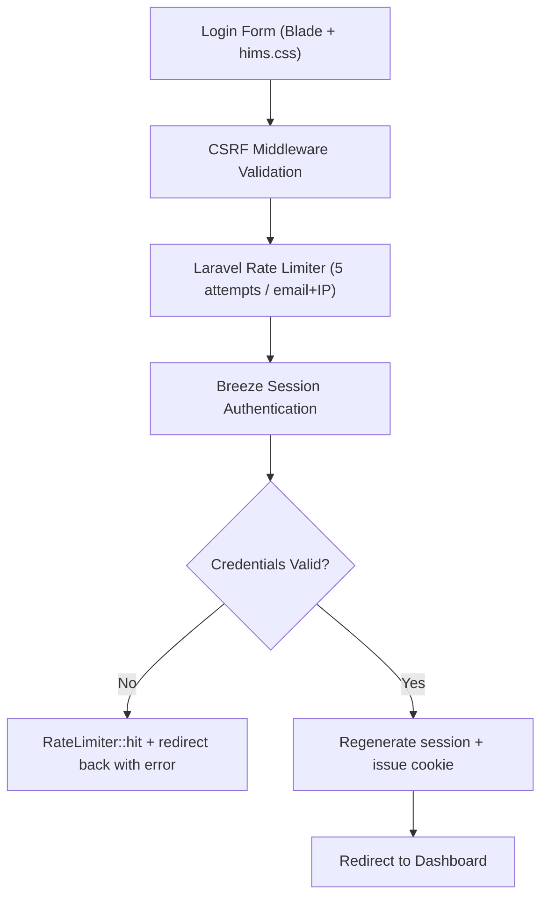

# Hospital Information Management System (HIMS)
## Performance & Development Module – Technical Specification & System Documentation

This document describes the architectural, functional, security, and data design of the **Performance & Development (P&D)** module for a modern Hospital Information Management System (HIMS). This module is tailored to meet the strict credentialing, continuing education, leadership succession, and quality-of-care demands of clinical and non-clinical staff.

---

## 1. System Overview

The **HIMS Performance & Development Module** is an enterprise-grade subsystem designed to manage, evaluate, and develop clinical (physicians, nurses, allied health professionals) and non-clinical (administrative, facilities, finance) hospital personnel. The primary objective is to align individual clinical competency with hospital quality standards, Joint Commission International (JCI) accreditation requirements, and employee development goals.

The system integrates performance, competency, learning/compliance, training, succession, and recognition workflows under a unified interface, controlled by Laravel session-based authentication (Laravel Breeze) and enhanced by the **HIMS Performance AI Assistant**, which runs on a **provider-agnostic AI layer** (Gemini by default; OpenAI, Anthropic, or any OpenAI-compatible host selectable via one env var).

> **Status of this document — AS-BUILT.**
> Describes only what is actually implemented in `hims-app/`, verified against source. Designed-but-unbuilt
> features have been removed rather than described; **if a capability is not documented here, it does not exist
> in the system.** For the stack and security breakdown see `HIMS_ARCHITECTURE_AND_SECURITY.md`.

### 1.1 High-Level Architecture (as-built)


**Implementation choices** (detail in `HIMS_ARCHITECTURE_AND_SECURITY.md`):

| Concern | Implementation |
|---|---|
| Styling | Hand-authored `public/css/hims.css` (1506 lines); Bootstrap **Icons** font only — no Bootstrap CSS framework, so no reboot layer: element defaults are declared in the stylesheet itself. Served outside the Vite build, so its URL carries the file's own content hash — see §14 |
| Data access | Raw `DB::table()` Query Builder; `App\Models\User` is the only Eloquent model |
| Authorisation | 20 Gates + `EnsureUserHasRole` middleware over four roles: `admin` \| `hr_manager` \| `supervisor` \| `staff` |
| Cache / queue / session | `CACHE_STORE=database`, `SESSION_DRIVER=file`, `QUEUE_CONNECTION=database`; the app makes no cache calls |
| AI | Provider-agnostic `AiProvider` contract; four selectable providers |
| Interface | Server-rendered web routes only; there is no `api.php` and no REST API |
| Clock | `APP_TIMEZONE=Asia/Manila`. Review and cycle freezing turn on "has this date passed?", so the timezone is an authorisation setting, not a display one |

#### Shared UI conventions

Two front-end conventions are used across modules and are worth stating once.

**Compact records are created or edited in modals, not on separate form pages.** The shared system covers
cycle create/edit, competency assessment/credential/domain creation, course create/edit, pathways, CPD,
required-training assignment and roster drill-downs, renewal rules, training sessions/venues/feedback, and
recognition posts/badges. Each partial is included on its host page and submits to the existing write route;
obsolete GET form pages were removed. All share **one** JavaScript controller, `resources/views/partials/modal-js.blade.php`,
which is `@once`-guarded so a page can include it per modal and still ship a single copy. Markup opts in with
`data-modal-open="<modal id>"` and `data-modal-dismiss`; the controller listens on `document`, so it also
serves markup that did not exist at page load. Escape and a backdrop click both dismiss, body scroll is locked
while open, and focus returns to the button that opened it.

Three supporting behaviours make modals usable in place of pages:

- Each partial `@push`es its backdrop markup to a `@stack('modals')` in `layouts/hims.blade.php` placed
  **outside `<main>`**, so every modal renders as a direct child of `<body>`. The content wrapper inside `<main>`
  animates in with a transform that CSS holds permanently (`animation-fill-mode: forwards`), and a transformed
  ancestor becomes the containing block for `position: fixed` children — a modal rendered inside it centres on
  the middle of the *page* rather than the viewport, which on a long page puts the panel below the fold. Only the
  backdrop is pushed; the shared JS include and any auto-open script stay in place.
- A hidden `_modal` field flashes through `old()` on validation failure, so a page hosting two modals reopens
  the one the user was actually filling in, with their input intact.
- `?new=<thing>` on the host URL opens a modal on load — cycle, assessment, credential, domain, course,
  pathway, CPD, assignment, rule, session, venue, post or badge; `?feedback=1` opens training feedback.
  Dashboard quick actions and cross-page prompts link this way, so they stay one click.

**Choosing several things is a checkbox list, never Ctrl-click.** Where a form needs multiple selections
(course competency tagging, pathway target roles, or Required Training courses/sessions) it renders a `.hims-checklist` of checkboxes rather than a
`<select multiple>`, because the "Hold Ctrl to select multiple" instruction is not discoverable and is easy to
undo by accident. Lists long enough to need it get a filter box above them
(`resources/views/partials/checklist-js.blade.php`, same `@once` shape) which hides non-matching rows without
ever changing what is ticked — so filtering cannot silently drop a selection.

### 1.2 Subsystems Layout

```
+-------------------------------------------------------------------------------------------------+
|                                    HIMS Core Platform                                           |
+-------------------------------------------------------------------------------------------------+
                                                 |
                                                 v
+-------------------------------------------------------------------------------------------------+
|                                PERFORMANCE & DEVELOPMENT MODULE                                 |
+-------------------------------------------------------------------------------------------------+
|  +--------------------+  +--------------------+  +--------------------+  +--------------------+ |
|  |    Performance     |  |     Competency     |  |      Learning      |  |      Training      | |
|  |     Management     |  |     Management     |  |     Management     |  |     Management     | |
|  +--------------------+  +--------------------+  +--------------------+  +--------------------+ |
|  |     Succession     |  |       Social       |  |  Multi-Provider    |                              |
|  |      Planning      |  |    Recognition     |  |   AI Assistant     |                              |
|  +--------------------+  +--------------------+  +--------------------+                              |
|  |  Gates + role MW   |                                                                        |
|  |     (Security)     |                                                                        |
|  +--------------------+                                                                        |
+-------------------------------------------------------------------------------------------------+
```

Learning contains the compliance/oversight tabs, while Recognition and Succession are separate navigation
surfaces. The AI assistant and Employees/Departments/Users administration are
additional application surfaces.

---

## 2. Functional Requirements

The system supports the following functional requirements:
- **Evaluations & Goals**: Review cycles (annual, semi-annual, quarterly, probationary), named-reviewer KPI scoring, employee response/appeal and acknowledgement, and a goals/PIP data model surfaced on the review screens. A cycle closes automatically at its end date, and the reviews inside it freeze with it.
- **Competency & Credentialing**: Custom clinical/technical/administrative competency frameworks, competency assessments, gap analysis, skills matrices, and monitoring of clinical licences/certifications with computed expiry status.
- **Learning & Compliance**: One Learning navigation surface combining the course catalogue, assignment-only course enrolment, searchable multi-course/session requirements, CPD, pathways, renewal oversight and accreditation reporting.
- **Training Logistics**: Session scheduling with venue conflict prevention, registration, and trainee feedback capture.
- **Leadership Pipelines**: Confidential HR succession mapping using a Performance–Potential 9-Box Grid, critical roles, vacancy risk, quarterly position reviews, readiness evidence, and development milestones. Supervisors receive redacted direct-report milestone access only.
- **Social Recognition**: Named public or private appreciation, audience-inherited reactions/comments, HR moderation, and a public-only monthly leaderboard.
- **AI Automation**: Provider-agnostic AI integration (Gemini default; OpenAI / Anthropic / OpenAI-compatible selectable) powering the in-app assistant and competency gap-analysis narratives.

---

## 3. User Roles and Permissions

Permissions are enforced via **20 Laravel Gates** (`AppServiceProvider::registerGates()`) plus the
`EnsureUserHasRole` middleware (aliased `role`) applied per-route in `routes/web.php`. There are no Policy
classes, and no table-driven permission model — a user's rights are derived entirely from the single
`users.role` column.

Route middleware answers "may this role reach this route". Row-level scoping (own / reporting line / all) is
layered on top of it by two helpers on the base `App\Http\Controllers\Controller`:

*   `scopeToVisibleEmployees($query)` — constrains a list query. Admin and HR are unrestricted, a supervisor gets
    **the employees whose `supervisor_id` is their own linked `employee_id`**, and everyone else (including any
    account with no linked employee profile) gets only their own row.
*   `authorizeEmployeeAccess($employeeId)` — `abort(403)` on a single-record page under the same rule.

**The supervisor half of that rule is the reporting line, not the department.** Sharing a department with
somebody grants nothing; only actually managing them does. Two consequences follow. An employee with no
`supervisor_id` is invisible to every supervisor, which is why `employees.supervisor_id` is now a **Reports To**
field on the employee create and edit forms and why the seeder builds an explicit reporting line. And the
narrowing reaches every calling module at once — a supervisor's CPD list, course enrollee list, compliance
at-risk list and accreditation report all shrank to their direct reports when this changed.

**People Manager controls who may appear in Reports To. Account role controls what they may do inside HIMS.**
`employees.is_people_manager` is an organisation-chart flag, not a permission. New assignments require an
active People Manager with a linked `supervisor`, `hr_manager`, or `admin` account. Existing unavailable
assignments remain visible and unchanged; server validation rejects ineligible new choices, self-reporting,
and any direct or indirect loop. People Manager cannot be removed while direct reports remain, and the
Manager Setup report exposes account/status mismatches for HR correction.

Two other modules keep their own department rule and were deliberately left alone.
`TrainingController::checkIn()` compares `department_id` directly, because marking a room of attendees present
is about who was in the room rather than who reports to whom. `AiEntityResolver::scopeEmployees()` likewise
matches by department, but it only turns a typed name into a UUID — `AiActionExecutor` then invokes the real
controller, so the reporting-line check still runs on the write itself.

The shared reporting-line helper is called by `EmployeeController`, `PerformanceController`,
`GapAnalysisController`, `LearningController`, `ComplianceController`, `CompetencyController`,
`DashboardController`, and `SuccessionController`. The last two also contain module-specific queries:
supervisor dashboard core metrics are direct-report scoped while credential alerts remain department-scoped
and upcoming sessions are hospital-wide; succession adds direct-report candidate/position scoping and redacts
ratings, readiness, mentor, status and vacancy-risk fields. `RecognitionController` uses a purpose-built
audience rule instead of the shared helper.

Performance reviews go further still: reviewer eligibility, per-column write ownership and review visibility are
resolved against the acting **identity**, and `admin` / `hr_manager` hold no blanket access there. See
[§4.A](#a-performance-management).

### 3.1 Roles (`users.role`)

| Role | Employees | Performance | Learning / Compliance | Succession | Recognition | Administration |
| :--- | :--- | :--- | :--- | :--- | :--- | :--- |
| **`admin`** | Full CRUD | Cycles; direct-report reviews; logged exceptions | Full | Full confidential management | Post; all private; moderation/badges | Users + departments |
| **`hr_manager`** | Full CRUD | Cycles; direct-report reviews; logged exceptions | Full | Full confidential management | Post; all private; moderation/badges | Departments |
| **`supervisor`** | Direct-report read | Create/score own direct-report reviews; read connected reviews | Direct-report oversight, plus documented broader assignment-target behavior | Direct-report candidates only; confidential fields redacted; milestones only | Same sender/recipient audience as any employee | None |
| **`staff`** | Own development records | Read/respond to own reviews | Catalogue, own CPD/cycles, session self-registration | **No access** | Named public/private posts involving them; public wall | None |

Admin and HR may step outside the reporting line for a review only on one of four logged exception bases —
see [§4.A](#a-performance-management). Every role, including admin, is barred from reviewing itself.

**Gates defined:** `manage-users`, `manage-departments`, `manage-employees`, `view-employees`,
`manage-performance`, `manage-review-cycles`, `manage-competency`, `manage-competency-framework`,
`manage-learning`, `manage-training`, `manage-venues`, `record-completion`, `view-compliance`,
`manage-compliance`, `manage-succession`, `view-succession`, `manage-recognition`,
`view-audit-history`, `view-org-analytics`, and `run-gap-analysis`.

**No Gate covers review authority.** Every rule there needs the review row — who its subject is, who its
reviewer is, which cycle it belongs to and whether that cycle has ended — and a Gate closure receives only
`$user`. Those rules therefore live as controller methods (`isLegitimateReviewerFor()`, `canScoreReview()`,
`reviewIsFrozen()`, `scopeToVisibleReviews()`), not as Gates. `manage-performance` and `manage-review-cycles`
still exist, but they govern the *cycle* administration screens and the sidebar, not who may write a review.

One compliance route is deliberately ungated: `learning.cycles.mine` is open to every signed-in role. The
oversight pages answer the hospital's question, but this one answers the individual's — restricting it would
mean the only people who can see a CPD deficit are the ones who cannot personally fix it.

The same Gates drive both the `@can` checks that show/hide sidebar navigation and the route middleware that
enforces access, so the menu and the guard cannot drift apart.

---

## 4. Module-by-Module Features & Workflows

### A. Performance Management

*   **Role-Specific KPI Library**: Differentiates between Clinical KPIs (e.g., *Medication Error Rate*, *Patient Satisfaction Rating*, *Documentation Accuracy*) and Non-Clinical KPIs (e.g., *Billing Error Ratio*, *Facilities Ticket Response Time*), with each KPI carrying a target value, unit, weight, and applicable-role list.
*   **Review Cycles**: HR/admin opens a cycle (annual, semi-annual, quarterly, probationary) with a date range and status; reviews are created against a cycle.
*   **A cycle closes itself at its end date.** `review_cycles.status` is set to `planned` on creation and is
    never advanced by any job or screen, so it is treated as advisory: a cycle whose `end_date` has passed
    reads as **Closed** everywhere, whatever the column says, and only a deliberate `archived` outranks the
    date. The comparison is a strict `<`, so a cycle ending *today* is open for the whole of that day. See
    [§4.A.1](#a1-review-and-cycle-status-are-derived-not-stored).
*   **Reviewer eligibility follows the chain of command.** An account may open or score a review only for the
    employees whose `employees.supervisor_id` is its own linked `employee_id`. Role alone grants nothing here:
    `admin` and `hr_manager` have **no blanket review access**, and their organisation-wide reach in the rest of
    HIMS stops at this module. The employee dropdown on the create screen lists exactly the people the account
    may legitimately review, so the form is itself a statement of authority rather than a list to be validated
    afterwards.
*   **No self-review, ever.** `reviewer_id` may never equal `employee_id`, checked at both create and score
    time. No role is exempt, including admin.
*   **A narrow, logged exception path.** Admin and HR may act outside the chain on exactly four bases:
    the employee has no supervisor recorded (`no_supervisor`); the assigned supervisor's `employment_status` is
    `on_leave`, `suspended` or `resigned` (`supervisor_unavailable`); or the assigned supervisor is themselves
    a subject of a review in that same cycle (`supervisor_is_subject`); or the assigned supervisor has no linked
    Supervisor/HR Manager/Admin account (`supervisor_account_unavailable`). Anything else is refused. A qualifying
    create demands a typed reason, stamps `is_exception_review` with its basis and reason, **badges the review
    in the UI**, and writes an `audit_trails` row through the existing `App\Support\AuditTrail::record()`.
*   **One reviewer, one review per employee per cycle.** A unique index on
    `(employee_id, cycle_id, reviewer_id)` — `pr_employee_cycle_reviewer_unique` — backs it, and a repeat
    "create" redirects to the existing review's score screen instead of inserting a duplicate. `review_type` is
    deliberately **not** part of the key: relabelling a review from `standard` to `promotion` does not entitle a
    reviewer to open a second one on the same person in the same cycle.
*   **One review, one voice.** There is no self-assessment and no peer rating. The only score column is
    `supervisor_score`, and only the account named in `reviewer_id` may write it. Reviews are scored against the
    KPI grid on 1–5 scales with per-KPI comments, plus free-text strengths and improvement notes.
    `review_kpi_scores.weighted_score` carries the reviewer's number straight through — there is no blend to
    compute — and `performance_reviews.overall_score` is the mean of those weighted by each KPI's
    `kpi_library.weight`, with `supervisor_rating` their plain unweighted average.
*   **The screens name the two roll-ups by what each averages, and state each KPI's influence as a percentage.**
    `supervisor_rating` reads **"Average of KPI ratings"** and `overall_score` reads **"Final Score / weighted by
    KPI importance"**, followed by a sentence explaining why they differ. In the KPI table, the old **Weighted**
    column is gone — it printed `supervisor_score` verbatim under a heading claiming a weighting it never applied
    — and in its place each KPI states its share of the final score ("counts 9% of the final score"), computed by
    `App\Support\KpiWeighting`. The header carries a rated count, and a sheet with a blank box warns that **an
    unrated KPI is left out of the score entirely rather than counted as a zero**, with the rated KPIs sharing out
    its influence. Shares are apportioned so the column totals exactly 100%. See
    `HIMS_ARCHITECTURE_AND_SECURITY.md` §2.2.2.
*   **The freeze is an authorisation boundary, not a hidden button.** Once the cycle's end date has passed the
    review reads **Completed** and refuses writes: `scoreReview()` refuses the GET screen and `saveScores()`
    refuses the PUT, independently, so a replayed request carrying a valid CSRF token leaves the stored scores
    untouched. `storeReview()` applies the same rule at the other end — a review cannot be opened into a cycle
    that has already ended, because it would be born frozen and editable by nobody.
*   **An account with no linked employee record cannot author a review at all.** Reviewer identity is an
    `employee_id`, so an account without one has no identity to assert; `storeReview()` refuses before any
    authority question is asked, and the reviews list returns empty for it.
*   **Review visibility is relational.** The reviews list and a single review return only records the account is
    part of — their own, ones they authored, or their direct reports' — and this applies to admin and HR too.
*   **Employee response and acknowledgement do not alter the reviewer's decision.** Once a review is no longer
    Draft, its subject can save or replace `employee_response`; no score or reviewer comment is accepted on that
    route. Acknowledgement is allowed only after the cycle closes, stamps `employee_acknowledged_at`, and locks
    the response. Response and acknowledgement are audited as `review_employee_response` and
    `review_acknowledged`.
*   **Lifecycle writes are attributable.** Cycle creation/updates, review creation, exception use, and coherent
    reviewer score/comment/status saves record audit events. An unlinked account cannot create a cycle or review.
*   **Goals & PIPs**: `review_goals` and `performance_improvement_plans` carry goal titles, progress percentages, and action steps, surfaced read-only on the review screens.

#### A.1 Review and cycle status are derived, not stored

Neither a review's frozen state nor a cycle's closed state is written anywhere. Both are computed on every
read from `review_cycles.end_date` by two small classes in `App\Support`:

| Class | Question it answers | States |
|---|---|---|
| `CycleStatus` | Has this review cycle ended? | `planned`, `active`, `closed`, `archived` |
| `ReviewStatus` | May this review still be edited? | `draft`, `finished`, `completed` |

`CycleStatus::of($stored, $endDate)` returns `archived` when the column says so, otherwise `closed` when the
end date has passed, otherwise the stored value — **archived outranks the date; the date outranks the stored
column otherwise**. `ReviewStatus::of()` returns `completed` on the same condition and delegates the date test
to `CycleStatus::hasEnded()`, so the cycle badge and the review lock cannot drift apart.

Only `draft` and `finished` are settable by a person, and **both remain editable** — `finished` means "I have
said what I have to say", not "sealed". `completed` is nobody's to set: it is refused by validation and
appears only when the calendar produces it. That makes the transition automatic and universal — no screen has
to remember to close anything, and no cycle can be left open by neglect.

Three properties are load-bearing:

*   **The comparison is a strict `<` on `Y-m-d` strings**, so a cycle ending *today* is open for the whole of
    that day and freezes the following morning.
*   **Dates are bound as query parameters, not baked in as `CURDATE()`**, which keeps `ReviewStatus::caseSql()`
    and `CycleStatus::whereNotEnded()` runnable on the sqlite connection the test suite uses.
*   **There is no scheduled job.** The freeze is an authorisation rule, and a rule that depends on
    `schedule:run` being wired is one that fails open on any box where it is not. The cost is that a raw query
    reading `performance_reviews.status` alone cannot see that a review is completed — it must join
    `review_cycles` and go through `of()`, `caseSql()` or `CycleStatus::whereNotEnded()`.

That last cost is not theoretical, and it is the one thing to check when adding a read. The dashboard's
**Pending Reviews** tile counted with `whereNotIn('status', ['completed'])`, which was correct while something
wrote that value and became a no-op the moment nothing did: the filter excluded zero rows, so every frozen
review in every ended cycle stayed on the tile as outstanding work while the review screen showed it Completed
and refused edits. Both tiles now join `review_cycles` and ask the date. **A query that wants "reviews still
open" must join the cycle** — the status column cannot answer it, and the sqlite suite cannot catch it, because
the admin dashboard is one of the `CONCAT()`-carrying screens that skips off MySQL.

Because the whole mechanism turns on "has this date passed?", **`config('app.timezone')` is `Asia/Manila` and
that is an authorisation setting, not a display one** (`APP_TIMEZONE` in `.env`). Under Laravel's stock UTC
default, `now()->toDateString()` was still yesterday for the first eight hours of every Philippine day, so a
cycle that ended the night before stayed scoreable until 8am local time.
`Unit\CycleStatusTest::test_the_app_clock_is_the_hospital_clock` pins the value, and `phpunit.xml`
deliberately does not override the timezone so the assertion stays live.

#### A KPI's weight, shown as what it actually buys

`kpi_library.weight` is a `decimal(3,2)` running 1.00 down to 0.60 in the seeded library. On its own that
number is unreadable: it is not a multiplier a reviewer can apply to their rating and it is not a percentage.
It means something only relative to the other KPIs on the same review, since `overall_score` divides every
weight by their total. **`App\Support\KpiWeighting`** turns it into the one form a person can act on — the
share of the final score that KPI decides — and both review screens print that instead of the raw figure.

Its rules, in the same `final class` / static / no-database shape as the two status classes above:

*   **A missing, null or zero weight counts as 1.00**, not as removal from the score. A KPI attached to a
    review is something the reviewer was asked to judge; a blank library column is an unset field, not an
    instruction to discard their answer. `recalculateReviewTotals()` takes its coefficient from the same
    method, so the percentage on screen and the arithmetic behind the stored score cannot drift.
*   **Only rated rows are in the denominator.** `cleanScore()` turns a blank box into a `null`, not a zero, so
    an unrated KPI drops out of the roll-up *and* out of the divisor — the rated KPIs' shares grow to fill the
    gap. An unrated row is reported as having no share at all rather than 0%, which would read as "counted,
    and worthless". The scoring form says this out loud whenever anything is unrated, because the form itself
    cannot show it.
*   **The printed integers are apportioned to total exactly 100.** Rounding each share on its own produces a
    column a reviewer adds up to 102% — both seeded reviews did — so `displayShares()` uses largest remainder:
    floor everything, then give the leftover points to the largest fractional parts, ties breaking on the
    order the screen lists the rows.

`Unit\KpiWeightingTest` (12 tests, no database) covers all three, including a case asserting the shares
reproduce a stored `overall_score` exactly; three MySQL-gated tests in `Feature\ReviewAuthorityTest` assert
what the two screens actually render.

### B. Competency Management

*   **JCI Accreditation Mapping**: Maps compliance guidelines directly to required skills (SQE.3, SQE.4, SQE.5 standards) via the `jci_standard_code` on each competency category.
*   **Credential Monitoring**: Displays statuses for clinical licences (e.g. PRC licence, board certs, BLS, ACLS), derived in PHP from the expiry date on every read:
    *   🟢 **Active** — valid and current
    *   🟡 **Expiring soon** — expiry within 30 days
    *   🔴 **Expired** — expiry date passed
    *   ⚪ **No expiry** — credential without an expiry date

    `employee_credentials` has **no `status` column** — nothing is stored. `App\Support\CredentialStatus` is
    the single place the banding is defined, and every screen and query routes through it, which is what keeps
    the four states consistent. Because it is an application-level rule rather than a database one, a
    hand-rolled date comparison written elsewhere could disagree with it. Expiry is no longer display-only:
    `credentials:scan` writes notifications on a schedule and records what it sent in `credential_alert_log`.
*   **Department Skills Matrix**: Heatmaps showing competency coverage per ward, allowing managers to see if a ward lacks critical skills (e.g., ventilator operation).
*   **Gap Analysis Engine**: Computes `Gap = Current Proficiency − Required Proficiency` per employee per competency, via a MySQL `BEFORE INSERT`/`BEFORE UPDATE` trigger pair.

### C. Learning Management

*   **Hospital Course Catalogue**: Course records categorised by compliance, clinical, and soft skills, each with CPD hours, difficulty, duration and passing score. The catalogue has no Enrol or View action buttons: admins/HR get one shared **Edit** modal per row, while the linked title remains the route to course detail and competency tagging.
*   **Course enrolment is assignment-only**: employees cannot put themselves on a course. Required Training creates `course_enrollments` on their behalf; every new row carries an `assignment_id`. Null identifies legacy rows created before self-enrolment was removed. Training sessions remain independently self-registerable.
*   **CPD (Continuing Professional Development) Ledger**: A record of hours earned from courses, training, and external activities, listed per employee and totalled on the dashboard. Hours arrive two ways. **Automatically**, when a course enrolment is marked complete. **Manually**, through the **Log CPD Activity** modal on `/learning/cpd`; in-house course/session entries are auto-verified, while external activities need HR/Admin verification.
*   **Learning Pathways**: Multi-course curriculums (e.g., "Critical Care Nurse Pathway") sequencing courses with prerequisite ordering.
*   **My Renewal Cycles** (`/learning/my-cycles`): the employee-facing half of the compliance layer — how many CPD hours this cycle requires, how many are verified so far, and the date the window closes. Served by `ComplianceController::myCycles()` and open to every role. See [§G](#g-compliance--oversight).

    The `course_enrollments.assignment_id` column is now required by application behavior for new rows: a value names the requirement that created the enrolment; null is retained only for legacy data and schema compatibility.

### D. Training Management

*   **Session Scheduling**: Instructor-led workshops (e.g., Infection Control Seminar) with date, times, capacity, category, registration deadline, and optional linked course.
*   **Venue & Conflict Prevention**: Sessions are assigned to classrooms or simulator rooms; a unique index on `(venue_id, session_date, start_time)` blocks two sessions starting at the *same instant* in the same room on the same day. It is an exact-match index, **not an overlap check** — a 09:00–12:00 session and a 10:00–11:00 session in the same venue on the same date both insert successfully. `storeSession()` does not pre-check for the collision or catch the failure, so a genuine duplicate surfaces as a database error page rather than a validation message.
*   **Registration & Attendance**: Employees register for a session, with a capacity check and a unique constraint preventing duplicate registration. Registrations are written with status `registered`, and the session page carries a check-in panel (`POST /training/sessions/{id}/checkin`) where each registration is moved to `attended` or `no_show`; `attended` also stamps `check_in_time` and sets `check_in_method` to `manual`. Access is gated on the `manage-training` Gate — the session's own instructor and any admin/HR Manager may check anyone in, while a supervisor who is not running the session is silently limited to their own department's staff. The "Avg Attendance" figure on the training page is the proportion of all registrations sitting at `attended`.
*   **Feedback Display**: `training_feedback` holds 1–5 ratings and free-text comments, and the training page shows the average and a recent-feedback list. The app **reads** this table only — there is no survey form, so rows must be loaded directly into the database.

### E. Succession Planning

Succession records are confidential HR data. Staff are route-blocked. Admin/HR see the full registry and may
create positions, nominate/update/withdraw candidates, record quarterly position reviews, and manage all
milestones. Supervisors see only direct-report candidates and positions containing those candidates. Their
queries redact `performance_score`, `potential_score`, `nine_box_label`, `readiness_level`, `mentor_id`,
candidate `status`, `vacancy_risk`, `risk_factors`, and `estimated_vacancy_date`; they may manage milestones
only for those direct-report candidates.

*   **Critical Role Registry**: Flagging key medical positions (e.g., Chief of Surgery, ICU Head Nurse) that present high operational risk if vacant.
*   **9-Box Grid Placement**: Maps candidates on Performance vs. Potential. Scores are **1–5** on each axis (not 1–3), banded low (1–2) / med (3) / high (4–5) to give the nine cells:
    | | Low Potential (1–2) | Medium Potential (3) | High Potential (4–5) |
    |---|---|---|---|
    | **High Performance (4–5)** | Solid Performer | High Performer | ⭐ Star Talent |
    | **Medium Performance (3)** | Average Performer | Core Contributor | High Potential |
    | **Low Performance (1–2)** | Underperformer | Inconsistent | Rough Diamond |

    The label is **derived server-side on every write** and never accepted from the form, so it cannot contradict the scores. The nomination form shows a live preview of the resulting placement as scores are entered.
*   **Readiness Scale**: Categorises successors as "Ready Now," "Ready in 1–2 Years," "Ready in 2–5 Years," or "Long Term."
*   **Candidate Pipeline**: Hospital-wide and fully rated for HR/Admin; direct-report scoped and confidentially redacted for Supervisors. Position filters cannot name a position outside the current user's visible set.
*   **Leadership Development Paths**: Per-candidate milestones (course, assignment, mentoring, rotation, certification, project) with target dates. Each advances `not started → in progress → completed`; the completion date is stamped automatically and cleared if the milestone moves back. Completion drives the pipeline's Dev Progress percentage.
*   **Nomination Management**: Scores, readiness, and mentor can be revised after nomination (stamping `reviewed_at`); a candidate can be withdrawn, which also removes their milestones.
*   **Vacancy Risk Flagging**: Each critical position carries a `low` / `medium` / `high` / `critical` risk level set when the position is created or edited, used to sort and highlight the positions list and the dashboard's at-risk panel.
*   **Quarterly Review Tracking**: HR/Admin can stamp `last_reviewed_at`, `last_reviewed_by`, and optional `quarterly_review_notes`; the change is audited.
*   **Coverage Alert**: The organisation dashboard lists high/critical-risk positions with no `ready_now` candidate.
*   **Readiness Evidence** (`SuccessionController::readinessEvidence()`): the candidate page shows what the person has actually completed — pathway completion percentages, latest proficiency per competency against the required level, training and CPD totals, and their open renewal cycles. Readiness was previously a judgement typed into a form while the figures behind it lived one module away; surfacing them makes a promotion decision reviewable against evidence rather than against somebody's recollection. Reassessments are reduced to the newest row per competency in PHP, the same way the gap-analysis service does it.

### F. Social Recognition

*   **Named public/private recognition**: sender and recipient are always visible. Public approved posts appear on the Wall; private approved posts appear only to the sender, recipient, and HR/Admin moderators.
*   **Identity-derived post type**: supervisor recognition is assigned only when the reporting line proves it;
    authors cannot label their own post as management recognition, and cannot recognize themselves.
*   **Personal history**: Received and Sent contain both public and private posts involving the current employee. HR/Admin also receive a Private moderation tab.
*   **Audience inheritance**: comments and reactions resolve the post through `visiblePost()`, so a private post cannot be interacted with by somebody outside its audience.
*   **Notifications and moderation**: recipients are notified when recognized; authors are notified about
    reactions, comments, and moderation. HR/Admin can approve, flag, or remove posts and comments, with audit rows.
*   **Core Hospital Value Badges**:
    *   *Compassion (Kalinga)*: For exemplary patient bedside manner.
    *   *Teamwork (Bayanihan)*: For helping colleagues in understaffed shifts.
    *   *Innovation (Diskarte)*: For solving emergency bottlenecks.
    *   *Clinical Excellence*: For zero-error documentation or procedures.
*   **Leaderboard**: Highlights public approved recognition only; private posts are excluded from statistics and the monthly leaderboard.

### G. Compliance & Oversight

Learning and Compliance are two controller halves of one visible **Learning** module. The sidebar has no
Compliance entry; a role-gated tab strip exposes Overview, Required Training, Renewals, My CPD, Pathways and
Reports. `LearningController` serves the catalogue/CPD/pathway side, while `ComplianceController` answers the
institutional questions without growing the first controller indefinitely. Canonical URLs are all under
`/learning`; `/compliance/...` routes are compatibility aliases only.

**No page in this module requires the subject to have a login.** Every query keys on `employee_id`. Account
coverage is the single place a `users` row is even mentioned, and there it is the thing being reported on, not
a precondition.

*   **Assigned (mandatory) training** (`TrainingAssignmentService`): one form can require any number of courses
    and upcoming sessions of an
    employee, a department, a role, or everyone active, with an optional required-by date and a reason. The
    service expands the target into real enrolment rows — `course_enrollments` for a course,
    `training_registrations` for a session — so an assigned course appears on the employee's own Learning page
    on their behalf. Intent and expansion are kept in separate tables: `training_assignments`
    records what was required of whom and by when, and survives even if an individual enrolment is later
    withdrawn.

    Already-enrolled employees are **skipped, not duplicated**, and a session assignment stops at the venue
    capacity rather than overbooking it. The response reports both: "Assigned to 34 of 41 employee(s). 7 already
    enrolled or beyond session capacity." Searchable course/session checklists post type-prefixed `subjects[]`;
    `assignMany()` creates one separately measured assignment per subject in one transaction.
*   **Compliance rate and modal roster**: each assignment shows completed / total as a percentage. Its
    outstanding/overdue badge opens the roster already filtered to unfinished people, and the Roster button
    opens everyone, without leaving the Required Training page. The roster is filtered through
    `canAccessEmployee()`, so a supervisor sees their own direct reports and not everyone else's. A canonical
    `/learning/required/{id}` deep link remains available.

    The rate is **people, not content**: `count(completed) / count(assigned)`. What counts as completed depends
    on the subject. A session is completed by check-in on the attendance sheet (`training_registrations.status
    = 'attended'`, or any `check_in_time`). A course is completed by the **Mark complete** button, which the
    roster carries on every unfinished row and which posts to `learning.enrollments.complete` — the only thing
    in the system that writes `course_enrollments.status = 'completed'`. A completion also credits the course's
    CPD hours as a verified `cpd_records` row, so it moves the employee's renewal cycle at the same time as it
    moves this percentage. **Reopen**, shown on completed rows to admin/HR only, reverses both.
*   **Renewal cycles** (`RenewalCycleService`): a renewal *rule* states what a credential type or CPD
    requirement demands — required hours, cycle length in months, grace days. Syncing opens a *cycle* per
    employee per rule, which freezes the requirement at `hours_required_snapshot` so raising a rule next year
    cannot retroactively fail somebody who met the old one.

    Attained hours are summed from `cpd_records` **on every read** rather than stored, and only `verified`
    hours count — an employee cannot clear a compliance requirement by typing a number into a form. A
    credential-backed cycle ends when the licence expires; a CPD-only rule rolls forward from the hire date
    until the window covers today, so a five-year employee on a 36-month cycle lands in their current window
    rather than one that closed two years ago.
*   **At-risk list** (`/learning/renewals`): everyone heading for a shortfall. A cycle is `at_risk` when
    finishing it now needs a run-rate 1.5× the pace so far, or when the window closes within 30 days with hours
    still owed; `shortfall` once the window has passed unmet; `met` when the hours are in. The flat lifetime CPD
    total the Learning tab used to show could not answer the only question that matters at renewal — a nurse
    with 200 lifetime hours and 3 in the current window is a compliance failure that number reported as a
    success.
*   **Escalation routing** (`credentials:scan`, extended): the nightly scan now raises cycle-shortfall alerts
    alongside credential expiry, and routes each one to the employee's own account, their supervisor, and their
    department head. Where the subject has no `users` row it falls back to the email on the `employees` record,
    so a proxy-tracked employee is still reachable. Sends are recorded in `credential_alert_log` — one ledger,
    one dedupe path — which is why that table gained `subject_type` / `subject_id` and a nullable
    `credential_id` instead of a parallel table being created beside it.
*   **Accreditation report** (`/learning/accreditation`): one row per active employee carrying competency
    proficiency, credential standing, and training completion, filterable by department, role, and JCI standard.
    This is the compilation a survey asks for. The standard code is tagged on `competency_categories`, one join
    above the competency itself; it had been captured since the competency module shipped and never reported on.
*   **Account coverage** (`/learning/accounts`): which employees have a linked login and which are
    tracked by proxy, plus any `users` row with no `employee_id`. Read-only. Being proxy-tracked is a supported
    state, not a defect — the page exists so that "nobody told them" can be answered with a list rather than a
    guess.

---

## 5. AI Provider Layer

The original Gemini-only design has been **replaced by a provider-agnostic layer**. Application code depends on
the `App\Contracts\AiProvider` interface (one method: `ask(string $prompt, array $history = [], ?string $scope = null): string`);
`AiManager` resolves the concrete driver from `config('services.ai')` at runtime.
| Setting | Value |
|---|---|
| **Selector** | `AI_PROVIDER` = `gemini` \| `openai` \| `anthropic` \| `compatible` |
| **Default** | `gemini` — an existing `GEMINI_API_KEY` keeps working with no other change |
| **Drivers** | `GeminiProvider` · `OpenAiProvider` · `AnthropicProvider` · `compatible` (reuses `OpenAiProvider` with a custom label + `base_url` for Groq / DeepSeek / xAI / Mistral / Together / OpenRouter / Ollama) |
| **Transport** | Raw `Http::` calls — no vendor SDKs |
| **Model fallback** | Per-provider `*_MODEL` plus a `fallback_models` list; a 404/model error advances to the next candidate |
| **Failure contract** | `ask()` **never throws** on an API or config error — it returns a `⚠️`-prefixed string that callers detect and degrade on |
| **Conversation memory** | `$history` is the current chat session's earlier turns, oldest first. Drivers map the stored `ai` role to their own wire role (`assistant` for OpenAI/Anthropic, `model` for Gemini) and must not trust the list — `AbstractAiProvider::sanitiseHistory()` cleans and caps it first. |
| **Access scope** | `$scope` is a per-request role instruction from `AiAccessPolicy::scopeFor()`, appended to the system prompt. Passed per call rather than read from `auth()` inside a driver, because `AiManager` shares each driver as a memoised singleton — state stored on one would leak into the next request. |
| **Application grounding** | `HimsKnowledge::appGuide()` is appended to the system prompt on every request. It states the real navigation, each module's write permissions, the remaining self-service flows (session registration and CPD logging), the assignment-only course workflow, and an explicit list of what HIMS **does not** have. Without it the assistant answers "how do I…" from generic LMS conventions and invents pages and fields — see [§12.9](#129-employees-departments-users--ai). |

**Live AI features:**
*   **In-app assistant** (`AiController` → `POST /ai/query`): conversational queries in English/Tagalog/Taglish, presented as a docked right-hand rail. Conversations are organised into sessions (`ai_chat_sessions` + `ai_chat_messages`), and the current session's earlier turns are replayed to the provider so follow-up questions carry context. The conversation list is visible when the rail opens, can be collapsed without deletion, and is owner-only; an owner can also find a saved session through Global Search and reopen it through `?ai_session=<uuid>`. Access is bounded by subject matter, not by route — `AiAccessPolicy` refuses questions on topics the asker's role cannot reach.
*   **Action execution** (`AiActionPlanner` → `AiActionExecutor`): the assistant performs writes, not just describes them. "Create a 2027 annual review cycle" creates one; "delete the user bob@hospital.ph" asks for confirmation first, then deletes. Every action is bounded by the signed-in person's role, and every successful one writes an `audit_trails` row. See [§5.1](#51-ai-action-execution).
*   **Competency gap-analysis narratives** (`CompetencyGapAnalysisService`): AI-generated summaries and development recommendations over assessment data, surfaced by `GapAnalysisController`. This caller passes no history and no access scope — it is a one-shot question. The employee report additionally sends the **written feedback** from the last three performance-review cycles verbatim — `strengths_text`, `improvements_text` and every per-KPI `comments` note — and asks the model to summarise it as `feedback_summary`.

These are the only places the AI layer is called, and it is **read-only over performance data**: the
gap-analysis prompt quotes review comments but nothing in the AI layer writes a review, a score or a comment.
There is no AI involvement in quizzes or training feedback at all.

### 5.1 AI Action Execution

The assistant can perform any write the signed-in person could perform through the UI — 30 actions across the
seven original domain modules — and nothing they could not. The three Learning oversight writes
(`learning.assignments.store`, `learning.renewals.rules.store`, `learning.renewals.sync`) are **not** in the
registry: assigning training to a whole department or opening cycles across every active employee is a bulk
write, and those belong behind a form the operator can read back before submitting.

**The one idea that makes this safe: nothing is re-implemented.** `AiActionExecutor` resolves the *existing*
controller from the container and calls the *existing* method with a synthesized `Request`:

```php
app(PerformanceController::class)->storeCycle($request);
```

That reuses `$request->validate([...])` verbatim, the in-method safety rails (`UserController::destroy()`
refusing self-deletion and last-admin deletion), `authorizeEmployeeAccess()`, the UUID/timestamp conventions,
and the MySQL triggers. A second implementation would have to restate all of it and would be wrong the first
time any of it changed.

**Roles are read from the router, not hand-copied.** Calling the controller directly bypasses route
middleware, so `AiActionRegistry` derives the permitted roles from the real route:

```php
Route::getRoutes()->getByName('performance.cycles.store')->gatherMiddleware()
// -> [..., 'role:admin,hr_manager']
```

A route with no `role:` middleware is open to every signed-in user. When `web.php` changes, the assistant's
permissions change with it. **All `role:` layers must pass** — `employees.destroy` carries one from the prefix
group (`admin,hr_manager,supervisor`) and a narrower one on the route itself (`admin,hr_manager`); reading only
the first would hand supervisors the delete.

**Request flow** in `AiController::query()`:

1.  **Pending confirmation?** If `pending_action` is set and under five minutes old, `confirm`/`yes`/`proceed`
    executes it; anything else clears it and replies "Cancelled — nothing was changed."
2.  **Verb pre-filter.** Only messages containing an action verb reach the classifier, so a question costs one
    AI call as it always did and a command costs two.
3.  **`AiAccessPolicy::deniedTopic()`** — unchanged, and still first. A topic the role cannot discuss is one it
    certainly cannot act on.
4.  **Plan.** `AiActionPlanner` returns `{"action","params","missing","summary"}`. An unmappable instruction or
    a key outside `availableTo()` falls through to normal conversation.
5.  **Resolve.** `AiEntityResolver` turns names, codes and emails into UUIDs. Ambiguous or missing targets are
    reported as a question; nothing executes.
6.  **Destructive?** The target is resolved and named back ("⚠️ Delete an employee record: **Maria Santos
    (EMP-0001)**"), stored in `pending_action`, and the turn ends. Otherwise execute now.
7.  **Execute, audit, reply** with the controller's own flash message — so the chat says exactly what the web
    form would have said.

**Partial updates are filled from the current row.** Update controllers are written against a web form that
posts the whole record: every field `required`, every column overwritten. A chat instruction names one thing, so
`AiActionExecutor::prefill()` fills the rest from the row as it stands before calling. Without it, "set Maria
Santos to probationary" was rejected for a first name, email and hire date nobody had mentioned — and had it
not been rejected, it would have blanked them.

**`password_confirmation` is mirrored, not guessed.** Laravel's `confirmed` rule exists to catch a human
mistyping into two password boxes. Chat has one value and no second box, so the check cannot do its job there;
the registry's `mirror` key names the companion field and the executor fills it from the value already given.
The rule still runs — it simply cannot fail this way.

**Audit.** Every successful action writes an `audit_trails` row via `App\Support\AuditTrail::record()`, holding
the actor, the action, before/after state, the IP, and a metadata blob with the verbatim prompt and session id.
Failed and rejected actions write nothing. `AiActionExecutor` is one of several caller locations for `record()` —
others include `TrainingAssignmentService` (`assign_training`), `ComplianceController`, `LearningController`,
`PerformanceController`, `RecognitionController`, `SuccessionController`, `EmployeeController`,
`CompetencyController`, and `UserController`. This includes the review lifecycle, employee response/acknowledgement,
recognition creation/moderation, every succession mutation, and selected employee/account/competency administration. Reads and every possible UI
edit are not comprehensively tracked; coverage is selective. See `HIMS_ARCHITECTURE_AND_SECURITY.md` §3.4.

Covered by `tests/Unit/AiActionRegistryTest.php` (16 tests — role derivation, the two-layer middleware case,
destructive flagging), `tests/Unit/AiActionPlannerTest.php` (27 tests — malformed JSON, unpermitted keys), and
`tests/Feature/AiActionTest.php` (18 tests — end-to-end create, the confirm gate, stale pending actions,
partial updates, whitelist enforcement).

---

## 6. Database Schema (MySQL 8.0+)

The relational schema is configured for **MySQL 8**. All domain primary and foreign keys use UUIDs represented as `CHAR(36)`. Arrays are represented as `JSON` columns.

> **Implementation notes.**
> *   UUIDs are generated **in PHP** via `Str::uuid()` at insert time — MySQL generates nothing. An insert that omits the PK will fail. `created_at` / `updated_at` must likewise be set explicitly, since raw Query Builder has no timestamp magic.
> *   **Access is via raw `DB::table()` Query Builder** throughout — there are no Eloquent models, relationships, or eager loading for these tables. Joins are written by hand in the controllers.
> *   **The `CHECK (col IN (...))` clauses below are documentation, not DDL.** They record the value domain
>     each column is *expected* to hold, but **no `CHECK` constraint exists anywhere in the migrations** —
>     those columns are plain `VARCHAR(n)`, and the value set is enforced one layer up by the `in:` rules in
>     each controller's `$request->validate()` call. A row written outside the app (direct SQL, a seeder, a
>     console command) can therefore hold a value the app would have rejected. The schema contains exactly
>     **two** integrity objects it enforces itself: the `trg_compute_gap_*` trigger pair on
>     `competency_assessments.gap`, and the unique index on `(venue_id, session_date, start_time)`. There are
>     **no generated columns** and the only genuine `ENUM` in the database is `ai_chat_messages.role`.

> **Live schema baseline.** The current MySQL database contains **51 tables and 1 view** with **30 applied
> migration rows**. Earlier placeholder tables (`permissions`, `role_permissions`, `system_users`,
> `course_modules`, `quiz_questions`, `quiz_attempts`, `training_tests`, `training_test_results`,
> `succession_reviews`, `credential_types`) and `peer_reviews` were removed by later migrations and are not
> part of the live schema. The real account table is Laravel's `users`, extended with `role`, a nullable
> `employee_id`, failed-attempt, and lockout columns.

### 6.1 Entity-Relationship Diagram

```mermaid
erDiagram
    DEPARTMENTS ||--o{ EMPLOYEES : employs
    DEPARTMENTS ||--o{ ROLES : defines
    DEPARTMENTS ||--o{ CRITICAL_POSITIONS : contains
    ROLES ||--o{ EMPLOYEES : assigns
    ROLES ||--o{ ROLE_COMPETENCY_REQUIREMENTS : requires

    EMPLOYEES ||--o{ PERFORMANCE_REVIEWS : undergoes
    EMPLOYEES ||--o{ REVIEW_GOALS : tracks
    EMPLOYEES ||--o{ PERFORMANCE_IMPROVEMENT_PLANS : assigned

    EMPLOYEES ||--o{ COMPETENCY_ASSESSMENTS : evaluated_on
    EMPLOYEES ||--o{ EMPLOYEE_CREDENTIALS : holds

    EMPLOYEES ||--o{ COURSE_ENROLLMENTS : enrolls_in
    EMPLOYEES ||--o{ CPD_RECORDS : earns
    EMPLOYEES ||--o{ CERTIFICATES : receives
    EMPLOYEES ||--o{ EMPLOYEE_RENEWAL_CYCLES : owes_hours_in

    EMPLOYEES ||--o{ TRAINING_REGISTRATIONS : registers_for
    EMPLOYEES ||--o{ TRAINING_FEEDBACK : submits

    EMPLOYEES ||--o{ SUCCESSION_CANDIDATES : nominated_as
    EMPLOYEES ||--o{ LEADERSHIP_DEVELOPMENT_PATHS : follows

    EMPLOYEES ||--o{ RECOGNITION_POSTS : gives_or_receives
    EMPLOYEES ||--o{ RECOGNITION_REACTIONS : reacts
    EMPLOYEES ||--o{ RECOGNITION_COMMENTS : comments

    REVIEW_CYCLES ||--o{ PERFORMANCE_REVIEWS : contains
    KPI_LIBRARY ||--o{ REVIEW_KPI_SCORES : measures
    PERFORMANCE_REVIEWS ||--o{ REVIEW_KPI_SCORES : includes
    PERFORMANCE_REVIEWS ||--o{ REVIEW_GOALS : sets

    COMPETENCY_DOMAINS ||--o{ COMPETENCY_CATEGORIES : groups
    COMPETENCY_CATEGORIES ||--o{ COMPETENCIES : contains
    COMPETENCIES ||--o{ COMPETENCY_ASSESSMENTS : assessed_via
    COMPETENCIES ||--o{ ROLE_COMPETENCY_REQUIREMENTS : required_by

    LEARNING_PATHWAYS ||--o{ PATHWAY_COURSES : sequences
    COURSES ||--o{ PATHWAY_COURSES : belongs_to
    COURSES ||--o{ COURSE_ENROLLMENTS : enrolled
    COURSES ||--o{ CERTIFICATES : certifies

    TRAINING_VENUES ||--o{ TRAINING_SESSIONS : hosts
    TRAINING_SESSIONS ||--o{ TRAINING_REGISTRATIONS : registers
    TRAINING_SESSIONS ||--o{ TRAINING_FEEDBACK : reviewed

    CRITICAL_POSITIONS ||--o{ SUCCESSION_CANDIDATES : candidates
    SUCCESSION_CANDIDATES ||--o{ LEADERSHIP_DEVELOPMENT_PATHS : develops

    RECOGNITION_BADGES ||--o{ RECOGNITION_POSTS : awarded_via
    RECOGNITION_POSTS ||--o{ RECOGNITION_REACTIONS : reacted_to
    RECOGNITION_POSTS ||--o{ RECOGNITION_COMMENTS : discussed

    RENEWAL_RULES ||--o{ EMPLOYEE_RENEWAL_CYCLES : opens
    EMPLOYEE_CREDENTIALS ||--o{ EMPLOYEE_RENEWAL_CYCLES : anchors_window_of
    TRAINING_ASSIGNMENTS ||--o{ COURSE_ENROLLMENTS : expands_into
    TRAINING_ASSIGNMENTS ||--o{ TRAINING_REGISTRATIONS : expands_into
```



---

### 6.2 Core / Shared Tables

```sql
-- ═══════════════════════════════════════════════════════
-- CORE / SHARED TABLES
-- ═══════════════════════════════════════════════════════

CREATE TABLE departments (
    department_id       CHAR(36) PRIMARY KEY,
    name                VARCHAR(150) NOT NULL UNIQUE,     -- "Nursing", "Surgery", "Pediatrics"
    department_code     VARCHAR(20) UNIQUE,
    head_employee_id    CHAR(36),                         -- Resolved via FK later
    parent_dept_id      CHAR(36) REFERENCES departments(department_id),
    is_clinical         BOOLEAN DEFAULT TRUE,
    created_at          TIMESTAMP DEFAULT CURRENT_TIMESTAMP
);

CREATE TABLE roles (
    role_id             CHAR(36) PRIMARY KEY,
    role_name           VARCHAR(100) NOT NULL UNIQUE,     -- "Senior ICU Nurse"
    role_slug           VARCHAR(50) NOT NULL UNIQUE,      -- "senior_icu_nurse"
    department_id       CHAR(36) REFERENCES departments(department_id),
    is_clinical         BOOLEAN DEFAULT TRUE,
    created_at          TIMESTAMP DEFAULT CURRENT_TIMESTAMP
);

CREATE TABLE employees (
    employee_id         CHAR(36) PRIMARY KEY,
    employee_code       VARCHAR(30) UNIQUE NOT NULL,      -- "EMP-001"
    first_name          VARCHAR(100) NOT NULL,
    last_name           VARCHAR(100) NOT NULL,
    email               VARCHAR(255) UNIQUE NOT NULL,
    phone               VARCHAR(100),
    department_id       CHAR(36) NOT NULL REFERENCES departments(department_id),
    role_id             CHAR(36) NOT NULL REFERENCES roles(role_id),
    position_title      VARCHAR(200),
    hire_date           DATE NOT NULL,
    employment_status   VARCHAR(20) DEFAULT 'active'
        CHECK (employment_status IN ('active','on_leave','suspended','resigned','retired')),
    is_people_manager   BOOLEAN DEFAULT FALSE,
    supervisor_id       CHAR(36) REFERENCES employees(employee_id),
    profile_image_url   TEXT,
    created_at          TIMESTAMP DEFAULT CURRENT_TIMESTAMP,
    updated_at          TIMESTAMP DEFAULT CURRENT_TIMESTAMP ON UPDATE CURRENT_TIMESTAMP
);

-- Complete circular dependency reference for Department Head
ALTER TABLE departments ADD CONSTRAINT fk_dept_head 
    FOREIGN KEY (head_employee_id) REFERENCES employees(employee_id);
```

---

### 6.3 Performance Management Tables

```sql
-- ═══════════════════════════════════════════════════════
-- PERFORMANCE MANAGEMENT TABLES
-- ═══════════════════════════════════════════════════════

CREATE TABLE review_cycles (
    cycle_id            CHAR(36) PRIMARY KEY,
    cycle_name          VARCHAR(100) NOT NULL,
    cycle_type          VARCHAR(20) NOT NULL
        CHECK (cycle_type IN ('annual','semi_annual','quarterly','probationary')),
    start_date          DATE NOT NULL,
    end_date            DATE NOT NULL,
    -- Advisory, not authoritative. Creation always stamps 'planned' and nothing
    -- ever advances it; a cycle whose end_date has passed reads as closed
    -- regardless, and only 'archived' outranks the date. See §4.A.1.
    status              VARCHAR(20) DEFAULT 'planned'
        CHECK (status IN ('planned','active','closed','archived')),
    created_by          CHAR(36) NOT NULL REFERENCES employees(employee_id),
    created_at          TIMESTAMP DEFAULT CURRENT_TIMESTAMP,
    updated_at          TIMESTAMP DEFAULT CURRENT_TIMESTAMP ON UPDATE CURRENT_TIMESTAMP
);

CREATE TABLE kpi_library (
    kpi_id              CHAR(36) PRIMARY KEY,
    kpi_name            VARCHAR(200) NOT NULL,
    kpi_category        VARCHAR(30) NOT NULL
        CHECK (kpi_category IN ('clinical','non_clinical','administrative')),
    description         TEXT,
    target_value        DECIMAL(5,2),
    unit                VARCHAR(30),
    applicable_roles    JSON,                             -- Array of role slugs e.g., ["icu_nurse"]
    weight              DECIMAL(3,2) DEFAULT 1.00,
    is_active           BOOLEAN DEFAULT TRUE,
    created_at          TIMESTAMP DEFAULT CURRENT_TIMESTAMP
);

CREATE TABLE performance_reviews (
    review_id           CHAR(36) PRIMARY KEY,
    employee_id         CHAR(36) NOT NULL REFERENCES employees(employee_id),
    cycle_id            CHAR(36) NOT NULL REFERENCES review_cycles(cycle_id),
    reviewer_id         CHAR(36) REFERENCES employees(employee_id) ON DELETE SET NULL,
    review_type         VARCHAR(20) DEFAULT 'standard',   -- app-validated:
                                                          -- standard | probationary | promotion
                                                          -- A label only. No self, no peer, no 360.
    is_exception_review BOOLEAN DEFAULT FALSE,            -- written outside the reporting line
    exception_basis     VARCHAR(30),                      -- no_supervisor | supervisor_unavailable
                                                          -- | supervisor_is_subject
                                                          -- | supervisor_account_unavailable
    exception_reason    TEXT,                             -- operator-typed, mandatory on that path
    -- Only draft and finished are ever stored, and both stay editable. The third
    -- state, 'completed', is derived from review_cycles.end_date and never
    -- written — validation refuses it as an input. See §4.A.1.
    status              VARCHAR(30) DEFAULT 'draft',      -- app-validated: draft | finished
    supervisor_rating   DECIMAL(3,2),
    overall_score       DECIMAL(3,2),
    strengths_text      TEXT,
    improvements_text   TEXT,
    ai_bias_flags       JSON,                             -- Google Gemini audit reports
    ai_summary          TEXT,
    digital_signature   TEXT,
    signed_at           TIMESTAMP NULL DEFAULT NULL,
    employee_response   TEXT,
    employee_response_submitted_at TIMESTAMP NULL DEFAULT NULL,
    employee_acknowledged_at TIMESTAMP NULL DEFAULT NULL,
    created_at          TIMESTAMP DEFAULT CURRENT_TIMESTAMP,
    updated_at          TIMESTAMP DEFAULT CURRENT_TIMESTAMP ON UPDATE CURRENT_TIMESTAMP,
    -- One reviewer opens one review per employee per cycle. review_type is
    -- deliberately NOT in the key: relabelling does not buy a second review.
    -- A backstop only: reviewer_id is nullable and MySQL treats NULLs as
    -- distinct, so the PHP pre-check in PerformanceController::storeReview() is
    -- what actually routes a repeat "create" to the existing review.
    UNIQUE KEY pr_employee_cycle_reviewer_unique
        (employee_id, cycle_id, reviewer_id)
);

CREATE TABLE review_kpi_scores (
    score_id            CHAR(36) PRIMARY KEY,
    review_id           CHAR(36) NOT NULL REFERENCES performance_reviews(review_id) ON DELETE CASCADE,
    kpi_id              CHAR(36) NOT NULL REFERENCES kpi_library(kpi_id),
    -- The only score column. Only the account named in reviewer_id may write it.
    supervisor_score    DECIMAL(3,2),
    -- Carries supervisor_score straight through; there is no blend to compute.
    weighted_score      DECIMAL(3,2),
    comments            TEXT,
    UNIQUE KEY (review_id, kpi_id)
);

CREATE TABLE performance_improvement_plans (
    pip_id              CHAR(36) PRIMARY KEY,
    employee_id         CHAR(36) NOT NULL REFERENCES employees(employee_id),
    -- NOT NULL with a plain FK: no cascade, no null-on-delete, so a PIP pins its
    -- review in place. Migration ..._000170 had to purge PIPs before it could
    -- purge reviews.
    triggered_by_review CHAR(36) NOT NULL REFERENCES performance_reviews(review_id),
    status              VARCHAR(20) DEFAULT 'initiated'
        CHECK (status IN ('initiated','in_progress','resolved','escalated')),
    action_steps        JSON NOT NULL,                    -- Task step definitions
    start_date          DATE NOT NULL,
    target_end_date     DATE NOT NULL,
    actual_end_date     DATE,
    supervisor_id       CHAR(36) REFERENCES employees(employee_id),
    notes               TEXT,
    created_at          TIMESTAMP DEFAULT CURRENT_TIMESTAMP,
    updated_at          TIMESTAMP DEFAULT CURRENT_TIMESTAMP ON UPDATE CURRENT_TIMESTAMP
);

CREATE TABLE review_goals (
    goal_id             CHAR(36) PRIMARY KEY,
    review_id           CHAR(36) NOT NULL REFERENCES performance_reviews(review_id) ON DELETE CASCADE,
    employee_id         CHAR(36) NOT NULL REFERENCES employees(employee_id),
    goal_title          VARCHAR(300) NOT NULL,
    goal_description    TEXT,
    target_date         DATE,
    progress_pct        INT DEFAULT 0 CHECK (progress_pct BETWEEN 0 AND 100),
    status              VARCHAR(20) DEFAULT 'not_started'
        CHECK (status IN ('not_started','in_progress','completed','deferred')),
    created_at          TIMESTAMP DEFAULT CURRENT_TIMESTAMP
);
```

---

### 6.4 Competency Management Tables

```sql
-- ═══════════════════════════════════════════════════════
-- COMPETENCY MANAGEMENT TABLES
-- ═══════════════════════════════════════════════════════

CREATE TABLE competency_domains (
    domain_id           CHAR(36) PRIMARY KEY,
    domain_name         VARCHAR(100) NOT NULL UNIQUE,     -- "Clinical", "Administrative"
    description         TEXT,
    created_at          TIMESTAMP DEFAULT CURRENT_TIMESTAMP
);

CREATE TABLE competency_categories (
    category_id         CHAR(36) PRIMARY KEY,
    domain_id           CHAR(36) NOT NULL REFERENCES competency_domains(domain_id),
    category_name       VARCHAR(150) NOT NULL,           -- "Emergency Response", "Infection Control"
    jci_standard_code   VARCHAR(30),                     -- "SQE.3", "PCI.5"
    created_at          TIMESTAMP DEFAULT CURRENT_TIMESTAMP
);

CREATE TABLE competencies (
    competency_id       CHAR(36) PRIMARY KEY,
    category_id         CHAR(36) NOT NULL REFERENCES competency_categories(category_id),
    competency_name     VARCHAR(200) NOT NULL,           -- "Advanced Ventilator Support"
    competency_code     VARCHAR(30) UNIQUE,              -- "COMP-ICU-009"
    description         TEXT,
    required_proficiency INT NOT NULL CHECK (required_proficiency BETWEEN 1 AND 5),
    is_mandatory        BOOLEAN DEFAULT FALSE,
    created_at          TIMESTAMP DEFAULT CURRENT_TIMESTAMP
);

CREATE TABLE role_competency_requirements (
    id                  CHAR(36) PRIMARY KEY,
    role_id             CHAR(36) NOT NULL REFERENCES roles(role_id),
    competency_id       CHAR(36) NOT NULL REFERENCES competencies(competency_id),
    minimum_proficiency INT NOT NULL CHECK (minimum_proficiency BETWEEN 1 AND 5),
    is_critical         BOOLEAN DEFAULT FALSE,
    UNIQUE KEY (role_id, competency_id)
);

CREATE TABLE competency_assessments (
    assessment_id       CHAR(36) PRIMARY KEY,
    employee_id         CHAR(36) NOT NULL REFERENCES employees(employee_id),
    competency_id       CHAR(36) NOT NULL REFERENCES competencies(competency_id),
    assessed_by         CHAR(36) NOT NULL REFERENCES employees(employee_id),
    assessment_method   VARCHAR(30) DEFAULT 'observation'
        CHECK (assessment_method IN ('observation','exam','simulation','self_report')),
    current_proficiency INT NOT NULL CHECK (current_proficiency BETWEEN 1 AND 5),
    gap                 INT,                              -- Computed via trigger
    evidence_url        TEXT,
    notes               TEXT,
    assessed_date       DATE NOT NULL,
    next_assessment_due DATE,
    created_at          TIMESTAMP DEFAULT CURRENT_TIMESTAMP
);

-- MySQL trigger definition to auto-calculate performance gaps
DELIMITER $$
CREATE TRIGGER trg_compute_gap_insert
BEFORE INSERT ON competency_assessments
FOR EACH ROW
BEGIN
    DECLARE req_prof INT;
    SELECT required_proficiency INTO req_prof FROM competencies WHERE competency_id = NEW.competency_id;
    SET NEW.gap = NEW.current_proficiency - req_prof;
END$$

CREATE TRIGGER trg_compute_gap_update
BEFORE UPDATE ON competency_assessments
FOR EACH ROW
BEGIN
    DECLARE req_prof INT;
    SELECT required_proficiency INTO req_prof FROM competencies WHERE competency_id = NEW.competency_id;
    SET NEW.gap = NEW.current_proficiency - req_prof;
END$$
DELIMITER ;

CREATE TABLE employee_credentials (
    credential_id       CHAR(36) PRIMARY KEY,
    employee_id         CHAR(36) NOT NULL REFERENCES employees(employee_id),
    credential_type     VARCHAR(50) NOT NULL,             -- 'PRC_License','Board_Cert','BLS'
    credential_number   VARCHAR(100),
    issuing_body        VARCHAR(150),
    issue_date          DATE,
    expiry_date         DATE,
    -- No status column. Expiry state is derived in PHP by App\Support\CredentialStatus
    -- on every read; nothing is stored. See §6.4 note below.
    document_url        TEXT,
    verified_by         CHAR(36) REFERENCES employees(employee_id),
    verified_at         TIMESTAMP NULL DEFAULT NULL,
    created_at          TIMESTAMP DEFAULT CURRENT_TIMESTAMP,
    updated_at          TIMESTAMP DEFAULT CURRENT_TIMESTAMP ON UPDATE CURRENT_TIMESTAMP
);
```

---

### 6.5 Learning Management Tables

```sql
-- ═══════════════════════════════════════════════════════
-- LEARNING MANAGEMENT TABLES
-- ═══════════════════════════════════════════════════════

CREATE TABLE learning_pathways (
    pathway_id          CHAR(36) PRIMARY KEY,
    pathway_name        VARCHAR(200) NOT NULL,
    description         TEXT,
    target_roles        JSON,                             -- Role slug mappings
    total_cpd_hours     DECIMAL(5,1),
    is_mandatory        BOOLEAN DEFAULT FALSE,
    created_by          CHAR(36) REFERENCES employees(employee_id),
    created_at          TIMESTAMP DEFAULT CURRENT_TIMESTAMP
);

CREATE TABLE courses (
    course_id           CHAR(36) PRIMARY KEY,
    course_code         VARCHAR(30) UNIQUE,
    title               VARCHAR(300) NOT NULL,
    description         TEXT,
    category            VARCHAR(50) NOT NULL,             -- 'compliance','clinical'
    cpd_hours           DECIMAL(4,1) NOT NULL DEFAULT 0,
    difficulty_level    VARCHAR(20) DEFAULT 'intermediate'
        CHECK (difficulty_level IN ('beginner','intermediate','advanced')),
    estimated_duration  INT,                              -- Duration in minutes
    passing_score       DECIMAL(5,2) DEFAULT 70.00,
    max_retakes         INT DEFAULT 3,
    is_mandatory        BOOLEAN DEFAULT FALSE,
    is_active           BOOLEAN DEFAULT TRUE,
    created_by          CHAR(36) REFERENCES employees(employee_id),
    created_at          TIMESTAMP DEFAULT CURRENT_TIMESTAMP,
    updated_at          TIMESTAMP DEFAULT CURRENT_TIMESTAMP ON UPDATE CURRENT_TIMESTAMP
);

CREATE TABLE pathway_courses (
    id                  CHAR(36) PRIMARY KEY,
    pathway_id          CHAR(36) NOT NULL REFERENCES learning_pathways(pathway_id) ON DELETE CASCADE,
    course_id           CHAR(36) NOT NULL REFERENCES courses(course_id),
    sequence_order      INT NOT NULL,
    is_prerequisite     BOOLEAN DEFAULT FALSE,
    UNIQUE KEY (pathway_id, course_id)
);

CREATE TABLE course_enrollments (
    enrollment_id       CHAR(36) PRIMARY KEY,
    employee_id         CHAR(36) NOT NULL REFERENCES employees(employee_id),
    course_id           CHAR(36) NOT NULL REFERENCES courses(course_id),
    enrolled_by         CHAR(36) REFERENCES employees(employee_id),
    enrollment_date     DATE,
    due_date            DATE,
    status              VARCHAR(20) DEFAULT 'enrolled'
        CHECK (status IN ('enrolled','in_progress','completed','failed','expired')),
    progress_pct        INT DEFAULT 0 CHECK (progress_pct BETWEEN 0 AND 100),
    completed_at        TIMESTAMP NULL DEFAULT NULL,
    cpd_hours_earned    DECIMAL(4,1) DEFAULT 0,
    certificate_id      CHAR(36),                         -- FK added post-creation
    assignment_id       CHAR(36) NULL                     -- set on new rows; null only on legacy enrolments
                        REFERENCES training_assignments(assignment_id) ON DELETE SET NULL,
    UNIQUE KEY (employee_id, course_id)
);

CREATE TABLE cpd_records (
    cpd_id              CHAR(36) PRIMARY KEY,
    employee_id         CHAR(36) NOT NULL REFERENCES employees(employee_id),
    source_type         VARCHAR(30) NOT NULL,             -- 'course','training','external'
    source_id           CHAR(36),
    activity_name       VARCHAR(300) NOT NULL,
    cpd_hours           DECIMAL(4,1) NOT NULL,
    date_earned         DATE NOT NULL,
    renewal_period      VARCHAR(20),
    verified            BOOLEAN DEFAULT FALSE,
    verified_by         CHAR(36) REFERENCES employees(employee_id),
    created_at          TIMESTAMP DEFAULT CURRENT_TIMESTAMP
);

CREATE TABLE certificates (
    certificate_id      CHAR(36) PRIMARY KEY,
    employee_id         CHAR(36) NOT NULL REFERENCES employees(employee_id),
    course_id           CHAR(36) NOT NULL REFERENCES courses(course_id),
    certificate_code    VARCHAR(50) UNIQUE NOT NULL,      -- Verifiable serial
    issued_date         DATE NOT NULL,
    expiry_date         DATE,
    pdf_url             TEXT,
    qr_verification_url TEXT,
    created_at          TIMESTAMP DEFAULT CURRENT_TIMESTAMP
);

ALTER TABLE course_enrollments ADD CONSTRAINT fk_enrollment_cert 
    FOREIGN KEY (certificate_id) REFERENCES certificates(certificate_id);
```

---

### 6.6 Training Management Tables

```sql
-- ═══════════════════════════════════════════════════════
-- TRAINING MANAGEMENT TABLES
-- ═══════════════════════════════════════════════════════

CREATE TABLE training_venues (
    venue_id            CHAR(36) PRIMARY KEY,
    venue_name          VARCHAR(150) NOT NULL,
    building            VARCHAR(100),
    floor               VARCHAR(20),
    capacity            INT NOT NULL,
    equipment           JSON,                             -- Stored equipment array
    is_active           BOOLEAN DEFAULT TRUE,
    created_at          TIMESTAMP DEFAULT CURRENT_TIMESTAMP
);

CREATE TABLE training_sessions (
    session_id          CHAR(36) PRIMARY KEY,
    session_code        VARCHAR(30) UNIQUE,
    title               VARCHAR(300) NOT NULL,
    description         TEXT,
    category            VARCHAR(50) NOT NULL,
    instructor_id       CHAR(36) NOT NULL REFERENCES employees(employee_id),
    venue_id            CHAR(36) REFERENCES training_venues(venue_id),
    session_date        DATE NOT NULL,
    start_time          TIME NOT NULL,
    end_time            TIME NOT NULL,
    capacity            INT NOT NULL,
    registration_deadline DATE,
    status              VARCHAR(20) DEFAULT 'scheduled'
        CHECK (status IN ('scheduled','in_progress','completed','cancelled')),
    linked_course_id    CHAR(36) REFERENCES courses(course_id),
    linked_competencies JSON,                             -- Competency link array
    cpd_hours           DECIMAL(4,1) DEFAULT 0,
    has_pre_test        BOOLEAN DEFAULT FALSE,
    has_post_test       BOOLEAN DEFAULT FALSE,
    created_by          CHAR(36) REFERENCES employees(employee_id),
    created_at          TIMESTAMP DEFAULT CURRENT_TIMESTAMP,
    updated_at          TIMESTAMP DEFAULT CURRENT_TIMESTAMP ON UPDATE CURRENT_TIMESTAMP
);

-- Unique index to prevent physical venue double-booking in MySQL
CREATE UNIQUE INDEX idx_venue_schedule ON training_sessions (venue_id, session_date, start_time);

CREATE TABLE training_registrations (
    registration_id     CHAR(36) PRIMARY KEY,
    session_id          CHAR(36) NOT NULL REFERENCES training_sessions(session_id) ON DELETE CASCADE,
    employee_id         CHAR(36) NOT NULL REFERENCES employees(employee_id),
    registered_by       CHAR(36) REFERENCES employees(employee_id),
    registration_date   TIMESTAMP DEFAULT CURRENT_TIMESTAMP,
    status              VARCHAR(20) DEFAULT 'registered'
        CHECK (status IN ('registered','waitlisted','attended','no_show','cancelled')),
    check_in_time       TIMESTAMP NULL DEFAULT NULL,
    check_in_method     VARCHAR(20),                      -- 'qr_scan','manual'
    assignment_id       CHAR(36) NULL                     -- set => mandatory, null => self-registered
                        REFERENCES training_assignments(assignment_id) ON DELETE SET NULL,
    required_by         DATE NULL,                        -- deadline copied from the assignment
    UNIQUE KEY (session_id, employee_id)
);

CREATE TABLE training_feedback (
    feedback_id         CHAR(36) PRIMARY KEY,
    session_id          CHAR(36) NOT NULL REFERENCES training_sessions(session_id) ON DELETE CASCADE,
    employee_id         CHAR(36) NOT NULL REFERENCES employees(employee_id),
    overall_rating      INT NOT NULL CHECK (overall_rating BETWEEN 1 AND 5),
    content_rating      INT CHECK (content_rating BETWEEN 1 AND 5),
    instructor_rating   INT CHECK (instructor_rating BETWEEN 1 AND 5),
    venue_rating        INT CHECK (venue_rating BETWEEN 1 AND 5),
    comments            TEXT,
    ai_sentiment_score  DECIMAL(3,2),                     -- rendered if present; nothing writes it
    ai_sentiment_label  VARCHAR(20),                      -- 'positive','neutral','negative'
    submitted_at        TIMESTAMP DEFAULT CURRENT_TIMESTAMP,
    UNIQUE KEY (session_id, employee_id)
);
```

---

### 6.7 Succession Planning Tables

```sql
-- ═══════════════════════════════════════════════════════
-- SUCCESSION PLANNING TABLES
-- ═══════════════════════════════════════════════════════

CREATE TABLE critical_positions (
    position_id         CHAR(36) PRIMARY KEY,
    position_title      VARCHAR(200) NOT NULL,
    department_id       CHAR(36) NOT NULL REFERENCES departments(department_id),
    current_holder_id   CHAR(36) REFERENCES employees(employee_id),
    is_critical         BOOLEAN DEFAULT TRUE,
    vacancy_risk        VARCHAR(10) DEFAULT 'medium'
        CHECK (vacancy_risk IN ('low','medium','high','critical')),
    risk_factors        JSON,                             -- Metadata about vacancies
    impact_description  TEXT,
    estimated_vacancy_date DATE,
    last_reviewed_at    TIMESTAMP NULL DEFAULT NULL,
    last_reviewed_by    CHAR(36) REFERENCES employees(employee_id),
    quarterly_review_notes TEXT,
    created_at          TIMESTAMP DEFAULT CURRENT_TIMESTAMP,
    updated_at          TIMESTAMP DEFAULT CURRENT_TIMESTAMP ON UPDATE CURRENT_TIMESTAMP
);

CREATE TABLE succession_candidates (
    candidate_id        CHAR(36) PRIMARY KEY,
    position_id         CHAR(36) NOT NULL REFERENCES critical_positions(position_id) ON DELETE CASCADE,
    employee_id         CHAR(36) NOT NULL REFERENCES employees(employee_id),
    -- Plain INT, range 1-5, no CHECK constraint. The range is enforced by
    -- request validation and the form inputs, not by MySQL.
    performance_score   INT NOT NULL,                     -- 1-5
    potential_score     INT NOT NULL,                     -- 1-5
    -- A plain VARCHAR, not a generated column. The value is computed in PHP by
    -- SuccessionController::nineBoxLabel() on every insert and update, and any
    -- submitted value is ignored, so it cannot contradict the scores.
    -- Labels in use: star | high | solid | potential | core | avg | diamond |
    --                inconsist | under   (bands: low 1-2, med 3, high 4-5)
    nine_box_label      VARCHAR(30),
    readiness_level     VARCHAR(20) NOT NULL,             -- ready_now | 1_2_years | 2_5_years | long_term
    development_plan    JSON,                             -- unused; milestones live in leadership_development_paths
    mentor_id           CHAR(36) REFERENCES employees(employee_id),
    status              VARCHAR(20) DEFAULT 'proposed'
        CHECK (status IN ('proposed','hr_reviewed','approved','withdrawn')),
    nominated_by        CHAR(36) REFERENCES employees(employee_id),
    nominated_at        TIMESTAMP DEFAULT CURRENT_TIMESTAMP,
    reviewed_at         TIMESTAMP NULL DEFAULT NULL,
    approved_at         TIMESTAMP NULL DEFAULT NULL,
    UNIQUE KEY (position_id, employee_id)
);

CREATE TABLE leadership_development_paths (
    path_id             CHAR(36) PRIMARY KEY,
    candidate_id        CHAR(36) NOT NULL REFERENCES succession_candidates(candidate_id),
    milestone_title     VARCHAR(200) NOT NULL,
    milestone_type      VARCHAR(30),                      -- 'training','mentorship','rotation'
    description         TEXT,
    target_date         DATE,
    completed_date      DATE,
    status              VARCHAR(20) DEFAULT 'pending'
        CHECK (status IN ('pending','in_progress','completed','deferred')),
    linked_course_id    CHAR(36) REFERENCES courses(course_id),
    linked_competency   CHAR(36) REFERENCES competencies(competency_id),
    created_at          TIMESTAMP DEFAULT CURRENT_TIMESTAMP
);
```

---

### 6.8 Social Recognition Tables

```sql
-- ═══════════════════════════════════════════════════════
-- SOCIAL RECOGNITION TABLES
-- ═══════════════════════════════════════════════════════

CREATE TABLE recognition_badges (
    badge_id            CHAR(36) PRIMARY KEY,
    badge_name          VARCHAR(100) NOT NULL UNIQUE,     -- "Compassion (Kalinga)"
    badge_icon          VARCHAR(50),                      -- Bootstrap icon class e.g., "bi-heart-fill"
    badge_color         VARCHAR(7),                       -- Hex code
    hospital_value      VARCHAR(100),
    description         TEXT,
    points_value        INT DEFAULT 1,
    is_active           BOOLEAN DEFAULT TRUE,
    created_at          TIMESTAMP DEFAULT CURRENT_TIMESTAMP
);

CREATE TABLE recognition_posts (
    post_id             CHAR(36) PRIMARY KEY,
    author_id           CHAR(36) NOT NULL REFERENCES employees(employee_id),
    recipient_id        CHAR(36) NOT NULL REFERENCES employees(employee_id),
    badge_id            CHAR(36) REFERENCES recognition_badges(badge_id),
    post_type           VARCHAR(20) DEFAULT 'peer',       -- app writes peer|supervisor
    message             TEXT NOT NULL,
    is_public           BOOLEAN DEFAULT TRUE,
    is_featured         BOOLEAN DEFAULT FALSE,
    moderation_status   VARCHAR(20) DEFAULT 'approved'
        CHECK (moderation_status IN ('pending','approved','flagged','removed')),
    moderated_by        CHAR(36) REFERENCES employees(employee_id),
    moderation_note     TEXT,
    link_to_review_id   CHAR(36) REFERENCES performance_reviews(review_id),
    created_at          TIMESTAMP DEFAULT CURRENT_TIMESTAMP,
    updated_at          TIMESTAMP DEFAULT CURRENT_TIMESTAMP ON UPDATE CURRENT_TIMESTAMP
    -- No database CHECK exists for self-recognition; RecognitionController enforces it.
    -- The production write path always leaves link_to_review_id null.
);

CREATE TABLE recognition_reactions (
    reaction_id         CHAR(36) PRIMARY KEY,
    post_id             CHAR(36) NOT NULL REFERENCES recognition_posts(post_id) ON DELETE CASCADE,
    employee_id         CHAR(36) NOT NULL REFERENCES employees(employee_id),
    reaction_type       VARCHAR(20) DEFAULT 'like'
        CHECK (reaction_type IN ('like','clap','heart','celebrate','support')),
    created_at          TIMESTAMP DEFAULT CURRENT_TIMESTAMP,
    UNIQUE KEY (post_id, employee_id)
);

CREATE TABLE recognition_comments (
    comment_id          CHAR(36) PRIMARY KEY,
    post_id             CHAR(36) NOT NULL REFERENCES recognition_posts(post_id) ON DELETE CASCADE,
    author_id           CHAR(36) NOT NULL REFERENCES employees(employee_id),
    comment_text        TEXT NOT NULL,
    moderation_status   VARCHAR(20) DEFAULT 'approved',
    created_at          TIMESTAMP DEFAULT CURRENT_TIMESTAMP
);

-- Standard SQL View for leaderboard computations
CREATE VIEW v_recognition_leaderboard AS
SELECT
    rp.recipient_id                         AS employee_id,
    CONCAT(e.first_name, ' ', e.last_name)  AS employee_name,
    e.department_id,
    d.name                                  AS department_name,
    COUNT(rp.post_id)                       AS total_recognitions,
    SUM(COALESCE(rb.points_value, 1))       AS total_points,
    DATE_FORMAT(rp.created_at, '%Y-%m-01')  AS month
FROM recognition_posts rp
JOIN employees e ON rp.recipient_id = e.employee_id
JOIN departments d ON e.department_id = d.department_id
LEFT JOIN recognition_badges rb ON rp.badge_id = rb.badge_id
WHERE rp.moderation_status = 'approved'
  AND rp.is_public = TRUE
GROUP BY rp.recipient_id, e.first_name, e.last_name, e.department_id, d.name, DATE_FORMAT(rp.created_at, '%Y-%m-01');
```

Private posts use the same named sender/recipient structure but are excluded from the view. Controller audience
checks, rather than the schema alone, restrict private reads, reactions, and comments.

### 6.9 Compliance & Oversight Tables

Three new tables, plus three existing ones widened. **Nothing here references `users`** — every row keys on
`employee_id`, so the whole subsystem works for an employee who has no login.

```sql
-- ═══════════════════════════════════════════════════════
-- COMPLIANCE & OVERSIGHT
-- ═══════════════════════════════════════════════════════

-- What a credential type or CPD requirement demands. One rule, many cycles.
CREATE TABLE renewal_rules (
    rule_id             CHAR(36) PRIMARY KEY,
    subject_type        VARCHAR(20) NOT NULL,             -- 'credential' | 'cpd'
    subject_key         VARCHAR(100) NOT NULL,            -- credential_type string, or a CPD label
    label               VARCHAR(150) NOT NULL,
    required_hours      DECIMAL(5,1) NOT NULL,
    cycle_months        INT NOT NULL,
    grace_days          INT NOT NULL DEFAULT 0,
    is_active           BOOLEAN NOT NULL DEFAULT TRUE,
    created_by          CHAR(36) NULL REFERENCES employees(employee_id) ON DELETE SET NULL,
    created_at          TIMESTAMP DEFAULT CURRENT_TIMESTAMP,
    updated_at          TIMESTAMP DEFAULT CURRENT_TIMESTAMP ON UPDATE CURRENT_TIMESTAMP,
    UNIQUE KEY (subject_type, subject_key)                -- one rule per subject
);

-- One employee's window against one rule. The requirement is frozen at open.
CREATE TABLE employee_renewal_cycles (
    cycle_id                CHAR(36) PRIMARY KEY,
    employee_id             CHAR(36) NOT NULL REFERENCES employees(employee_id) ON DELETE CASCADE,
    rule_id                 CHAR(36) NOT NULL REFERENCES renewal_rules(rule_id) ON DELETE CASCADE,
    cycle_start             DATE NOT NULL,
    cycle_end               DATE NOT NULL,
    hours_required_snapshot DECIMAL(5,1) NOT NULL,        -- frozen copy of renewal_rules.required_hours
    credential_id           CHAR(36) NULL                 -- set when the window is anchored to a licence
                            REFERENCES employee_credentials(credential_id) ON DELETE SET NULL,
    status                  VARCHAR(20) NOT NULL DEFAULT 'open',  -- open | met | shortfall
    created_at              TIMESTAMP DEFAULT CURRENT_TIMESTAMP,
    updated_at              TIMESTAMP DEFAULT CURRENT_TIMESTAMP ON UPDATE CURRENT_TIMESTAMP,
    UNIQUE KEY (employee_id, rule_id, cycle_start),       -- re-running the sync cannot duplicate a window
    KEY (employee_id, status)
);

-- The intent: what was required, of whom, by when. Survives the enrolments it created.
CREATE TABLE training_assignments (
    assignment_id       CHAR(36) PRIMARY KEY,
    subject_type        VARCHAR(20) NOT NULL,             -- 'course' | 'session'
    subject_id          CHAR(36) NOT NULL,                -- courses.course_id | training_sessions.session_id
    target_type         VARCHAR(20) NOT NULL,             -- 'employee' | 'department' | 'role' | 'all'
    target_id           CHAR(36) NULL,                    -- null when target_type = 'all'
    required_by         DATE NULL,
    reason              TEXT NULL,
    assigned_by         CHAR(36) NULL REFERENCES employees(employee_id) ON DELETE SET NULL,
    expanded_count      INT NOT NULL DEFAULT 0,           -- enrolment rows actually created
    created_at          TIMESTAMP DEFAULT CURRENT_TIMESTAMP,
    updated_at          TIMESTAMP DEFAULT CURRENT_TIMESTAMP ON UPDATE CURRENT_TIMESTAMP,
    KEY (subject_type, subject_id)
);

-- ── Widened existing tables ────────────────────────────
ALTER TABLE course_enrollments     ADD assignment_id CHAR(36) NULL;   -- null retained for legacy rows
ALTER TABLE training_registrations ADD assignment_id CHAR(36) NULL,   -- null => self-registered
                                   ADD required_by   DATE    NULL;
ALTER TABLE credential_alert_log   ADD subject_type  VARCHAR(20) NOT NULL DEFAULT 'credential',
                                   ADD subject_id    CHAR(36) NULL;   -- credential_id | cycle_id
ALTER TABLE credential_alert_log   MODIFY credential_id CHAR(36) NULL; -- a cycle alert has no credential
```

**Why two tables for renewals rather than one.** A rule is hospital policy; a cycle is one person's window
against it. Keeping them apart is what lets `hours_required_snapshot` freeze the requirement at the moment the
cycle opened — raising the CPD requirement next year then cannot retroactively fail somebody who satisfied the
old one. Merging them would either lose that history or force every past requirement change to be replayed.

**Why attained hours are not a column.** They are summed from `cpd_records` on every read. CPD is verified days
or weeks after it is logged, so a stored total is stale the moment a verification lands, and a recount job is
one more thing to run and get wrong.

**Why `credential_alert_log` was widened instead of a new table being created.** It already held the dedupe
ledger for "have we told this person about this yet". A second table would have meant two dedupe paths, and the
nightly scan would have had to consult both to avoid sending the same warning twice.

**Why `credential_types` was not used for renewal rules.** It exists in the schema and is written by nothing.
Adopting a dead table would have meant populating it first and then reconciling it against the free-text
`employee_credentials.credential_type` values that are actually in use. `renewal_rules.subject_key` matches
those strings directly.

---

## 7. Security and Compliance Architecture

> **Controls and limitations.** Field-level encryption exists for `employees.phone` and
> `employee_credentials.credential_number` only. There is **no multi-factor authentication**, **no
> tamper-proof (hash-chained) audit trail**, and **no table-driven permission model**. Audit logging is
> **selective** — it covers the implemented sensitive workflows and selected administrative writes, but reads
> and every possible ordinary edit are not comprehensively logged. The compliance posture of HIPAA /
> Philippine Data Privacy Act RA 10173 is **not met**. Authoritative detail lives in
> `HIMS_ARCHITECTURE_AND_SECURITY.md` §3.

### 7.1 Authentication & Sessions



Public self-registration is **disabled**; accounts are provisioned by an admin through `UserController`.

### 7.2 Security Settings

*   **Laravel Breeze & Sessions** ✅ — session cookies are `HttpOnly` with `SameSite=Lax` by framework default. `SESSION_DRIVER=file`, `SESSION_ENCRYPT=false`. The `Secure` flag applies only over HTTPS; local dev runs plain HTTP on `http://localhost:8000`. `bootstrap/app.php` sets `trustProxies(at: '*')` for correct scheme detection behind a TLS-terminating proxy.
*   **CSRF Protection** ✅ — `VerifyCsrfToken` in the default `web` group; all state-changing forms emit `@csrf`.
*   **Brute-force throttling and account lockout** ✅ — `LoginRequest` throttles on an email+IP key at **5 failed attempts** and increments `failed_login_attempts`; the fifth failure sets `locked_until` for 15 minutes. A successful login resets both fields, and Admin can unlock through `UserController::unlockAccount()`. `throttle:6,1` guards password-reset and verification routes.
*   **Role-Based Access Control (RBAC)** ✅ — 20 **Gates** + the `EnsureUserHasRole` middleware, keyed on `users.role`. See §3.1.
*   **Input validation & SQL safety** ✅ — every write path calls `$request->validate([...])`; all queries use Query Builder parameter binding. `DB::raw` fragments (`CONCAT`, `DATE_FORMAT`, `FIELD`) contain no user-supplied interpolation.
*   **Encryption at rest** ⚠️ — Laravel `Crypt::encryptString()` protects `employees.phone` and `employee_credentials.credential_number`, with controller decryption on authorized reads and a migration that encrypted existing rows. Other fields, including most performance and succession data, remain database plaintext.
*   **TOTP MFA** ❌ — no 2FA package installed, no `totp` / `two_factor` code.
*   **Audit trail** ⚠️ — selective. Covered paths include AI writes, training assignments, renewal administration, course completion/reopen, employee and user creation/updates, competency assessments/credentials, recognition creation/moderation, performance cycle/review/score/response/acknowledgement changes, and all succession mutations. There are no Observers, no comprehensive read logging, and hash-chain columns remain null.

### 7.3 Compliance Control Summary

| Control | Required for | Status |
|---|---|---|
| Session auth, CSRF, password hashing | Baseline | ✅ Implemented |
| Login rate-limiting | Baseline | ✅ Implemented (5 attempts, email+IP) |
| Role-based access enforcement | Baseline | ✅ Implemented (20 Gates + `role` middleware) |
| Input validation / SQL-injection defence | Baseline | ✅ Implemented (validation + bound params) |
| HTTPS in deployment | HIPAA · RA 10173 | ⚠️ Proxy-terminated; no app-level HSTS or TLS-1.3-only enforcement |
| Field-level encryption at rest | HIPAA · RA 10173 | ⚠️ Partial — employee phone and credential number only |
| Multi-factor authentication | HIPAA | ❌ Not implemented |
| Audit trail of PHI access/modification | HIPAA · RA 10173 | ⚠️ Selective write logging; no comprehensive read logging, Observers, or hash chaining |
| Account lockout policy | Hospital policy | ✅ Five failures; 15-minute lock; Admin unlock |

**Net position:** everyday web controls, limited field encryption, account lockout, and attributable writes on
sensitive workflows are implemented. MFA, comprehensive encryption, read/access logging, and tamper-evident
audit chaining remain absent, so the application must still be treated as **pre-compliance** rather than as a
HIPAA or RA 10173 compliant system.

---

## 8. Sample Workflow

### Performance Review
1.  **Cycle setup**: an admin or HR manager clicks **New Cycle** on `/performance` and fills the modal (name, type, date range — the type pre-fills the dates). The end date is the deadline in the literal sense: everything below stops working the morning after it.
2.  **Review creation**: the employee's own supervisor opens `/performance/reviews/create` and picks them from a dropdown that lists only their direct reports. If the create is a repeat for the same employee and cycle, it redirects to the existing review's score screen rather than creating a second one — the label on the review does not buy a second one. Admin and HR see that same dropdown, and it is empty unless somebody actually reports to them — except for employees who qualify for one of the four exception bases, including a recorded manager with no usable HIMS account. Exception rows appear annotated with the reason they qualify and require a typed justification. A cycle that has already ended accepts no new reviews at all.
3.  **Scoring**: the reviewer opens `/performance/reviews/{id}/score` and enters a score and comment for each KPI in the employee's role library, plus overall strengths and improvement notes. The reviewer is the only person who writes anything on the review — there is no self-assessment step and no peer step. Each KPI states the share of the final score it decides ("counts 9% of the final score"), and the header tracks how many are rated; leaving a box blank excludes that KPI from the score altogether rather than scoring it zero, which the form says on screen.
4.  **Save**: scores are written to `review_kpi_scores`, the aggregate weighted by each KPI's `kpi_library.weight` is stored on the review, and the reviewer is returned to the review list. Saving as **Finished** stamps a digital signature and timestamp; the review is still editable, and reverting it to **Draft** clears the signature.
5.  **Automatic close**: the moment the cycle's end date passes, the cycle reads **Closed** and every review in it reads **Completed** and stops accepting writes — the score screen refuses to open and a replayed save is rejected. Nothing has to be clicked and no scheduled job has to run; the state is derived from the date on every read (see [§4.A.1](#a1-review-and-cycle-status-are-derived-not-stored)).
6.  **Employee response and acknowledgement**: after Finished, the subject can save a response or appeal without changing scores. After the cycle closes, the subject may acknowledge once; acknowledgement stamps the time and locks the response.
7.  **Reading**: the review is visible to its subject, its author, and the subject's supervisor — and to nobody else, regardless of role. It stays readable after it freezes.

```
[Cycle created by HR] --> [Supervisor opens review for a direct report]
                      --> [Supervisor scores KPI grid] --> [Weighted score saved to employee record]
                      --> [Cycle end date passes] --> [Cycle Closed, reviews Completed and read-only]
```

---

## 9. Dashboard Layout

The dashboard renders one of four partials depending on the signed-in user's role
(`dashboard/partials/organisation`, `supervisor`, `staff`). The organisation view — shown to `admin` and
`hr_manager` — is laid out as follows.

```
+------------------------------------------------------------------------------------------------------+
|  HIMS Performance & Development                     [ Bell ] [ Help ] [ Search ] [ AI Assistant ] |
+------------------------------------------------------------------------------------------------------+
|  [Dashboard] [Performance] [Competency] [Learning] [Training] [Succession] [Recognition] [Admin]      |
+------------------------------------------------------------------------------------------------------+
|  STAT CARDS:                                                                                         |
|  [ Active Employees ] [ Reviews In Progress ] [ Expiring Licenses ] [ Critical Skill Gaps ]          |
|  [ Active Enrollments ] [ Upcoming Sessions ] [ Recognitions This Month ] [ Login Accounts ]         |
|  [ Never Assessed ]                                                                                  |
|                                                                                                      |
|  +--------------------------------------------------+  +-------------------------------------------+ |
|  |  Workforce by Department                          |  | 🚀 Quick Actions                          | |
|  |  Largest Skill Gaps                               |  | ⚠️  Succession Risk                        | |
|  |  Recent Performance Reviews                       |  | 🪪 Credential Alerts                      | |
|  |                                                   |  | ❤️  Latest Recognition                     | |
|  +--------------------------------------------------+  +-------------------------------------------+ |
+------------------------------------------------------------------------------------------------------+
```

Every figure on this screen is a live aggregate query in `DashboardController` — none of the panels are
placeholders.

---

## 10. Sample Form

### Competency Assessment (the **New Assessment** modal on `/competency`)
*   **Employee**: Maria Santos, RN
*   **Competency**: Advanced Ventilator Support (COMP-ICU-009)
*   **Assessment method**: observation | exam | simulation | self-report
*   **Current proficiency (1–5)**: [3]
*   **Assessed date** / **Next assessment due**
*   **Evidence URL**, **Notes**

On save the MySQL trigger subtracts the competency's `required_proficiency` from the submitted
`current_proficiency` and stores the result in `gap` — the reviewer never types the gap, and it cannot be
inconsistent with the two proficiency figures.

---

## 11. Sample Report

### Clinical Skills Gap Analysis Report (`/competency/gap-analysis/department`)
*   **Department**: Critical Care Unit (ICU)
*   **Generated**: 2026-07-06

| Competency Name | Code | Target Score | Current Avg | Gap |
| :--- | :--- | :---: | :---: | :---: |
| **Advanced Vent Support** | COMP-ICU-009 | 5 | 3.4 | **-1.6** |
| **ACLS Certification** | COMP-GEN-002 | 5 | 4.8 | -0.2 |
| **JCI Sterile Techniques** | COMP-INF-001 | 4 | 3.9 | -0.1 |

`CompetencyGapAnalysisService` sends the aggregated figures to the configured AI provider for a narrative
summary and development recommendations, which are rendered alongside the table. If the provider is unavailable
the service detects the `⚠️` marker and the report renders with the numbers only.

---

## 12. Routes & Endpoints

> **There is no REST API.** `hims-app/routes/` contains only `web.php`, `auth.php`, and `console.php`;
> `bootstrap/app.php` registers **`web` and `commands` routing only** (no `api:` key), so a `routes/api.php`
> would not even be loaded if it existed. Laravel Sanctum and Passport are both absent from `composer.json`.
>
> The application is **entirely server-rendered**: routes return Blade views, forms POST with `@csrf`, and
> redirects carry flash messages. The four exceptions that return JSON are noted below.

All domain routes sit behind `['auth', 'verified']` and are gated per-route by the `role` middleware.
Roles: `admin` | `hr_manager` | `supervisor` | `staff`.

### 12.1 Performance Management

| Method | Route | Name | Access |
|---|---|---|---|
| GET | `/performance` | `performance.index` | all authenticated |
| GET | `/performance/reviews` | `performance.reviews.index` | all authenticated · **row-scoped** |
| GET | `/performance/reviews/create` | `performance.reviews.create` | `admin,hr_manager,supervisor` · dropdown limited to eligible employees |
| POST | `/performance/reviews` | `performance.reviews.store` | `admin,hr_manager,supervisor` · **+ chain-of-command check** |
| GET | `/performance/reviews/{id}` | `performance.show` | all authenticated · **row-scoped**, 403 otherwise |
| GET | `/performance/reviews/{id}/score` | `performance.reviews.score` | `admin,hr_manager,supervisor` · **+ reviewer identity check**, refused once the cycle has ended |
| PUT | `/performance/reviews/{id}/score` | `performance.reviews.score.save` | `admin,hr_manager,supervisor` · **+ reviewer identity check**, refused once the cycle has ended |
| POST | `/performance/cycles` | `performance.cycles.store` | `admin,hr_manager` |
| GET | `/performance/cycles/{id}` | `performance.cycles.show` | all authenticated |
| PUT | `/performance/cycles/{id}` | `performance.cycles.update` | `admin,hr_manager` |

**Three of these rows need reading carefully, because the `role:` column is not the whole rule.**

**There is one write route, and one score column.** `reviews.score.save` carries the reviewer's score, the
narrative fields and the status. Nothing else writes to a review — the self-assessment and peer-contribution
route (`performance.reviews.contribute`) was removed along with the columns it fed. That role list is
load-bearing beyond performance: `AiActionRegistry` derives each AI action's permitted roles from route
middleware, so widening it would silently hand every signed-in account the `performance.review.status`
assistant action.

**The GET score screen sits inside the same `role:` group as the write**, so the screen and the save cannot
disagree about who is allowed near them. Passing the middleware still opens nothing on its own:
`canScoreReview()` then requires the acting account to *be* the review's `reviewer_id` and not its subject.

**`role:admin,hr_manager,supervisor` on create and score is the door, not the decision.** Which employee an
account may actually review is resolved per-record against `employees.supervisor_id` — so an HR account
cannot review a nurse whose supervisor is present and able to do it, and admin holds no override.

Creating **and** editing a cycle have **no GET page**. Both are modals on `/performance` and on a cycle's own
page, gated on the `manage-review-cycles` Gate: `performance/cycles/_create-modal.blade.php` POSTs to
`performance.cycles.store`, `_edit-modal.blade.php` PUTs to `performance.cycles.update`. Both updates redirect
back to `performance.index`, because the modal is opened from whichever page the user was already on. The edit
form is included **once per page** and re-pointed at whichever row was clicked, so a table of twenty cycles
still ships one `<form>`. `/performance?new=cycle` opens the create modal on load, which is how the dashboard
quick action and the "create one first" prompt on the new-review page reach it.

Choosing a cycle type pre-fills the date range — quarterly to the current quarter, semi-annual to the current
half, annual to the calendar year, probationary to the next six months — in both modals. The dates stay
editable; the pre-fill is a starting point, not a constraint.

Reviews are created and scored through these routes. There are no approve / return state transitions and no
calibration screen. A review is **created at `draft`** and the reviewer moves it between `draft` and
`finished` on save — those are the only two values the form offers and the only two validation accepts.
Saving as `finished` stamps `signed_at` and writes a SHA-256 `digital_signature` over the review id, the
signer's employee id and the timestamp; it is re-signed on every finish, because a finished review is still
editable and the signature has to cover what the review currently says. Saving back to `draft` **clears both**
— leaving the old signature in place would leave a review reading as attested while its author has openly
reopened it. `completed` is not on the form at all: the cycle's end date decides it, and posting it fails
validation rather than being quietly dropped. `performance_improvement_plans` and `review_goals` are read for
display and have no management screens.

**Reviews are the one create that kept its GET page** (contrast [§6.1](#61-creation-has-no-get-route)), because
the employee dropdown is itself an authorization statement rather than a convenience: it lists exactly who the
account may review, annotates any exception-eligible employee with the reason they qualify, and grows a
mandatory reason field when one is selected. That does not survive being reduced to a modal on a list page.

### 12.2 Competency Management

| Method | Route | Name | Access |
|---|---|---|---|
| GET | `/competency` | `competency.index` | all authenticated |
| POST | `/competency/assessments` | `competency.assessments.store` | `admin,hr_manager,supervisor` |
| GET | `/competency/credentials` | `competency.credentials.index` | `admin,hr_manager,supervisor` |
| POST | `/competency/credentials` | `competency.credentials.store` | `admin,hr_manager,supervisor` |
| POST | `/competency/domains` | `competency.domains.store` | `admin,hr_manager` |
| GET | `/competency/domains/{id}` | `competency.domains.show` | `admin,hr_manager` |

> The `domains/{id}` wildcard is still registered **last** on principle, but it is now the only GET under
> `/domains` — the create page it used to be ordered around became the `?new=domain` modal.

Assessments and credentials are created in **modals on `/competency`**, and the credential modal also appears on
the credentials register. Both POST to the `store` routes above; neither has a GET page. `?new=assessment` and
`?new=credential` open them on load. Because both modals live on the competency index, that page's controller
action loads `$employees` and `$competencies` purely to fill their dropdowns.

The **Department Skills Gap Matrix** on the same page filters by department: the header carries a
`<form method="GET">` + `<select name="department_id" onchange="this.form.submit()">` (the same shape as the
position filter on `/succession`), so picking a department applies it immediately and `@selected(...)` reads it
back after the reload — there is no Apply button. Competencies have no `department_id`, so the filter narrows
which assessments are averaged via a join `competency_assessments` → `employees`; with no filter the whole
hospital is averaged. The underlying query is an inner join on `competency_assessments`, so a competency with no
assessments behind it (common once the scope shrinks to one department) drops out of the matrix instead of
rendering a false "Met" badge from `AVG(NULL)`. `CompetencyController::index()` also loads `$departments` for the
select and `$filterDepartmentId` so the view can echo the current pick.

### 12.3 Competency Gap Analysis

Nested under the competency prefix, named `competency.gap.*`. Whole group requires `admin,hr_manager,supervisor`.

| Method | Route | Name | Notes |
|---|---|---|---|
| GET | `/competency/gap-analysis` | `competency.gap.index` | organisation-wide overview |
| GET | `/competency/gap-analysis/department` | `competency.gap.department` | per-department heatmap |
| GET | `/competency/gap-analysis/employee/{employeeId}` | `competency.gap.employee` | individual profile |
| GET | `/competency/gap-analysis/employee/{employeeId}/json` | `competency.gap.employee.json` | **returns JSON** |

Backed by `CompetencyGapAnalysisService`, which calls the configured AI provider for narrative summaries and
degrades gracefully when the provider returns its `⚠️` unavailable marker.

**The employee report reads the written half of the performance reviews, not only the scores.** The prompt
carries `strengths_text`, `improvements_text` and **every** `review_kpi_scores.comments` note across the last
three review cycles — not just the notes attached to a failing KPI, since praise on a strong KPI is evidence
too and the analysis is asked to report strengths as well as gaps. `App\Support\ReviewFeedback` assembles the
set; the model returns an extra `feedback_summary` object (`overview`, `recurring_themes` with an
`improving|persistent|new|resolved` direction, `praised`, `concerns`) which renders as **Summary of Supervisor
Feedback** inside the AI card.

Underneath it, a **Written Feedback on Record** card reproduces the same comments verbatim, grouped by cycle,
computed with no AI involvement. Two reasons it is there rather than trusted to the summary: the reader can
check the summary against its source, and the feedback is still on the page when no API key is configured. A
cycle that carries no comment is listed saying so, in both the card and the prompt — reviews are not filtered
out for being silent, because a cycle that passed with nothing written is itself a finding.

Comments are scored off `supervisor_score` rather than `weighted_score`. The two are identical in the data
today (`saveScores()` copies one to the other), but `supervisor_score` is the column that means what the line
claims — see *A KPI's weight, shown as what it actually buys* under §A for why the "Weighted" display column
was removed from the review screens.

### 12.4 Learning Management

| Method | Route | Name | Access |
|---|---|---|---|
| GET | `/learning` | `learning.index` | all authenticated |
| GET | `/learning/courses/{id}` | `learning.courses.show` | all authenticated |
| POST | `/learning/courses` | `learning.courses.store` | `admin,hr_manager` |
| PUT | `/learning/courses/{id}` | `learning.courses.update` | `admin,hr_manager` |
| POST | `/learning/courses/{id}/competencies` | `learning.courses.competencies.update` | `admin,hr_manager` |
| GET | `/learning/pathways` | `learning.pathways.index` | all authenticated |
| POST | `/learning/pathways` | `learning.pathways.store` | `admin,hr_manager` |
| GET | `/learning/cpd` | `learning.cpd.index` | all authenticated |
| POST | `/learning/cpd` | `learning.cpd.store` | all authenticated |
| POST | `/learning/cpd/{id}/verify` | `learning.cpd.verify` | `admin,hr_manager` |
| POST | `/learning/enrollments/{id}/complete` | `learning.enrollments.complete` | `admin,hr_manager,supervisor` |
| POST | `/learning/enrollments/{id}/reopen` | `learning.enrollments.reopen` | `admin,hr_manager` |
| GET | `/learning/my-cycles` | `learning.cycles.mine` | all authenticated — handled by `ComplianceController` |
| GET | `/learning/required` | `learning.assignments.index` | `admin,hr_manager,supervisor` |
| POST | `/learning/required` | `learning.assignments.store` | `admin,hr_manager,supervisor` |
| GET | `/learning/required/{id}` | `learning.assignments.show` | `admin,hr_manager,supervisor` |
| GET | `/learning/renewals` | `learning.renewals.index` | `admin,hr_manager,supervisor` |
| GET | `/learning/renewals/rules` | `learning.renewals.rules` | `admin,hr_manager` |
| POST | `/learning/renewals/rules` | `learning.renewals.rules.store` | `admin,hr_manager` |
| POST | `/learning/renewals/sync` | `learning.renewals.sync` | `admin,hr_manager` |
| GET | `/learning/accreditation` | `learning.accreditation` | `admin,hr_manager,supervisor` |
| GET | `/learning/accounts` | `learning.accounts` | `admin,hr_manager` |

Courses are catalogued and assigned through Required Training; pathways sequence them. The catalogue has no
course Enrol/View action buttons. Admin/HR see **Edit**, which opens one shared edit modal; everyone can open a
course by clicking its title. Course content itself is not delivered in-app — there is no module player, quiz
engine, certificate issuance, or QR verification. The `certificates` count remains read-only.

**Authoring is modal-only.** Courses and pathways are created from modals on `/learning`, and the pathway modal
also appears on the pathways index; `?new=course` and `?new=pathway` open them on load. Neither has a GET create
page. Both use **checkbox lists** rather than Ctrl-click multi-select — the course modal for competency tagging
(filterable, since the catalogue runs to dozens of competencies) and the pathway modal for target roles. The
same checkbox list backs the Competency Tagging panel on a course's own page
(`learning.courses.competencies.update`), so tagging looks and behaves identically wherever it is done. Ticking
nothing clears every tag, which the panel states in-line. `target_roles` is stored on `learning_pathways` as a
JSON-encoded array of `role_id`s.

**Recording a completion.** Because there is no module player, progress cannot be measured from content — so
completion is *attested*, not computed. `learning.enrollments.complete` sets `status = 'completed'`,
stamps `completed_at`, sets `progress_pct` to 100, copies the course's `cpd_hours` onto
`course_enrollments.cpd_hours_earned`, and inserts a **verified** `cpd_records` row for those hours
(`source_type = 'course'`). That single write is what moves an assignment's compliance rate and what feeds
`RenewalCycleService::attainedHours()`, so a completion closes a training requirement and a CPD requirement at
once. The employee is notified.

Who may do it is deliberately asymmetric:

- **Recording** is `admin,hr_manager,supervisor` (the `record-completion` gate). A completion is a statement
  about a person, so nobody self-certifies — the same rule already applied to session check-in. Supervisors are
  additionally held to their own direct reports by `authorizeEmployeeAccess()`, and staff never see the control at
  all rather than seeing it refused.
- **Reopening** (`learning.enrollments.reopen`) is `admin,hr_manager` only. It reverts the enrolment to
  `in_progress`, clears `completed_at` and the earned hours, and **deletes the `cpd_records` row** — withdrawing
  evidence is a narrower act than recording it. A course whose CPD row already exists is never credited twice,
  so complete → reopen → complete cannot stack hours.

A second completion on an already-completed enrolment is refused with an error rather than applied. Sessions
are unaffected: `training.sessions.checkin` remains their only completion mechanism, so no session has two
places recording the same fact. Both operations write an `audit_trails` row — there is no `completed_by`
column, so that row is the record of who certified it.

**CPD logging.** Any signed-in employee can record continuing-professional-development hours against their own
record through the **Log CPD Activity** modal on `learning.cpd.index`, posting to `learning.cpd.store`. Entries
carry a two-tier verification state:

- **System-sourced entries are auto-verified.** When the activity is an in-house course or training session the
  system already knows about, `LearningController::storeCpd()` marks the row verified on insert — the system is
  the witness, so no human sign-off adds anything.
- **External entries land unverified** and appear in an HR queue. `learning.cpd.verify` (`admin,hr_manager`)
  approves them. Until approved, the hours are visible to the owner but do not count toward compliance totals.

An employee may only file CPD against their own `employee_id`; the controller takes the id from the session, not
from the request body, so the field cannot be forged.

**Course → competency tagging.** `learning.courses.competencies.update` writes the `course_competencies` join
table introduced by migration `..._000130_add_reassessment_and_course_linkage`. This is what lets gap analysis
recommend a concrete course for a specific deficient competency rather than leaving the gap unanswered — see
§12.3.

**Several routes in this group are served by another controller.** Required Training, renewals, reports and
`learning.cycles.mine` are declared in the Learning prefix but handled by `ComplianceController`; they use the
same tab strip and canonical URL family as catalogue/CPD/pathway pages.

### 12.5 Learning Oversight Tabs

Required Training, Renewals and Reports are the institutional tabs inside Learning. Supervisors, HR Managers
and Admins see them; all three can assign training, while renewal rules, cycle sync and account coverage remain
HR/Admin because those change hospital-wide policy or expose account state.

**Assign Training is one multi-subject modal.** It presents separate searchable checkbox lists for active
courses and upcoming sessions, posts `subjects[]`, and can mix both types. A submission makes one assignment
per selected subject. The Required Training table keeps people in context: its outstanding/overdue badge opens
a modal already filtered to people still short, and its Roster button opens everyone. The direct
`learning.assignments.show` route remains for deep links.

**Every oversight list is row-scoped**, not just route-gated. `index`, `atRisk`, `accreditationReport`, and the
target employees supplied to the assignment modal use `scopeToVisibleEmployees()`; assignment rosters use
`canAccessEmployee()`. A supervisor therefore sees only their reporting line in rosters. On write, a
single-employee target is access-checked; department/role/all targets currently expand across every active
employee matching that target, which is broader than the roster the supervisor sees afterwards.

**`learning.renewals.sync` is a deliberate manual step.** Opening cycles walks every active employee, so doing
it silently on rule save would make a typo expensive to unpick. `myCycles()` additionally calls `syncCycles()`
for the one employee being viewed, so somebody hired after the last hospital-wide sync does not see a blank page.

`/compliance/...` URLs and `compliance.*` names remain as backward-compatible aliases only. New UI, links, and
integrations should use the canonical `learning.*` routes above.

### 12.6 Training Management

| Method | Route | Name | Access |
|---|---|---|---|
| GET | `/training` | `training.index` | all authenticated |
| GET | `/training/sessions/{id}` | `training.sessions.show` | all authenticated |
| POST | `/training/sessions/{id}/register` | `training.register` | all authenticated |
| POST | `/training/sessions` | `training.sessions.store` | `admin,hr_manager,supervisor` |
| GET | `/training/venues` | `training.venues.index` | all authenticated |
| POST | `/training/venues` | `training.venues.store` | `admin,hr_manager` |
| POST | `/training/sessions/{id}/checkin` | `training.sessions.checkin` | `admin,hr_manager,supervisor` |
| POST | `/training/sessions/{id}/feedback` | `training.sessions.feedback.store` | all authenticated |

Sessions are scheduled, venues managed, and employees register themselves. Scheduling a session, adding a
venue and filing feedback are all **modals**, so this module has no `.../create` GET routes and no GET
feedback page — `?new=session`, `?new=venue` and `?feedback=1` open them on load.

**Attendance.** `training.sessions.checkin` marks a registrant present. The route sits behind
`role:admin,hr_manager,supervisor`, and `TrainingController::checkIn()` narrows that further: a supervisor may
only check in attendees of a session they are the instructor for, while `admin` and `hr_manager` may check in
any session. Marking attendance is what flips a registration to attended and makes the feedback form reachable;
anyone not checked in is left as a no-show on the roster.

**Feedback.** `training.sessions.feedback.store` writes `training_feedback`, which the session page has always
displayed; the form itself is the `feedbackModal` partial on that page, reached from the Feedback Summary button
or `?feedback=1`. Submission is restricted to the employee's own
attended registration — the controller resolves the registration from the session id plus the signed-in
employee, so an employee cannot rate a session they did not attend or file feedback in someone else's name.

Still absent: QR-code check-in (attendance is marked from the roster, not scanned), pre/post-tests and delta
analytics, and registration cancellation.

### 12.7 Succession Planning

Whole group requires `admin,hr_manager,supervisor` — **`staff` have no access to this module at all.**

| Method | Route | Name | Access |
|---|---|---|---|
| GET | `/succession` | `succession.index` | group |
| GET | `/succession/positions` | `succession.positions.index` | group |
| GET | `/succession/positions/{id}` | `succession.positions.show` | group |
| GET | `/succession/positions/create` | `succession.positions.create` | `admin,hr_manager` |
| POST | `/succession/positions` | `succession.positions.store` | `admin,hr_manager` |
| GET | `/succession/candidates/{id}` | `succession.candidates.show` | group |
| GET | `/succession/candidates/create` | `succession.candidates.create` | `admin,hr_manager` |
| POST | `/succession/candidates` | `succession.candidates.store` | `admin,hr_manager` |
| GET | `/succession/candidates/{id}/edit` | `succession.candidates.edit` | `admin,hr_manager` |
| PUT | `/succession/candidates/{id}` | `succession.candidates.update` | `admin,hr_manager` |
| DELETE | `/succession/candidates/{id}` | `succession.candidates.withdraw` | `admin,hr_manager` |
| POST | `/succession/candidates/{id}/milestones` | `succession.milestones.store` | group |
| PUT | `/succession/candidates/{id}/milestones/{pathId}` | `succession.milestones.update` | group |
| DELETE | `/succession/candidates/{id}/milestones/{pathId}` | `succession.milestones.destroy` | group |

**Pipeline filter.** `/succession?position_id={uuid}` narrows the candidate table to one position. The value is
validated against the loaded position list, so an unrecognised id is discarded rather than reaching the query.

**9-Box integrity.** `nine_box_label` is computed by `SuccessionController::nineBoxLabel()` on every insert and
update, and any submitted value is ignored — the badge cannot contradict the scores shown next to it. Scores are
1–5, each axis banding to low (1–2) / med (3) / high (4–5). This is a **PHP-enforced** guarantee: the column is a
plain `VARCHAR(30)`, not a `GENERATED` column.

**Dev Progress.** The percentage on the pipeline is
`completed milestones / total milestones` per candidate, with `NULLIF(COUNT(...), 0)` guarding the
zero-milestone case. (The earlier `AVG(CASE WHEN ... THEN 100 ELSE 0 END)` formula was replaced — it produced
misleading figures once a candidate had a mix of statuses.)

**Withdraw** deletes the nomination and its milestones inside a transaction. It is a hard delete: the table has
no soft-delete column, and the `(position_id, employee_id)` unique key would otherwise block re-nominating the
same person later.

There is no approval workflow. `status`, `reviewed_at`, and `approved_at` exist on the table — and `reviewed_at`
is stamped when a nomination is edited — but nothing moves a candidate from `proposed` to `approved`.

### 12.8 Social Recognition

Deliberately open to **every** role — recognition is peer-to-peer.

| Method | Route | Name | Access |
|---|---|---|---|
| GET | `/recognition` | `recognition.index` | all authenticated |
| POST | `/recognition/posts` | `recognition.posts.store` | all authenticated |
| POST | `/recognition/posts/{id}/react` | `recognition.react` | all authenticated |
| POST | `/recognition/posts/{id}/comments` | `recognition.comments.store` | all authenticated |
| POST | `/recognition/badges` | `recognition.badges.store` | `admin,hr_manager` |
| PATCH | `/recognition/posts/{id}/moderation` | `recognition.posts.moderate` | `admin,hr_manager` |
| PATCH | `/recognition/comments/{id}/moderation` | `recognition.comments.moderate` | `admin,hr_manager` |

Post and badge creation are modals on the index; there are no create-page GET routes. The main page computes its
summary and top-department result with portable Query Builder, while MySQL still receives
`v_recognition_leaderboard` for reporting. Self-recognition is rejected in the controller. `post_type` is derived
from `employees.supervisor_id`, and `link_to_review_id` is deliberately null so recognition cannot alter formal
review scoring. Reactions toggle, approved comments render in the thread, and the Sent/Received tabs filter by
the linked employee id. An unlinked account may read the wall but cannot post, react, or comment.

### 12.9 Employees, Departments, Users & AI

| Method | Route | Name | Access |
|---|---|---|---|
| GET | `/dashboard` | `dashboard` | all authenticated |
| GET | `/employees` | `employees.index` | `admin,hr_manager,supervisor` |
| GET | `/employees/{id}` | `employees.show` | `admin,hr_manager,supervisor` |
| GET | `/employees/create` · POST `/employees` | `employees.create` · `.store` | `admin,hr_manager` |
| GET | `/employees/{id}/edit` · PUT `/employees/{id}` | `employees.edit` · `.update` | `admin,hr_manager` |
| DELETE | `/employees/{id}` | `employees.destroy` | `admin,hr_manager` |
| GET | `/employees/{id}/progression` | `employees.progression` | all authenticated — **scoped in the controller** |
| GET | `/my-progression` | `employees.progression.mine` | all authenticated |
| GET | `/search?q={keyword}` | `search` | all authenticated — **permission-scoped JSON** |
| POST | `/notifications/read-all` | `notifications.read-all` | all authenticated — **returns JSON** |
| POST | `/notifications/{notification}/read` | `notifications.read` | all authenticated — **returns JSON** |
| GET | `/departments` · POST `/departments` | `departments.index` · `.store` | `admin,hr_manager` |
| — | `/users` resource (no `show`) | `users.*` | `admin` only |
| POST | `/ai/query` | `ai.query` | all authenticated — **returns JSON** |
| GET | `/ai/history` | `ai.history` | all authenticated — **returns JSON** |
| DELETE | `/ai/history` | `ai.history.clear` | all authenticated — **returns JSON** |
| GET | `/ai/sessions` | `ai.sessions` | all authenticated — **returns JSON** |
| POST | `/ai/sessions` | `ai.sessions.store` | all authenticated — **returns JSON** |
| GET | `/ai/sessions/{session}/messages` | `ai.sessions.messages` | all authenticated — **returns JSON** |
| PATCH | `/ai/sessions/{session}` | `ai.sessions.update` | all authenticated — **returns JSON** |
| DELETE | `/ai/sessions/{session}` | `ai.sessions.destroy` | all authenticated — **returns JSON** |
| POST | `/log-error` | `log-error` | inline closure; receives client-side JS errors |

Notes:
*   `employees.show` constrains `{id}` to a UUID pattern (`[0-9a-fA-F-]{36}`) so it cannot capture `/employees/create`.
*   **The two progression routes sit deliberately outside the `role:admin,hr_manager,supervisor` employees group.** A member of staff has no directory access at all, yet must still be able to see their own development record — so the route is open to every authenticated user and `EmployeeController::progression()` calls `authorizeEmployeeAccess()`, which is the actual barrier: staff are held to their own row, a supervisor to **their own direct reports** (`employees.supervisor_id`, not the department — sharing a ward with somebody is not authority over them), admin/HR see everyone. `employees.progression` carries the same UUID constraint as `employees.show`. `/my-progression` is a convenience redirect so the sidebar can link "My Development" without knowing the id; it flashes an error and returns to the dashboard when the account has no `employee_id`.
*   **The bell has no index route.** Its recent read/unread feed is injected into every page by a view composer. `notifications.read` marks one row and `notifications.read-all` marks every unread row belonging to the caller; both service methods filter on the authenticated account's linked `employee_id`, so one employee cannot dismiss another's alerts. Read rows stay in the recent feed instead of disappearing.
*   **Global Search is an allow-list, not a database-wide `LIKE`.** `GlobalSearchController` searches only named sources and columns, applies the owning module's record scope first, returns at most fifty JSON results, and supplies a real route/anchor for each result. Staff are limited to their own employee records, supervisors to themselves/direct reports where that module allows it, private recognition to participants/moderators, confidential succession terms to HR/Admin, user accounts to Admin, and AI sessions to their owner.
*   **Departments have no controller** — `departments.index` and `.store` are inline closures in `routes/web.php`. `web.php` imports a `DepartmentController` class that does not exist; the unused import is harmless but misleading.
*   **Chat is organised into sessions.** `ai_chat_sessions` holds one row per conversation (`id`, `user_id`, `title`, `pending_action`, `pending_action_at`, timestamps); `ai_chat_messages` points at its session through a `session_id` column and orders turns by a `seq` counter. `AiController` persists both halves of every exchange, scoped per user. The shell loads the session list whenever the visible history pane opens and resumes the latest or explicitly requested owned session. `pending_action` stores the planner output for a destructive action awaiting confirmation; it is cleared on read (confirm, cancel, or expiry) and expires at five minutes.
*   **Conversation memory is session-scoped.** `query()` reads the current session's earlier turns *before* inserting the new question and passes them to `AiProvider::ask($prompt, $history, $scope)`, so follow-up questions carry context. A new session starts empty — memory never crosses conversations. `AbstractAiProvider::sanitiseHistory()` normalises the transcript before it is sent: replies HIMS wrote itself (`⚠️` provider failures, `🔒` access refusals) are dropped along with the question each stood in for, roles are forced to alternate `user → ai`, a trailing unanswered question is removed, and the result is capped by turn count and total characters.
*   **Ownership has no database constraint.** `ai_chat_messages.session_id` deliberately carries no foreign key (see migration `..._000120` for the SQLite-rebuild reason), so `AiController::ownedSession()` is the only barrier between a user and another user's conversation — every session read and write is scoped by `auth()->id()` and 404s otherwise. Deleting a session deletes its messages explicitly; there is no `ON DELETE CASCADE` to rely on.
*   **Subject-matter RBAC.** The AI routes carry no `role:` middleware — every signed-in user gets the assistant — so the per-role boundary is applied inside `query()` by `App\Services\Ai\AiAccessPolicy`. A question about a topic the asker's role cannot reach is refused before any provider call; everything else is sent with a role-scoped instruction appended to the system prompt. See [§4.3 of the Architecture & Security document](HIMS_ARCHITECTURE_AND_SECURITY.md) for the topic → role map.
*   **The assistant still reads nothing from the database.** `query()` forwards the question and the conversation and nothing else; the only other framing is `AbstractAiProvider::systemContext()`, which is static domain text plus the application guide and the access-scope fragment. No employee, review, or competency record is ever placed in the prompt. It can now *write*, though — see [§5.1](#51-ai-action-execution) — and that path reads records too, but only inside `AiEntityResolver` and `AiActionExecutor`, and only the ids and labels needed to name a target. Nothing it reads is sent to the provider.
*   **It is told what HIMS actually is.** Because the assistant can see neither the database nor the running UI, a "how do I…" question has nothing to draw on but generic HR/LMS conventions — and it answered from those confidently, describing a course-enrolment wizard (employee search, enrolment type, enrolment date) that HIMS has never had. `App\Services\Ai\HimsKnowledge::appGuide()` is therefore carried on every request: the real sidebar, each module's write permissions, the assignment-only course workflow, the remaining self-service flows (session registration and CPD logging), and a list of capabilities HIMS **lacks** (course self-enrolment or requests, automatic progress tracking, quizzes, push/SMS notifications, uploads, certificate generation, and a public API). In-app notifications do exist through the topbar bell. The negative list is what suppresses invention — naming what exists merely leaves a smaller gap for the model to fill. Being prompt text it fails silently when it drifts, so it is pinned by `tests/Unit/HimsKnowledgeTest.php` and must be updated whenever a route, button or permission changes.
*   There is no `routes/api.php` and no token-based API. Every route in this section is a session-authenticated web route; the JSON responders above are reached from the app's own pages.

---

## 13. Implementation Status

| Area | Status |
|---|---|
| MySQL schema & migrations (51 live tables, 1 view, 2 triggers; 29 applied migrations) | ✅ Complete |
| Laravel Breeze session auth; admin-provisioned accounts, registration disabled | ✅ Complete |
| RBAC — 20 Gates + `EnsureUserHasRole` middleware over 4 roles | ✅ Complete *(Gates, not Policies)* |
| Performance module — cycles, named reviews, KPI scoring, employee response/acknowledgement, automatic close | ✅ Core paths |
| Competency module — domains, assessments (trigger-computed gap), credentials | ✅ Core paths |
| Competency Gap Analysis (Objective 6) — org / department / employee views + JSON | ✅ Complete |
| Learning — catalogue, assignment-only enrolment, pathways, CPD, Required Training, renewals and reports | ✅ Complete |
| Training module — sessions, venues, registration, attendance check-in, feedback | ✅ Core paths |
| Succession module — confidential positions/candidates, 9-box, quarterly reviews, direct-report milestone scope, alerts | ✅ Complete except approval workflow |
| Recognition module — named public/private posts, audience-limited interaction, moderation, public leaderboard | ✅ Complete |
| Employees / Departments / Users administration | ✅ Complete |
| AI assistant + provider-agnostic AI layer (4 providers, fallback models, owner-only saved history) | ✅ Complete |
| UI shell, permission-aware Global Search, design system, full mobile-responsive support | ✅ Complete |
| Password reset by email — request, delivery, tokenised reset, single-use enforcement | ✅ Complete *(needs mail credentials + a correct `APP_URL`; see "Outbound Mail" in `HIMS_ARCHITECTURE_AND_SECURITY.md`)* |
| Topbar Notifications and Help/FAQ dropdowns | ✅ Complete *(recent read/unread feed, numeric badge, per-item read, mark-all read, access-aware destinations)* |
| Credential, competency and renewal-cycle alerts — `hims:scan-credential-expiry`, scheduled daily | ✅ Complete *(escalates to supervisor/department head; falls back to the `employees` email when there is no login)* |
| Development progression view — per-employee consolidation, staff-accessible | ✅ Complete |
| Automated test suite — **359 tests, 338 passed, 21 skipped, 1536 assertions** on sqlite `:memory:`; **359 passed, 0 skipped, 1604 assertions** against MySQL | ✅ Passing *(the 21 sqlite skips are MySQL-specific read paths — `EmployeeProgressionTest` 5, `GapAnalysisFeedbackTest` 9, `ReviewAuthorityTest` 7 — and only the MySQL run exercises them)* |

---

## 14. Technology Stack & Dev Environment

*   **Frontend**: HTML5, CSS3, vanilla JavaScript. Styling is a **single hand-authored stylesheet**, `public/css/hims.css` (1506 lines), loaded via `asset()` — including a hand-rolled 12-column `.row`/`.col-*` grid and 11 media queries. **Bootstrap Icons 1.11.3** (font glyphs, CDN) is the only Bootstrap artefact; the Bootstrap **CSS framework is not used**, which means there is no reboot/normalise layer and the stylesheet is responsible for its own element defaults — the omission of one such default (`.hims-table th` had no `text-align`, so browsers applied `center` to headers and `left` to data) is what left every table in the app with misaligned headers until it was declared explicitly. Because the file sits outside the Vite build its name never changes when its contents do, so `partials/app-css.blade.php` appends the file's own `substr(md5_file(...), 0, 8)` to the URL — the same treatment `partials/favicon.blade.php` gives the favicon, and the reason a release's new classes reach clients rather than sitting behind a four-hour `max-age` and Cloudflare. 48 views extend `layouts/hims`; Alpine.js + Tailwind reach only `profile/edit` via Breeze's `x-app-layout`. Interactive behaviour is two shared, `@once`-guarded partials — `partials/modal-js` (every modal) and `partials/checklist-js` (checkbox-list filtering) — plus the sidebar, dropdown, notification, Global Search, and AI-rail JavaScript inlined in the layout.
*   **Backend Framework**: **PHP ^8.3**, **Laravel 13.22**. Data access is **raw Query Builder** (`DB::table()`) — not Eloquent; `App\Models\User` is the only model.
*   **Database**: MySQL 8 — `CHAR(36)` UUID PKs generated in PHP via `Str::uuid()`, two `BEFORE INSERT`/`BEFORE UPDATE` triggers for competency gap, and one view (`v_recognition_leaderboard`). That is the whole of the database-enforced logic: there are **no generated columns and no `CHECK` constraints**, and the only true `ENUM` is `ai_chat_messages.role`. Credential status, review status, cycle status and the 9-box label are all computed in PHP, not by the database.
*   **Clock**: `APP_TIMEZONE=Asia/Manila`. Three statuses — credential expiry, review freeze, cycle close — are decided by comparing today's date against a stored one, so the application timezone is part of the authorisation surface rather than a formatting preference. Under Laravel's stock UTC default an ended cycle stayed writable until 8am Philippine time.
*   **Caching / Queue / Session**: `CACHE_STORE=database`, `QUEUE_CONNECTION=database`, `SESSION_DRIVER=file`. **Redis is not used** — its config is framework scaffolding only, no `predis` package, and the app makes no `Cache::` calls at all.
*   **Authentication**: Laravel Breeze v2.4, session-based, bcrypt (12 rounds). Public registration disabled; admin-provisioned accounts.
*   **Authorisation**: 20 Laravel Gates + `EnsureUserHasRole` middleware over `users.role` (`admin`/`hr_manager`/`supervisor`/`staff`). No Policies.
*   **AI Integration**: provider-agnostic `App\Contracts\AiProvider` resolved by `AiManager` — Gemini (default), OpenAI, Anthropic, or any OpenAI-compatible host, selected by `AI_PROVIDER`. Raw `Http::` calls via Guzzle; no vendor SDKs.
*   **Build tooling**: Vite 8 + `laravel-vite-plugin` 3.1, Tailwind (v3 core + v4 Vite plugin), Alpine.js 3 — present but largely bypassed by the domain UI. Pint for formatting, PHPUnit 12 for tests, Pail for log tailing.
*   **Local Setup & DevOps**: Laragon (Apache/Nginx + PHP + MySQL) on Windows, Git & GitHub. Deployed behind a **Railway** TLS-terminating proxy — `bootstrap/app.php` calls `trustProxies(at: '*')` so HTTPS asset URLs resolve correctly.
*   **Not present**: Redis, TOTP MFA, comprehensive field encryption, a tamper-proof (hash-chained) audit trail, and any REST API (no Sanctum/Passport). Laravel `Crypt` protects employee phone and credential numbers only. Audit logging covers selected sensitive workflows and administrative writes, not all reads or every edit. The former unused `ZapierService` has been removed.

---

## 15. Database Schema Summary

| Subsystem | Tables / Views | Key MySQL Features Used |
|---|---|---|
| **Core / Shared** | `departments`, `roles`, `employees`, `notifications` | UUID formatting represented as `CHAR(36)`, indexing on login credentials, self-referential parent department mapping. `notifications.recipient_id` is an FK to `employees.employee_id` — alerts address the *employee*, not the login. |
| **Performance** | `review_cycles`, `kpi_library`, `performance_reviews`, `review_kpi_scores`, `performance_improvement_plans`, `review_goals` | JSON column stores for PIP steps, composite unique key indexes. Neither a review's frozen state nor a cycle's closed state is stored — `App\Support\CycleStatus` and `App\Support\ReviewStatus` derive both from `review_cycles.end_date` on every read, which is why `performance_reviews.status` only ever holds `draft` or `finished`. `peer_reviews` was dropped by migration `..._000170` when self and peer review were removed. |
| **Competency** | `competency_domains`, `competency_categories`, `competencies`, `role_competency_requirements`, `competency_assessments`, `employee_credentials`, `credential_alert_log` | MySQL `BEFORE INSERT` and `BEFORE UPDATE` trigger routines to auto-populate numerical gaps — the schema's only computed value. Credential status is **not** stored: `employee_credentials` has no `status` column, and `App\Support\CredentialStatus` derives the banding in PHP on every read. `credential_alert_log` is the scan's idempotency ledger — one row per subject per alert band, where a subject is either a credential or a renewal cycle (`subject_type` distinguishes them). |
| **Learning** | `learning_pathways`, `courses`, `pathway_courses`, `course_competencies`, `course_enrollments`, `cpd_records`, `certificates` | `course_competencies` tags remediation courses. New course enrolments are assignment-only and carry `assignment_id`; null is legacy pre-removal data. Certificates remain read-only schema. |
| **Learning oversight** | `renewal_rules`, `employee_renewal_cycles`, `training_assignments` | `hours_required_snapshot` freezes the requirement at cycle open; attained hours are summed from verified CPD. Each selected course/session creates its own assignment row and may fan out to an employee, department, role, or the hospital. |
| **Training** | `training_venues`, `training_sessions`, `training_registrations`, `training_feedback` | Unique index on `(venue_id, session_date, start_time)` — an exact start-time collision guard, **not** an overlap check. Registration status doubles as the attendance record (`registered` → `attended` / `no_show`). `training_registrations` carries the same `assignment_id` + `required_by` pair as `course_enrollments`. |
| **Succession** | `critical_positions`, `succession_candidates`, `leadership_development_paths` | 9-Box placement derived in PHP; quarterly review stamps on positions; supervisor queries are direct-report scoped and confidential fields redacted. |
| **Recognition** | `recognition_badges`, `recognition_posts`, `recognition_reactions`, `recognition_comments`, `v_recognition_leaderboard` | Named public/private posts; private audience inherited by reactions/comments; public-only statistics/view; moderation audited. |
| **AI** | `ai_chat_sessions`, `ai_chat_messages` | Per-user assistant conversations and their messages (`AiController`). `session_id` deliberately carries no FK — ownership is enforced in the controller. `pending_action` stores unconfirmed destructive-action plans. |
| **Audit** | `audit_trails` | Selective attributable write history covering review lifecycle/response, succession, recognition, AI actions, employee/user/competency administration, training assignment, compliance, and completion paths. Reads and every edit are not comprehensively logged. |
| **Settings** | `system_settings` | Key/value pairs, currently two: `ai_include_comments` and `ai_redact_names`. Written by `UserController::updateAiSettings()`, read by `ReviewFeedback::promptLines()` to decide whether verbatim review comments may reach the AI provider and whether names and patient identifiers are redacted first. The read fails safe — an error redacts. |
| **Laravel infrastructure** | `users`, `sessions`, `cache`, `cache_locks`, `jobs`, `job_batches`, `failed_jobs`, `password_reset_tokens` | Framework tables. `users` is the real auth table, extended with `role` + nullable `employee_id` FK, plus `failed_login_attempts` / `locked_until` for lockout. |

**Current live baseline: 51 tables + 1 view, with 30 applied migration rows**, configured for MySQL 8. The
legacy placeholder tables and `peer_reviews` named earlier in project history have been dropped. The latest
schema additions are employee review-response fields and quarterly succession-review fields.
